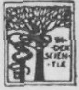

# Traité de Documentation
: Le Livre sur le Livre. Théorie et Pratique

✒ Paul Otlet

Les Livres et les Documents. — La Lecture, la Consultation et la Documentation. — Rédaction, Multiplication, Description, Classement, Conservation, Utilisation des documents. — Edition et Librairie; Bibliographie, Bibliothèque, Encyclopédie, Archives, Muséographie documentaire, Documentation administrative. — Organismes, organisation, coopération. — Office et Institut International de Bibliographie et de Documentation. — Réseau Universel d’information et de Documentation.

[002 (02)]

EDITIONES MUNDANEUM /
PALAIS MONDIAL /
BRUXELLES /
1934

<!-- 1934: p. 2 → -->

❧ Qui scite ubi scientia /
  habenti est proximus

## Notice bibliographique

OTLET, Paul. 002 (02)

1934 Traité de Documentation. — Le Livre sur le Livre. — Théorie et Pratique, 1 vol. (21 1/2 X 16 1/2), p., deux colonnes, Bruxelles, Editiones Mundaneum, Palais Mondial, Imp. Van Keerberghen & fils).

0 Fundamenta — 1 Sciences bibliologiques — 2 Le Livre et le Document en soi — 3 Les Livres et les Documents: Unités et Ensembles considérés au point de vue de la Bibliologie comparée — 4 Organisation rationnelle des Livres et des Documents — 5 Synthèse bibliologique

Imprimé par D. Van Keerberghen & fils
Bruxelles

Commencé d’imprimer 1932.00
Achevé d’imprimer 1934.04

Tous droits réservés.

