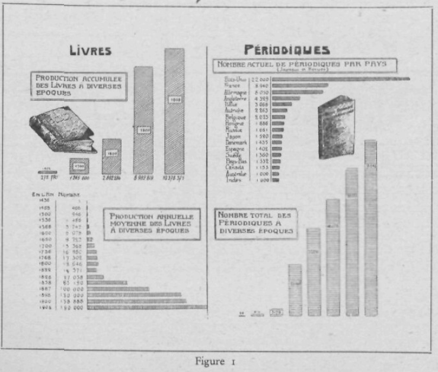
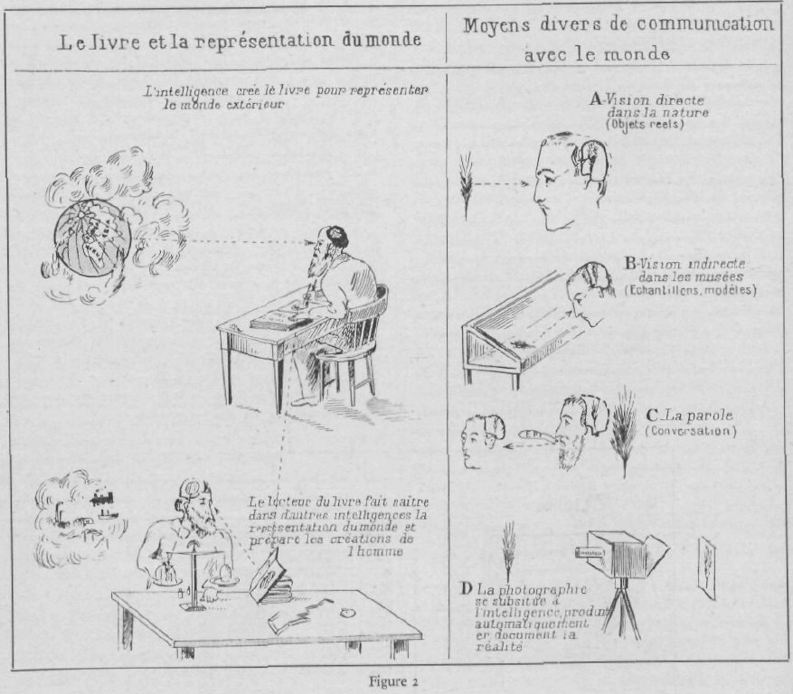
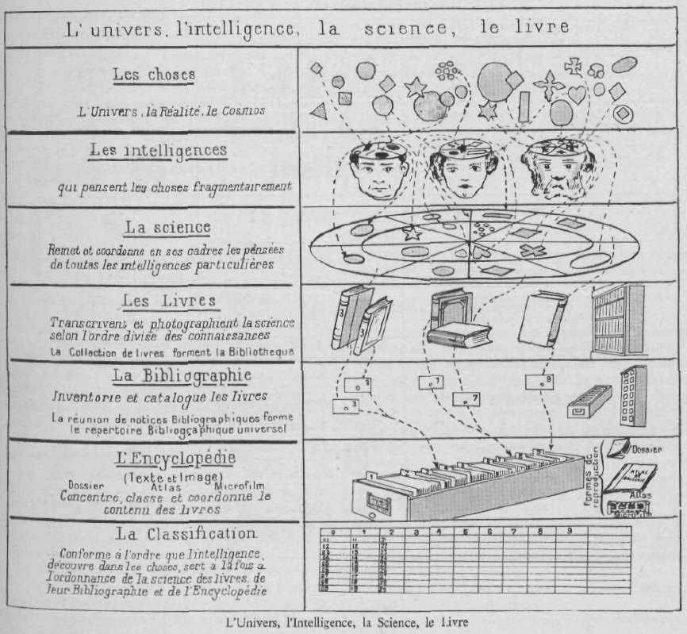
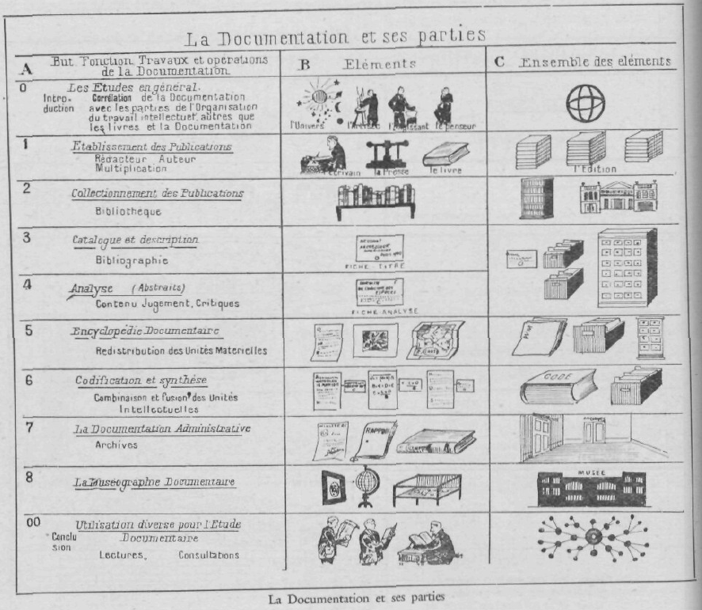

<!-- 1934: p. 9 → --> 

## 1 La Bibliologie ou Documentologie: 
Sciences du Livre et de la Documentation

### 11 NOTION. DÉFINITION. CARACTÉRISTIQUES

#### 111 Notion.

1\. Livre (Biblion ou Document ou Gramme) est le terme conventionnel employé ici pour exprimer toute espèce de documents. Il comprend non seulement le livre proprement dit, manuscrit ou imprimé, mais les revues, les journaux, les écrits et reproductions graphiques de toute espèce, dessins, gravures, cartes, schémas, diagrammes, photographies, etc, La Documentation au sens large du terme comprend : Livre, éléments servant à indiquer ou reproduire une pensée envisagée sous n’importe quelle forme.

2\. Le Livre ainsi entendu présenté un double aspect: a) il est au premier chef une œuvre de l’homme, le résultat de son travail intellectuel; b) mais, multiplié à de nombreux exemplaires, il se présente aussi comme l’un des multiples objets créés par la civilisation et susceptible d’agir sur elle; c’est le propre de tout objet ayant caractère corporel et agencé techniquement.

#### 112 Nécessité d’une Bibliologie.

II y a une langue commune, une logique commune, une mathématique commune. Il faut créer une biblio-iogie commune : Art d’écrire, de publier et de diffuser les données de la science.

Nous avons besoin maintenant non plus seulement de Bibliographie, description des livres, mais de Bibliologie, c’est-à-dire une science et une technique générales du document. Les connaissances relatives au Livre, à l’Information, et à la Documentation sont demeurées trop longtemps dans l’état où était la Biologie il y a un siècle; il y avait alors de nombreuses sciences sans lien entr’eJlea et qui avaient cependant toutes pour objet les êtres vivants et la vie (ana;omie, physiologie, botanique, zoologie).

La Biologie a rapproché et coordonné toutes ces sciences particulières en une science générale. Pour le livre, nous possédons dès maintenant des traités de rhétorique, de bibliothéconomie, de bibliographie, d imprimerie. Mais nous n’avons pas encore bien formée, de Bibliologie, c’est-à-dire une science générale embrassant l’ensemble systématique classé des données relatives à la production, la conservation, la cir-culation et l’utilisation des écrits et des documents de toute espèce. Cette science conduirait les esprits à réfléchir plus profondément sur les bases mêmes qui servent de fondement aux diverses disciplines particulières du livre; elle permettrait d’envisager de nouveaux progrès, grâce à des définitions plus générales et plus approfondies, grâce à l’expression de besoins plus larges et à la maîtrise d une technique qui puisse résoudre les nouveaux problèmes.

Des efforts doivent donc être faits pour constituer en science autonome toutes les connaissances théoriques et pratiques relatives au Livre, la Bibliologie. Cette science est appelée à faire sortir de l’empirisme les applications et les réalisations.

Nous devons former d’immenses bibliothèques, nous devons élaborer des répertoires puissants. Mais, de même qu’après de Jussieu et Linné décrivant des milliers d’espèces sont arrivés, les Darwin et les Claude Bernard qui ont créé la Biologie, science théorique explicative, évolutive de l’ensemble des êtres vivants, de même les temps sont venus maintenant où il faut fonder la Bibliologie, la science théorique, comparative, génétique et abstraite, embrassant tous les livres, toutes les espèces et toutes les formes de documents. Comme la sociologie, synthèse des sciences de la société s’est constituée avec toutes les sciences sociales particulières. Comme il existe une mécanique générale appliquée, indépendante de toute étude particulière du livre, science de toutes les formes particulières bibliologie : synthèse bibliographique, science particulière du livre, science de toutes les formes particulières de livres,

#### 113 But.

La Bibliologie doit se proposer comme but :

1\. Analyser, généraliser, classer, synthétiser les données acquises dans les domaines du livre et en même temps promouvoir des recherches nouvelles destinées surtout à approfondir le pourquoi théorique de certaines pratiques de l’expérience.

2\. Elaborer une série complète de « formes docu?? mentaires » où puissent venir se déverser les données <!-- 1934: p. 10 → --> 
de la pensée scientifique ou pratique, depuis le simple document jusqu aux complexes des grandes collections et aux formes élevées que constituent le Traité et l’Encyclopédie.

3\. Faire progresser sinsi tout ce qui peut tendre à l’Exposé plus méthodique et plus rationnel des données de nos connaissances et des informations pratiques.

4\. Provoquer certaines inventions qui sans doute pourront rester longtemps isolées et sans application, mais qui un jour seront peut-être le point de départ de transformations si profondes qu’elles équivaudront en cette matière à de véritables révolutions

5\. La Bibliologie élabore les données scientifiques et techniques relatives à ce quadruple objet : 1° l’enregistrement de la pensée humaine et de la réalité extérieure en des éléments de nature matérielle dite documents; 2° la conservation, la circulation, l’utilisation, la catalographie, la description et l’analyse de ces documents ; 3° l’établissement à l’aide de documents simples, de documents plus complexes, et à l’aide de documents particuliers, d’ensemble de documents; 4° au degré ultime, l’enregistrement des données de plus en plus complet, exact, précis, simple, direct, rapide, synoptique, de mode à la fois analytique et synthétique; suivant un plan de plus en plus intégral, encyclopédique, universel et mondial.

6\. Au point de vue scientifique, le principe biblio-logique fondamental, principe-tendance de la publication optimum s’exprime en ces quatre desiderata ; 1° Dire le tout d’une chose. 2° Dire une fois tout. 3° La vérité sur le tout. 4° Sous la forme la plus apte à être comprise. Ce principe est tempéré de quatre manières : 1° Ce qui est encore ignoré. 2° La thèse de la vérité, le doute, la discussion, les thèses diverses. 3° La variété des intelligences : langue, degré, âge. préparations antérieures. 4° La pluralité des formes possibles, d’exposé à raison du goût de chacun, et du progrès possible dans la présentation, l’accessibilité, le prix.

#### 114 Conditions de la constitution de la Bibliologie en science.

La Bibliologie doit répondre aux huit conditions suivantes qui sont nécessaires pour qu’il y ait science complète :

1.  Un objet général ou spécial (êtres, entités, faits).
2.  Un point de vue spécifique ou objet intellectuel distinct pour envisager ces faits et les coordonner.
3.  Généralisation, faits généraux, concepts fondamentaux, lots.
4.  Systématisation, résultats coordonnés, classification,
5.  Méthode: avec ce qu elle comporte: a) méthodes de recherches. procédés logiques ou de raisonnement; b) classification, terminologie; c) ?? système des mesures; d) instruments; e) enregistrement et conservation des données acquises (Sources, Bibliographie).
6.  Organisation du travail (division du travail, coopération, organismes nationaux et «internationaux, associations, commissions, congrès, instituts couvrant les fonctions de recherches, discussion, décision des méthodes, enseignement et diffusion).
7.  Histoire.
8.  Application des divers ordres d’études et d’activité.

#### 115 Objet propre de la Bibliologie.

1\. Qu’est-ce qui dans le Livre lui est propre, qu’est-ce qui est proprement bibliographique? On a déjà dit la distinction entre: a) la Réalité objective, b) la Pensée subjective ou l’état de conscience provoqué ou le moi par la réalité, c) la Pensée objective qui est l’effort de la réflexion combinée et collective sur ces données premières jusqu’à la science impersonnelle et totale, d) la Langue, instrument collectif de l’expression de la Pensée. Collée tion totale, tout livre contient ces quatre éléments associés concrètement en lui-même et que, par abstraction seulement, il est possible de dissocier et d’étudier à part. Ce qui est propre au livre, c’est le cinquième élément : la pensée désormais fixée par l’écriture des mots ou l’image de choses, signes visibles, fixés sur un support matériel.

2.  D’où ces trois conséquences: a) La Réalité, la Pensée objective ou subjective, la Langue ont chacune une existence antérieure et indépendante du livre. Elles s’étudient dans leurs connaissances respectives (Psychologie-Science-Linguistique). b) Au contraire, signes et supports sont bien le propre du livre et il s’agit dans les sciences bibliologiques de les étudier sous tous les aspects, c) Mais à son tour le complexe concret des idées, des mots, des images tel qu’il est incorporé dans le livre et le docu\^ ment («biblifié» ou «documentalisé» ) sont, à l’égard les unes des autres, dans la position de contenu et contenant. Leurs rapports, interinfluences, répercussions, sont à examiner. à leur tour et c’est là un domaine commun aux sciences du a et à celles du h.
3.  Il y a lieu de poursuivre études et réalisations de la Documentation dans le cadre général de l’ensemble des connaissances et des activités en établissant des corrélations : a) avec les diverses sciences; b) avec les diverses techniques et leur objet (Science Universelle, Technique Générale) ; c) avec les divers plans d’organisation (Plan Mondial).

4\. Définir la Bibliologie, c’est caractériser le domaine sur lequel cette science étend son empire et en même temps indiquer les limites qui séparent ce domaine des voisins.

5.  Il y a lieu de distinguer l’objet d’une science de la science de cet objet. La science c’est l’organisation des connaissances d’un objet. L’objet existe en dehors de la <!-- 1934: p. 11 → --> 
connaissance qu’on en a. La science géologique, par exemple, est de création récente, alors que la terre préexistait. Il y a eu des livres longtemps avant qu’il y ait eu des sciences bibliologiques.

6\. La Biblioiogie a un caractère encyclopédique universel, à raison du fait que les documents (son objet) se référent à l’ensemble de toutes les Choses.

La Biblioiogie participe de la même généralité que la Logique et la Linguistique: tout est susceptible, à la fois, d’expression, de documentation. La Logique, ont dit les Logiciens, est une science générale en ce sens qu’elle règle le contenu de toutes les autres et que toutes doivent se constituer d après ses lois. Son objet d une simplicité extrême et d’une extension illimitée est l’être de raison. La Biblioiogie, en tant qu’elle considère les conditions du meilleur livre fait ou à faire, ne règle pas la pensée pour elle-même. Toutefois son influence est grande sur chaque pensée, car, de plus en plus, chacun tend à s’exprimer, à se communiquer aux autres, à les interroger, à leur répondre sous une forme documentaire. Or une telle forme peut ou altérer ou exalter la pensée elle-même. Par conséquent on doit tenir la Biblioiogie comme une science générale, auxiliaire de toutes les autres et qui leur impose ses normes dès qu elles ont à couler leurs résultats en forme de « document ». L’objet de la Biblioiogie, comme celui de la Logique, est d’une simplicité extrême et d’une extension illimitée. C’est ici l’ «être documenté», comme l’objet de la Logique est l’cêtre de raison».

7.  Le point de vue propre à la Biblioiogie générale est celui du Livre considéré dans son ensemble, de la totalité des Livres. De mème\^ue la Sociologie s’occupe, non des phénomènes qui se passent dans la société, mais des phénomènes qui réagissent socialement, de même la Biblioiogie s’occupe des faits qui ont une action générale sur le Livre.
8.  Le domaine propre de la Biblioiogie doit être déterminé et exploré. Au sens large, il comprend l’Histoire de la Littérature et la Critique. Mais à côté de l’histoire des Livres et celle des auteurs, il y a parallèlement l’Histoire de la pensée.

#### 116 Fondement.

Il y a une réalité faite du total et qui est ce qu elle est. Au sein de cette réalité, nous voyons à l’œuvre l’Homme, les Hommes et leur Société au sein de la Nature. En l’homme, constatation sinon définition et explication, nous sommes amenés à distinguer deux éléments: 1° le moi profond, personnel, vécu ; libre mobilité qualitative dans in durée étrangère à lui ; mémoire pure plongeant dans le mouvement indivisible de l’éian vital ; 2° le moi intelligent, aux fonctions pratiques, au mécanisme déterministe. Les deux éléments coexistent, produisant toutes les œuvres avec leurs deux méthodes, intuition et connaissances directes pour l’un; logique et connaissance diseur sive pour l’autre. On retrouve ces deux éléments dans l’individu, dans la vie de la société (pensée, sentiment, activité) et on les retrouve dans les livres qui en sont la manifestation ou l’expression.

L’intelligence, en le disputant à l’instinct, en procédant du conscient à l’inconscient, s’est faite claire, communicative, démonstrative, coopérative dans deux grandes créations qui lui sont largement propres, qui sont sociales: la Science systématique et la Civilisation coordonnée. Le livre est par excellence l’œuvre de l’intelligence, mais non pas exclusivement, car l’Intuition (Instinct, sentiment) y a aussi sa grande part. Une bifurcation a été déterminée parmi les espèces de livres selon deux grandes lignes divergentes: le livre de science et de pratique raisonnée; le Livre de littérature qui va de la simple notation spontanée aux fixations écrites et graphiques du mysticisme le plus élevé.

### 12 DIVISION ET MODES D’EXPRESSION

#### 121 Parties des sciences bibliologiques

1\. La Documentation doit se constituer en corps systématique de connaissances comme science et doctrine d’une part; en technique, d’autre part; en corps systématique d’organisation de troisième part.

A\) Comme Science : l’étude de tous les aspects sous lesquels son objet peut être examiné, c’est-à-dire en lui-même, en ses parties, dans ses espèces, dans ses fonctions, dans ses relations, envisagé dans l’espace et dans le temps. Comme toute science la Biblioiogie a donc pour objet: a) la description des faits dans le temps, ou histoire. et des faits dans l’espace, ou étude comparée (Graphie, soit Bibliographie) ; b) la compréhension et l’explication théorique des faits jusqu’aux relations nécessaires les plus générales (Nomie, soit *Biblionomie*).

B\) Comme Technique : les règles d’application des faits aux besoins de la vie pratique et de la production. Ces règles embrassent tout le cycle des opérations auxquelles donne lieu la production des documents, leur circulation, distribution, conservation et utilisation (Technie, soit *Biblio-technie*).

C\) Comme Organisation: l’aménagement rationnel des forces individuelles et du travail en collectivité en vue d’obtenir des résultats maximum par corrélation. Tout ce qui par entente et par coopération peut y amener plus d’ampleur et d’unité, par suite faciliter le Travail intellectuel et le développement de la Pensée (Economie ou Organisation, soit *Biblio-économie*).

2\. La science est spéculative ou pratique. A côté de la science il y a l’art. <!-- 1934: p. 12 → --> 
La science spéculative s’arrête à la connaissance de son objet; la science pratique fait servir la connaissance de son objet à une action ou à une œuvre ultérieure. L’art est un ensemble de règles pratiques» directives de l’action. La tendance moderne est de donner à tout ensemble de connaissances les trois caractères spéculatif, pratique, normatif. La Bibliologie tendra donc à être a la fois science spéculative, pratique et art. Les connaissances relatives à la Langue ont déjà ces mêmes caractères. De même la Logique qui est l’étude réfléchie de l’ordre à mettre dans les pensées dans le but, non seulement de connaître leur coordination, mais pour la direction ultérieure de la pensée.

La Bibliologie comprend deux sciences distinctes : la Bibliologie générale, globale et synthétique, qui contient l’observation du livre en son ensemble, avec les comparaisons et les indications qui en découlent, et les sciences bibliologiques partielles et analytiques contenant l’observation successive et séparée de chacun des aspects divers du livre : bibliologie économique, technologique, sociologique, esthétique, etc. (I).

3.  Le phénomène du livre relève de la Logique et de la Psychologie, de la Sociologie et de la Technologie. C’est l’Intelligence qui crée le livre et qui s’en assimile le contenu. C’est la Technique qui le confectionne. C’est sur la Société qu’il réagit puisqu’il sert à mettre en relation au moins deux individualités et à les modifier.

la Bibliologie doit donc comprendre quatre grandes branches qui la relient à l’ensemble des sciences : a) La Bibliologie logique. ou les rapports du Livre avec l’exposé de la science; b) La Bibliologie psychologique, ou les rapports du Livre avec l’auteur; c) La Bibliologie technologique ou les rapports du livre avec les moyens matériels de le produire et de le multiplier; d) La Biblio-hgie sociologique ou les rapports du Livre avec la Société qui le fait naître dans son ambiance et l??y accueille.

#### 122 Terminologie. Nomenclature.

1\. Comme toutes les sciences, la Bibliologie doit avoir et possède effectivement une nomenclature, c’est-à-dire une collection de termes techniques. Malheureusement, comme pour l’Economie politique et la Sociologie en général, la plupart des termes de la Bibliologie sont empruntés au langage usuel. I’l manque des termes spécialisés ou des définitions fixant le sens conventionnel des termes usuels. Ce n’est pas définir

(\\ D’après 7.ivny. la Bibliologie qui tiaile du livre dans le sens le plus général est divisée en théorique et pratique. Ces divisions comprennent : 1° la Bibliologie physique qui traite : a) la matière, écriture ou typographie, reliure et formes du livre comme unité (technologie des arts graphiques. Bibliographie graphique et descriptive) ; b) le livre comme un agrégat (catalogue bibliographique). 2° La Bibliothéconomie, production et distribution du livre.

------------------------------------------------------------------------

un mot que d’expliquer sa valeur philosophique ou métaphysique en lui laissant toutes les significations vagues du langage habituel. Définir un mot au point de vue d’une science c’est délimiter exactement et avec précision le sens au point de vue de la science envisagée.

2.  La définition des mots doit reposer sur la définition des choses, des faits et des notions elles-mêmes qu’ils doivent servir à exprimer. Une définition doit être un exposé précis des qualités nécessaires et suffi?? santés pour créer une classe afin d’indiquer les choses qui appartiennent et n’appartiennent pas à cette classe (Stanley Jevons, Traité de Logique).
3.  Afin d’éviter des doubles emplois, il est préférable d’exposer la Bibliologie dans toutes ses parties et d’en présenter les termes et les définitions au moment où sont analysées et exposées les choses, les faits et les notions. Les définitions conduisent aux lois. Celles-ci sont l’expression de rapports entre les choses. Il n’y aura d’expression claire que si les choses mises en rapport ont été elles-mêmes clairement bien définies. Réciproquement, toute définition implique déjà certaines lois, rapports constants), ne fût ce que les lois des élément« constitutifs des choses définies.
4.  En attendant que l’accord soit fait sur l’unité de la terminologie, nous employerons indifféremment les termes formés des quatre radicaux suivants, deux gîtes, deux latins, en leur donnant pat convention une signification équivalente ; 1° biblion, 2° grapho (gram-mata gramme), 3° liber, 4° documentant.
5.  Ce demeure un problème de disposer d’un vocabulaire de termes généraux et d’adjectifs suffisamment étendus, réguliers et adéquats pour exprimer ici les idées générales, les ensembles et les propriétés communes. On y tend. Le grec a donné le mot biblion, le latin le mot liber. On a fait, de l’un Bibliographie. Bibliologie, Bibliophilie, Bibliothèque; d© l’autre Livre, Livresque, Librairie.

« Schriftum » disent les Allemands et, d’autre part, partant du radical « Buch », ils forment « Buchwesen » et « Bücherei ». Les Allemands aussi se servent du radical « Biblion », mais ils ont introduit à côté des mot» \<t Bibliothek », « Bibliographie » des expressions nouvelles « Inhaltverzeichnis, Zeitschriftenschau ?? (Bibliographie du contenu des périodiques), «Referate» (Compte rendu analytique et critique), « Li-teraturübersichten in Kartenform » (fichier), « Lite-ratur-Auskunftdienst, Beratungstelle », etc.

6.  L’historique des termes est intéressant :

<!-- -->

a)  Le mot « Bibliographie » est né dans les temps grecs post classiques. Il signifiait alors l’écriture ou la copie, c’est-à-dire la production des livres. Au XVIIIe siècle encore, on entendait par Bibliographie l’étude des anciens livres manuscrits. La technique et <!-- 1934: p. 13 → --> 
l’histoire de la production du livre sont encore une partie de la science des livres. Pour le spécialiste de quelque partie de la science, la Bibliographie désigne toutes sortes de listes de livres; pour le bibliothécaire elle comprend le collectionnement, le soin et l’administration des livres dans les bibliothèques (Hoosen),

b)  Le radical gramma a donné lieu autrefois à (- — )

ligne ; c’est un terme de géométrie. Grommir, arum L pl. (au lieu de grammata). lettre, caractères. Gramatica (/) et grammatice ( )grammaire, la science grammati-

cale. Pour Cicéron la grammaire comprend l’interpréta lion des mots Grammaticus. Homme de lettres, littérateur, savant, érudit, critique, philologue; Grammatopho-rus. Messager (porteur d’un écrit) ; Grammatophylacium, Archives; Graphice, art du dessin, Graphion, dessin, plan, esquisse et l’art de lever des plans, graphium style, poinçon (pour écrire sur la cire).

Dans les temps modernes, le radical Gramme a formé télégramme, diagramme, cinégramme, barogramme et pourrait former photogramme. Des documents qui exposent le sujet selon l’ordre des choses, du lieu ou du temps, pourraient se dire « ontogramme », « topogramme », « chronogramme »,

7.  Il y a lieu de construire la terminologie à partir du mot Document, plus général que Livre ou Biblion ; ce changement de radical est justifié: 1° par les motifs qui ont fait admettre le mot Document, Documentation, 2° par le retard des pratiques du monde du livre qui n’ayant pas évolué assez rapidement, a laissé se créer toute une nomenclature à part pour des objets et notions dont il s’est désintéressé au début.

Les branches nouvelles que le mot livre n’a pas couvertes sont : a) les documenta mêmes : estampes, pièce: d’archives, documents d’administration, disques, photographies, films, clichés à projection; b) les collections constituées de documents : cartothèque, hémé-Tothèque, périodicothèque, discothèque, filmothèque; c) le matériel spécial ; fiches, rayons, casiers, classeurs, dossiers, fichiers, répertoires.

La série de base du Radical : Document serait donc : Document (substantif) L’objet (signe -f support). — Documentation (substantif) Action de documenter et ensemble de documents. — Documentaliste (substantif) ou Documenteur (substantif, même désinence que docteur) : la personne, les techniciens de la Documentation. — Documenter. L’action de faire usage du document. — Documentaire (adjectif) qui est relatif à la documentation. — Documcniatoire : qui remplit la qualité d’être une suffisante documentation. — Documentorium ou Documento-thèque, Institut de Documentation. — Documento-technique ; Technique de la documentation.

8.  Le problème de la Terminologie de la Documentation a été discuté à la XIe Conférence Interna-

tionale de l’I. I. B, (I. I. D.), à Francfort. Rapports Gérard, Dupuy, Ledoux, Otlet (Voir les Actes).

En ce qui concerne la Terminologie Technique, les dix dernières années ont vu des avancements révolutionnaires. Ce qui exigeait autrefois de longues périphrases (trois ou quatre mots), a fini par pouvoir s’exprimer en un tout. Le « Pitman’s Technical Dictionary », traite maintenant de 60.000 a 70.000 choses distinctes.

#### 124 Le Livre et la Mesure. Bibliométrie.

##### 124.1 Notions.

1.  En tout ordre de connaissance, la mesure est une forme supérieure que prend la connaissance.

Il y a lieu de constituer en un ensemble coordonné les mesures relatives au livre et au document, la Bibliométrie.

2.  Les mesures sont celles relatives aux objets, aux phénomènes ou faits, aux relations ou lois. Elle concerne le particulier (métrie proprement dite) ou les ensembles (statistique) ; elle concerne ce qui est ou ce qui devrait être (unité et standardisation).

Les mesures des rapports principaux considérées par une science prennent la forme d’indices. (Par exemple les géographes considérant les rapports de l’eau pluviale et des territoires ont créé l’indice d’aridité).

3.  Les données acquises de la métrie en général, de la Sociométrie en particulier sont à prendre en considération pour réaliser la Bibliométrie.

L’adage « omnia in mensura », tout dans la mesure, est devenu l’idée directive de toutes les sciences qui tendent à passer du stade qualitatif au stade quantitatif. Le passage est désormais accompli pour les sciences astronomiques et physiologiques.

Les sciences biologiques ou bio-psychologiques s’efforcent de joindre à la description minutieuse la mesure aussi exacte que possible. La fréquence de la répétition d’un type permet une mesure indirecte de la vitalité de l’espèce végétale ou animale; la longueur, la portée des organes, leur diamètre, leur poids, la variabilité des caractères essentiels permettent de nouvelles précisions. L’anthropologie bénéficie de l’établissement de corrélations et de coefficients; l’anthropométrie a aidé la criminologie. La psychologie est entrée à son tour dans la voie des mesures multiples, indirectes, grâce aux corrélations psychologiques laborieusement établies. La sociologie tend aussi à devenir quantitative. Elle opère sur des groupes et les groupes sont susceptibles de dénombrements, dont la statistique établit les méthodes et enregistre les résultats. Les choses du livre ne sont guère mesurées, ni dans leur réalité objective et matérielle, ni dans leur <!-- 1934: p. 14 → --> 
réalité subjective et intellectuelle. Des efforts dans ce sens sont donc désirables.

Les sciences du Iívtc, elles aussi doivent tendre maintenant à introduire la mesure dans leurs investigations. En tant que le livre est objet de psychologie, de sociologie et de technologie, ses phénomènes sont susceptibles d’être mesurés.

La « Bibliométrie » sera la partie définie de la Biblio-logie qui s’occupe de la mesure ou quantité appliquée aux livres. (Arithmétique ou mathématique bibliolo-gique).

Tous les éléments envisagés par la Bibliologie sont en principe susceptibles de mesure et il faut tendre de plus en plus à revêtir leurs données de la forme précise du nombre, à passer de l’état qualitatif ou descriptif à l’état quantitatif.

4.  La mesure du livre consiste à rapporter toutes les parties et éléments d’un livre quelconque à ceux d’un livre type, standard, unité. Ce type devrait être le meilleur des livres.

##### 124.2 La mesure des livres.

1\. Unités de mesure bibliologique. — Etant donné que tout livre contient une portion de la matière bibliologique générale, on pourrait établir conventionnellement des unités de mesure de cette quantité et les comparer directement aux unités de mesures psychologiques et sociologiques en général, et, à l’aide de ces dernières les comparer aux unités physiques. La Physique a établi un système d’unités mesurant ses forces élémentaires et directement comparables les unes avec les autres. Elle a établi que ces forces sont d’ailleurs convertibles et transformables les unes en les autres, selon un rapport constant (loi de la conservation des forces). Les unités bibliologiques, elles, auraient & évaluer la quantité de matière ou d’énergie bibliologique emmagasinée dans chaque organisme bibliologique (ou livre). Cette évaluation serait faite en décomposant le livre en ses éléments composant ultimes, lesquels, d’autre part, auraient été mesurés par les mêmes unités.

2.  La Stylistique. — La stylistique ou stylométrie a été créée récemment pour l’étude de la manière de s’exprimer des auteurs. On a introduit la statistique dans l’analyse des phrases, dans celles des expressions employées pour traduire les émotions dans le langage. (Ex. B. Bourdon).
3.  La stichométrie. — Les anciens ont imaginé des moyens pour mesurer l’étendue des livres. On convint de prendre pour unité de mesure l’hexamètre grec renfermant en moyenne de 15 à 16 syllabes et 35 à 36 lettres. Cette unité s’appela stique ou épos (vers épique, en latin versus). On obtenait le nombre de stiques d’un ouvrage soit en écrivant un exemplaire

type en lignes normales, soit par une évaluation approximative. Les Muses d’Hérodote avaient de 2.000 à 3.000 stiques.

C’est la mesure qu’observèrent plus tard les prosateurs, historiens, philosophes, géographes, auteurs de traité didactique. Quelques auteurs ne donnent exceptionnellement à leurs livres que 1.500 ou même 1.200 stiques, d’autres atteignent ou dépassent le nombre tout à fait anormal de 4.000 ou même 5.000 stiques, mais la très grande majorité oscille entre 1.600 et 3 000 stiques. La stichométrie ainsi entendue affirme un triple avantage : renvoyer au stique comme on renvoie maintenant au chapitre et au verset; fermer la porte aux suppressions et aux interpolations plus ou mcins considérables ; déterminer une fois pour toutes le prix de l’ouvrage et la rétribution due au copiste. ( 1 )

4.  On a entrepris des recherches statistiques, d’après les dictionnaires biographiques, sur la ratio plus ou moins élevée dés savants nés dans tel pays ou partie de pays. Recherches de la supériorité de tel écrivain sur tel écrivain (par exemple Sophocle sur Euripide) d’après la longueur des articles qui leur sont consacrés, d’après le nombre d’adjectifs élogieux ou non (pro et contra) qui leur sont attribués dans ces articles, travaux basés sur la longueur des exposés et le degré d’éloge dans les expressions. (2)
5.  Mesures des incunables, — Les procédés d’identification des incunables ont donné lieu à des mensurations d’une extrême précision.

6\. Bases de bibliométrie. — Combien 1.000 mots représentent-ils : a) de lettres dans les diverses langues (français, anglais, allemand) ; b) d’espaces en différents textes réduits en centimètres carrés sur page (exemple perceptible : combien dans une pièce de théâtre, un roman, un journal, une séance) ; c) de temps de lecture à haute voix ou de lecture silencieuse.

Didot a fixé le point à la sixième partie de la ligne de pied de roi. Le mètre légal équivaut à 443 lignes et 296 millièmes. En négligeant l’infinitésimale fraction d’un tiers de point, nous avons 2.660 points dans un mètre.

Le centimètre vaut donc 26 points 6 et le millimètre 2 points 66.

Par suite, si l’on veut connaître le nombre de points contenus dans une mesure métrique, il suffit, suivant qu’il s’agit de centimètres ou de millimètres, de multiplier par l’un de ces nombres. Une feuille de papier, format 4°, mesure 0.45 X 0,56. Elle aura donc :

―

\(1) Voir Vigouroux, Dictionnaire de la Bible. V°. Livre n° 2.

\(2) Frédéric Adams Woods. - Historiometry as an exact science. Reprinted from Science; N. S. Vol. XXXIII. n° 850, p. 568–574, April 14. 1911. <!-- 1934: p. 15 → --> 
0 m, 45×26,6 — 1.197 points; sur 0 m. 56×26,6 = 1.490 points. Mais le point a un multiple qui sert à simplifier. Ce multiple, certains l’appellent le cicéro, en souvenir des Offices de Cicéron, qui furent imprimé?? dans un caractère dont le corps y correspondait à peu près. Il est préférable de dire un douze, des douzes, c’est a la fois plus précis, plus commode et cela ne prête pas à confusion.

Quand on a une justification à prendre, on parle en douze?? et quand on connaît le nombre de points, comme dans l’exemple ci-dessus, il faut diviser par douze. Il est donc plus simple de chercher immédiatement le nombre de douzes, et cela est assez facile si l’on veut se donner la peine de retenir que, dans un mètre ou 2.660 points, il y a 222 douzes moins 4 points (221 d. Ô points). Il faut souligner « moins 4 points »; c’est ce qui permet une approximation aussi exacte que possible. Quand la mesure métrique approche du quart de mètre, on aura à déduire un point et on fera dî même pour chaque quart de mètre.

Dès lors, en douzes, le centimètre équivaut à 2,22, le millimètre à 0,222. En multipliant par ces nouveaux nombres, on a une approximation suffisante.

7.  Les coefficients. — Les coefficients portent notamment sur :

1° les formats; 2° les points typographiques; 3° le poids du papier, étendue au poids, épaisseur des livres de type; 4° les prix unitaires.

La bibliométrie résume les statistiques et donne les indices de comparaison.

8.  Fréquence de lecture d’un auteur ou d’un livre, — Il serait intéressant de savoir combien un auteur a été lu. Voici Voltaire. De 1740 à 1778 il se fit

19 recueils des œuvres, sans compter les éditions séparées, très nombreuses pour les principaux écrits (I). De 1778 à 1815, QuérardSndique six éditions des œuvres complètes sans compter deux éditions incomplètes et déjà copieuses. Enfin pour la période de 1815 à 1835, en vingt an??. Bengesco rencontre 28 éditions des œuvres complètes (2). Puis rien de 1835 à 1852. De 1852 à 1870.

5 éditions, dont l’édition de propagande du journal \* Le Siècle \*.

Depuis 1870, une édition, celle de Moîand, de caractère purement littéraire et historique et tout à fait sans rapport avec la conservation ou la diffusion du voltairisme. Au total, grande consommation jusqu’à la Révolution î puis ralentissement ¿usqu’en 1815; prodigieuse recrudescence de la demande sous la Restauration ; puis de nouveau ralentissement ; reprise sensible sous le second Empire. Cette courbe correspond assez à celle des mouvements libéraux ; on imprime et on réimprime Voltaire, surtout aux époques où ces mouvements rencontrent le

―

(1) Bengesco. Q. IV. N°s 2122–2141.
(2) Ibid. N°s 2145–2174.

------------------------------------------------------------------------

plus de résistance et prennent le plus de violence. Cependant, il faut aussi tenir compte du fait que, sous la Révolution, après l’édition encadrée de 1775 et les deux éditions de Kehl ; et, sous L.ouis-Pbilippe, après les 28 éditions qui se succédaient depuis vingt ans, le marché put être encombré ; il fallut donner au public le temps d’absorber la production de la librairie. Toujours est il que l’abondance même de l’offre, de la part des éditeurs, indique une demande considérable de l’opinion libérale.

Il faudrait connaître le tirage de ces éditions. Le gouvernement de la Restauration a essayé de se rendre compte de la diffusion «des mauvais livres». D’un rapport offi ciel qui fut alors analysé par les journaux, il résulte que. de 1817 à 1824. douze éditions de Voltaire se sont impri mées, formant un total de 31,600 exemplaires et de I million 598.000 volumes. En même temps. 13 éditions de Rousseau donnaient 245,000 exemplaires et 480.500 volumes. Les éditions séparées d’écrits de l’un et de l’autre jetaient sur le marché 35,000 exemplaires et 81,000 volumes. Au total, c’étaient 2,159.500 volumes philosophiques qui étaient lancés en sept ans contre la réaction légitimiste et religieuse et de ce nombre effrayant de projectiles. Voltaire fournissait plus de trois quarts. (1)

9.  Bibliosociométrie. — Comment mesurer l’action du Livre et du Document sur l’homme et la société ?

a\) Voici par exemple un Traité de Physique, il est tiré à 2.000 exemplaires; chacun constitue comme une sphère d’influence ayant la potentialité d’agir sur tout lecteur qui s’en approchera. En ses 500 pages, supposons que le traité comprenne 15 chapitres avec en tout 50 sections et 600 alinéas, constituant chacun l’exposé d’une idée ayant un sens complet. Le « volume documentologique » global offert en lecture dans la société par ce traité est 600 alinéas x 2.000 exemplaires = 120,000 idées documentalisées. Mais les 2,000 exemplaires ont des sorts bien différents: exemplaires destinés aux livres de texte des étudiants du cours de professeur, circonstance qui a déterminé l’édition ; exemplaires dans les Bibliothèques : exemplaires chez les particuliers : exemplaires dans les librairies ; exemplaires de presse ; exemplaires donnés en hommage ; exemplaires restés en stock chez l’éditeur ou l’auteur. Après un certain temps ont agi sur le corps matériel des exemplaires du livre, les causes d’usure et de destruction et sur les idées exprimées par les livres, des causes du vieillissement (par ex, les livres de sciences dépassés). La chance pour les exemplaires de rencontrer, leurs lecteurs est donc inégale et avec le temps, elle diminue ou s’accroît, proportionnellement à la notoriété de l’auteur et de l’ouvrage. D’autre part, les lecteurs sont de complexité et formation différentes. En présence d’un ensemble de données bibliographiques déterminé, ils procéderaient chacun à la lecture suivant leur spécialité, leur curiosité et leur réceptivité. Intervient aussi le degré de <!-- 1934: p. 16 → --> 
saturation, en fonction des connaissances ou des impressions antérieures acquises ou éprouvées et qui, pour un lecteur déterminé, diminue l’appétit et profit de la lecture.

b)  Le problème général de « bibliosociométrie » consiste à déterminer les lieux et les temps et, eu égard aux lecteurs, la chance qui existe pour les ouvrages d’être lus, partant d’exercer leur action sur la société. Qu’il soit possible de poser théoriquement un tel problème, alors même que sa solution serait retardée ou empêchée par manque de données concrètes, c’est déjà une étape vers la solution, la seule mise en relation des termes indique déjà avec précision comment se présente la question et problème bien posé est à moitié résolu. D’autre part, une comparaison est à faire ici avec la nourriture. Quand il s’agit de nourriture capable d’alimenter les forces corporelles, on se préoccupe aussi d’établir l’unité générale de me«ure alimentaire. Les livres à leur manière et pour l’esprit, sont une nourriture dont on doit pouvoir mesurer les « calories » intellectuelles. Les calories ce sont les idées susceptibles d’être transmises et comprises (!). Si nous supposons que dans les écrits l’unité correspondante à l’idée susceptible d’être comprise, soit non pas le mot, qui n’implique aucun jugement, ni la phase qui est trop peu explicite à elle seule, mais bien l’alinéa (verset ou articulet) qui exprime une idée complète, en conséquence, on pourrait poser les définitions conventionnelles des termes suivants avec les unités de base qui en résulteraient :

Idée : la plus petite partie d’un exposé présentant en soi un tout complet.

Idéogramme : la partie d’un document qui contient l’idée ainsi définie et qui par convention est l’alinéa.

Idéogrammite : l’unité d’idée (énergie intellectuelle) incorporée dans l’idéogramme et assimilable au moyen dr la lecture. L’idéogrammite est ainsi, à la calorie, ce qu’est la réception d’une idée par le livre à l’alimentation par la nourriture.

Lecture : le fait de lire.

Lecturité : le rapport entre les livres existants et les occasions fournies d’être lus (de lecturus, gérondif de legere, lectus). (2)

―

(1) Le mot « Education ». qui est très récent, a remplacé le mot « nourriture » dont usaient les grands écrivains du XVIIe siècle et du XVIIIe siècle. L’éducation nourriture physique et intellectuelle dans le cadre naturel est l’idée maîtresse de la philosophie de J.-J. Rousseau. L’Antiqité disait « Nutrimentum Spiritus — Educit nutrix ».

\(2) La théorie de la lecturité est mise en lumière par des analogies avec deux théories d’ordre économique qui toutes deux ont été traitées par les méthodes mathématiques (calcul différentiel).

1° La loi du débit donnant lieu à la théorie des maxima et des minima traitée par Cournot. La quantité de marchandise débitée annuellement dans l’étendue du pays ou du marché considéré en fonction des prix (Aug. Cournot, Recherches, pp. 55–56) ;

------------------------------------------------------------------------

Légibilité : Possibilité physique de lecture, quant aux livres.

Lecturabilité : Possibilités psychiques de lecture, quant aux lecteurs.

c)  Si donc l’on généralise le cas du Traité de physique, pris antérieurement comme exemple, et qu’on en exprime les rapports en terme de formule, on a

Lecturité = (Livres différents × Exemplaires × Idéo-grammites × Lecturabilités) : Légitibilité

ou en abrégé : $\text{Lu} = \frac{\text{L}\times\text{E}\times\text{I}\times\text{Lb}}{\text{Lg}}$

d)  Pour toute communauté désireuse d’assurer par la lecture la culture de ses habitants et d’accroître l’usage social du livre, on doit conclure à la nécessité de pourvoir ses habitants d’un certain nombre de livres placés dans de bonnes conditions de lecture.

##### 124.3 La statistique.

1.  La statistique du livre se confond avec la Biblio-métrie. bien que jusqu’ici elle se soit appliquée principalement à dénombrer la quantité produite des livres (éditions). Mais la statistique commence à s’étendre maintenant aux tirages, à la circulation du livre, aux Bibliothèques, à la Librairie, aux pTix, etc… Déjà des travaux considérables ont été entrepris sur la statistique du livre. Ils ont porté sur les chiffres absolus et aussi sur les coefficients. Sans doute, il ne faut pas exagérer la valeur de ces chiffres car les dénombrements sont loin encore d’être complets, exacts, comparables. D’autre part, les coefficients que nous pouvons obtenir ne sont que des moyennes, qui comportent toutes sortes de variations, en fonction d’innombrables variables. Mais en tenant les nombres que déjà nous possédons comme provisoires, ils doivent être pour nous un acheminement vers des nombres plus exacts et plus complets. (1)
2.  Statistiques. Voici quelques données chif-

frées à titre d’évaluation avant que des études systématiques poursuivies aient permis de dégager des coefficients.

Nombre des œuvres. — Il nous reste plus de 1,600 ouvrages de l’antiquité grecque ou latine.

La production actuelle. — Elle varie de pays à pays, de branche a branche, d’année à année. La production

------------------------------------------------------------------------

2° La propriété de l’ophélimité, étudiée par Pareto et qui se définit : « L’ophélimîté pour un individu, d’une certaine quantité d’une chose, ajoutée à une autre ciuan tité déterminée (qui peut être égale à zéro) de cette chose déjà possédée par lui, est le plaisir oue lui procure cette chose ». (Vilefredo Pareto. Manuel d’Economie Politique Traduction Bonnet. Paris, 1909, pp, 158–159).

Voir aussi le résumé et le commentaire des deux théories dans L. Leseine et L. Suret, Introduction mathématique à VEconomie Politique, pp. 75 et 122.

(1) Voir par analogie Alfredo Niceforo : La misura délia Vita. Extrait de la Rioista drAnthropologie, <!-- 1934: p. 17 → --> 
littéraire allemande en 1932 a été de 27 % inférieure à celle de l’année précédente.

D’après Holden, la statistique du nombre des ouvrages sur l’astronomie jusqu’en 1600 a été, siècle par siècle : 2e siècle (2), 3e siècle (2), 4e siècle (3), 5e siècle (5), 6e siècle (2), 7e siècle (2), 8e siècle (2), 9e siècle (5), 10e siècle (4), 11e siècle (8), 12e siècle (13), 13e siècle (14), 14e siècle (19), 15e [^1] siècle (190). 16e [^2] siècle (1933).

Pour la zoologie, la statistique a relevé les travaux suivants :

  Périodes    Accroissement de la période   Total
  ----------- ----------------------------- ---------
  1700–1845   13.560                        13.560
  1846–1860   40.750                        54.310
  1861–1879   125.000                       179.310
  1880–1895   115.000                       294.310
  1896–1908   104.415                       398.725
  ————-       —————————————-                ————-
  1700–1908   Total 398.725                 398.725

De 1911–1913 le nombre des ouvrages et mémoires scientifiques publiés sur les poissons atteint 1.178.

Quelques chiffres disent l’extension qu’a prise la Bibliographie médicale. L’Index Catalogue, dont la publication se poursuit, comprend 342.895 titres de livres et 1.527.038 titres d’articles de périodique. La Bibliothèque du General Surgeon Office de Washington, consacrée exclusivement à la médecine, comprenait en 1929, 842.395 volumes et brochures et 7.618 portraits.

On a établi que, sans compter les brevets, il paraît annuellement de un a un million et demi d’articles scientifiques et techniques (Dr. Bradford, The necessity for the standardisation of Bibliographical Methods, 1928).

L’U. R. S. S. déclare les chiffres suivants : 500 millions d’exemplaires en 1930, comparés à 120 millions avant la guerre. Maintenant 50 % d’ouvrages sur les matières économiques et sociales et 30 % sur les matières techniques au lieu de 5 et 14. On a publié 16 millions d’exemplaires d’œuvres de Lénine et 50.000 par an du « Capital » de Marx, 30 millions d’exemplaires classiques. L’an dernier il y aurait eu 52.000 titres d’ouvrages des 58 nationalités au lieu de 24 en 1913.

André Suarés écrit : « Il y avait cent manuscrits d’un poème pour cent princes amis de la poésie. Avec la Renaissance et l’incunable il y a eu cinq ou six mille exemplaires du même ouvrage pour vingt mille

―

------------------------------------------------------------------------

lecteurs. Il y a maintenant un million de volumes pour dix millions de gens qui lisent ».

Un humoriste a dit : puisque beaucoup d’imprimés, à raison des subtilités de leurs rédacteurs, doivent être lus entre les lignes, il y a de quoi doubler bon nombre de chiffres.

On estime à I 2 millions le nombre de livres publiés depuis l’invention de l’imprimerie; à près de 200.000 la production annuelle de l’ensemble des pays; à plus de 75.000 le nombre des périodiques et journaux, à 1 millier celui des grandes bibliothèques générales et spéciales.

Il y a environ 30.000 revues scientifiques et techniques. On estime à plus de 3 millions le nombre des articles qui y sont publiés.

La Textil Chemiscbe Gesellschaft a publié plus de un million d’analyses bibliographiques classées par matières et par auteur.

Quelques chiffres donnent une idée du nombre des documents.

Les chansons populaires lettones sont au nombre de 218.000.

A son 85?? anniversaire (oct. 1932), le Président Hindenburg a reçu 22.000 lettres, cartes-postales. dépêches et cadeaux; 1.700 télégrammes. Ces envois ont été enregistrés et il y a été répondu.

Durée d??élaboration des œuvres. — Le temps d’élaboration des œuvres varie d’une extrême rapidité a une extrême lenteur.

L’œuvre de Forcelïini (Totius latinitatis Lexicon) fut commencée en 1718. Interrompue à plusieurs reprises, elle ne fut terminée qu’en 1753, soit après 35 ans. Près de deux ans furent ensuite employés à la révision; le manuscrit fut transcrit par Louis Vio-lato, qui consacra huit ans à ce travail et l’acheva seulement en 1761. Le Lexique ne parut qu’en 1771. soit après 53 ans. Forcelïini était mort avant la publication de son œuvre.

Etendue des œuvres. — L’Odyssée se compose de 12.118 vers. L’Illiade se compose de 12.210 vers et chaque vers d’environ 33 lettres, cc% qui donne un total de 501.930 lettres Les poèmes épiques, lyriques ou didactiques des latins ne dépassaient guère mille vers dans un chant. Le roman de François Coppée. Henriette, soit un volume de 193 pages comporte 19.029 mots.

l\^e MahabHhavata, est un poème de 200.000 vers dont chaque chant (il y a en a 18) égale presque rilliade en étendue. (Il y a, en outre, le Rigveda et le Ramayana).

Les chansons de geste ont une étendue très imposante. Ils renferment, en général, vingt, trente, cinquante mille vers qui se suivent par tirades de vingt à <!-- 1934: p. 18 → --> 
deux cents, et quelquefois davantage, sur une même assonance.

Le Roman de la Rote, œuvre capitale de la littérature française et même européenne, est un monument de 22.000 vers.

La National Education Association, fondée il y a 65 ans, accusait en 1923 pour le seul volume de ses comptes rendus (formant 1/10° du total de ses publications), une distribution de 111.000.000 pages. Son journal, de grand format, est envoyé à ses 130.000 membres.

En 1907 l’Armée du Salut possédait 69 journaux et périodiques et avait publié 1.013.292 exemplaires. (Dépt. des publications, Fortees Road, 79, London).

Les « Calendars » des Universités de l’Empire Britannique comprennent, pour une seule année, près de 50.000 pages.

Un milliard en billets de 1.000 francs formerait 2.000 volumes de 500 feuilles.

Tirage. — Au début de l’imprimerie, le chiffre du tirage habituel était de 275 à 1.000 exemplaires.

Le sermon de Spurgeon a été publié et répandu à un million tous les ans.

Le tirage du « Rotschilds Taschenbuch für Kaufleute », 60° édition, a atteint 1/2 million d’exemplaires L’Abécédaire Géorgien a été distribué à raison de 500.000 exemplaires sous le régime tsariste.

Edition. — De tous les livres, c’est la Bible qui a eu le plus grand nombre d’éditions. On lui connaît environ 700 traductions complètes ou partielles.

Poids. — « La plupart des livres anglais dépassent le poids de 409 grammes. »

Un livre de 3 centimètres sur papier India peut contenir 1.000 pages. (Exemple : l’Encyclopedia Britannica).

Prix. — On estime à 200 millions ce que coûte la production et l’organisation de la documentation chimique. De 1885 à 1893 de « Meyers Conversation Lexikon » il a été vendu pour plus de 24 1/2 millions de marks, soit plus de 143.000 exemplaires. Pour un livre scientifique de 350 pages tiré à 1.000, l’éditeur Alcan, avant la guerre, payait à l’auteur 500 francs et lui remettait gratuitement 50 exemplaires.

Typographie. lignes, lettres, mots. — Il y a 400 millions de lettres dans le grand Dictionnaire Larousse et à raison de 4.000 mots à la page (2 7.500X4.000) 90 millions de mots. Un volume de la € Bibliothèque scientifique Flammarion contient :

a)  pages : 300.
b)  lignes à la page : 29, total : 8.700;
c)  lettres à la ligne : 50, total : 435.000;
d)  mots à la ligne ; 8 à 9;
e)  mots n la page, environ 215;
f)  mots au volume, environ 65.000.

------------------------------------------------------------------------

Il y a le type de volume de 320 pages (20 feuilles) à 33 lignes par page ( = 10.560 lignes) à 10 mots par ligne ( = 106.600 mots). Certains livres de type courant ont 60 lignes en moyenne à la page. On estime qu’un ouvrage compte en moyenne deux volumes.

Lecture. — Un roman de 109.000 mots se lit en 4 heures I heure = 25.000 mots,

1 minute = 400 mots,

1 seconde = 6 mots 1/2,

soit une ligne en 2 secondes et une page à la minute.

Destruction, — On a évalué qu’en Russie, pendant la révolution, on a publié 60.000.000 de volumes, tandis qu’on en a brûlé I 5 millions.

Espace cubique occupé par les Livres dans les Riblio-thèques :

à Hannovre ; 220, à Stuttgart : 225, à Boston : 225, au British Muséum : 224; la division type des rayons sera :

I rayon in-folio — 45 centimètres

1 rayon in–4° =35 \>

5 rayons in–8" =125 »

espace libre 4" 21 ?? 7 rayons 224

ou 8 rayons in–8?? = 200 24 = 224 centimètres.

La largeur des livres a été calculée : à Goettingen : 8", 20 cent. à Halle : 8°, 35-

4°, 30 cent. 4a, 25–35

fol.. 40 cent. fol.. 35–45

grand in-folio 4- 45

On peut compter 80 livres par mètre carré de surface latérale. C’est la moyenne, des calculs ont donné respectivement 100, 66 et 63. Il y tendance à diminution de la grandeur des livres.

Outillage. — La puissance de l’outillage technique du livre peut être mesurée par les chiffres suivants : machine à fondre les caractères (Wicks), 60.000 caractères à l’heure; machine à composer Langston Monotype. 12.000 lettres à l’heure; machine à imprimer ou presser, 50.000 feuilles à l’heure, quadruple ou Pall Mail, 200.000; machine à relier, à ronder, 6.000 volumes par jour; machine à couvrir de toile ou de papier, 22.000 volumes par jour.

De3 1910, les machines géantes débitèrent à l’heure 66.000 exemplaires d’un journal de 24 pages, pliés, ficelés en ballots, prêts à partir par la poste. Il suffirait de 10 compositeurs et 5 pressiers dans un grand journal pour faire le travail de 300.000 copistes.

Dès le commencement du XXe siècle, en Allemagne. 2 75.000 personnes étaient occupées dans les industries du livre et produisaient 100 millions en valeur pour l’exportation. Au même moment 125.000 <!-- 1934: p. 19 → --> 
vivaient à Pari», de la presse, la pensée imprimée. Aux Etats-Unis, les capitaux investis dans les industries du livre étaient de 200 millions de dollars avec une valeur de produits annuels de 375 millions de dollars.

3.  En face de cette statistique du livre et du document devrait se dresser celle de l’état actuel de notre civilisation dont ils sont l’expression et où ils doivent servir à œuvrer. Rappelons celle-ci : nous sommes deux milliards d’êtres humains, répartis en trois continents. cinq parties du monde, 60 Etats. Nous avons construit un million de kilomètres de chemins de fer; nous possédons quelque 60.000 navires; nous pouvons par Zeppelin faire le tour du monde en 21 jours et par radio en quelques secondes. Annuellement le commerce extérieur universel dépasse un milliard et demi de livres. Des industries toutes récentes, celle de l’auto et du cinéma investissent respectivement des milliards de capital. Et quand nous nous mettons à nous battre et à tout détruire, sans que nous disparaissions, nous pouvons, comme dans la guerre mondiale, aligner au tableau 10 millions de morts, autant de blessés et 2.000 milliards de dépenses, francs-or.

Mais quand nous édifions ce sont d’immenses organisations. 400 associations internationales. 200 trusts internationaux, 5 religions internationales, une Société des Nations comprenant déjà 54 Etats.

Véritablement notre temps est celui du colossal.

4.  Il y a lieu de travailler ensemble à l’établissement d’une Statistique Générale du Livre en envisageant à la fois, les matières, les pays, les dates, les formes et les langues des publications. Divers essais de synthèse sta tistique ont été entrepris, dont le premier en date est celui de l’Institut international de Bibliographie. La difficulté de réunir des données exactes est considérable, mais On doit y tendre constamment. D’ailleurs, des données approximatives valent mieux que l’absence de toute donnée.

Le travail de préparation doit être réparti entre le?? divers pays et les diverses grandes spécialités, La statistique présentée au Congrès International de Bibliographie en 1910. publiée dans ses actes et aussi dans le Bulletin de l’Institut International de Bibliographie (1911), fasc. 1–3, page I, constitue une première base. Des formules unifiées et coordonnées (Tableaux) indiquent le but vers lequel il faut tendre. Le résultat final du travail et de ses conclusions, a été présenté en une série de diagrammes.

La préparation de la statistique générale du livre repose sur le dépouillement des bibliographies exis tantes. Il se combine aussi avec un travail d’inventaire des sources principales à centraliser et coordonner dans le Répertoire Bibliographique Universel. Il s’agit aussi de produire une sorte de Bibliographie des Bibliographies choisie, limitée aux grands Recueils fondamentaux de la bibliographie, la notice de chacun d’eux, étant accompagnée d’indications relatives à l’état actuel d’achèvement ou avancement, ainsi qu’au nombre des unités enregistrées. Ces recueils constituent les sources, toujours contrôlables de la statistique elle-même. L’Institut International de Bibliographie a établi sous çette forme des états statistiques et des listes bibliographiques préparatoires.

5.  La méthodologie de la statistique des imprimés a progressé. La Chambre centrale du Livre à Moscou a donné ses soins particuliers à l’élaboration de la statistique des imprimés russes envisagés sous les points de vue les plus divers î nombre total des unités imprimées. nombre des feuilles imprimées, tirage, réédition et reproduction, littérature originale et traduction, prix de vente, réparation territoriale de la production, groupes d’éditeurs (éditeurs privés, éditeurs scientifiques, éditeurs d’Etat), sujet traité, répartition de la production par groupes de lecteurs. Chacun de ces points est examiné sous quatre aspects différents : 1“ nombre de spécimens imprimés; 2° nombre des feuilles imprimées contenues dans un spécimen imprimé; 3° tirage; 4° nombre de feuilles imprimées contenues dans le tirage total de toutes les publications. (N Jcnitzky).

La statistique des imprimés de R. S. F. S. R. (Russie) en 1926 (142 pages), dont les chiffres de la production des imprimés russes sont présentés dans une série de tableaux analytiques et synthétiques. Les questions posées et les réponses numériques qui leur sont données constituent une remarquable méthode. La classification décimale sert largement de cadre aux tableaux fondamentaux. (Travaux de M. Yanaitski.)

6.  Les premiers travaux d’ensemble sur la Statistique du livre ont été établis il y a quelque vingt ans par le Bureau International du droit d’auteur à Berne (M. Rôthlisberger) et ensuite par l’Institut International de Bibliographie. Récemment, la Commission internationale de Coopération intellectuelle a demandé à l’Institut International de Statistique d’inclure plus de données intellectuelles dans les cadres recommandés aux administrations, et par conséquent aussi quant au livre. Il est projeté que l’Institut International de Coopération Intellectuelle publie un Annuaire de la Statistique Intellectuelle qui réunira notamment les stat:stiques scolaires et bibliographiques des différents pays. Parmi les récents travaux particuliers, citons celui fort suggestif de E. Wyndham Hulme ; « Statistical Bibliography in relation to the Growth of Modern Civilization. 1923 ». Il y est mis en œuvre notamment les données, non publiées ailleurs, relatives à l’International Catalogue of Scientific Literature.

L’ouvrage statistique de Enrique Spam \<r Las Bibliothecas con 50.000 y mas volumenes. (Cordoba.

------------------------------------------------------------------------

*20*

Statistique générale des Livres 0- Ouvrages généraux

1.  Philosophie
2.  Religion
3.  Sciences sociales. Droit . . .
4.  Philologie, Linguistique ….
5.  Sciences pures
6.  Sciences appliquées, Technologie
7.  Beaux-Arts
8.  Littérature
9.  Histoire, Géographie

Total. . .

0.  Ouvrages généraux
1.  Philosophie
2.  Religion
3.  Sciences sociales et Droit
4.  Philologie, Linguistique
5.  Sciences pures
6.  Sciences appliquées, Technologie. . .
7.  Beaux-Arts
8.  Littérature
9.  Histoire, Géographie

Total. . <!-- 1934: p. 22 → --> 
gentine, 1924)», demeure une source générale pour la statistique des bibliothèques. — Dans le Jahrbuch der Deutschen Bibliotheken 1929 a été donnée la carte des bibliothèques et instituts allemands-

##### 124.4 La Mathé-Bibliologie.

I.  Une place aux mathématiques doit être faite dans la Bibliologie. Toutes les sciences tendent sinon à prendre la forme mathématique, tout au moins à recourir à l’aide des mathématiques comme à une méthode de recherches complémentaire (physique, chimie, biologie, mathématique, sociologie, économie mathématiques). L’absence presque complète de travaux théoriques de cet ordre n’est pas un motif suffisant pour ne pas introduire le sujet dans le cadre général de la systématique de la Bibliographie. La

------------------------------------------------------------------------

Mathé-bibliologie se rattache a tout ce qui est de In mesure du livre (statistique du livre, bibliométrie).

La mathématique constitue un langage. Elle exprime les rapports logiques entre les faits objectifs. Dans le domaine social, elle est le moyen de mettre en œuvre et d’utiliser la statistique et de la relier, par un sys-¿me de relations exactes, aux lois définies par la sociologie. On a montré, par exemple, qu’il est possible d’introduire l’économie dans le domaine des sciences précises, comme une théorie mathématique analogue à la théorie statistique des gaz par exemple, ou même à la thermodynamique en général.

On a montré, en un autre exemple, Que dans chaque nation il existe un rapport mathématique entre les prix de détail, le salaire et le nombre de chômeurs. (I)

―

(1) F.  Arnould : Theoritical study of unemployment, 1932.

### 13 MÉTHODE DE LA BIBLIOLOGIE

#### 131 Généralités.

1.  En général les méthodes valables dans les autres sciences le seront en Bibliologie. Mais il faut réfléchir a ces applications, en examiner la légitimité, voir comment on peut en étendre l’usage et les assouplir, sans en diminuer la rigueur, pour les conformer aux exigences des recherches dans les domaines nouveaux.

Venant après tant de sciences, la Bibliologie doit composer sa méthode de la comparaison de toutes les méthodes. A. Observation. B. Expérimentale : les nouveaux livres. C. Historique. D. Déductive. E. Inductive. F. Ma thémat.que (emploi des symboles). G. Statistique.

Les mathématiques ont été primitivement empiriques et inductives ; les sciences de la nature tendent à devenir comme les mathématiques conceptuelles et déductives. Il y aurait lieu de faire un effort pour traiter la documentation à la manière abstraite et de constituer par raisonnement des systèmes documentaires qui seront simplement possibles.

2.  Les règles de la méthode scientifique consistent essentiellement à dénombrer les divers facteurs intervenant dans le problème posé et à élucider successivement l’influence de chacun d’eux pris isolément, tous les autres étant maintenant invariables.

Conformément donc a la méthode dans toutes les autres sciences: il s’agit: a) de déterminer les faits particuliers; b) après avoir établi ces faits, de les grouper en une construction méthodique ou système pour découvrir les rapports entr’eux. On doit isoler les faits pour les constater, les rapprocher pour les comprendre.

La première question est donc d’établir la manière de déterminer les faits. Elle consiste dans l’observation di-

------------------------------------------------------------------------

recte des faits. Mais le procédé est insuffisant. Beaucoup de faits sont passés et ce n’est que par les traces qu’ils ont laissé dans les documents que nous pouvons en avoir connaissance. D’autre part, les faits sont épars avec les objets même de la bibliologie : les livres. Il est impossible a un homme seul de procéder à l’observation peisonncllc et directe de tous ces faits. Force est donc d’ajouter à cette observation celle des autres observateurs et de corn biner les observations propres avec des documents rédigés par les autres observateurs. Observation directe et méthode indirecte par les documents, tels sont donc les deux moyens d’arriver à déterminer les faits de la Bibliologie.

3.  Les sciences, les techniques et les organisations les plus avancées constituent aussi des modèles dont il y a lieu de s’inspirer et de tenir compte pour sa constitution. En se poursuivant en toute autonomie, elle peut par ses desiderata, ses initiatives et ses inventions, offrir elle-même des modèles aux autres sciences, techniques et organisations.
4.  Une science complète des faits et théorie; l’esprit d’observation et la spéculation. Ainsi la science linguistique par ex. est formée de l’histoire linguistique (fait) et de la psychologie linguistique (théorie). La science do cumentaire sera donc constituée: a) de l’Histoire du Livre et du Document (faits observés) ; b) de leur interprétation idéologique : Psychologie, Technologie, Sociologie.
5.  Le Livre est un objet d’observation bibliologiquc. De même qu’un mathématicien, un chimiste, un biologiste sauront, dans les objets qu’ils observent, ne considérer que les caractères qui fondent leur science propre, de même le bibliologue sait dans un livre ne voir que les caractères biblioîogiques en laissant de côté le contenu même du livre, le sujet traité. Ainsi à un chimiste importe peu s’il analyse les matières organiques du corps d’un lapin ou d’un poulet. On a

------------------------------------------------------------------------

*23*

thode de l’Histoire naturelle en Bibliographie, on lui o ? donné le nom de bibliographie systématique. ( 1 )

Dans les sciences de la nature l’objectif est double : description des faits et leur explication ou théorie. Les faits ici échappant à l’homme, il faut leur reconstituer un commentaire satisfaisant. En Bibliologie l’objet d’étude est de création humaine. Il n’offre rien de caché, de mystérieux, mais ici l’invention, l’imagination préfigurant les formes futures est appelée à remplir un rôle analogue à celui ce la théorie et des sciences de la nature : il s’agit dans les deux cas d’une construction scientifique.

6.  Ayant décriL et comparé les livres (de tous temps, pays, matière, forme, langue) et les ayant classés d’après leurs diverses caractéristiques (Bibliologie descriptive, Bibliologie théorique) en dégager : I" les possibilités re?? latives diverses pour l’expression des idées (production, conservation, compréhension, diffusion) (Théorie technique) ; 2° les lois suivant lesquelles s’est opérée la transformation des livres au cours des âges (Evolution du iivre) ; 3° les applications principales à en déduire (Applications),
7.  Pourrait-on, en Bibliologie, s’inspirer de la méthode mise en œuvre par la Rhétorique et la Poétique. Toutes deux cherchent à résoudre en formules et en préceptes ce qui dans les œuvres littéraires a paru le plus beau. Les chefs-d’œuvre leur ont servi de base, mais elles ont su se dégager d’elles jusqu’à s’élever, pour partie au moins au rang de science rationnelle. C’est que les chefs-d’œuvre de l’étude desquelles elles se déduisent sont eux-mêmes issus d’opérations logiques et naturelles de l’esprit humain.

La Rhétorique et la Poétique, l’art de la composition littéraire recherchent cette suite d opérations, l’analysent, se rendent compte de leur valeur et les traduisent en formules. I] faudrait étudier similairement les livres en tant que formes documîntaires.

8.  La dernière opération de la construction bibliographique. c’est de grouper les phénomènes successifs pour arriver à dresse\^ le tableau de l’évolution. L évolution est une série de changements qui va dans une direction qui nous paraît constante. L’évolution est un phénomène fondamental dans toutes les sciences qui étudient des êtres vivants.

Il faut préciser le sens de l’évolution bibliologique. Elle se rattache à l’évolution de la société et des usages, faits tout différents de l’évolution d’une espèce animale. Il n’y a de commun entre elles que le fait d’une transformation dans un sens continu, mais le processus de la transformation diffère.

Hérédité et Sélection sont les deux facteurs de l’évolution des espèces. L’évolution y étant purement biolo-

(I) (Cole, George Watson. — Bibliographical problems: In Bibl. Soc. of Amer. Papers. 19, 1914, p. 119–142). — In Bibliog. Soc. Transactions, 1912 13, p. 40–53). Greg. — W’hat is bibliography.

gique, ces facteurs sont purement biologiques. En bibliologie, comme en sociologie en général, les faits sont mixtes : partie physiologique, développement de l’Homme qui modifie le milieu et partie psychology que (intellectuel). Deux facteurs dominent: a) l’hérédité = tous les matériaux accumulés par le passé; b) sélection — choix fait pour beaucoup de raisons entre ces matériaux pour continuer à transmettre les uns, à rejeter les autres.

9.  Le livre sera successivement comparable à un mécanisme, à un organisme, à un psychisme, à un sociologisme.

#### 132 L’analyse et la synthèse des éléments.

On distingue l’analyse et la synthèse, l’induction et la déduction, par suite les sciences rationnelles reposant sur la déduction et les sciences d’observation reposant sur la déduction. La documentation est une science d’observation qui, une fois arrivée à l’expression de certains rapports généraux, se sert de la méthode déductive pour en généraliser les données, et des méthodes de combinaison et d’invention pour imaginer des données nouvelles. Les recherches ont pour objet de déterminer les propriétés du livre et du document, et moyennant celles-ci, leur nature spécifique conséquemment les lois de leur action. L’objet de recherche est ou la découverte des causes ou celle des lois et la définition des types.

Après avoir décrit et comparé les livres de tous temps, pays, matières, formes, langues et les ayant classée d après leurs -diverses caractéristiques (Biblio-logie descriptive, Bibliologie théorique), il y a lieu d’en dégager : I " les possibilités relatives diverses

pour l’expression des idées (production, conservation, compréhension, diffusion des idées) (ce sont les questions techniques); 2° les lois suivant lesquelles «’est opérée la transformation des livres au cours des âges (Evolution du livre); 3° les applications principales à en déduire.

L’analyse et la synthèse sont constamment à l’œuvre dans le livre comme dans la science et dans les langues elles-mêmes. Il y a un système, le système bibliologique dont les éléments sont incessamment en action les uns sur les autres et subissent tous, à chaque moment du temps, les iafluences du total du système. Association des éléments, dissociation, redistribution dans des associations nouvelles, ces trois opérations sont continues. Toute forme bibliologique particulière ou analytique (par ex. l’exposé chronologique ou géographique, la disposition des termes dans la démonstration, la formulation des conclusions récapitulatives), en se perfectionnant, agit pour désintégrer les autres formes moins parfaites fixées dans certaines

------------------------------------------------------------------------

*24*

synthèses. Toute forme bibliologique, générale ou synthétique (par ex. un Traité, un Périodique) en se perfectionnant de son côté, entraîne la transformation, non seulement de ses propres formes particulières, mais de proche en proche, par imitation et par nécessité de coordination, entraîne les autres formes intégrées dans d’àutres ensembles. A l’ensemble de ces mouvements, la Bibltologie doit apporter une attention spéciale : son étude constitue un point important de son objet,

i

#### 133 Pluralité des systèmes bibliolo-giques.

1.  Les peuples, au cours des âges, ont constitué leur système bibliologique, soit séparément, soit par imitation, soit par interinfluence. Il en est ici comme en Histoire naturelle. La cellule est au fond de toutes les formations, mais cependant chaque être a pu, à partir de l’existence purement cellulaire, prendre une direction divergente. Il en est ainsi comme en linguistique, le point de départ n’a pas été le même pour toutes les langues, elles se sont séparées dès l’origine avant de suivre leur route particulière et si leur évolution ultérieure est parallèle, elle ne coïncide pas entre elles dans leur système général. Les systèmes bibliologiques, Assyriens, Egyptiens, Grecs, Occidentaux, Orientaux, Primitifs, chaque peuple a donné naissance au sien. Ultérieurement, les évolutions ont fini par se confondre ou tout aux moins un système, le plus avancé, s’est substitué aux autres.
2.  Il y a donc un « phénomène bibliologique », « effet bibliologique » (le mot effet est entendu ici dans le sens de phénomène bibliologique comme on dit par exemple l’effet photoélectrique). Il consiste essentiellement dans l’application de signes sur des supports (en surface ou en volume).

3\. On doit se demander dans quelles mesures les propriétés bibliologiques reconnues ici affectent-elles vraiment la pensée coulée en forme documentaire ? Pour y répondre, il faudrait pouvoir dresser en parallèle le tableau d’un même ordre de pensée dans les divers cas considérés : a) parole improvisée, enregistrée par la sténographie; discours écrit; discours prémédité, mais non écrit; b) récit spontané et conte ou roman écrit; c) poésie orale et poésie écrite; d) théâtre improvisé et théâtre écrit; e) méditation interne sur un sujet scientifique, et exposé documenté du même sujet; f) tradition orale de souvenirs historiques et 133 1

annales écrites; g) recettes et pratiques d’un métier et doctrine professionnelle écrite.

4.  Il y a lieu : 1° d’observer directement les faits; 2° de les noter, de les décrire succinctement, de les répertorier; 3° de les analyser sous tous leurs aspects, de les disséquer; 4° de découvrir un rapport commun et constant liant tous les faits, prélude indispensable à l’élaboration de toute loi, à l’explication et à la détermination de la causabilité.
5.  Il y a deux manières différentes de pratiquer la comparaison ; 1° pour en tirer des lois universelles; 2° pour en tirer des indications historiques.
6.  Une science avancée est faite d’un ensemble de

principes fondamentaux qui ne sont plus discutés par les savants; d’un système de vérités établies, de lois démontrables et vérifiables expérimentalement. Mais le premier aspect d une science, disait Kant, est un fouillis de phénomènes (Gewühl der Erscheinungen), une rapsodie de perceptions (Rhapsodie der Wahrnehmungen). Ainsi à la base de toute connaissance, il y des descriptions : 1° bien exactes; 2U faites en

termes compréhensibles; 3° mesurées; 4° classées. D’où l’on s’élève à la considération des rapports généraux existants entre les éléments de la science envisagée et qui ont eux-mêmes été déjà décrits, dénommés et mesurés.

7.  Toute méthode (metaodos, chemin vers) s’exprime complètement dans un système et elle repose sur des principes. Il peut y avoir des systèmes divers et même nombreux, comme autant de chemins conduisant au même but et coordonnant les mêmes données que dégagent la pratique ou les discussions. Plusieurs systèmes aussi peuvent ne pas être opposés de principes, ni même de méthodes, mais exprimer seulement les différences d’étapes et de phases quant à leur élaboration.

#### 134 Méthode d’exposé de la Biblio-logie.

Deux méthodes dans l’exposé sont possibles. Ou bien traiter séparément en trois parties et même en trois ouvrages distincts: 1° la Bibliologie ; 2° la Bibliotechnie ; 3° les Règles, recommandations arrêtées ou préconisées par l’organisation internationale de la Documentation. — Ou bien traiter simultanément de ces questions, dans les cadres d’une classification unique dont les divers points seraient envisagés chacun à ces divers points de vue.

Dans le présent exposé, on a combiné les deux méthodes.

------------------------------------------------------------------------

*25*

### 14 PROBLÈMES GÉNÉRAUX DE LA BIBLIOLOGIE

Comme toute science la Bibliologie a un problème ion-camemal sur lequel t»e concentrent constamment tous les eüorU. Puisque le document consiste essentiellement en un mécanisme de transmission de la pensée par l’écriture et la lecture, ce problème peut être exprimé en ces termes; a J Lire la plus grande quantité, b) dans le moindre temps, c) avec le minimum de peine et de fatigue, a) le maximum d assimilation, e) le maximum de mémo nsat.on, J) le maximum de réaction intellectuelle (travail ne la peinée), g) le maximum d agrément,

1.  Pour faire progresser la bibliologie il importe de pré ciser, de systématiser et d étendre les recherches nouvelles. Les théories reposent souvent sur des données incomplètes, vagues, livrées par le hasard plutôt que choisies,
2.  Il faut des observations toujours plus précises, La matière à observer ce sont les livres et les documents. Mais il ne suffit pas qu ils soient déposés dans les Bibliothèques. il faut encore qu’ils y soient examinés du point de vue bibliologique (la fo.me) qui est tout différent du point de vue scientifique (le contenu). Il faudrait aussi des centres d eludes, de vrais laboratoires où puissent travailler de concert des a bibliologues a exercés à manier les matériaux et les instruments d’étude. Les problèmes doivent être posés eu commun et résolus par la coopération commune,

#### 141 Problèmes pratiques.

1.  D’une manière directement pratique le problème fondamental de la Documentation a deux aspects, l’un de fond, l’autre de forme.

<!-- -->

a)  Quant au fond.

La documentation n’est que le troisième terme d’un trinaire ; Réalité, Connaissance, Document, En consé-quence, la Documentation a pour problème fondamental de formuler des méthodes propres, à dégager de l’amoncellement des documents les vérités originales, importantes, non répétées et placées dans le cadre systématique des sciences. Ce problème n’est pas sans analogie avec celui de la métallurgie, qui a pour objet une méthode pour séparer de la gangue les minerais dont le titrage est plus ou moins élevé,

b)  Quant à la forme,

Le document n’est que le moyen de transmettre des données informatives à la connaissance des intéressés, qui, éloignés dans le temps et dans l’espace, ou dont l’esprit discursif a besoin qu’on luî montre les liens intelligibles des choses. Par conséquent la documentation doit tendre à réaliser au maximum pour l’homme des conditions dont la limite à atteindre, soit l’ubiquité, l’éternité et la connaissance intuitive. Ces conditions sont idéales, étant impossiblej à atteindre puisqu’elles sont celles-là où est placé le pur esprit. Mais on peut le tenir comme conditions-tendance.

Le problème est donc de chercher le perfectionnement du livre en lui-même (rapidité, richesse, extension, prix, etc.), le perfectionnement de chacun des éléments analysés, et le perfectionnement des substituts du livre, c’est-à-dire des autres moyens d’atteindre le but, des autres organes capables d’exercer la même fonction. La Documentation est partie d abord du livre tel qu’il était donné par les auteurs cl les éditeurs et elle a cherché à l’organiser. On doit se préoccuper maintenant d’étudier systématiquement le perfectionnement du livre et sa ré forme en général et en lui-même. Ce mouvement soulève une suite de problèmes qui s’échelonnent ainsi :

a)  La Bibliographie et la Bibliothéconomie; Traitement des livres reçus tout faits, b) La Publication. Les types rationnels de publications et la règle pour les établir, c) La structure d’une science : La manière d’ordonner et de systématiser l’ensemble des données relatives à une science, d) La classification générale des connaissances: la manière d’organiser les rapports entre les diverses sciences, e) La synthèse scientifique: principes, lois et méthodes devant déterminer et dominer les données de chaque science particulière.

La Bibliologie doit envisager successivement ces deux questions :

a)  Etant donné les livres produits au cours des âges et qui continuent à être publiés, quelles caractéristiques, matérielles, graphiques et intellectuelles présentent-ils. et comment ces divers éléments sont-ils capables d’exprimer des data intellectuels?
b)  Réciproquement, étant donné les data intellectuels, quels éléments matériels graphiques et intellectuels sont les mieux appropriés pour leur expression bibliologique et documentaire ?

<!-- -->

4.  En résumé, le problème pratique fondamental de

la documentation peut encore être formulé en ces termes i

a)  Comment toute pensée qu elle soit intellectuelle pure, sentiment et émotion, ou tendances et volontés; qu’elle se réfère au moi ou au non-moi, comment toute pensée peut-elle s’exprimer au moyen de documents, c’est-à-dire de réalités corporelles et physiques, incorporant ou supportant les dites données de la pensée à l’aide de signes ou de formes ou d’éléments différenciés perceptibles par les sens et reliées à l’esprit par une correspondance.
b)  Comment les documents de toute espèce, pris

------------------------------------------------------------------------

*26*

mant à certains principes, certaines dispositions raisonnées et coordonnées.

c)  Comment comprendre la pensée de l’auteur exprimée graphiquement, en le moins de temps possible (vitesse), avec le moins d’effort possible, c’est-à-dire avec le maximum d’efficience (quantité, qualité).
d)  Comment dans l’élaboration du livre opérer l’union de tous ceux que la division, conventionnelle ou historique, du travail, semble avoir séparés (coopération, rapprochement).
e)  Comment obtenir un accroissement de l’efficience totale du livre d’une part en perfectionnant chacun des éléments composants du livre; d’autre part, en dégageant, de mieux en mieux, le but total et final à atteindre des buts particuliers et transitoires de chacune des parties. Et pour ce faire, comment se fonder sur les moyens traditionnels, ou inventer des méthodes et des moyens nouveaux.

#### 142 Problèmes théoriques : La Biblio-logie pure.

1.  La question se pose d’une bibliologie pure, conçue à la manière de toute science pure, reposant sur quelques concepts fondamentaux, dont dans toutes les directions seraient déduites toutes les conséquences logiques et les possibilités imaginables. Sur de telles bases on a créé par exemple une mathématique pure, une physique pure, une économie pure, un droit pur.

On pourrait appeler du nom de Meta-Documenta-tion ou Documentation pure les formes les plus hautes de la documentation. On affirmerait aussi ce fait : qu’il ne faut se laisser arrêter dans le raisonnement et l’invention par le désir seul d’aboutir à des résultats immédiatement pratiques et généralement applicables, mais pousser sans cesse plus loin. L’algorithme mathématique n’est pas à l’usage de tous; la mesure des phénomènes physiques s’opère par une instrumentation compliquée (par exemple celle de Ja lumière, celle du pendule). On connaît de même des conflits extrêmement confus pour lesquels le juge ou l’arbitre n’ont que faire des dispositions toutes populaires du mur mitoyen.

La documentation pure doit revendiquer la possibilité de s’élever aussi haut que le peuvent les facultés, non de tous, mais de quelques-uns, d’aboutir a des transcriptions documentaires rares ou uniques, des combinaisons de documents compliquées et inusuelles. Demain, c’est fort probable, saura simplifier, généraliser et tirer de l’utile de ce qui aujourd’hui serait simplement vrai et rationnel.

2.  Le précédent des mathématiques est remarquable. Jusqu’au XIXe siècle toute investigation mathématique avait son inspiration et son importance seulement en

142 ?

fonction des problèmes pratiques posés depuis les débuts de la pensée humaine ou en fonction des nouvelles découvertes et inventions de la Physique. En ce sens la mathématique était la servante des autres j sciences. Mais à partir du XXe siècle, sur la base du ; patrimoine de résultats accumulés par les génies synthétiques de Newton, Euler, Lagrange, Gauss et tant d’autres, les mathématiques s’afffirment un édifice ! logique et indépendant. La critique les libère de toute dépendance de l’intuition et elle-même, sur la base de ses propres concepts et poslulats indépendants, éta blit un système de théorie logique toute enfermée en ; soi et n’ayant aucun besoin de reposer sur ce qui n’est pas elle-même.

3.  Une Bibliologie pure pourrait être édifiée sur la base d’un concept composé des quatre éléments suivants : a) la représentation du monde; b) par un système de signes; c) sur des supports pratiques et maniables; d) donnant Heu à des enregistrements qui 1 puissent être conservés, communiqués et diffusés.

On pourrait établir par le raisonnement logique toutes les possibilités inhérentes aux quatre termes, et à leur combinaison deux à deux, trois à trois, quatre à quatre. La représentation du monde serait étendue à celle du monde réel et du monde idéal. Quant aux signes, on envisagerait les signes visibles et les signes audibles, les signes abstraits et concrets, les signes fixes et les signes en mouvement. Le support serait envisagé sous le rapport des diverses dimensions, deux (surface), trois (volume) et du mouvement (dynamisme). La communication serait envisagée sur place ou à distance, et comme s’adressant aux divers types d’intelligence destinés à la recevoir.

4.  Dans le cadre de la Bibliologie pure — cadre abstrait, sans cesse élargi par la critique, la déduction et l’induction — trouveraient donc place toutes les réalisations existantes ou ayant existé, c’est-à-dire tous les types de livres et de documents. Ceux-ci ont vu le jour dans un certain lieu, à une certaine époque et ont traité d’une certaine chose individualisée. La Biblio. logie pure aurait pour caractéristique d’être dégagée de ces trois modes de contingence pour ne retenir, des données concrètes et réalisées, que ce qu’il y a en elles de généralisable.
5.  Pourra-t-il arriver un jour à la Bibliologie ce qui est advenu de la Mathématique? Une transformation radicale de celle-ci s’est opérée au XXe siècle. Elle était d’abord simple moyen auxiliaire pour la seule description quantitative des phénomènes et non essentiellement pour la conception quantitative des phénomènes. Elle a été promue maintenant à la dignité d’élaborer les nouvelles catégories de pensées nécessaires pour la systématisation logique et pour la c conceptibilité \> même de nouveaux phéno-

------------------------------------------------------------------------

*27*

mènes (nouvelles conceptions du temps et de l’espace ; géométrisation des phénomènes de gravitation, expression de la catégorie causale). Une transformation analogue en Bibliologie pourrait se concevoir, mais en sens inverse. Le document jusqu’à ce jour est essentiellement descriptif de qualités. Un perfectionnement des catégories bibliologi-ques pourrait tendre vers tels détails, vers une précision et une telle corrélation des parties avec les ensembles qu’on approcherait de la description quantitative par une voie autre que la mathématique elle-même. Ce serait le cas notamment avec une classification scientifique exprimée en indices ordinaux dans les cadres de laquelle auraient pris place les données scientifiques et grâce à laquelle pourraient ctre opérés mécaniquement des rappro chements, des décompositions et des compositions d’idées.

D’autre part, dans l’évolution humaine, on constate les quatre phases : sensations, intelligence, langage, écriture-documentation. Sans le langage, l’intelligence n’aurait pu se perfectionner, sans récriture-documentation le langage serait demeuré dans un état inférieur. Or, de même que par le langage les catégories de la pensée se sont constituées plus fortement et plus pleinement, de même en pourrait-il être avec une documentation à un stade plus avancé. Par son moyen, on entrevoit la possibilité de doter un jour la Pensée de nouvelles catégories élaborées par le processus indirect du document à la manière dont la mathématique contemporaine a elle-même élaboré de nouvelles catégories de pensée.

6.  Lorsqu Aristote créa sa logique. Athènes était en proie à un mal intellectuel redoutable. Les Rhéteurs y prétendaient pouvoir indifféremment prouver le faux et le vrai, l’utile et le nuisible. Plus tard, après les abus et les déviations de la scolastique vint un temps où la Logique et ses procédés furent profondément méprisés. La faute n’en est pas à l’œuvre d’Aristote qui est demeurée immortelle. mais à celle de ses successeurs qui en méconnurent l’esprit. Le chaos du livre et des documents appelle de nos jours une science qui obvierait au mal de la documentation devenue désordonnée, répétitive, contra-

------------------------------------------------------------------------

dictoire, un mal comparable sous certains aspects à celui des Rhéteurs dont Aristote finit par triompher. Cette science serait pour l’ordre à mettre dans les documents le prolongement de la Logique, qui est la science de l’ordre à mettre dans les idées. Quels que soient les abus auxquels donnera lieu infailliblement la nouve.le «cience, son utilité et sa nécessité sont incontestables.

7.  Les transformations futures des livres. — Par une ascension extrême, on arrive à concevoir presque une documentation sons documents. Y pourrait conduire une généralisation extrême qui rappellerait dans ce domaine la marche qui a conduit les mathématiciens à ce qu’on pourrait appeler une mathématique sans nombre ni espace f Les géomètres, en transportant des éléments géométriques vulgaires dans des espaces de plus en plus complexes, ont conduit à des géométries généralisées dont celle vulgaire, la géométrie d’Euclide, ne serait qu un cas particulier. Les algébristes ont construit des arithmétiques généralisées. (1)

Le document élémentaire correspond à la pensée discursive. Il sert d’appui à cette pensée en lui permettant un développement explicite de plus en plus étendu et abondant. Le document du degïé supérieur qu’on entrevoit correspondrait à la pensée intuitive. Il dépouillerait le document élémentaire de ses propriétés fondamentales, physiques et psychologiques pour le sublimiser et réduire à peu de chose et son substratum et la série enchaînée de ses signes. Quoi T Comment? C’est difficile à formuler dès maintenant. Disons que la musique réduite à de purs tons, n’ayant peut être jamais été notés en peut donner quelque pressentiment ; qu’aussi la radio agissant c ubiquiquement » audible à volonté, venant subitement emplir de ses ondes ou l’en vider, un espace donné, celui à notre portée et par la seule pression d’un bouton. Disons que la musique et la radio nous permettent ici des anticipations bien que difficiles à pousser au delà de leur simple énoncé.

(I) Harris Haucock. — Foundation of the tbeory of alge-bric numbers. 1931.

%left column

### 15 RAPPORTS DE LA BIBLIOLOGIE AVEC LES AUTRES CONNAISSANCES

La Bibliologie, comme toute science, a des rapports avec les autres connaissances. Ces rapports sont dans deux directions : elle leur emprunte et elle leur donne. Les principales connaissances avec qui de tels rapports existent sont la Linguistique, la Technologie, la Logique, la Psychologie et la Sociologie.

Mais il y a aussi des rapport» tout à fait généraux avec l’ensemble des connaissances et de la science comme telles et c’est eux qu’il y a lieu d’examiner tout d’abord.

% right column

#### 151 Corrélations Générales.

Les rapports entre les choses, ceux entre les sciences qui y correspondent sont en principe des rapports mutuels. On a donc « Logique : Livre » et « Livre : Logique », « Psychologie : Livre » et « Livre : Psychologie », «Technologie : Livres et «Livre ! Technologie », « Sociologie : Livre » et « Livre : Sociologie ».

La mutualité de ces rapports s’exerce cependant, en chaque cas, suivant deux directions différentes. Ainsi, il y a lieu d’envisager les influences de la Logique su <!-- 1934: p. 28 → --> 
fe Livre, mais inversement celles du Livre sur la Logique à laquelle il est venu apporter un instrument propre à des démonstrations rigoureuses et enchaînées en vaste système. (Par exemple qu’aurait été la Logique en œuvre dans la géométrie si elle n’avait pu s’exprimer dans les VJJJ livres d’EucJide). De même les influences corrélatives du Livre sur la Psychologie (formation de l’Esprit) sur la Technique (signification claire donnée aux choses produites) sur la Société (extension et précision du lien social), manière dont le livre réagit sur les phénomènes sociaux, en particulier, action du livre sur un public ou une ioule dispersée et réciproquement.

Une formation systématique des termes pourrait exprimer clairement ces corrélations dans les deux sens. On dirait Logique, Psychologie, Technologie et So-ciologie bibliologiques. On dirait corrélativement Biblio-logie, logique, psychologique, technologique et sociologique

#### 152 La Linguistique ou Philologie fiibliologique.

1.  Les rapports de la Bibliologie et la Linguistique constituent ce qu’on pourrait dénommer la Philologie bibliologique. Celle-ci a pour objet de montrer comment, à l’origine, s’est opéré le prolongement du langage dans le signe, après que la pensée elle-même sensation, sentiment, idée) se fut frayée un chemin extérieur par ce même langage, comment la langue a trouvé dans le livre le moyen de se fixer et progresser jusqu’aux formes complexes de la littérature, comment elle continue sans cesse de se développer par plus de livres, par la nécessité d’incorporer plus de pensées dans plus de documents, comment à cette fin elle procède sans discontinuer à l’amplification du vocabulaire, de la nomenclature, de la terminologie.
2.  Les systèmes phonétiques, les systèmes morphologiques. les systèmes psychologiques du langage sont aussi complétés par un système bibliologique. Les travaux poursuivis depuis plusieurs siècles sur les langues, les études de grammaire comparée sont une indication de ce qui peut être attendu des études sur les livres. On a envisagé d’abord de classifier les langues envisagées successivement à divers points de vues, puis envisagées dans leur ensemble. On a examiné ensuite l’évolution de chaque groupe systématique de langages à travers le temps et vu fa marche qu’il a suivie et du suivre. D’où des études du point de vue étymologique et généalogique, des études dans les trois parties bien distinctes du langage, la phonétique, la morphologie, la syntaxe ou partie psychologique. Les formes bibliologiques étudiées d’après des méthodes analogues fourniront des résultats non moins remarquables.
3.  Les textes pour l’étude des langue« offrent des clé ments précieux. Pour les langues anciennes les faits se laissent observer seulement avec leur aide. C’est sur de?? documents écrits qu’on observe par exemple l’attique, le gothique ou le vieux slave. On peut aussi déterminer l’étal d’une longue à un certain moment, dans certaines conditions et l’examen des textes est alors le substitut de l’observation directe devenue impossible. Mais la langue écrite est bien loin d enregistrer exactement tous les changements de la langue parlée, il y a des différences variables suivant les individus et leur degré de culture. Or, les langues romanes n’ont pas continué le latin littéraire, mais surtout le latin vulgaire. Les textes d’époques diverses fournissent des états de langue successifs. Les changements essentiels auxquels est dû le passage du type latin ancien au type roman, du IIIe siècle au Xe siècle après J.-C. trouve sa trace dans les monuments écrits. Mai» la transformation des langues s est faite aussi hors des textes. La Linguistique fait ses rapprochements en posant une « langue commune » initiale (Ursprache). Chaque fait linguistique fait partie d’un ensemble où tout se tient (système linguistique). On rapproche donc non pas un fait de détail d’un autre fait de détail, mais un système linguistique d’un autre système,
4.  Dans chaque région il y a un groupe de parler« locaux de même famille et une langue écrite, langue de civilisation qui sert à tous les usages généraux, aux relations avec l’ensemble du pays et qui est la langue du Gouvernement, de l’école, des administrations, de la presse, etc. En pareil cas, la langue écrite a sur les parlers locaux une forte influence (I). Ainsi en France. Au Ve siècle avant J.-C., en Grèce, presque chaque localité grecque avait son parler propre alors qu à partir de cette époque l’uction de la langue générale de plus en plus forte élimine les unes après les autres les particularités locales et une langue commune fondée sur l’usage attique se répand sur toute la Grèce. Cette observation éclaire la notion de « langue classique s.
5.  Il advient qu’une population toute entière sans voir renouveler sa population change de langue. C’est le cas de l’Egypte où après avoir persisté durant encore 4.000 ans de?? périodes historiques, J??égyptien est sorti de l’usage et a été remplacé par l’arabe. Sur le territoire actuel de la France, le gaulois a dû arriver avec la conquête celtique durant la première moitié du millénaire qui a précédé l’ère chrétienne ; puis il a cédé la place au latin après la conquête romaine. On ne peut donc pas identifier un pays avec la langue qu’on y parle, ni inversement une langue avec un pay». Cette observation a son importance dans la classification des documents.

( I ) A. A. ME1LLET : La méthode comparative et linguistique historique, p. 73. <!-- 1934: p. 29 → --> 
6.  La Parole, — Antérieurement à tout livre il y a la Parole et celle-ci coexiste parallèlement au Livre.

La vie en commun, la civilisation a besoin de la parole : entretien, communication, accord, ordre, avertissement, enseignement; la Parole dans les maisons, les salons, les bureaux, les ateliers, les administrations, les assemblées, les conférences.

Le téléphone c’est la parole portée au loin. Il y a eu le «Journal Téléphoné??. Le radiophone est aussi un mode de transmission de la parole.

Le langage offre les cinq degrés suivants dans f’étheïfe de l’ordre mis dans les pensées exprimées : a) Parler; b) Conversation; c) Débat; d) Cours et conférences d’après des notes; e) Théâtre d’après un libretto.

On retrouve dans les formes bibliologiques les équivalents des formes parlées, Ainsi, la conversation. Vin-terrogatoire (interview), dialogue, le récit, le débat.

7.  La Conversation ressemble au chant. Le chant répond à un besoin organique tout autant qu’intellectuel. On chante pour chanter, et cela sans un but défini. De même, on peut converser par le besoin physiologique et psychologique de parler, et non point pour informer, décrire, prouver ou persuader. Il est vrai que le chant ordinairement exprime les sentiments les plus élevés et que ses paroles traduisent des idées élevées en forme poétique. Au contraire, la conversation peut se trouver terre à terre et formuler les lieux communs les plus ordinaires.

Les Salons furent très importants au XVIIIe siècle. Plus mondains et littéraires avant 1750 (les bureaux d’esprit), Ils servent dans la dernière moitié du siècle surtout à fa propagation des nouvelles idées. La Cour de Sceaux de la duchesse du Maine, les salons de Mme de Lambert, Mme de Teneur, Mme Geoffrin (rendez-vous des encyclopédistes), Mme de Deffand et Mlle de Lespinasse, Mme Necker.

fi. L’improvisation est restée l’essentiel de f art oratoire. L’improvisation fut à l’origine de la poésie. Il y avait alors uniformité des tournures, simplicité des rythmes, licences nombreuses du langage. Les aimées savantes de l’Egypte, les rapsodes de?? Grecs, les bardes d’Ecosse, les scaïde?? du Nord, les trouvères et les troubadours, ont eu, à des degrés divers, le don de I improvisation. Chez les peuplades sauvages qui existent encore aujourd’hui, on peut entendre des improvisation». Les tribus nègres elles-mêmes »e réjouissent aux chants improvisés de leurs griots.

Avec les progrès du temps et des langues qui s’enrichissent et se compliquent, l’improvisation, devenue difficile, céda la place aux œuvres plus travaillées et finit par disparaître. Du moins elle cessa d’être le mode même de la poésie et n’en fut plus qu’une particularité, en genre inférieur. En musique, J’improvisation n’est généralement qu’un jeu d’esprit. La distraction d’un grand artiste dont l’imagination féconde est aidée par de longues études et une science consommée. Beethoven, Mozart, ont été de grands improvisateurs. Toutefois, une improvisation si brillante, si étonnante qu’elle soit, n’atteindra jamais à la hauteur d’une œuvre mûrement réfléchie, élaborée avec amour et dans le silence qui convient à l’enfantement d’une véritable création. L’orgue, sa raison et ses conditions matérielles exigent l’improvisation.

9.  La tradition, scientifique ou autre, continue à jouer un grand rôle. C’est la transmission des connaissances, elle s’opère non seulement à l’intermédiaire des documents, mais sans documents, par la parole, les objets ou les actes de l’habileté professionnelle (apprentissage, éducation).

153 La Sociologie Bibliologique.

1.  Les rapports de la Bibliologie et de la Sociologie constituent ce qu’on pourrait dénommer la Sociologie bibliologique.
2.  La sociologie est la science des phénomènes sociaux. IJi oii deux ou plusieurs hommes sont en présence il y a phénomène social. De nos jours une science générale s’est constituée embrassant toutes les disciplines qui étudient les phénomènes sociaux, c’est la sociologie.
3.  Le Livre naît dans ta société; ce sont les circonstances de temps et de lieu de la Société qui lui donnent sa physionomie propre. Tel Livre eût été impossible à concevoir et à publier avant tel moment ou en dehors de tel pays.

Les circonstances sociales sont celles qui déterminent les formes de la coopération intellectuelle ou matérielle et les modalités commerciales ou autres selon lesquelles s’opère la diffusion des écrits dans le corps social. Pour les étudier dans leur véritable cadre, la Bibliologie emprunte à la Sociologie ses données fondamentales. Inversement elle lui apportera les conclusions d’ordre social de ses propres investigation».

4.  La Sociologie d’aujourd’hui a mis en lumière ces trois principes : 1° La Société humaine est une totalité et chaque phénomène partiel s’y répercute sur tous les autres ; 2° Toute chose particulière dans la vie sociale est à considérer en fonction des autres : la notion des fonctions se substitue à celle des causes : 3° Le point de vue prévalant dès lors doit être celui-ci de la relativité. Ces principes sont trois corollaires quant à la documentation, considérée comme expression de la pensée sociale : 1° La Documentation est une totalité ; 2° Les facteurs agissant dans chaque domaine de la documentation sont à considérer comme des fonction» dépendant les unes des autTes : 3° La valeur intrinsèque e <!-- 1934: p. 30 → --> 
5.  La conception nouvelle se fait jour d’une justice effective, d’une santé contrôlée, d’une économie dirigée, d’une politique scientifique, d’une Intelleclualité largement coopérative. C’est la mise à contribution de tout l’ensemble des résultats déjà acquis par Tes sciences et des résultats qu’elles obtiendront demain. Il y a conséquemment un rôle immense entrevu pour la Documentation puisque la collectivité humaine, étendue jusqu’au degré mondial, ne saurait pratiquement établir son action, la poursuivre régulièrement, la prolonger dans toute la sphère internationale qu’en usant des documnets.

Dans cette conception nouvelle de la société qui tend à prévaloir, toute réalité si petite soit-elle, apparaît fonction de toutes les autres réalités existantes. C’est dès lors une harmonie et un équilibre permanent qui est à rechercher entre elles toutes, et ceci n’est possible que par une documentation de plus en plus perfectionnée (l).

Il faut attendre des événements mêmes certains effets psychologiques. Ils doivent conduire à une claire vision chez tous des exigences de notre époque. C’est à l’information documentée mise sous les yeux du public à acce-lérer ces effets psychologiques.

L’Intelligence de la Nation doit être mise en œuvre en même temps que celle de ses mandataires et de leurs organes d’exécution. Tout citoyen a sa responsabilité; il doit être entraîné à agir. Parmi les idées nombreuses et confuses, il doit être rendu habile à clarifier et à choisir entre elles. Il doit s’exercer à l’acte et sortir du chaos où il se débat.

(t Examiner » à quoi correspondent les problèmes, dans l’esprit des peuples et des hommes d’Etat, les pensées, les projets, les raisonnements auxquels sont suspendus le destin, la prospérité ou la ruine, la vie ou la mort des humains.

Point ne suffit que des hommes, des groupes, des organisations travaillent à dégager et dire ce qu’il faut faire. C’est la masse des citoyens qu’il faut toucher. Leur information est nécessaire, afin qu’avertis, ils fassent vouloir la coopération et contraignent à passer à la réalisation. Tout cela met en lumière le rôle de la Documentation dans la Société.

6.  Dans l’Evolution, le rôle du livre à un certain moment est devenu capital. Améliorer le livre c’est améliorer la civilisation, terme global sous lequel vien nent se ranger tous les éléments qui composent la société. On constate que l’évolution du corps de l’homme est devenue à peu près stationnaire depuis les temps historiques. Il n’y a guère eu dç changements dans ses organes, ses membres, ses sens. Mais il s’est constitué comme un prolongement externe de sa personne. L’un, l’outil proion-

\(I) Paul OTLET ; a) Conslifafion mondiale, 1917; b) Programme mondial, 1932; c) La Banque mondiale et le Plan Economique mondial, J 932. gement de sa main (main-outil); l’autre, le livre, proion geinent de son cerveau (cerveau-livre). Il y a là une sorte de développement exodermique opposé au développement endodermique (hors les limites de l’enveloppe cutanée du corps). Ce qui fait penser à ce que les métapsychicieti?? appellent ectoderme. Perfectionner le livre, c’est perfec tionner l’Humanité.

#### 154 Science ou Logique Bibliologique.

il y a lieu cîe remonter à la conception synthétique a se faire de toutes choses (Universalisme). A cet effet les distinctions fondamentales sont à rappeler. 1° La Réalité objective (l’homme et la société), 2° La Pensée qui cherche à se représenter cette réalité et qui l’associe à la réalité subjective du moi, 3° L’Expression et la formulation de cette pensée, soit par le langage qui est fugitif, soit par ses signes, l’écriture ou le dessin, en des docu ments. Le Livre à caractère scientifique peut donc être tenu comme déformations auxquelles ceux-ci sont soumis.

D’autre part la classification des sciences distingue

Les connaissances, d’abord toutes confondues, sans ordre et d’ailleurs fort élémentaires, se sont ensuite successivement spécialisées à l’extrême. Nous sommes entrés dans une période de synthèse où la corrélation de toutes les sciences est revenue au premier plan des préoccupations.

Il y a donc lieu d’envisager les sciences bibliologique?? au même point de vue. Les corrélations seront de deux ordres: 1°) ce qu’elles?? empruntent aux autres sciences. 2°) ce qu’elles leur apportent.

La Bibliologie n’est pas encore constituée en science et devrait l’être en corrélation et en coopération.

JJ y a utilité à rappeler les notions fondamentales sur la Science en général et sa formation.

1.  Notion de la Science. —- Une science est un ensemble de propositions qui constituent un système, un tout qui tient debout.

Laplace (O. C. VII. p. VI) a donné cette formule de la Science: «Une intelligence qui a pour un instant donné, connaîtrait toutes les forces dont la nature est animée et la situation respective de ces choses, si d’ailleurs cette intelligence était assez vaste pour soumettre ces données à l’analyse ??. La documentation peut fonder la nécessité de son universalité sur cette définition de la science dont elle doit être l’auxiliaire.

Toute réalité concrète n’offre que de l’individuel. C’est l’intelligence qui par abstraction peut en dégager ce qu’il y a de général. La science d’un objet, d’un ensemble d’objets est précisément constituée par ce qu’ils offrent de général. Dans les conditions d’existence à remplir par les réalités concrètes il y a quelque chose de nécessaire. On peut donc intellectuellement déterminer des types, des espèces, et déterminer les conditions auxquelles doit satisfaire tout objet, tout phénomène imagi nable de l’ordre <!-- 1934: p. 3131 → --> 
Les conceptions philosophiques, que ce soient Celles de l’exemplarisme ou du mécanisme, conduisent au principe que dans T intelligence résident non pas les choses mais des portraits des choses, des images intellectuelles dont le système, la ressemblance est ou n’est pas suspecte.

2 Facteurs de la Systématisation. — Il y a trois

facteurs de la systématisation scientifique :

a)  la définition qui dit ce qu’une chose est; b) la démonstration, qui passe des principes aux conclusions ; c) fa division ou différenciation.

On peut définir ainsi l’idéal d’une science parfaite: un ensemble de propositions évidentes et certaines, nécessaires et universelles, systématiquement organisées, tirées immédiatement ou médiatement de la nature du sujet et qui donne la raison intrinsèque de ses propriétés ainsi que des lois de son action.

Travaux analytiques. Travaux synthétiques, les deux sortes de travaux, avec les documents et les publications qu’ils comportent, sont a envisager distinctement et en corrélation. Analyse, synthèse sont les deux mouvements essentiels de la pensée, qui alternativement ou successivement décomposent un ensemble d’éléments et ses élé mentx forment un ensemble. Une économie dans la pensée, un gain dans le travail consistent à procéder à l’analyse et à la synthèse en liaison si étroite que sans peine l’une conduise b l’autre et réciproquement.

3 But. — Le but de la Science est de former et de constituer l’image intellectuelle du Monde mouvant (science statique, dynamique) et la détermination des points d’action sur lesquels est possible une action en vue de la transformation du monde selon les besoins humains (desiderata matériels et intellectuels).

Ainsi «r Savoir pour prévoir afin de pouvoir ». Or. cela n’est possible pour l’esprit ni spontanément, ni immédiatement, ni directement, ni isolément. Il lui faut : 1° du temps ; 2° de la coopération ; 3° une méthode ; 4° un outillage (langue, classification, logique, documentation).

4.  Espèces de sciences. — Les sciences sont de deux ordres : 1° Sciences d’objets (sciences de réalités concrètes). Elles envisagent des choses éventuellement uniques comme la Terre, objet de la Géographie envisagé dans la synthèse totale qu’elle forme), 2° Sciences de phénomènes, d’aspecls. Science abstraite, analytique, envisageant les choses ou quelques-uns de leurs éléments donnant lieu à des Types ou classification et à des lois), il y a les Sciences exactes et les autres. Pour être une science exacte, suivant la terminologie admise, il faut qu’une science s’exerce sur des objets mesurables : a) les sciences de la Nature et les sciences de l’Homme et de la Société ; institutions, objets artificiels et idées créés par l’Homme; b) les sciences des faits, sciences de lois, et les sciences d’application ou disciplines pratiques.

Le passé a connu la division des sciences en deux parties, l’une occulte, réservée aux initiés en savoir, sages et prêtres en même temps, et l’autre publique, ésotérique, pour le vulgaire et révélée par le moyen de symboles. (Les Egyptiens constructeurs de pyramides. Zoroastre, les Pythagoriciens, tou« les tenants de la Gnose). Le Livre a été l’instrument de l’une et de l’autre de ces formes de science.

D’autre part, la pensée réfléchie exprimée dans les documents (écrits, images) relève de quatre ordres de production s’élevant des unes aux autres selon une progression croissante de précision et de généralisation abstraite:

a)  Folklore; b) Littérature; c) Science; d) Philosophie.

<!-- -->

5.  Mouvements internes dans la constitution de la Science. — La constitution générale de la science est affectée en ce moment par de grands mouvements internes qui tendent à embrasser toutes les connaissances et dont la Bihliologie devra tenir compte. Ces mouvements sont :

<!-- -->

a)  L’Interdépendance plus étroite de toutes les parties (à l’intérieur et à l’extérieur).
b)  l’Explication génétique, évolution historique. Actuellement dans les deux directions : approfondissement de son propre domaine; utilisation du domaine des autres sciences en offrant à celles-ci ses propres résultats.
c)  la Mathématique des sciences, formulation de leurs lois, en langage mathématique (concentration, déduction).
d)  l’Elimination de la distinction entre sciences pures et sciences appliquées. (I)
e)  ln Substitution de la notion de fonction b celle de

cause.

f)  In Substitution de la notion de loi statistique donnant lieu aux probabilités, à celle de détermination des causes. Restauration de l’individuel et de son libre arbitre relatif. Une révolution s’est accomplie dans cette conception b la suite des grandes découvertes de la Physique. La conception déterministe a été attaquée, on veut recon naître une sorte de libre arbitre dans le monde des corpus cules (Heisenberg. Bohr). Impossible de connaître à la fois la position et le mouvement précis d’un corpuscule et son état immédiatement postérieur. Seules des considérations statistiques définiront un état le plus probable parmi les divers états possibles. La notion de loi, fondamentale jusqu’ici, serait par suite singulièrement modifiée.
g)  l’importance grandissante du finalisme volontaire, humain, social, sous le nom de Plan (Téîéologie).

5 Constatation, Prévision, Action. — Il faut aujourd’hui une science développée jusqu’à ces trois degrés : 1° Enregistrement des faits quand ils se produisent ; 2° Prévision des faits et établissement des conséquences <!-- 1934: p. 32 → --> 
utiles avant leur plein épanouissement ; 3° Action en vue de produire ou de modifier les faits.

7.  Science générale comparée. — Sans qu’un nom distinct, ni même une organisation distincte la caractérise, il se constitue sous nos yeux une Science générale comparée; c’est-à-dire une manière commune de constituer chaque science particulière, son contenu, son expression, son organisation. Telle science particulière sous l’empire de son développement propre peut ne pas avoir ressenti [e besoin de telle méthode ou de telle forme d’organisme, ni avoir été amenée à poser tels ordres de problèmes, que ces besoins cependant naissent dès que les sciences se rapprochent et se comparent, t.a Bibliologie bénéficiera de tout ce qu’apportera cette « science commune s. Avant qu’elle ait été formulée, elle devra se confronter directement elle même avec les plus importantes et les plus caractéristiques des sciences.
8.  Science et objet de la Science. — Une première et fondamentale distinction est à faire entre la chose et sa science, ici entre le Livre-Document lui-même et la science du Livre-Document. La Zoologie, science des animaux, est bien distincte de ceux-ci : elle a une histoire (évolution des conceptions concernant les animaux) bien distincte de l’Histoire des Animaux, leur évolution, laquelle donne lieu elle-mcme à une science propre : la Paléontologïr.
9.  Caractère complet ou choisi des sciences. Importance des sujets traités. — Décrire le Monde, décrire la Pensée des Hommes, décrire ce que cette Pensée conçoit de la Nature, de l’Homme, des Société»; quelle tâche immense. A priori, il est impossible de la réaliser 100 °o. Pour écrire une histoire intégrale, par exemple, il faudrait écrire, seconde par seconde, ce qui s’est passé au cour» du temps ; pour décrire une géographie intégrale, il faudrait décrire non seulement la Terre, mais tout l’espace, mètre par mètre, au moins Kilomètre par Kilomètre. (1) Impossible et surtout inutile de construire et de communiquer un savoir complet. On a donc procédé de deux manières: en créant des types gé néraux auxquels sont supposées correspondre les entités particulières et en choisissant les sujets à traiter. Il y a bien des sujets qui sont sans intérêt. Les personnes d’esprit médiocre et sans portée, souvent qualifiées d?? curieux, s’attaquent volontiers à des questions insignifiantes. La liste des titres bibliographique?? en fait foi. • Toute science doit tenir compte des conditions pratiques de la vie. au moins dans la mesure où on la destine A devenir une science réelle, une science qu??on peut arriver A savoir. Toute conception qui aboutit A empêcher de savoir, empêche la science de se constituer. — I-a science est une économie de temps et d’efforts obtenue par un procédé qui rend les faits rapidement connaissables et intel-

\(I) André George. — L’œuvre de Louis de Broglie et la Physique d’aujourd’hui. ligibles ; elle consiste A recueillir lentement une quantité de faits de détails et A les condenser en formules portatives et incontestables. Les sciences ont le choix entre deux solutions: être complètes et inconnaissables: ou être connaissables et incomplètes. File s ont choisi la seconde, 1 elles abrègent et condensent, préférant le risque de muti- fl 1er et de communiquer arbitrairement les faits à la certi- j tude de ne pouvoir ni les comprendre ni les communi- j quer. » (Ch v. Langlois et Cb. Seignobos. — Introduc- I tion aux Etudes historique??, p. 228.)

10. La Science et le Livre. — Notre temps a créé j la recherche scientifique. C’est un accroissement illimité ] des connaissances provoquées a la fois par le désir intense j de les conquérir et par une organisation pour le réaliser (personnel, plan, méthodes, outillage). Si de tout temps ? il y eut amour et effort de savoir, le point essentiel et ] 1h grande nouveauté est maintenant dans la recherche, j ainsi définie. Or, les conditions sine qua non sont que les j résultats se puissent comparer exactement et qu’ils puis- j sent s’aiouter les uns aux autres. Il s’agit par des procédés très puissants, par une action continue, de cons-tihier un capital — capital intellectuel — de lois et de procédés puissants. Continuité, addition, comparabilité, capitalisation, elles ne sont pleinement possibles que par la Documentation. Réciproquement, il n y a Documentation satisfaisant aux desiderata de la science que si elle correspond A ces mêmes quatre but-desiderata.

#### 155 La Psychologie et Je« Activités de l’esprit ou Psychologie Biblio-logique.

I.  En Bibliologie s’est ouvert un chapitre nouveau La Psychologie Bibiiologique: l’étude des rapports mentaux entre auteurs et lecteurs A l’intermédiaire du livre, étude du livre considéré comme une cristallisation des idées, des sentiments des volontés de qui le produit, une cristallisation qui a son tour va influencer cette autTe cristallisation, plus souple et susceptible de modification qu’est l’utilisateur du livre. Nicolas Roubakine a poursuivi cette étude depuis plus de trente ans; pendant la guerre, il a été contraint par ses amis A sortir du milieu exclusivement russe ou il présentait des faits et des idées de portée universelle. Par une action jointe. l’Institut Rousseau (Ecole des Sciences de l’Education A Genève) et l’Institut International de Bibliographie ont amené la création en 1916 d’une Section de Psychologie Bihliologique. transformée en 1928 en Institut International de Psychologie hiblioloffiqae. Celui-ci installé d’abord A Clarens. maintenant A Lausanne, a produit un très actif travail sous la direction et l’impulsion de N. Roubakine lui-même, assisté de sa collaboratrice Marie Betbmann. Les Principes de la nouvelle branche de science ont été exposés dans deux volumes écrit» en français, forts de <!-- 1934: p. 36 → --> 
600 pages (*Introduction de la Psychologie Bibliologiqtic*. Paris. Povolosky, 1922) et en deux volumes russes de 900 pages parus en 1923 1924 et contenant les derniem développements. Une Enquête internationale de Psycho. logie Bihliologique a été entreprise en 1932. Elle a fourni d’excellents matériaux pour l’étude de cette science et pour la précision des types de lecteurs, étudiés longuement et en détail d’après leurs propres réactions biblio-psychologiques. Nul qui s’intéresse aux sciences du Livre ou aux sciences de l’esprit ne pourra plus désormais ignorer les nouveaux problèmes posés et les premières solutions y apportées. Car il s’agit d’une science mixte ; elle entre à la fois dans la Psychologie et dans la Bjbliologie ; elle est une résultante de l’une et de l’autre, un apport de l’une à l’autre,

2.  Les scolastiques, après Aristote, avaient posé trois termes : l’objet, l’esprit, la vérité ; ou en leur langage : l’objet connu, le sujet connaissant, le rapport de l’un à l’autre qui devait être une «equatio» pour mériter le nom de vérité. Toute leur logique, en grande partie encore celle d’aujourd’hui, est basée sur ce fondement. Mais leur psychologie était sommaire et derrière la Logique comme derrière elle, la métaphysique régnait tn affirmation de principes absolus, il a fallu la révolution scientifique et les patientes analyses de la\^Paychologie physiologique pour se pénétrer du point de vue phéno-ménaliste, relativiste et reconnaître tout ce que le « sujet connaissant » offre de modalités et d’individualités diverses. S’il n’y a pas deux hommes physiquement identiques, comment croire à la structure uniforme de l’esprit. F.t alors, comment ne pas refaire sur de nouvelles bases l’œuvre individuelle et sociale de la Raison, conçue comme trop raisonnante ».
3.  La biblio-psychologie est une branche spéciale de la psychologie scientifique ; elle s’appuie avant tout sur les méthodes des sciences naturelles et des sciences exactes en général. Son obiet est l’étude de tous les phénomènes psychiques liés à la créat:on du livre, a »a circulation, à son utilisation et a son influence. Dans la biblio-psychologie. le mot « Livre » prend son sens le plus large: il indique a la fois: livre, journal, gazette, discours, conférence, etc.

Comme on le sait, l’attention des savants a été attirée jusqu’à nos jours principalement sur l’étude de l’origine des phénomènes littéraires. La biblio-psychologie, par contre, étudie la perception de ces phénomènes (paroles. ’ livres, discourt, etc.) et leur influence sur le lecteur ou l’auditeur. Elle passe de l’étude préliminaire du lecteur et du processus de la lecture à l’étude de l’auteur et de son travail créateur. Elle démontre que le lecteur ne connaît lame de l’auteur et le contenu dr son œuvre que dans la mesure de leur action sur lui, dans des conditions données intérieures et extérieures (race, I milieu social et son histoire, etc.). L’effet produit par un meme livre sur un même lecteur dépend non seulement de l’individualité, mais aussi de toutes ces conditions, qui changent continuellement. C’est pour cela que la biblio-psychologie a formulé sa thèse fondamentale de la manière suivante : « Le livre n’existe qu’en fonction du lecteur. » C’est-à-dire: tout ce qui n’a pas été perçu par le lecteur, n’existe pas pour lui. Dans la mesure où deux lecteurs se ressemblent, le contenu d’un même livre leur parait identique, et vicc-vcrsa. De ce point de vue: le livre n’existe, pour le lecteur, que dans la mesure où il en a aperçu le contenu, et ce contenu lui-même, pour autant qu’il est aperçu, n’est que l’expression de toutes les facultés du lecteur, de son âme, complexus des phénomènes psychiques excités par la lecture du livre. Le contenu du livre, en dehors du lecteur, n’existe pas, parce que pour chaque lecteur pris séparément il se trouve dans la projection des excitations produites par le livre sur l’âme du lecteur. Il s’en suit que pour étudier urt livre, il est indiypensahle d’étudier ses lecteurs et leurs qualités physiologiques, psychologiques, anthropologiques, ethniques, sociales.

4.  L’influence d’un livre est déterminée par l’individualité du lecteur, par la « mnème » de celui-ci. Le mot « mnème », d’un usage si commode pour tous les travailleurs du livre, a été introduit dans la science par le professeur R. Scmon. il indique la mémoire organique héréditaire de l’espèce, et la mémoire individuelle qui permet d’acquérir et de conserver les engrammes, c est-à dire les changements produits dans la matière organique par des excitations quelconques. Dans ce sens, la mnème est le total des engrammes. ( l ) La mnème ne se compose pas seulement des connaissances et des idées, mais aussi des émotions, des sentiments, des désirs et des réserves de conscience et de subconscience. Le livre représente pour le lecteur un ensemble d’aperceptions. c’est-à-dire d’excitations de ces centres psychiques tels qu ils ont été constitués en lui par la mnème, par la totalité de ses expériences raciales et individuelles. Or. chaque mot n’excite pas seulement un, mais presque toujours un ensemble de phénomènes psychiques. Le lecteur peut enregistrer ces phénomènes suivant ses aptitudes personnelles. et l’état de sa conscience dans des circonstances et dans un moment donnés. Si nous écrivons sur l’axe des aheisses le texte et sur Taxe des ordonnées n importe quelle classification des phénomènes psychiques. L’individu peut indiquer les impressions produites par chaque mot du livre au cours de la lecture et les classer respectivement. Chaque individualité se caractérise par le nombre et par la distribution de ces indications. En faisant la statistique de ces annotations, correspondant aux diverses catégories de phénomènes psychiques, on obtient la

<!-- -->

(1) R.  Scmon. Die Xfneme. 3. Auf. S. 15. — A. Fore!. Gchim un A Seele. S. 8, 94.

------------------------------------------------------------------------

*34*

«omme rl le pourcentage des excitation« produites sur un lecteur par un livre et dans un moment donné

5.  De cette manière on peut obtenir des eoetficierifs biblio-psychologiques numérique?? qui caractérisent le îec teur à un moment donné. La théorie de la statistique permet de passer de ces coefficients individuels à des coefficients moyens (pour un même lecteur, pour des lecteurs differents, etc.). Cette méthode spéciale conduit la biblio-psychologie à l’analyse des différents lecteurs, à préciser leurs types psychiques et à obtenir ainsi une série ou une échelle d’étalons d un lecteur moyen (en général), d’un lecteur spécialiste (d’une branche déterminée d’une science), d’un peuple, d’une classe sociale, d’un moment de l’histoire, etc. ; on peut comparer avec ces étalons des coefficients individuels. Une telle comparaison permet de caractériser non seulement qualitativement. mais aussi quantitativement n’importe quel lecteur. On remplace de cette manière l’étude subjective des ouvrages littéraires par l’étude objective; la même méthode nous permet d’introduire dans les opinions des critiques et des commentateurs leurs « correctifs comme lecteur » (équation permonnelle) soit le correctif du critique. On arrive ainsi î» expliquer le rôle des faux témoignages dans le domnine de la littérature et de ’a critique.

Cette méthode spéciale de la biblio-psychologie (la statistique des excitations produites par chaque mot du livre) donne la possibilité d’appliquer la théorie des probabilités et les courbes mathématiques à l’étude de tous les phénomènes psychiques de la lecture. De cette étude du lecteur, on passe a l’étude des livres eux memes, puisque les coefficient» moyens bihlio-psycholo giquen, caractérisant le lecteur moyen d’un livre ne «ont autre chose que la caractéristique de ce livre (conformément à la loi des grands nombres de Quetelet). L’étude par les mêmes procédés de toutes les œuvres d’un écrivain conduit à la constatation objective des qualités de se«

travaux et à leur action dans tel ou tel sens sur les

lecteurs. La comparaison de coefficients biblio-psycbolo giquen se rapportant K toutes les œuvres d’un écrivain donné avec les étalons de différents types de lecteurs permet de caractériser chaque auteur aussi objectivement et a des points de vue différents.

6.  En développant de plus en plus l’application de cette méthode et en basant toujours l’étude des livres sur l’étude préliminaire des lecteurs et celles des auteurs

sur celle de leurs œuvres, la biblio-psychologie tend à transformer 1’bistoire et la théorie de ta littérature en une des branches de la psychologie scientifique, en une science étudiant la qualité et la quantité des excitations psychiques produites par les livres. La même méthode permet de déterminer avec exactitude les notions fondamentales du type des livres, des lecteurs, des auteurs

et de leurs relations réciproques. Les lois fondamentales de la hiblio-psychologie sont les suivantes :

a)  Loi de W. HumboldtPotebnia : « Le mot est un excitateur et non pas un transmetteur de la pensée ».
b)  Loi de E. Hcnncquin : « Un livre produit un effet maximum sur le lecteur dont l’organisation psychique est le plus analogue à celle de l’auteur ».
c)  Lot de H. Taine : « La race, le milieu et le moment de l’histoire déterminent la mentalité des lecteurs ».
d)  Loi de R. Semon ; « La compréhension du livre est une fonction de la mentalité du lecteur, c’est-à-dire de la totalité des engrammes formés en lui par la mnème ».
e)  Loi de Ernest Mach : « L’économie du temps et des forces du lecteur s’accroît à mesure que le type du livre se rapproche de celui du lecteur ».

Les recherches biblio-psychologiques permettent donc de constater la dépendance fonctionnelle de?? trois fac teurs : 1. le lecteur; 2. le livre; 3. l’auteur, et de l’exprimer par des coefficients numériques. Il s’ensuit qu’on peut utiliser un livre comme réactif sur le lecteur et réciproquement.

7.  La Psychologie bibliologique récente est allée plus loin. Elle s’appuie maintenant sur des lois cosmiques, écrit M. Roubakine. elle n’étudie plus uniquement les phénomènes du livre et de la littérature d’après le point de vue social et des sciences naturelles. Elle tend à formuler la loi de la conversation et des critères. Elle a déjà formulé, et expérimentalement prouvé, la loi très importante des consonances et des div\>nances des émotions. Cette loi e«t la vraie base du travail pratique dans le domaine du livre et de la parole. Elle détermine la biblio-psychologie comme science du comportement verbal et étudie In dépendance fonctionnelle entre le percipent, l’agent et le milieu (temps et espace).
8.  Les applications possibles de la Biblio-psychologie ont été résumés en ces termes par N. Roubakine :

1° la possibilité de rédiger les livres scientifiques de vulgarisation et les manuels scolaires de telle façon qu’ils «oient plus lus que les belles-lettres; 2° au lieu d’étudier dans les buts de l’instruction et de l’auto-instruction une quantité de livres, poursuivre ce travail avec un nombre de livres relativement petit, sans porter préjudice aux connaissances reçues et au développement mental ; 3° transformer les bibliothèques en des laboratoires où l’on étudie la circulation des idées et de l’opinion publique; 4° organiser l’activité des maisons d’édition, des rédactions de livres et leur distribution de façon que cette activité ne ressemble plus à un tir désordonné sur un but invisible ; 5° et c’est là peut-être le plus important, faire comprendre à tous ceux qui. »ous le régime social \^ actuel, sont opprimés, humiliés, offensés et appauvris et qui maintenant n’ont ni les connaissances ni les possibilités pour travailler pour la création de meilleures con- <!-- 1934: p. 35 → --> 
ditions. qu ils peuvent, eux aussi, lutter et travailler avec succès, sans verser ni larmes, ni sang ; tous ils peuvent apprendre à créer une vie nouvelle, et la créer toujours et partout avec insistance et ferveur, et cela sans \>e faite te marquer par ceux qui. maintenant, construisent leur bonheur et leur aisance sur les malheurs des autres.

» La force du livre et de la parole n’est pas encore utilisée pleinement, dit N. Roubakine. Nous n’avons pas encore trouvé les meilleurs moyens de nous en servir. Nous ne savons pas encore les mettre en pratique. De nos temps, le livre n’est pa?? encore un instrument de la lutte pour la vérité et la iustice. Mais nous pouvons et nous devons le rendre tel. ?? (l)

156 Les rapports du Livre avec la Technique ou Bibliologie technologique.

L La Bibliologie Technologique envisage les rapports du livre avec les moyens matériels de les reproduire et de les multiplier.

Il y a de nos jours une Technique Générale qui embrasse dans ses cadres tous les moyens raisonnés d’action de l’homme sur la matière; tous lej processus chimiques, mécaniques, électriques de l’industrie. Plus elle progresse et plus sont appelées à progresser ses appli cations au Livre et aux Documents.

L’invention dans un domaine retentit sur tous les autres; il y a emprunts et apports réciproques entre les domaines. Par exemple : les principes des presses, du clavier de la machine à écrire, inspiré lui-même du clavier du piano, la redistribution automatique dans la machine à composer ont suggéré maints dispositifs dans d’autres domaines que l’imprimerie.

2.  Il n??y a pas eu une technique complète du livre, il y a encore bien des recettes. Le traditionalisme domine toute cette matière où il semble que l’on ne soit pas plus avancé que dans les premiers arts, alors que les progrès étaient la plupart inconscients et s’élaboraient avec une lenteur que nous nvons peine à nous représenter.

------------------------------------------------------------------------

(I) A.  Ferrière « La biblio-psychologie d’après les travaux de N. Roubakine » dans les « Archives des Pyschologics». 1916. N° 12, — Du même auteur: «Transformons l’école », 1920, p. 93–98. — T. Kellen ?? Die Bibliologbche Psychologie. Eine neuc Wissenschnft von Büchern uud. Letetn ?? Deutsche Verlegerzcitung j», Leinzig, 192!, N° 22). — S. Salvoni ?? N. Rouhnkine » (?? Culture Populaire ». N° 6, 1923). — Careî Scharten « De Mensch en dr Ge\^eerde Nicolas Rouhakîne » (« Telegraaf ». 17. VIII, 1922. Amsterdam), — V. Bauer « Biblio-psychologie, novà weda o knize », dans le « Ceska Osveta », 1925. N° 6. — Thomson. J. « De macht van het boek » (?? Algemeen Handelshl\^d ». 4 en 5 Maart, 1921). — Rocznîk Padagogiczny, Serja II Tom 11. 1924 (par Prof. H. RadlinxVh).

#### 157 Enseignement ou Bibliologie pédagogique

1.  Dans une mesure considérable, les livres et les document» constituent un enseignement. Les livres, dès lors, jouent un grand rôle dans l’enseignement et réciproquement les cours enseignés donnent naissance à un grand nombre de livres.
2.  L’importance de l’Enseignement oral relativement aux autres moyens d’étude n’a pas cessé de dominer. Avant la découverte de l’imprimerie, c’était le moyen principal de transmettre les idées. Les manuscrits ne pouvaient pas rivaliser alors avec la parole, mais peu à peu les imprimés ont pris In place principale dans les affaires intellectuelles. Ils ont porté la lumière hors des écoles, hors des villes, hors de?? pays civilisés. Les paroles fugitives ont été remplacées par quelque chose de durable et de précis, qui permet à chacun de réfléchît sut le?? Tnisonneîueot?? et de comparer exactement les opinions. Pourvu qu’un livre soit bien fait, il a plus de lecteurs qu’on ne voit d’auditeurs dans les cours les plus fréquentés, (de Candolle).
3.  L’art d’exposer s’inspirera de l’art d’enseigner. Or, celui-ci a subi une transformation profonde. Les nouvelles méthodes de pédagogie n’ont rien de commun avec le?? ancienne». Celles-ci étaient basée?? »ut le principe faux que toute connaissance doit se fixer dans l’esprit au moyen de la mémoire. Il n’en est rien. On pouvait le croire à une époque où l’art d’enseigner consistait pour le professeur a transmettre ce qu’il avait lui-même appris et l’art d’apprendre a recevoir In parole de maître comme parole sacrée. Maintenant on s’est mis à étudier les phases de l’esprit humain, les manières dont les connaissances s’acquièreut dans l’enfance et dans le restant de la vie. Or, le cerveau humain b raison de la plasticité de son organisation cellulaire, est ainsi fait qu’il peut approvisionner les connaissances et les rappeler au moment voulu. Il est des circonstances qui peuvent aider ou contrarier le fonctionnement des centres nerveux. Tout ce qui est acquis ne doit pas être rappelé en même temps à la mémoire.

L’acquisition de la connaissance dépend de la force de l’impression. Acquérir la possession de la connaissance. sans imposer au cerveau un travail sui-i hauffé et énervant. Toute forme d’activité moderne est agréable, tout travail fait avec plaisir, concentre sur lui toutes les forces mentales et, en conséquence tend à produire une impression profonde. Plus grande, pour un individu, est la facilité d’apprécier des ressemblances et des différences, plus surs et plus rapides seront son jugement et son raisonnement. Le principal de l’association fondé sur les ressemblances et les différences est un élément de grande valeur pour la <!-- 1934: p. 36 → --> 
transmission du savoir scientifique; il apporte une économie de temps et de force. Il suffit de rappeler les ressemblances qui sont connues et de ne plus insister que sur les différences, lesquelles constituent de nouveaux éléments pour l’esprit. Il faut connaître le mode naturel de travail de l’esprit. C’est l’ignorer que de placer subitement l’esprit en présence de choses abstraites, difficiles, indéfinies, complexes, de poser devant lui un corps de doctrine déjà établi et de principe qui sont le produit d’un long travail. L’enfant est capricieux, crédule, curieux et a besoin d’une grande autorité d’esprit, (1)

4.  Pourquoi donc faut-il que l’esprit n’arrive à la synthèse des choses, à la sagesse de la vie qu’à une époque tardive, à un moment où les forces positives sont diminuées ? Pourquoi, dés l’éducation, les fondements de la synthèse ne pourraient-ils, grâce aux livres, être posés dans les jeunes esprits ? Le problème consiste, d’une part, à simplifier l’exposé des notions particulières, d’autre part, à mettre à meme de comprendre le vaste ensemble, l’Univers.

#### 158 Le livre et la vie, la Réalité.

1.  Le Livre tend toujours à chasser les réalités vivantes î Ainsi les étudiants lisent leurs livres d’anatomie sans assez se reporter à l’illustration vivante qu’ils emportent nécessairement avec eux. leur propre corps. Ainsi l’administration envisage les faits de la vie sociale à travers les rapports écrits ; elle a une vue artificielle des situations qui exigeraient des décisions rapides.

Les problèmes se posent donc d’une part, lutter contre ce qui est trop « livresque ». contre la lettre qui tue l’esprit ; d’autre part enserrer la réalité dans les textes de plus en plus précis, dans des documents de plus en plus représentatifs et complets.

2.  Si le livre sort de la vie, l’inverse est vrai aussi. Le livre, à son tour, produit la vie: vie extérieure, vie »Intérieure. Îl produit In vie extérieure en ce qu’il introduit et entretient dan?? le corps social un nombre immense d’idées qui sont comme les prototypes d’actions entreprises. Il produit la vie intérieure en ce que, dans la pensée de chaque lecteur il fait naître un monde et l’en fait jouir. Par le livre chacun est conduit dans tous les pays, introduit dans tous les milieux, initié à toutes les expériences de la vie. Par lui. la représentation mentale s’élève, s’élargit, s’approfondit: elle peut prendre une précision et une acuité extraordinaire, avance de l’auteur, avance du lecteur et tout se passe bientôt comme si les choses vraiment étaient présentes n’étant cependant représentées que par leur double, le livre. Il est des romans qu’on ne lit pas.

<!-- -->

(I) OU and New Methoda of Teaching. bv E. A.

I opez. Annual Reports of the Commissioner of Education.

(U. S. A.) 1904, ït. P. 2427. mais que l’on vit, et, s’ils sont vraiment des chefs-d’œuvre, dont on est tout bouleversé.

3.  Et le livre doit exprimer toute la vie. Or, bien ou mal, le caractère entier de la vie a changé avec ces inventions de l’ordre intellectuel qu’on appelle le journal quotidien, la « téhéseff », le cinéma et, en perspective, la télévision ; avec la machine et la vitesse; avec la dureté des conditions économiques et l’ébranlement social, profond. Une grande difficulté de l’esprit n notre époque c’est de prendre la mesure des changements qui modifient sans cesse les habitudes de la société, les rapports des hommes et des peuples entr’eux et l’apparence du monde. (L. Ro-mier).

#### 159 L’Evolution simultanée des Instruments intellectuels.

Les instruments que l’homme a forgés pour traiter intellectuellement les choses sont : 1° la Logique; 2° la Classification; 3° le Langage. 4° le Livre; 5° îa Science coordonnée et écrite. Il y a un système et une théorie de chacun de ces cinq instruments.

Sans cesse il faut distinguer la réalité de la pensée (méditée, parlée, écrite). Or, la réalité, les faits, dépassent de beaucoup les besoins d’ordre de l’homme, son esprit de système et ses conceptions logiques. En effet, il y a, d’une part, les faits nouveaux, d’autre part, les points de vues nouveaux sous lesquels se perçoivent les faits anciens. Ainsi les groupements de la Classification ne sauraient être stables, et il faut sans cesse un effort pour faire cadrer les concepts nouveaux avec la classification établie et avec l’état des connaissances déjà systématisées en science. La distinction entre ce qui était confondu jusque-là, et le chevauchement d’un sujet sur un autre sujet sont constan’s. A cette difficulté s’ajoute celle du langage, de la Terminologie. Les mots ont des significations consacrées par les dictionnaires ou par les idées dominantes. Ils n’éveillent pas dans l’esprit de qui les entend, ou les lit, des images identiques à celles qui sont dans l’esprit de celui qui les prononce ou les écrit. Il reste alors à inventer de nouveaux mots. Mais l’écueil alors est qu’ils seraient moins compris encore. Conscient d’une terminologie inadéquate, on en arrive à accoupler plusieurs termes, à superposer significations et après avoir énoncé les mots à y ajouter d’autres pour marquer des nuances. Ainsi, un travail continu se poursuit simultanément, parallèlement ou con-nexement, dans les cinq domaines : Science, Logique, Classification, Terminologie, Livres. Ce travail est largement fragmentaire et occasionnel; il ne prend que rarement des formes assez imposantes pour retenir l’attention et c’est à la longue qu’on en perçoit le résultat. <!-- 1934: p. 37 → --> 

#### 16 ORGANISATION DES RECHERCHES ET DES ÉTUDES

La science est une chose, l’organisation de la science en est une autre, l’une et l’autre sont intimement liées. La Bibliologie s’organise en tant que science de la Documentation et du Livre, tandis que ceux-ci considérés du point de vue de la science particulière dont ils traitent (Médecine, Droit, Technique, etc.) sont eux-mêmes des facteurs d’organisation dans leur domaine respectif. Í1 s agit donc en réalité de « l’organisation d’une partie de l’organisation », et il s’agit de recherches, d’enseignement et diffusion.

L’organisation des recherches et des études s’opère en tout domaine d’une manière de plus en plus systématique. Dans ses congrès suivis des travaux de réalisation qui en ont été la suite, l’Union des Associations Internationales s’est spécialement occupée de ces questions. (Voir Actes du Congrès mondial et Introduction aux volumes de Y Annuaire de la Vie Internationale.) Dans son Afonuel de Bibliographie historique (t. fI), M. Langlois a montré à propos de l’Histoire tout l’intérêt qui s’attache à l’organisation des Etudes dans une branche spéciale.

#### 161 Recherches.

Divers organismes s’occupent de recherches tendant à faire avancer soit la Bibliologie en général, soit certaines de ses questions. Ces organismes sont ou bien des centres spécialises à cet effet, ou des départements d’organismes plus généraux.

#### 162 Enseignement.

l\^a Bibiiclogic, comme science ou comme technique n’est guère enseignée dans les Universités. Les choses du livre et du document ont donné lieu assez têt à un enseignement dont le caractère était surtout professionnel : préparer des Bibliothécaires et des Archivistes.

L’Enseignement de l’Ecole des Chartes, Paris, a eu très tôt un caractère ccientifique. Il y a tendance maintenant à incorporer l’enseignement du Livre dans les Universités.

Ce devient une nécessité d’organiser dans toutes les branches de l’enseignement supérieur un cours de bibliographie et de documentation apprenant à connaître les sources de la science et la manière de se documenter, d’utiliser les documents. Savoir chercher est tout un art.

L’A. S. L. I. B. (Londres) dans sa Conférence de 1930, a par une résolution demandé que les autorités des Universités fassent donner aux Etudiants un enseignement sur Tunage efficient des Bibliothèques, que pour le moins les Bibliothécaires soient chargés de donner une fois Tan une lecture sur ce sujet.

Une Ecole des Bibliothécaires avait été organisée à Paris par l’American Library Association. Elle avait un certain caractère international. Cette Ecole a été fermée. L’Enseignement des matières du livre doit lutter contre des difficultés énormes parce que la Bibliologie n’est pas présentée comme science centrale ou unique et que ses différentes branches se présentent en ordre indépendant et dispersé.

#### 163 Associations.

Il y a autant d’espèces d’associations qu’il y a de branches du livre. Ainsi celles des éditeurs, des libraires, des bibliothécaires, des archivistes, des bibliographes, celles des bibliophiles. Celles des auteurs et des imprimeurs. Il y a des associations tout à fait spécialisées comme celles des amateurs d’ex-libris, des timbrophiles, etc.

#### 164 Encouragement au livre.

Diverses questions intéressant les Livres et le Document, comme tels ont déjà fait l’objet de concours, par exemple pour T hygiène. Il y a tous les prix littéraires ou scientifiques que décernent périodiquement les Académies et les Sociétés littéraires, il y a les bourses d’études qui, en favorisant les étudiants, facilitent l’établissement de leurs thèses, dissertations, rapport. Il y a les prix Nobel de littérature. médecine, physique et chimie dont chacun est d’environ 172,000 couronnes, soit environ 780,000 francs français.

#### 165 Sources.

1.  La Bibliologie possède un recueil important de Bibliographie dans l’Internationale Bibliographie des Buch und Bibliothckswcsen : li paraît régulièrement depuis 1926, année où il se sépara du « Zentralblatt » et de ses suppléments, ( I )
2.  La Bibliologie possède aussi des recueils de matériaux, récents ouvrages ou périodiques qui sont à la base de toutes les considérations sur le livre. M. F. C. Lon-champ a publié un Manuel du Bibliophile français en 4 volumes, 1600 p. avec 385 illustrations. C’est un ouvrage d’ensemble, historique et bibliographique sur tout le livre et ses arts, depuis les origines jusqu’à nos jours. (1470–1921). (Imprimerie, illustration, reliure, ex-libris, etc.).

3\. Les listes bibliographiques placées in fine de cet ouvrage, ainsi que les notes inframarginales au cours de l’exposé, indiquent les principales contributions. Tout l’ensemble constitue à ce jour la source des sciences biblio-logiques et documentaires. (I) (I) HOECKER, R et VORSTIUS, J. Internationale Bibliographie des Buch und Bibliothekswesen, mit besonderer Berücksichtigung der Bibliographie. — In Kritischer Ausv/ahl Zusammengestcllt von R. Hoecker und J. Vors-tius (Leipzig Harrassowitz). <!-- 1934: p. 38 → --> 
17 HISTOIRE ET ÉVOLUTION. PHASES DES SCIENCES BIBLIOLOGIQUES

1.  Trois points de vue tendent à prévaloir dans toute science : le statique, le dynamique, le génétique ou évolutif. De même en Bibliologie. Très longtemps statique, elle même doit se faire maintenant largement évolutive et génétique.

La loi d évolution es1, générale. On la retrouve dans les phénomèmes biologiques, sociaux et ceux qui portent l’objet des autres sciences. Influence du milieu, procédés organiques divers et réitérés d’agrégation des parties en un tout; transition incessante d’un ordre moins homogène, moins organique, moins efficace et moins parfait à un autre plus homogène, plus organique, plus efficace et plut parfait.

Sous le nom d’« Histoire du Livre », des matériaux considérables ont été rassemblés, mais ils visent les détails plus que les ensembles. L’Histoire du Livre, distincte ds l’histoire des sciences bibliologiques, sera traitée au chapitre qui envisage les livres aux diverses époques.

Une histoire du livre détaillée est une source incomparable pour la compréhension réelle du livre tel qu’il se présente aujourd’hui. Le livre est l’aboutissement d’une longue, très longue évolution et bien peu de ses détails qui soient le résultat d’un hasard et d’un fac teur arbitraire. On est stimulé ainsi à créer de nouveaux types, en connaissance plus complète des pos sibilités. Les notes historiques éclairent tout exposé et lui donnent une signification plus vive.

Il semble que pour nos objets familiers comme pour nos connaissances, le plus difficile est d’en prendre conscience, de les détacher pour ainsi dire en nous-mêmes, pour leur faire prendre existence et consistance propre. C’est le « désaxement » facilité par l’histoire, qui rend possible cette c autonomisation ».

2.  La Documentation, vieille comme l’homme au mo ment où il inscrivait ses premiers signes, a offert trois phases dans son développement récent :

Io Au sortir des temps modernes, les Bibliothèques constituent de grands centres d’érudition. Elles commandent l’activité intellectuelle et entreprennent l’œuvre de leur catalogue concurremment avec celle du collectionne-ment. C’est d’autre part chez elles et c??est avec leurs ressources en matériaux de toute nature que s’entreprennent alors les grandes compilations, recueils, dictionnaires, encyclopédies.

2" Ensuite la Bibliographie se dégage peu à peu de la Bibliothèque. Elle naît des besoins, non d’une collection déterminée, qui est satisfaite par le catalogue, mais de ia Science, désireuse de se servir des livres où qu’ils soient entreposés. Pour se constituer une méthode, — celle de la description des livres et des études sur les ensembles de livres. — elle arrive bientôt à élargir la conception qu’elle se fait du livre lui-méme jusqu’à lui substituer la notion du document. A partir de ce moment, à l’étroit dans les anciens cadres, la Bibliog.aphic s’affirme autonome, l’égale même de la Bibliothéconomie, et critique son particularisme. En travaillant dans la catégorie de l’universel, elle influence rapidement la science, la production inte lee-tuelle elle-même, à laquelle elle apporte le moyen de se représenter plus clairement sa propre universalité.

3U Et maintenant voici qu’une nouvelle phase est commencée. Ce n’est plus ni celle de la Bibliothéconomie, ni celle de la Bibliographie, c’est celle de l’ensemble du Livre et du Document, (a Documentation. L’une et ( autre en sont des parties, mais des parties rattachées à un corps plus vaste, dont l’existence les élargit, les élève, les transforme.

On peut rapprocher tout ce développement de celui de la Chimie à travers les Âges. Science théorique, industrie pratique, on ne trouve d’abord que les officines du moyen âge avec chez quelques esprits la préoccupation du problème de la matière, de ses espèces et de ses créations. La chimie naît lentement de l’Alchimie et de la Philosophie naturelle, et un moment vient, le nôtre, où toute la pharmacie est absorbée et réordonnée par la Chimie.

3.  Il ne faudrait trop s’étonner que la Bibliologie ne se constitue que de nos jours. Il fallait d’abord que les livres existassent avant de pouvoir les décrire, les analyser et dégager de leur existence même des faits généraux. De même la Critique littéraire est apparue tardive ment « le dernier produit d’une longue expérience disait Longin. avec la tâche de constater l’état-civil des vivants et de relever les morts ».

Proudhon (sur VEconomie politique), a dit :

> « L’Histoire de la Bibliologie est nécessairement prématurée si on la juge ou point de vue d’une Science faite. Mais elle est lumineusement utile sous ce rapport qu’elle est le dernier degré que nous ayons à monter pour arri-c ver au sanctuaire ».

Il y a des sciences qui se sont formées au sein des universités. D’autres hors les universités : ainsi la Sta tistique. Il est compréhensible que la Bibliologie se soit constituée hors les universités et qu elle s’impose aujourd’hui à elles,

4.  L’histoire des moyens de communications montre les phases suivantes :

Première époque. — D’abord le langage est le seul moyen de communication. Plus tard, les nouvelles se transmettent par des signaux (feux de nuit, signaux par le langage des tambours en Afrique). Plus tard, le système des messagers. <!-- 1934: p. 39 → --> 
Deuxième époque. — Communication pur l’Ecriture.

Le livre, l’écriture sont si importants qu’on dénomme période préhistorique celle qui va des premières manifestations humaines aux premiers documents écrits.

froisième époque. — Communication par des appareils mécaniques, imprimerie (journal). Télégraphie, Téléphone, Poste. Radiophonie.

XXe Siècle. — Nous nous sommes trouvés subitement en présence du livre en large collaboration de la publication périodique et continuelle, de la commercialisation, des formes matérielles nouvelles, notamment des répertoires sur fiches, de l’invasion du texte par l’image, des procédés de notation, de chiffrage et de diagramme, de /a culture simultanée de toutes les sciences de leur application.

Peut-être sommes-nous à un moment aussi important dans l’Histoire du Livre qu’a été la découverte et la généralisation de l’imprimerie au XVe siècle. En toute matière les grands changements d’orientation nécessitent de longues et patientes préparations. Après les efforts particuliers des dernières décades, nous assistons maintenant à ce qu’on pourrait appeler à rénovation de la pensée bibliologique,

5\. Les phases du livre correspondent aux phases de la Pensée : 1° Les pensées primitives. 2° L’expression littéraire de la pensée morale, philologique, scientifi-que. 3° La science constituée. 4° L’étape nouvelle : la science synthétisée, documentée, visualisée, mathéma-tisée, se condensant, se ramassant pour mieux bondir plus loin et plus haut.

C’est la parole extérieure, la vérité, la phonation, qui a fini par modeler la parole intérieure, et a donné au travail de notre pensée l’expression verbale, une réalité presque tangible. De même, c’est l’écriture qui a donné une forme, une réalité à la science : l’écriture a peu à peu constitué les livres. D’une manière générale, on peut suivre cette histoire de la pensée cérébrée (cogitée) et se constituant peu à peu en un vaste organisme intellectuel, la science.

6.  La scierice bibliologique dans sa première phase a été purement descriptive ; Ja Bibliographie proprement dite. Dans une deuxième elle a tendu à devenir théorique : Bibliologie. Voici qu’elle tend à devenir technique, c’est-à dire à influencer la confection du livre par des règles déduites de la théorie (Bibliotech nie). Cessant d’être la servante de livres tout fait«, et insuffisamment bien faits, elle revendique une action sur les livres à faire. Elle prescrit à la fois les meilleures formes (abstraction faite du contenu) et l’opportunité d écrire certains ouvrages selon les besoins scientifiques reconnus, ce qui est aujourd’hui livré entièrement à l’ar bitraire des éditeurs et souvent des auteurs. Cette fonction, les sciences du livre ont à la partager avec l’organisation scientifique de chaque science.

------------------------------------------------------------------------

Le livre et la representation du monde

------------------------------------------------------------------------

L’ univers, l’intelligence, la science, le livre

Les choses

L Univers , la Réalité, le Cosmos Les intelligences

qui pansent les choses fragmentairement La science Remet et coordonne en ses cadres les pdnsr.es de toutes les intelligences particulières Les Livres

Transcrivent et photographient la science selon l’ordre divise des°connaissances La Collection de livres forment la Bibliothèque La Bibliographic Jnventone et catalogue les Iivres

la reunion de notices Bihliographiquos forme le repertoire B?? bl’0(jcaP\^’9oC universe!

-L’Encyclopédie

. (Texte etlmage]

Dossier Atlas Microfilm

Concentre, danse et coordonne le contenu des livres

La Classification

Conforme à l’ordre que l’intelligence, découvre dans les choses, sert a lu fois a. J ordonnance de la science des li vres de leur Bibliographie et de l’Encyclopédie

L’Univers, l’lntellicence, la Science, le Livre

------------------------------------------------------------------------

La Documentation et ses parties

A B C

0

1

------------------------------------------------------------------------

