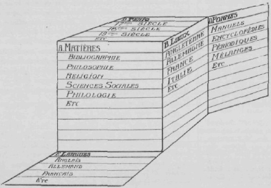
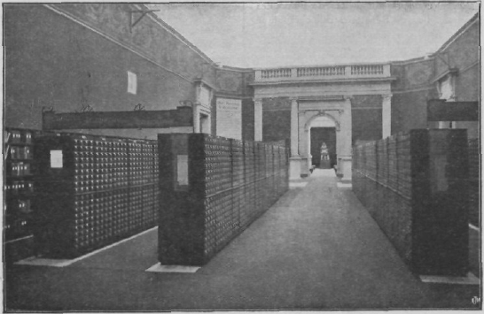
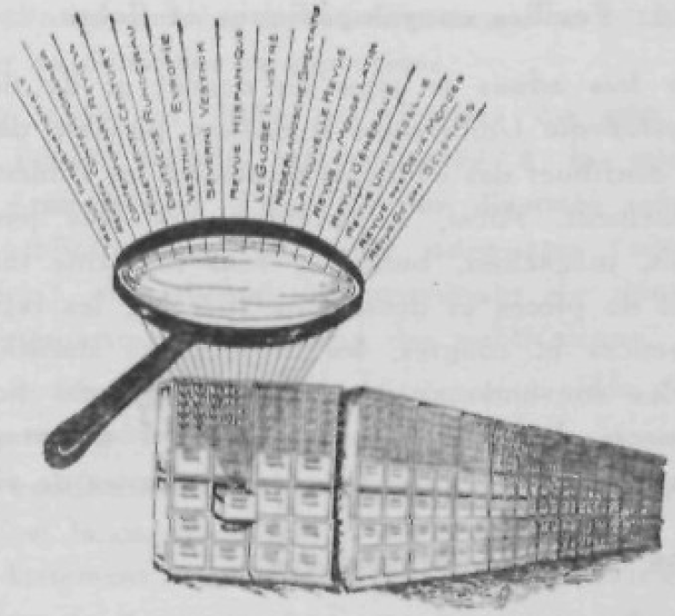
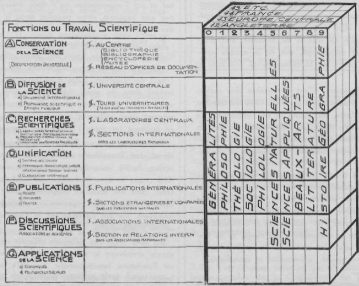
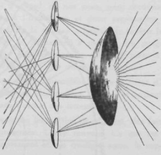
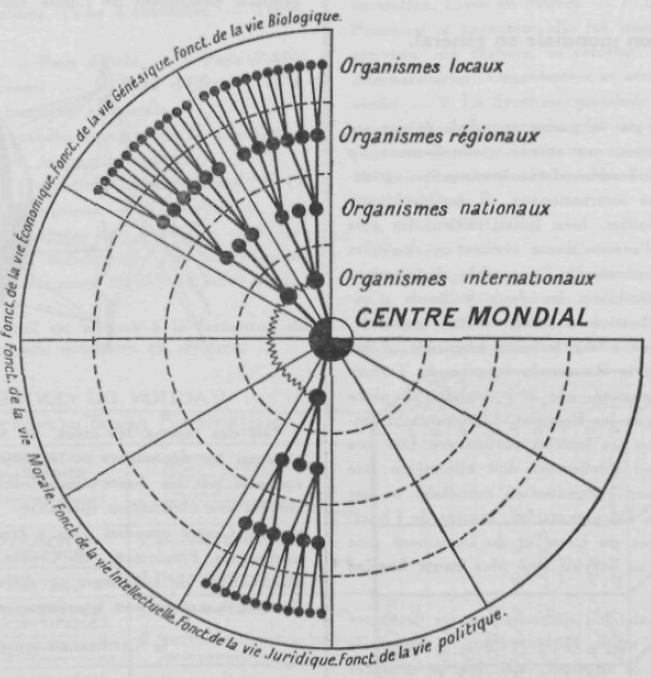

<!-- 1934: p. 372 → --> 

## 4 Organisation rationnelle des Livres et des Documents

Biblio-Technie, Biblio-Economie

a)  Apres avoir déterminé ce qui est (Documentation énumérative. descriptive, historique), il y a lieu de déterminer ce qui doit être (Documentation normative). C’est l’objet de cette quatrième partie du traité : L’organisation rationnelle des livres et des documents. C’est l’Economie (IJiblio Economie) et la Technique (Biblio-Technie).
b)  Il sera traité séparément et successivement des points suivants (ils sont précédés de leur numéro) :

<!-- -->

41. Principes généraux et méthodes à mettre en œuvre pour réaliser l’organisation.
42. Eléments ou ensembles réalisés dans une organisation à quatre échelons.
43. Les unités. Elles sont constituées par les documents.
44. Les divers ensembles (collections et services). Ils sont formés par la réunion des documents similaires et leur mise en œuvre.
45. Les organismes. Ils sont constitués par la réunion des dits ensembles.
46. Le Réseau Universel de Documentation. Il est

### 41 PRINCIPES GÉNÉRAUX ET MÉTHODE D’ORGANISATION

Quelles que soient les œuvres à créer, les ensembles a constituer, des principes généraux et une méthode sont nécessaires. Pour une organisation rationnelle et mondiale, ils doivent être universels. Il y a donc lieu de traiter ici :

1° des principes ; 2° de la méthode ; 3° de l’outillage; 4° des locaux ; 5° du personnel; 6° des opérat:ons ; 7° des autres facteurs d’organisation (finance, convention, réglementation).

#### 411 Les Principes généraux.

Des principes généraux ont à être formulés en ce qui concerne: 1° les documents eux-mêmes et leurs espèces ; 2° la documentation en son ensemble ; 3° le problème ; 4° le but et le plan ; 5° les principes d’unité, d’universalité, de standardisation, coopération.

##### 411.1 Les documents.

a\) L’examen antérieur doit faire conclure aux distinc-formé de tous les organismes unis par une convention sur le but, le travail et la méthode, les liens de coopération et les rapports d’échange.

c)  Dans cette partie on considère l’ensemble de la documentation, ses buis, ses parlies composâmes, ses unités, ses collections, ses opérations et formats. On examine de quelle manière il y a lieu de les traiter èt de les aménager de manière à en former des ensembles et à leur degré supérieur, réaliser une organisation universelle et mondiale. Les moyens, les méthodes, l’outillage, les relations entre organismes sont examinés en fonction de ce but ultime. Il s’agit donc avant tout de rapports généraux, de liaisons corrélatives.

En tête du traité, sous le titre Fundumcnta (0) on a résumé les directives générales à ce sujet.

d)  L’organisation décrite ci-après est en partie celle qu’ont commencé à mettre en œuvre l’Office et l’Institut International de Bibliographie et de Documentation. Nous l’avons développée sur divers points, à titre de commentaires ou de suggestions nouvelles, et en attendant qu’interviennent des décisions collectives internationales.

------------------------------------------------------------------------

lions suivantes; 1° la réalité; 2(\> le document qui est la représentation de la réalité sous une forme soit littéraire (le biblion, l’écrit, le texte), soit graphique ou plastique (l’Icone, l’image),

b)  En principe on peut distinguer suivant un ordre croissant de combinaisons :

1° La Réalité (Réalia) (ex. une science, un paysage, une personne), soit la Réalité dans son ambiance ou milieu naturel, soit la Réalité dans une collection d’objets (muséographie).

2° L’Image (Icône). Elle reproduit la réalité. On distingue la reproduction directe de la réalité. Elle s’opère par l’un des procédés suivants: tableau, aquarelle (en couleurs) isolé ou mobile ou fixe (fresque), plafond, encadrement dans une paroi dans un objet, dessin (noir ou couleur), gravure, photographie, sculpture.

3° La reproduction d’une reproduction de la réalité. <!-- 1934: p. 373 → --> 
Par les mêmes procédés: tableau, dessin, gravure, photographie, etc.

4° Les écrits (Biblion). On distingue qu ils sont ou relatif\* directement à la réalité ou bien relatifs à une image, et alors ils sont : a) ou relatifs à une reproduction de la réalité, soit tableau, dessin, gravure, photographie, sculpture ; b) ou relatifs à une reproduction d\*une reproduction laite à son tour par tableau, dessin, gravure, photographie ou sculpture.

c)  Les réalités, les images, les écrits peuvent, les uns comme les autres, donner lieu : 1° à des collections soit particulières soit universelles ;2° au catalogue de ces collections particulières, soit le catalogue universel.
d)  Le répertoire des éléments de la réalité (Réalia) est un inventaire des choses, êtres et phénomènes, au point de vue de la chose elle-même, du lieu et du temps, dans les trois séries.
e)  Le musée est une collection d’objets réels.
f)  Dans les organismes documentaires, on peut procéder de deux manières: 1° ou bien on constitue en services distincts les collections de choses réelles, les diverses formes de reproduction, les diverses formes d écrit, soit les catalogues et les répertoires selon les diverses formes de reproduction. 2" On peut au contraire combiner en une série unique plusieurs collections, catalogues ou répertoires qu’il serait possible en principe de distinguer.
g)  On peut opérer les classements des diverses collections et de leurs catalogues ou des répertoires en prenant des bases différentes pour les unes et pour les autres, de façon à permettre des recherches à plusieurs entrées.

Le tableau général suivant résume toutes ces distinctions.

1.  Réalité.
2.  Reproduction de la réalité.
3.  Ecrit sur une reproduction de la réalité.

> 1.  Choses elles-mêmes.
> 2.  La mention de chose dans la classification.
> 3.  Le catalogue général inventoriant les choses en elles-mêmes ou appartenant à des collections déterminées.
> 4.  Le catalogue (général ou particulier) de documents relatifs aux choses.
> 5.  Auteur de Pori-ginal.
> 6.  Auteur de la reproduction.

##### 411.2 La Documentation.

Par documentation on entendra à la fois l’ensemble des documents et la fonction de documenter, c’est-à-dire d’informer à l’aide de documentation. Il a été traité de ce point dans la partie 1.

##### 411.3 Le problème.

Il y a un problème central à la Documentation comme à toutes les disciplines. Par le fait que le Document est non pas une donnée naturelle mais bien une œuvre dépendante de la volonté humaine, ce problème est de l’ordre de l’action et de son progrès. Comme tous les problèmes d’ordre pratique il ne peut être résolu que progressivement et par approximation successive. La solution dépend de bonnes méthodes, de coopération dans le travail, d organisation dans les eflorts. Le problème se pose en deux parties: quant à rétablissement du livre et du document; quant à leur utilisation.

1° Quant à l’établissement du livre et du document.

a)  On distingue: 1“ Les Liurcs, dans leur ensemble, ont pour fin la transcription des connaissances scientifiques; 2’ La Science a pour but la connaissance de la réalité; 3‘ La Réalité est l’ensemble des choses corporelles qui existent (monde ou univers).
b)  Le but idéal assigné est : pour la Science qu’elle soit complète et parfaite et couvre intégralement le champ de la réalité; 2° pour les Livres, qu’ils soient complet\^ et parfaits et couvrent intégralement le champ de la science. Les livres devraient donc être les « miroirs » de la réalité.
c)  Critique de l’état actuel : 1° quant à la science: a) la science actuelle est incomplète en ce que les connaissances ne couvrent qu’une partie du champ de la réalité (inachèvement de la science) ; b) la science actuelle ne comprend pas que des vérités (erreurs de la science).

2° Quant aux livres: a) les livres ne transcrivent qu une parties des données scientifiques et par conséquent qu une partie de la science (inachèvement des livres) ; b) ils transcrivent nos connaissances fausses comme nos connaissances vraies (erreurs des livres) ; c) ils transcrivent plusieurs fois les mêmes connaissances (répétitions) ; d) ils ne rassemblent pas les exposés des connaissances en quelques ouvrages, mais les divisent et les éparpillent en d’innombrables volumes (fragmentation et dispersion) ;

e)  ils ne coordonnent pas les faits exposés suivant leur degré d’importance et d’utilité (mélange du principal et du secondaire).
f)  Le problème de l’établissement du livre est donc double: 1° rendre possible la transcription de l’intégralité de nos connaissances : 2° permettre d’extraire de la masse innombrable des livres les connaissances vraies, en écartant les erreurs et les répétitions et en les ordonnant de manière à les sérier et à dégager le principal de l’accessoire.

Deux comparaisons éclairent le problème; il faut mettre de l’ordre dans les «montagnes» de papiers et de documents; il faut créer une « métallurgie » du papier, faire

page omite 373

------------------------------------------------------------------------

> **note**
>
> ERRATA 373bis (orig ca. pg. 432)

ANNEXE ERRATA : (Page omise). 373bis. ORGANISATION RATIONNELLE DU LIVRE 411

des galeries d’approche vers ces montagnes, dont les flancs recèlent des trésors, en extraire le bon minerai et ensuite séparer le métal pur de sa gangue. L’extraction se fait d’une gangue pour le fer à raison de 40 à 65 %. pour le cuivre à raison de 7 à 8 %. Pour le radium, il faut des tonnes de Hornblende pour en extraire quelques milligrammes!

2.  Quant à iutilisation du Livre et du Document.

La connaissance des choses une fois acquise par quelques esprits et incorporée par eux dans les livres et les documents, il y a lieu de rendre possible, avec !e minimum de temps et de peine, la même acquisition par tou\* les esprits qui peuvent en avoir besoin. Il s’agit là d’utilisation et de diffusion. La documentation s’établit de nos jours sur la base d’une rationalisation et d’une organisation des ensembles des éléments en s’appuyant sur les données les plus avancées de la science et de la technique d’une part, du travail intellectuel et de l’industrialisation d’autre part.

Etablir le contact « entre l’élaboration de la pensée et l’enregistrement des connaissances ».

Le but se précise ainsi :

I" Accroître l’effet du livre et du document en tant que résultat corporel de l’enregistrement du savoir humain (efficace quant à la chose, l’espace et le temps, quant à l’individu et la société).

2° Aider à former de l’ensemble des documents un Corpus Librorum qui soit représentatif de la pensée uni Le Tahleau suivant présente les distinctions sur la base desquelles se pose le Problème de la Documentation. a Institution b Document C Etat de la chose d caractère C étendue f degré moJe de conservation h Forme 1. Bibliothèque 2. Bibliographie 3. Archive 4. Encyclopédie 5. Musce 1. Fiche 2. Livre 1. La chose 2. Son résumé 1. Analytique 2. Synthétique 1. Totalité 2. Partie 1. Détaillé 2. Abrégé 1. Emmagasiné 2. Exposé 1. Texte à lire 2. Imagcàvoir 3, Dossier 4. Tableau 3. Son catalogue 4. Son nom 3. Choisi 5. Objet 5. Sa classification

##### 411.4 Buts, Plan, Organisation de la Documentation.

Comme toute œuvre de l’homme, le livre et le document sont déterminés par un but. C’est à lui qu’ont auteurs et coopérateurs à subordonner tous leurs travaux.

Le but, le plan général a été exposé au début de ce traité sous le titre Fundamenta (0). Il y est dit les tâches communes proposées à l’action de tous. La détermination des méthodes est en fonction notamment de ce but.

Les six buts à poursuivre dans l’organisation peuvent s’exprimer par ces six devises : davantage, du meilleur, plus ordonné, plus facile, plus vite, pour un plus grand nombie.

###### 411.41 But.

Les Buts de la Documentation organisée consistent à pouvoir offrir sur tout ordre de fait et de connaissance des informations documentées : 1° universelles quant à leur objet; 2° sûres et vraies; 3° complètes; 4° rapides; 5° à jour; 6° faciles à obtenir; 7° réunies d’avance et prêtes à être communiquées; 8° mises à la disposition du plus grand nombre. verselle, de la science tenue comme systémation dts connaissances.

3° Tenir ainsi le livre comme instrument du travail intellectuel, nécessaire à la fois à la connaissance ou à la transmission du savoir acquis et à l’élaboration des connaissances elles-mêmes.

Desiderata majeurs de la documentation.

a)  Quant à la production et à la distribution : réaliser la documentation sous des formes et des modes tels qu’il soit possible d’en constituer des ensembles et de faire ainsi de chacun d’eux la partie s’insérant et s’incorporant aisément dans le tout.
b)  Quant à l’utilisation : disposer d’une documentation: a) complète; b) aisément obtenable (1° démarches et formalités simples; 2° rapidité; 3° coût); c) assimiliatton ou de lecture facile.

###### 411.42 Plan.

Il y a lieu de: 1° décomposer; 2° définir; 3° classer et 4° mettre en relation les données relatives au livre-doru-ment considéré: a) dans son entité totale; b) dana tes parties ou éléments; c) dans ses opérations ou fonction»; d) dans sa genèse ou son histoire; e) dans sa distribution dans l’espace. <!-- 1934: p. 374 → --> 

###### 411.43 Organisation. Concentration du travail et décentralisation.

a)  On peut définir l’organisation, l’ensemble des principes et des dispositions pour relier entr’eux d une façon permanente tous les éléments concourant à un simple ensemble ou à une suite d’acte. C’est à l’organisme formé par cet ensemble et à ses organes reliés aux autres organes qu’est dévolu le soin de veiller à cet ensemble, a son unité, à sa continuité, à son adaptation, à l’éloignement de tout ce qui pourrait le troubler et le détruire, n la réalisation de tout ce qui peut l’améliorer et le développer.
b)  L organisation détermine l’organisme et l’organisme à son tour détermine l’organisation. C’est la fonction qui, en s’exerçant, crée l’organe; c’est l’organe formé (*a structure) qui réalise la fonction. Il y a action et réaction, réciproques et continues. Avec l’avènement du règne humain caractérisé pat 1*intelligence, un facteur nouveau intervient, la finalité des actes, I organisation préconçue, la préfiguration des fins et des buts, en conséquence des pians et des programmes.

L’organisation dès lors se présente n trois stades ou degrés. 1° L’organisation est purement idéologique; elle est dans la pensée. 2° L’organisation est représentée pa. un organe de caractère social : une convention qui marque un accord convergent de volonté, une institution, un organisme. 3° L’organisation prend un caractère matériel, elle e«t incorporée dans des objets, des machines, des installations, des locaux.

L’organisation de la documentation doit se poursuivre simultanément et parallèlement dans les trois domaines : idéologique, institutionnelle, matérielle.

c)  D’une manière générale, tout ce qui est en dehors du point de vue spéculatif (la pensée pure) et intéresse le point de vue pratique (l’action) donne lieu à «Economies (organisation, aménagement, gestion, administration) et à Technique. Il y a une Economie et une Technique de la Documentation el elle embrasse les quatre fonctions de production, distribution, répartition, consommation. (Document-économie, biblio économie, document-technie, hiblio-technie.)

Les enfants parlent sans connaître la grammaire, les paysans chantent sans connaître la musique; ainsi les hommes pour la plupart lisent et écrivent sans se préoccuper de technique littéraire ni documentaire. L’élaboration, la connaissance et la diffusion de cette technique perfectionneront les documents dans la mesure où ;a gïnmvrmue et la théorie musicale ont pu perfectionner la langue et la musique. De même les hommes sont sociables; ils se rapprochent et concourent spontanément sans prendre pleinement consrience de la réalité sociale, de la science sociale (sociologie), des techniques sociales. Mais c’est sur la base de ces dernières que finalement il est travaillé au progrès social.

Dans le domaine des livres et des documents en particulier, il y a lieu d’arriver à la conscience d’une organisation, d’une économie, d’une technique. L’organisation rationnelle cri tout domaine implique buts et plans, coopération, division et répartition du travail, méthodes, ententes.

d)  Tandis que tous les objets autour de nous se transformaient rapidement, le livre a offert longtemps ce contraste qu’en sa forme externe il demeurait quasi immuable. Malgré l’évolution de la pensée scientifique, le contenu bibliologique, les modes d’enregistrement de nos connaissances faisaient peu de progrès.

La Pensée de l’homme depuis un siècle a largement un contenu nouveau, science, technique, arts, littérature, sociologie: l’idéologie a été sinon entièrement révolutionnée, tout au moins profondément modifiée et immensément augmentée. A ce contenu il n’est pas possible que ne correspondent des moyens nouveaux d’expression, une adaptation du contenant : le livre, les documents.

Mais depuis quelques années ces points ont fini par faire l’objet d’études et de mouvements. Des innovations réelles se sont produites. Nous sommes seulement à un commencement.

Un certain nombre d’idées et d’inventions ont apporté un progrès considérable à la documentation: la publicité reconnue nécessaire des travaux scientifiques; la collaboration ; la conception d’un cycle reliant toutes les opérations, tous les travaux ; la classification ; la fiche et le répertoire ; l’office de documentation, l’encyclopédie, l’idée I de règles, normes, unités s’appliquant au travail et aux productions intellectuelles comme au travail et aux productions industrielles.

e)  Au cours des siècles écoulés une technique et une organisation ont été données à la production matérielle des livres (l’imprimerie) et à leur distribution (librairie). C’est un exemple et la justification de la demande d organiser aussi les autres parties. Ainsi en imprimerie les lettres ont été standardisées (le point typographique), les règles de correction d’épreuves, largement déjà le format. Il y a toute la belle organisation de la librairie avec ses centrales et ses bourses.

On commence à se rendre compte que le travail relatif au livre ne peut gagner en puissance qu’en s’aidant d un outillage appropriée, qu’il ne peut s’y opérer de la coopération pratique qu’à l’aide de méthodes unifiées et coordonnées. Dans ce double ordre d’idées, chaque jour apporte quelque progrès.

g)  On objectera : 1° l’organisation proposée est trop

vaste. Mais la pensée elle-même n’est-elle une vastitude incompressible ? 2° L’heure est trouble, cahotique, ce qui divise l’emportant sur ce qui unit. Mais pourquoi ne pas <!-- 1934: p. 375 → --> 
scruter à fond les divergences pour dégager les convergences ? 3° L’organisation se développera d’elle-même avec le temps sans qu’il soit nécessaire de la déterminer. Mais les esprits ont renoncé en tous domaines aux fatalités résignées pour présider directement eui-mêroes aux destinées. L’idée est lancée. Il est toujours temps de présenter de nouveaux arguments ou d approfondir les premiers.

g)  L’organisation de la Documentation est a réaliser à cinq degrés :

<!-- -->

I.  Liare el Document. — L’organisation de la multiplicité des données graphiques et intellectuelles pour en constituer l’unité du livre et du document, a) Livre particulier. Il) Livre Universel (Encyclopédie).
II. Collection de Liares et de Documents. — L’organisation de la multiplicité des livres et des documents,

<!-- -->

a)  Collections particulières (Bibliothèques, Hcmcrothèques, Iconothèques. Photothèques, etc.), b) Collections universelles! Bihfioi/iccu Universalis, Iconoitraphia Universalis.

<!-- -->

III.  Organismes sa Offices de Documentation. —

<!-- -->

a)  Organismes spécialisés ou localisés, b) Organisme universel.

<!-- -->

IV. Réseau Universel de Documentation. — a) Centre du Késeau. b) Station du Réseau.
V.  Corrélation. — a) Avec le Travail intellectuel, b) Avec l’Organisation mondiale en général.

##### 411.5 Des divers principes.

Sont à mettre en œuvre les principes : 1° unite ;

2° universalité; 3° expansibility ; 4° rationalisation, normalisation, standardisation ; 5° coopération ; 6° publicité ; 7° Sériation des efforts.

###### 411.51 Unité (Complexité).

L’Unité consiste à concevoir comme un seul ensemble toute la Documentation et à tendre constamment à y ramener tout ce qui aurait tendance de s’en éloigner.

###### 411.52 Universalité (Complétude).

L’organisation d’ensemble proposée embrasse les diverses espèces de documents, de collections et d’organismes aux quatre étapes suivantes :

1° Prototype universel (idéaux). La réflexion scientifique combinée avec l’invention établit à l’état théorique idéal ce qu’il est désirable que soit l’organisation dans son ensemble et dans ses parties. Elle crée ainsi sous chaque partie le Prototype Universel ayant un caractère purement idéal, et constamment susceptible de développement et de revision.

2° Les standards: par convention on établit pour tous les ordres de documents, collection» et organismes, les standards et unités. Il y est procédé par recommandations, règles et conventions.

3° Les documents, collections et organismes, du type universel, se conforment aux standards arrêtés et se réali-] 375) Rant dans toutes les parties ou stations du Késeau Universel. Ces collections devraient être désignés par une nomenclature systématique avec termes internationaux (latin). Editio Universalis. Bibliographia Universalis. Bibliotheca Universalis. Atlas Universalis. Projeclio Universalis. Encyclopedia Universalis. Museum Universale.

4° Collections et organes centraux et ensembles constitués d’une manière conventionnelle sous la direction d’organes centraux mettant en œuvre la coopération.

###### 411.53 Expansibilité (règle). Méthodes universelles et applications particulières.

a)  Les méthodes arrêtées sont expansibles. Elles se développent a divers degrés, mais à partir du degré supérieur, celui du maximum d’étendue et de complexité.

Chaque élément de la méthode et de l’organisation offre une échelle de degrés, allant du plus simple au plus complexe (très petit, petit, moyen assez grand, très grand)

« qui peut le plus peut le moins ». Des règles destinées à la documentation universelle ne se trouveront donc pas en défaut devant les nécessités de documentations particulières. Pour celles-ci chacun est libre de n’appliquer les méthodes et les règles que jusqu’à un tel degré de détail qu’il juge utile.

b)  L’applicntion de ces principes généraux donnent lieu aux observations suivantes: 1° Les règles catalographiques détaillées, comme il importe pour la description des ouvrages rares, les incunables par exemple, peuvent de réduction en réduction se limiter à deux lignes et même à une ligne. 2° La classification peut être simplifiée jusqu’à ne faire usage que de I, 2 ou 3 chiffres, de n’employer certaines divisions communes (la langue par exemple) ou ne pas employer du tout de subdivisions communes, ou seulement 5, 3 ou même une décimale. 3° La forme matérielle des catalogues peut être celle de fiches en fort bristol ou se réduire s’il le faut à un catalogue imprimé ou manuscrit en volume. 41 Les ouvrages et articles seront analysés et il y a des règles à cet effet, mais ou pourra s’abstenir de toutes notes analytiques, de contenu ou de critique. On pourra appliquer un système complet de duplicata et de références ou les limiter aux plus essentiels. 5° On pourra, dans l’organisation de la bibliothèque et des collections de documents eux-mêmes, disposer les pièces dans l’ordre strict de la classification, intercaler à leur place quand les ouvrages ont des références multiples, des cartons repérés en tel nombre qu’d est fait des fiches de références dans les catalogues; on pourra même diviser une grande bibliothèque encyclopédique en sections correspondant aux principales divisions de la classification, de manière à rapprocher les travailleurs eux-mêmes des ouvrages et à leur donner libre accès aux rayons. On peut n’appliquer le principe du classement systématique sur les rayons qu’à la salle de lecture et y donner libre accès aux rayons, tandis que dans les nmga- <!-- 1934: p. 376 → --> 
ains l’ordre suivi serait celui des numéros d’accession uj d’inventaire, avec éventuellement respect des divers fonds antérieurement constitués.

c)  Ainsi les méthodes universelles constituent comme un réservoir général. Il appartiendra à chaque organisme de déterminer lui-même le degré auquel il les appliquera et l’étendue qu’il entend leur donner. Le Manuel Général des Méthodes sera donc complété par des instructions écrites, élaborées dans chaque établissement, et dans Lesquelles se trouveront incorporées les décisions prises quant à l’application du manuel.

d\) Le piincipe d’expansivité de la méthode offre plusieurs avantages. 1° 1 oui travail opéré une fois, à quelque degré élémentaire soit-il, est utilisable pour tout travail ultérieur. On sait exactement où l’on va; on peut commencer par n’importe quel bout; on est assuré de pouvoir a tout moment faire mieux et plus complet, de pouvoir faire face à l’accroissement subit ou considérable des collections, aux exigences nouvelles qui s’imposeraient. 2" Ceux qui ont à édifier de grandes architectures de services y affectés) se sentent en communion de travail avec tous ceux qui de par le monde appliquent les mîmes méthodes, de pouvoir comme eux coopérer au développement et au perfectionnement des méthodes et des stations d’un réseau universel, el d être activement reliés au centre de la Documentation Universelle. 3° Pour ceux qui ont à se servir des collections et à recourir aux services des Bibliothèques et Institutions documentaires, c’est avantageux de n’avoir à connaître qu une seule méthode, générale, synthétique, unique, malgré ses degrés de développement et par suite de se sentit immédiatement c chez eux » partout où on les applique, ce qui fait gagner du temps el permet d’utiliser plus à fond les ressources documentaires de ces établissements. 4" Est rendu possible de plus en plus l’établissement en coopération de certains travaux et services. On s’élève ainsi progressivement à la conception de l’Unité de la Documentation corerspondant à l’Unité des Connaissances , par la pensée, toutes les Bibliothèques, toutes les Archives, tous les Musées, Ioub les Offices de documentation du monde constituent des branches idéelles d’une seule grande Organisation Universelle dont toutes les œuvres sont, par voie de libre lecture, vision, consultation, prêt, copie échange, à la disposition de tous.

« Ut omnes uni J sinf ». L’on se trouve ici au cœur du problème général du temps présent et aussi de tous les temps : individus et société, égoïsme et altruisme. 1/ homme a-t-il avantage aux formes supérieures de la socialité (solidarité, fraternité) ; est-il capable de s’élever jusqu’à elles par un effort conscient, rationnel, dirige, constant ? Evidemment cet effort ne se justifie que s’il y a échange, réciprocité, mutualité. Mais il faut bien commencer et avoir conscience que le cercle ultime d’ex-pansion, l’universalité et la mondialité, sauront ne pas détruire les cercles de l’individu, de l’institut, de la nation, mais au contraire les épurer de ce que l’égoïsme a nui à leur développement même.

###### 411.54 Rationalisation, normalisation, standardisation.

a)  Les règles à suivre pour la standardisation de la documentation ne sauraient être arbitraires. Elles doivent être coordonnées non seulement entr elles, mais avec toutes les autres standaidisations et surtout avec les manières de faire les plus généralement suivies parce qu’elles sont les plus naturelles ou les plus conformes aux habitudes sociales.
b)  Les mouvements naturels sont basés sur l’usage pré dominant de la main droite. Tous les gestes actifs, tous ceux qui exigent de 1 habilité, de la force, de la grâce sont faits par la main droite.

Or les mouvements de la main droite sont commandes par la position du pouce qui, en se superposant aux autres doigts, fait de la main un instrument de préhension apte à tenir un outil, un ustensile et à le manier aisément. Ce tait détermine la position de la plume et la direction de l’écriture qui, chez les occidentaux, est universellement dirigée de gauche à droite et de. haut en bas.

La droite demeure la place d’honneur. (L’Evangile déjà fixe cette place. Le Christ à la droite de son Père.) On peut le justifier par la facilité de venir en aide à qui l’on veut honorer. On laisse autrui sur sa droite en marchant car si l’on va au-devant de lui c’est plus facile pour le saluer du chapeau, pour lui tendre la main.

c)  Dans la documentation il est naturel de ramener le plus de règles au livre et à la page du livre. Ceci conduit à quatre directions ou bases fondamentales : 1. de gauche à droite (sens de l’écriture et de la lecture) ; 2. de haut en bas (id.) ; 3. retour pérodique à la ligne d abord, à la page ensuite, au lieu d’une continuité de ligne et d’une continuité de papier ; 4. angle inférieur de gauche, base df tous les alignements. Cet angle est fixe quelle que soit !a dimension.

D’où les applications suivantes : I. les livres sont placés sur les rayons de gauche à droite, de haut en bas, en recommençant après chaque rayon et après chaque travée. 2. Les fiches dans les répertoires sont classées de devant en arrière ; l’ordre chronologique des fiches est aussi d’avant en arrière; les tiroirs sont disposés de haut en bas, et par rangées distinctes d’un seul tiroir. 3. Dans un dossier, les lettres anciennes sont classées les premières.’ 4. Dans les fichiers et les classeurs, les fiches divisionnaires sont placées devant les documents et non derrière; les becs et encoches sont disposés de gauche à droite et en ordre strict de subordination (et non en chevauchant et <!-- 1934: p. 377 → --> 
en recherchant la visibilité des titres, bientôt en vain quand de nouvelles fiches sont introduites dans la série), il)

###### 411.55 Coopération. Collaboration.

a\) Devant le travail à accomplir, l’homme peut avoir deux attitudes: l’isolement ou la coopération. Aucune œuvre ne pouvant se réaliser à l’appel d’un simple commandement donné aux choses, il faut que le travail s’élabore successivement. Il est possible qu’un même homme opère la suite des opérations nécessaires par une division introduite dans son propre travail, il est possible aussi qu’une répartition des tâches intervienne et que, pour des motifs divers, l’homme obtienne le concours d’autres hommes. C’est l’acte de socialité par excellence. Ces motifs peuvent être la contrainte, l’échange des valeurs ou l’acte désintéressé en considération de la personne d’autrui, ou du travail à réaliser.

b)  Les rapports étant devenus internationaux, ils ont amené la collaboration internationale. Il importe désormais d envisager et de traiter également les choses de la documentation sous l’aspect universel et mondial.
c)  La question se pose ici de l’obligation ou de la liberté dans la coopération. En tous domaines un minimum étant nécessaire, n’est-ce pas par tous les moyens possible qu’il faut le réaliser ? L’exemple du Radio est typique. L’U. R. S. S. y agit à sa guise, elle ne coopère pas à l’organisation mondiale des ondes; elle interfère, par ses propres ondes, dans tout le système mis en œuvre par les autres pays.
d)  Dans Ica méthodes, bases de la coopération, il y a cinq étapes : 1° elles commencent par une idée théorique ; 2° ensuite elles s’appliquent individuellement ; 3° puis elles font l’objet de recommandations; 4° finalement de règles; 5° et on entrevoit le moment où des lois et aussi des conventions et traités internationaux, conclus entre gouvernements. imposeront certaines règles sans lesquelles des travaux fondamentaux ne peuvent se poursuivre.

###### 411.56 Publicité des œuvres et des travaux scientifiques.

Cette publicité est à la base de tout ce qui s’entreprend dans le livre, lequel lui-même se définit c une publication ». On distinguera, entre la possibilité de connaître des faits et l’effort pour les faire connaître effectivement du très grand nombre des individus. La science, ( IJ Le Deutêche Normenauaschuaa (Conseil allemand de la Normalisation) s’occupe depuis plusieurs années de la rationalisation dans le domaine des bibliothèques. Il poursuit l’application du DIN-format aux formats des livres et des revues, l’unification des titres cités (Zitier-tïtel), de la classification et d’autres matières. Le sous-comité pour la normalisation des bibliothèques est présidé par le Directeur Général Dr Kruss, délégué à la Commission de Coopération Intellectuelle de la S. D. N. la technique, les industries, la conduite des affaires publiques doivent passer, graduellement de l’état de secret à l’état de publicité. Pour les lois, les brevets, le casier civil, l’état civil, les informations administratives telles que les statistiques, on a organisé la publicité.

Devant la multiplicité des travaux qui attendent leur tour de publicité, on sera amené à réaliser leur enregistrement dans des offices spéciaux où chacun pourra rn obtenir copie (expédition).

###### 411.57 Sériation des efforts. Etapes.

La différence est grande entre une création de toute pièce, avec des puissants moyens d’idées, d’hommes, d argent et une organisation reliant des éléments existants et qui ont chacun leurs propres moyens d existence et de direction. On peut obtenir tout de la contrainte dans le premier cas ; il faut attendre tout de la bonne volonté dans le second cas. L’analogie est frappante ici entre l’organisation scientifique et la synthèse scientifique. Celle-ci s’opère constamment et spontanément dans la liberté avec, à la base, les myriades de résultats analytiques, particuliers et, au sommet, les directives générales, et les principes formulés par les esprits synthétiseurs. Cette synthèse s’opère ainsi en quelque sorte d’elle-même. Le Livre, qu’il faut organiser, est une réalité vivante et ¿es organismes fonctionnent à la manière de tous les organes sociaux, partie spontanément, partie délibérément, rationnellement, conventionnellement. Le corps de la Documentation (Corpua documentarium) donne armature et soutien à la matière bibliologique (Materia bibUologica), laquelle se confond elle-même avec la science, l’art, la littérature, la technique et toute l’action. Il importe de ne détruire que ce qu’on a remplacé, de ne réformer que dans un cadre général, de savoir reconnaître avec tact et subtilité ce qu’il faut laisser à la vie propre et ce qu’il faut, au contraire, placer directement dans un cadre logique et naturel. En conséquence, toute l’organisation définie et conventionnelle doit procéder suivant les étapes déterminées par les circonstances. Il faut savoir préparer et mûrir l’action et considérer qu’en organisant certains îlo’s dans le vaste fleuve, on donne déjà une direction au flot lui-même.

#### 412 Méthodes.

Les méthodes comprennent : 1° les règles unifiées et codifiées; 2° le collectionnement systématique des document» eux-mêmes ; 3° 11 la classification, offrant un cadre commun à toutes les divisions de l’organisme et sous les numéros desquels figure tout sujet susceptible de l’intéresser ; 4° le système de rédaction analytique et synthétique, monographie et polygraphie; 5° le système des formats ; 6° le système des fiches et feuilles k classement vertical ; 7° le système des duplicata et références consis- <!-- 1934: p. 378 → --> 
tant à faire figurer un, meme document dans les diverses séries fondamentales de la classification auxquelles ils se réfèrent ; 8° le système des répertoires et celui des dossiers disposés dans les classeurs verticaux formant des ensembles organisés. 9° Méthodes documentaires universelles et applications particulières.

Dans l’élaboration des méthodes universelles, il a été procédé par l’Institut International et dans ce traité de deux manières différentes :

1° Certaines méthodes ont été élaborées directement.

2° D’autres, déjà réalisées en dehors, ont été adoptées mais revisées, élargies, intégrées au système général.

##### 412.1 Règles unifiées et codifiées.

11 faut des règles précisant et coordonnant les formes des documents et les ensembles qu’ils constituent: régies susceptibles de perfectionnement, formes et ensembles pouvant être conçus selon des types fondamentaux, les uns traditionnels, les autres nouveaux. Les règles bibliographiques et documentaires internationales ont à faire l’objet d’un « Code coordonné de la Documentation

La question des méthodes domine l’art du Livre, de la Bibliographie, des Bibliothèques, comme elle domine l’art de toutes les autres disciplines. Par les méthodes, celui qui traite le livre est nanti des moyens qui lui donnent 6a compétence et sa technicité. Il y a une Technique générale du classement des documents, une Technique bibliologique, une Bibliotechnie.

La technique repose sur ce principe fondamental : appeler à l’existence réelle des conceptions et des idées, en tenant compte des conditions de l’espace et du temps. Les opérations dans les organismes documentaires s’inspirent de ce principe et peuvent ainsi être définies une distribution adéquate des objets, des ressources et des énergies, selon le lieu et le moment. « A vrai dire, dit Coyecque, tout est technique, en d autres termes, pour faire une chose et pour la bien faire, il faut avoir appris à la faire Toute technique, pqur guider efficacement l’action, doit être fondée sur la science de l’objet dont elle » occupe. Il y a une technique du Livre et du Document, une Bibliotechnie; et elle doit reposer sur la science du livre et du document, la Bibliologie.

##### 412.2 Collections systématiques.

Le collectionnement est l’action de réunir en collections. Les documents existants formant des séries, on est naturellement conduit à les réunir tous et à former ainsi en corps réel, ce qui n’a jusque là d’existence que comme ensemble idéal.

Les catalogues universels sont des préfigurations des collections universelles. Ainsi le catalogue des livres existants f bibliographie) figure en avance l’ensemble que sera un jour la collection des livres réunis en bibliothèque ; le catalogue des objets préfigure la collection des choses ou le musée. L’exemple typique est celui des collections de timbres-poste. Chacun, par le catalogue édité de toutes les émissions timbrophiliques, peut connaître à l’avance sur quoi doit porter son effort de collectionneur. Et il en est ainsi de toute série de pièces, documents compris, dont on poursuit systématiquement la réunion, soit par la concentration de pièces inconnues recherchées, soit par la mise ensemble de pièces connues et décrites d’avance.

##### 412.3 Classification et classement.

L’importance de la matière et le fait que les Tables de la Classification Décimale, dont la 2• édition vient d être achevée, contiennent de nombreuses indications de principes et de méthdea, nous font réduire des développements qui pourraient paraître de proportions démesurées à cette place.

LA CLASSIFICATION BIBLIOGRAPHIQUE :

La masse de livres délaissée à différents points de vue, successivement ou simultanément (subdivision) selon les cinq caractéristiques suivantes : A. Matière ;

B.  Lieux; C. Temps: D. Formes; E. Langues.

------------------------------------------------------------------------

¡ 412 I METHODES ¡ 379 1

###### 412.31 Notion de la classification.

On entend par classement bibliographique, l’art de disposer les ouvrages d’après leur matière (sujet ou contenu) et par classification, le tableau ou les tables qui disposent les connaissances dans l’ordre où doivent 1 être l.\*s ouvrages eux-mêmes.

La classification bibliographique est un ordre de suite. Elle se développe en une série linéaire unique dont tous les termes occupent, les uns par rapport aux autres, une place ou rang désigné par un signe (mots, nombres ou symboles quelconques ordonnés en système).

La classification est l’armature de l’organisme intellec-tuel qu’est la bibliothèque ou une collection de documents. Elle a de multiples utilités: Io elle sert au choix des ouvrages, car elle constitue un véritable plan d acquisition ; 2Ü elle est utile à la lecture car elle présente le plan d’un cycle de lectures fondamentales (autodidaxie) ; elle sert aussi pour l’étude de la terminologie, pour l’ordonnancement des matières de l’encyclopédie; 3° le catalogue méthodique de la bibliothèque et des collections est fondé sur elle ; 4° le placement des ouvrages sur les rayons et des documents dans les classeurs est opéré dans son ordre ; 5° elle constitue un classement des connaissances dans l’esprit.

I.  — Division de Vétude.

Une étude complète de la classification embrasserait les questions suivantes :

A.  — La classification en général. — Taxonomie.

<!-- -->

1.  Préliminaires. Définition. Importance. Rapports et corrélations avec la Science en général, la Logique, le Langage, l’Ecriture et la Notation, la Documentation, les objets et les arts. 2. Notions fondamentales. Réalité et conception, l’individu et la classe, les catégories. Les ordres taxonomiques fondamentaux. 3. Degrés dans la classification : Classification d’une chose, d’une science, d- l’ensemble des sciences. 4. Espèces de classification • naturelle et conventionnelle. 5. Notation, expression de la classification : mots-matières, symboles. 6. Formes de la classification: alphabétique (analytique), méthodique

(synthétique).

B.  — La classification décimale universelle (C. D. U.).

L Notions, Historique et Développement. 2, Caractéristiques et Plan de la classification. 3. Notation. 4. Rubriques et nombres simples ou composés. 5. Les Tables systématiques, alphabétiques, synthétiques. Concordance avec les principales classifications. 6. Emploi. Applications et indexations dierses: Publications (titres, tables et index). Catalogue (bibliographie). Collections (bibliothèques); musées; répertoires, archives et dossiers divers, brevets, législation, statistique, comptabilité. 7. Editions diverses de la C. D. 8. Examen critique de la Classification ; réformes proposées. 9. Organisation de la coopération pour le développement de la C. D. 2. — Classification théorique.

Classer est la plus haute opération de l’esprit, celle qui Implique toutes les autres. L’esprit s’élève à mesure qu’il est susceptible d’abstraction, de systématisation et de synthèse. Classer donne l eu à quatre operations distinctes, quatre démarches successives de l’intelligence.

a)  De la multiplicité des choses (être, objets, phénomènes, événements) dégager par comparaison les classes ou types les plus généraux et établir ensuite les rapports entre eux selon les lignes d’une architecture intellectuelle d’ensemble (systématique, construction de la science).
b)  Désigner chacune des divisions ou rubriques du Tableau de la Classification ainsi obtenu par une notation adéquate, cotes ou indices (Langage).
c)  Ensu te, pour chaque objet qu’il y a lieu de classer (note, livre, fiche, document quelconque), reconnaître sa place dans la classification comme contenu par rapport nu contenant ; fixer cette place en inscrivant sur l’objet la notation correspondante (indexation).
d)  Enfin, former la collection ou l’ensemble des objets à classer (livres, documents, etc.) de telle sorte que con otdonnancemcnt reproduise l’ordre même de la classifi cation (classement).

<!-- -->

3.  — Difficulté de fa classification.

Cependant, dans l’état actuel d’avancement des connaissances :

a)  La Science dans sa plus grande partie n’est pas encore construite et les desiderata d’une structure logique (induction et déduction) ne sont pas satisfaits.
b)  Le langage usuel n’est pas adéquat pour dénommer les concepts scientifiques car: a) ce langage est aussi multiple et varié qu’il est de nations, alors que la science elle, est universelle; b) ce langage consiste en un système de vocables reposant sur de superficielles et lointaines analogies remontant aux âges d’ignorance de l’Humanité. (Ex. : le nom Soleil dérivé d’une racine sanscrite qui signifie brillant sert à désigner un corps bien déterminé du système solaire); c) les vocables rangés selon l’arbitraire de l’ordre alphabétique des lettres qui les transcrivent ne révèle rien de l’ordre systématique des choses que révèle ou formule la science.

###### 412.32 Types de classification bibliographique.

F existe d’innombrables systèmes de classement. Tous cependant peuvent se ramener aux types du tableau suivant :

(Classification systématique.

Classification alphabétique.

( Sans notation.

I Avec notation.

1 / Notation par chiffres.

/ 1 Notation par lettres,

j Notation par autres symboles.

! j Notation par combinaison de chiffres, lettres , [ ou symboles.

------------------------------------------------------------------------

ORGANISATION RATIONNELLE DU LIVRE 412 *380*

###### 412.33 Classification alphabétique. Classification décimale.

La classification alphabétique fait usage de mots, noms propres et noms communs, rangés dans l’ordre de l’alpha-bet, à la manière du dictionnaire : elle est pratique parce qu’elle n’exige aucun instrument intermédiaire pour le classement.

Mais la classification alphabétique par matières a sur la classification décimale les désavantages suivants : 1° elle épurpille la matière sous des rubriques classées arbitrairement dans l’ordre des lettres et non point dans l’ordre des idées comme le fait la C. D. ; 2J elle oblige chacun à fixer soi-même son choix sur les rubriques à utiliser tandis que la C. D, offre un cadre tout prêt; 3° elle oblige à écrire des mots plus longs que les chiffres, il en \< st surtout ainsi lorsqu’on désire diviser le mot principal par des mots secondaires ou ceux-ci par des mots tertiaires, alors qu’il suffit d’ajouter aux nombres décimaux un nu deux chiffres ; 4n les mots-matières n’ont de signification qu’en une seule langue, tandis que les indices de la C D. sont internationaux : 5° tout classement alphané tique par l’arbitraire du choix des mots a un caractère personnel, tandis que la C. D. a un caractère impersonnel et universel. Par elle est rendue possible la centralisation automatique de documents et de données émanant des sources les plus diverses; 6° dans l’échange des correspondances. si le correspondant A a eu soin d inscrire l’indice de classement des pièces sur la copie et sur l’original et cela par une seule frappe, il dispense le correspondant B de procéder lui-même au classement chez lui des originaux. D oit dans l’ensemble une économe de 50 % dans le classement de ces pièces.

###### 412.34 Principales classifications systématique?.

Les classifications françaises ont fort vieillis telles celles de Brunet, de la Bibliographie de la France. — Dans les pays anglo-saxons on connaît les classifications de Dewcy (Décimal Classification), de Cutter (Expansive Classifica tion), de James Duff Brown (the Subject Classification). Ln Bibliothèque du Congrès, & Washington, a sa propre classification. H. E. Blisa (The Organization o/ Knouîfedge in Libraries, 1933) a présenté une critique des grands systèmes et formulé des propositions pour une classification nouvelle. ( I ) (I) Ont spécialement traité de Classification bibliogra-graphique dans leurs écrits; Bishop, Bradford, Ch. Couh son, Charles A. Cutter, Cari Diesch, H. H. Field. Donker Duyvis, Rudolf Forke, Rudolf Gjelsness, Hanauer, E. Krelt, E. Wyndham Halme, H. Lafontaine, Margaret, Mann, Charles Martel, William Stetson, Mervil, Julia Petter, Ernest Cushing, Richardson, Ch, Richet, W. C. Bernwick Sägers, Georg Schneider, H. Sebert, A. R. Spofford, A. Law Voge, etc.

###### 412.35 Historique des systèmes existants.

\*\* • I

L’histoire des classifications bibliographiques, dites aussi systèmes bibliographiques, est très ancienne et très longue. Elle permet de constater les influences diverses i»uc cessives qui se sont exercées sur elles. Sans entrer dans aucun détail, voici quelques faits généraux qui caractérisent les grandes étapes parcourues.

On ne sait rien de bien précis sur les systèmes de l’antiquité, bien qu’il soit certain qu’il aient existé. On connaît les systèmes du moyen âge basés sur le trivium et le quadrivium. Ils servaient aux bibliothèques des monastères, des cathédrales et des châteaux. Au XVIe siècle, avec le développement de l’imprimerie et le progrès des doctrines de liberté religieuse et politique, il y eut des tentatives d’innovation. Gesner en donna le premier exemple.

Au XVIIe siècle, on vit apparaître les systèmes philosophiques fondés exclusivement sur un classement à priori dej connaissances humaines. C’est la suite des traités de Bacon et des autres réformateurs des méthodes scientifiques. Ces classifications, cependant, furent appliquées avec une extrême réserve. Au XVIIL siècle, au contraire, on remarqua parmi les systèmes bibliographiques les mêmes tendances à suivre la trad tion ou à appliquer de nouveaux classements à base philosophique. L ouvrage de Gabriel Peignot (1802) dit bien, par son titre même, toute l’influence exercée sur les systèmes par les progrès de la classification des sciences :

c Essai d’un système bibliographique calqué sur les ttois divisions de l’Encyclopédie et précédé d une notice sur l’ordre observé par Bacon, d’Alembert et Diderot, dans le tableau sommaire des connaissances humaines. ( ï )

Au XVIIIe siècle et au commencement du XIXe siècle régnait l’idée, spéciaement chez les écrivains français, qu’il appartenait au bibliographe d’apprécier la valeur de tous les livres qu’il enregistrait et d’indiquer la place exacte que tout livre devait occuper dans une classification logique de toute la littérature basée sur une classification antérieure de toutes les connaissances. Mais, peu à peu, on en vint à condamner comme impossibles ces sortes de classifications et l’on revient aux anciennes méthodes. La classification de Brunet, dans son Manuel du Libraire (1810), marque ce retour. Cette classification était, au fond, celle créée par les libraires érudits du siècle précèdent et qui, longtemps fut utilisée en France et au dehors.

Dans l’ensemble du mouvement bibliographique, la France s’est signalée par un très grand attachement a la tradition. L’Angleterre a produit des systèmes pratiques et presque toujours conformes aussi à la tradition. L’AHe- 1 (1) Peignot, Dictionnaire raisonné de Bibliographie,

t I. pp. 256–289. <!-- 1934: p. 381 → --> 
magne s’est manifestée par des systèmes qui, dans les divisions principales, étaient fondés souvent sur des considérations philosophiques assez vagues. L’Amérique s’est attachée surtout à adopter des dispositions pratiques tt uniformes. Dans sa Bibliotheca bibliographica, parue à Leipzig en 1866. J. Petzholdt décrivait déjà, dans l’ordre chronologique de leur création, 115 systèmes bibliographiques dont le premier remontait à 1347. Depu s cette époque, plus d’une soixantaine sont venus s’y ajouter.

Une certaine unité s’impose, ou tout nu moins la superposition, aux systèmes particuliers, d’un système général auquel ils seraient tous rapportés et qu’on appliquerait chaque fois qu’il n’existerait pas de motifs impérieux de s’en écarter.

A côté des classifications bibliographiques, on a vu se former d’autres types de classification visant à des buts utilitaires. Ce sont d’abord les classifications des grandes expositions universelles. Depuis 1853 (Londres), date de la première d’entre elles, ces classifications ont été en se simplifiant, se détaillant et se coordonnant. Des esprits éminents y ont travailé (par exemple: Le Play, en 1855). Dans la forme dernière que leur a donnée le Comité international des expositions, elles représentent le fruit de beaucoup d’expérience. Les classifications adoptées dans les grands musées ont été l’objet de soins spéc:aux et il existe aujourd’hui des musées de tout. Il existe aussi des classifications d’une très grande importance pratique destinées au classement des brevets d’invention, eu classement de la \$tat;stique (industries et professions), nu classement des marchandises (tarifs et statistiques des douanes), à l’organisation des grands magasins, etc. Une mention leur est due dans cette brève revue de l’Histoire des classifications,

###### 412.36 La Classification décimale.

a)  Principe. — L’Institut International de Bibliographie est passé outre à ces difficuités que le temps seul pourrait aplanir. Pour les fins de l’Organisation de la Documentation, il a placé au-dessus de tout l’existence d’une classification qui soit universelle, standardisée et immédiatement formée, fût-elle meme conventionnelle et incomplète en son expression. Il a élaboré, en deux éditions successives (1095 et 1927/29 ) une Classification pratique.
b)  Caractéristique. — La Classification décimale répond aux dix caractéristiques de la définition suivante :

Ir‘ Classification systématique dans sa disposition et encyclopédique dans son contenu.

2n Notation décimale, dont les nombres se combinent entre eux selon certaines fonctions correspondant aux aspects fondamentaux des documents.

3 ’ Classification exposée dans des Tables à doubles entrées, l’une méthodique et l’autre alphabétique.

41 Permettant à volonté une indexation sommaire ou détaillée. 5’\* D’application universelle à toutes espèces de documents et objets.

6° A toutes les collections ou parties d’un organisme documentaire.

7n Appropriée aux hesoins de la science spéculative et à ceux de l’activité pratique.

8J Susceptible à la fois d’invariabilité et de développement illimité.

9‘ Instrument prenant place dans l’Organisation internationale de la Documentation.

10° La Documentation conçue elle-même comme base de l’Organisation mondiale du Travail intellectuel (voir Publication n° 51 de l’Intitut International de Bibliographie).

c.  Fondement. —- L’unité de classification est indispensable pour mener à bien le travail documentaire. On avait élaboré jusqu’ici 170 classifications bibliographiques différentes. Or. aucune coopération n’est possible si chacun reste cantonné dans son système. Il a donc été nécessaire d’unifier le classement et de proposer l’adoption d’une Classification universelle, à la manière dont la Convention française conçut la nécessité d’un système universel de poids et mesures. En 1895 la première Conférence Bibliographique Internationale fit choix à cet effet de la Classification décimale en adoptant tout un plan pour son développement. En 1904 parut l’édition dts tables développées.

L’édition toute nouvelle de la Classification décimale, publiée par l’Institut International de Bibliographie a été achevée en 1933. Elle comprend en ses tables méthodiques 66,000 divisions et dans son index alphabétique environ 40,000 mots. L’œuvre est comprise dans un volume de 1.153 pages à 2 ou 3 colonnes. La Classification décimale a reçu à ce jour les plus larges applications en relation avec le Répertoire Bibliographique Universel. Due à Melvil Dewey en sa forme initiale, elle est maintenant le résultat d’une vaste coopération dirigée par l’Institut, coopération volontaire et anonyme offrande de pensée et de travail à la communauté humaine.

Toutes les connaissances y sont représentées en leur cycle entier ; l’encyclopédie du savoir. Le principe en est très simple. Un classement alphabétique par mot matière est trop empirique pour satisfaire aux besoins de groupement et dr système de la science. C’est l’éparpillement ; c’est la difficulté de manier les expressions complexes que l’on trouve dans la terminologie moderne de discipline telles que la médecine, la technique, les sciences sociales ; c’est surtout l’impossibilité d’asseoir la coopération internationale sur une base aussi étro terne rit nationale que les langues différentes pour chaque pays,

La Classification décimale, elle, se présente comme une vaste systématique des connaissances, sorte de «table de matières des tables de matières» de tous les traités et

------------------------------------------------------------------------

ORGANISATION RATIONNELLE DU LIVRE 412 *382*

périod ques spéciaux. Mais comme il serait impossible de retrouver dans semblables classifications la place assignée à un sujet par rapport à un autre sujet, un numérotage marquant l’ordre, s’impose. Ce numérotage est décimal, ce qu’un exemple fera bien comprendre. Voici l’allotropie, elle sera classée ainsi :

5° classe Sciences naturelles.

4° groupe Chimie pure.

Iw division Théories chimiques.

7" subdivision Allotropie. soit : 541.7.

Ce nombre 541.7 est dit décimal car le savoir tout entier est constitué par l’unité, dont chaque science est une fraction, et chaque question particulière est une décimale d’un ordre plus ou moins subdivisé. Pour abréger, l’on a supprimé le zéro de la notation complète, qui serait 0.541.7, le zéro se serait répété devant tout nombre. Le nombre formé de chiffres, ici « cinq, quatre, un, sept » peut s’énoncer distinctement sous cette forme, ou encore \*\*n groupant les chiffres par tranche de trois comme au téléphone on les groupe par deux, soit en énonçant ainsi : t cinq-cent-quarante et un, sept ». Le nombre demeure seul pour désigner un sujet, car on a laissé tomber naturellement les mots sous-entendus, et toujours les mêmes, cL ir classe, groupe, division et subdivision ».

La classification est encore dite décimale, par ce que c’est en dix classes puis, dans chacune d’elles, en dix groupes, ou moins puis dans chaque groupe en dix divisions ou moins que l’on répartit toutes les matières. Il suffira de traduire les mêmes tables dans toutes les langues pour que le même numéro 541.7 ait dans toutes la même signification ; il suffira de subdiviser ce nombre par de nouveaux chiffres décimaux, correspondant à des subdivisions de T\* allotropie » (soit l’isomerie, la tauto-merie, la polymerle) pour suivre le développement scientifique futur dans toutes ses ramifications: il suffira enfin d’inscrire ce nombre sur tout document, livre, brochure, article, notice bibliographique, pièce quelconque qui concerne l’allotropie pour assurer son classement suivi dans l’universalité des questions scientifiques.

L’index alphabétique de la table renvoie au numéro classif’cateur de chaque mot. comme l’index d’un livre renvoie aux pages. Et grâce à son indice le document se retrouvera avec la même facilité qu’un lieu désigné sur la sphère par des degrés de latitude et longitude.

A ce premier principe, très remarquable, de la classification décimale s’ajoute un second : la combinaison des nombres classificateurs entre eux chaque fois qu’il y a utilité d’exprimer une rubrique composée ou complexe. Voici la question de la Statistique 31 et celle des industries chimiques, 66.

Une convention admet que les nombres s’unissent par le simple signe: et l’on peut écrire.

31 :66 Statistique des Industries chimiques. Ceci marque la relation générale mais un sujet a aussi une situation dans l’espace et dans le temps. Il peut s’agir d’industries chimiques en France et ce limité à une période telle que le XIXe siècle (c’est-à-dire de 1800 à 1899). Le signe caractéristique des divisions de lieu étant la parenthèse et celui des divisions de temps les guillemets (doubles parenthèses) on pourra former l’indice composé 31:66 (44) «18» Statistique des Industries chimiques en France au XIXe siècle.

Soit une expression de quatre nombres formés ensemble de 8 chiffres séparés par trois signes caractéristiques pour exprimer, en fonction de l’universalité du savoir, quatre rubriques subordonnées, exprimées en écriture courante par 53 lettres. Comme tous les termes de ces nombres sont réversibles, ils peuvent servir sans difficulté à un classement géographique ou chronologique aussi bien qu’idéologique. On dira par exemple :

(44 ) 31:66 «18» France-statistique — industrie chimique XIXe Siècle (classement à base de lieu).

« 18" (44 ) 31 :66, XIXe Siècle, France-statistique-industrie chimique (classement à hase de temps).

Les subdivisions expliquées ici, de la relation et de la situation (lieu et temps) des rubriques peuvent être complétées selon le cas par des subdivisions de documentation, relative à la forme et à la langue du document (par exemple: revue, en italien). Enfin on aura des subdivisions communes à toutes les parties d’une science eu même à toutes les industries pour exprimer certains points de vue. certaines questions que l’on retrouve dans plusieurs : par exemple : Composition des corps, propriété, préparation, serait exprimé par le numéro 02,03.05 ajoutés K n’importe quel corps chimique.

Par exemple 546.52 Thallium.

546.52.02 composition du Thallium.

546.22 Soufre.

546.22.02 composition du Soufre.

546.22.05 préparation du Soufre.

En vertu de la loi des combinaisons et des permutations, les tables de classification existantes permettent de former à volonté des millions de nombres classificateurs composés. De même que In numération arithmétique ne nous donne pas tous les nombres déjà formés, mais nous procure le moyen de les former quand nous en avons besoin ; de même la classification nous fournît le moyen de créer des nombres classificateurs au fur et à mesure que les documentations arrangées nous présentent des rubriques composées à traduire en notation chiffrée.

5.  Progrès en voie de realisation.

La Classification décimale va sans cesse en se perfectionnant, grâce au principe de la décimalisation mis en œuvre par la collaboration aujourd’hui déjà fort étendue de spécialistes de tous pays.

Parallèlement se poursuit l’élaboration : a) d’une structure synthétique des sciences (logique et méthodique) ; <!-- 1934: p. 383 → --> 
b)  d’une classification scientifique et philosophique (Taxonomie) ; c) d’un langage scientifique et d’une notation rationnelle ) (Terminologie et symbologie). De ln classification synthétique, une ou multiple, et en constante évolution, on peut se reporter, par voie de concordance, à la Classification décimale elle-même qui possède ainsi en elle un nouvel ordre d’entrées, complémentaire de celui qu’elle a déjà dans son index alphabétique.
c)  Concordances entre classifications.

Des concordances peuvent être établies entre la classification décimale considérée comme classification universelle auxiliaire et les classifications spéciales en usage. Exemples :

:   Cîasv décim. Intern. Citai. Cut- ter Halle (Hanwig)

Calcul intégral. . . 517.3 A. 4000 — Pc. L 3B Littérature allemande. 843 — Y.V. De

a)  La classification décimale n trois caractères: 1° Conventionnel et standardisé: 2° Auxiliaire: 3° International. Elle ne vise à être ni la plus logique des classifications, ni l’unique, b) L’élaboration de cette classification jusqu’à celle qui sera continuée par ln tenue à jour, se développent dans le cadre des idées suivantes : La classification décimale, faite maintenant des tables systématiques et d’un index alphabétique sera complétée par des tables synthétiques qui n’auront pas de notation propre, qui pourront constamment se transformer et adopter les variantes des divers systèmes et écoles en présence. La classification décimale pourra périodiquement, après de grandes durées de temps, faire I objet de refonte radicale, de manière à ne pas opposer son intangibilité aux nécessités du progrès des sciences et de la vie. L’Institut Inter national de Bibliographie, en liaison avec d’autres organisations intéressées, poursuivra les études relatives à la classification en général. (Théorie et pratique: Taxonomie), de manière à établir les éléments des tables synthétiques et ceux de la refonte périodique,

###### 412.37 Développement de la classification en général dans quatre directions différentes.

Un immense effort a été fait à travers les âges, et plus particulièrement au XIXe siècle, pour améliorer les classifications et pour en approfondir les notions fondamentales. Confondus à l’origine, ces efforts, aujourd’hui, se portent sur quatre objets différents :

1° La théorie de la classification, qui relève de la logique. Cette théorie s’est précisée et enrichie d’observations nouvelles,

2° La systématique de chaque science, de chaque ordre de connaissance, énumération des êtres étudiés, leur sériation naturelle, cadre des études et des organisations d’études.

3° La classification des sciences, ou relation entre elles de toutes les branches des connaissances devant satisfaire aux lois de la logique et se fonder sur toutes les systématiques particulières, tout en s’abstenant des détails de

celles-ci.

4° La classification bibliographique et documentaire, dont l’objet tout utilitaire est la mise en ordre et la récupération rapide et sûre des pièces et documnets de toute nature. Elle vise à être aussi pratique et complète que possible. Elle se conforme aux lois de la logique, elle utilise les systématiques particulières et la classification des sciences. Mais elle renonce à être une œuvre de la raison théorique pour se borner à en être une de la raison pratique. La continuité, la stabilité, ses desiderata principaux, justifient les discordances avec l’ordre scientifique rigoureux. Et son caractère propre dérive encore d’un autre fait. Devant servir à l’ordre dans les documents et non dans les idées, il ne lui suffit pas d’énumérer, dans ses divisions, des êtres et des phénomènes ; elle doit énumérer aussi des documents et la manière dont les notions y sont combinées et incorporées. Ce fait influence le groupement même des rubriques. La classification, en effet, doit pouvoir servir au classement des ouvrages anciens comme à celui des ouvrages modernes, à ceux qui développent leur sujet selon des plans traditionnels comme à ceux qui les développent seon des vue nouvelles. La classification bibliographique et documentaire est donc semblable, dans son développement, à une langue. On y a constamment ajouté, abandonnant au temps le soin de laisser tomber en désuétude quelques parties, mais ne procédant jamais par refonte radicale ni synthèse nouvelle. La langue possède des mots et des formes de tous les âges ; elle multiplie ses exceptions selon les besoins, elle n’a d’autre but que d’être expressive, c’est-à-dire de pouvoir tout dire et être sûre d’être comprise. Ainsi la classification, fleuve sans cesse accru de rivières, de ruisseaux, s’est constituée d’additions successives et a conservé dans son lit tout ce que le temps a charrié vers elle. Elle a cherché à tout classer et à permettre, à tout moment, de tout retrouver. Mais quoique désormais bien distinctes, la théorie logique des classes, la systématique, la classification des sciences et la classification documentaire s’influencent étroitement et les progrès de l’une profitent à toutes les autres.

###### 412.38 Taxonomie générale. Science de la classification.

Le fait qu’on a pu relever et décrire près de 200 classifications différentes du seul ordre bibliographique, sans parler des classifications élaborées dans les sciences, donne une base objective à la Taxonomie. Ce terme a <!-- 1934: p. 384 → --> 
été proposé par Durand de Cros dans son ouvrage : I

c Essai de Taxonomie \* (Paris, Alcan),

Il convient de le réserver a l’étude historique, comparée, théorique et technique de la classification en général et âz toutes ses espèces ou formes.

D’une manière générale toute classification est une création consciente. A ce point de vue, il est difficile de distinguer ici, comme dans la langue, entre ce qui est inconscient et conscient, naturel et artificiel, (Bien que dans la langue même il fallut dès l’origine reconnaître ce4 élément conscient.) Cependant entre le propos délibéré d’une classification universelle et la simple élaboration d’une classification empirique pouvant répondre à des besoins pratiques, il y a une distance telle qu’il importe de distinguer pour en traiter, comme dans la langue elle-même, trois disciplines distinctes.

1° La Taxonomie historique et comparée, consacrée n 13 description des classifications existantes aux lois de leur production, à leur confrontation systématique. Dire C3 qui est, doit être ici la préoccupation exclusive.

2° La Taxonomie constructive. — Elle s’attache a diriger l’évolution et la transformation des classifications existantes. (Depuis 1912, Ph. Karblinger a proposé une linguistique constructive ayant en vue de faire que ’es linguistes s’occupent des langues naturelles et de leur \* évolution dirigée, de la même manière que les académies interlinguistiques s’occupent des langues artificielles).

3° La Taxonomie normative. — Système total de théorie! et techniques servant à la production d’une classification universelle. (Le terme de linguistique normative a été proposé par X. de Jezierski en 1927 pour dénomme! une discipline analogue en ce qui concerne la production des langues universelles.)

L’aptitude logique est un attribut de la classification. Plus une classification est logique et plus elle est apte à ordonner de manière exacte tout ensemble d’idées, de documents ou d’objets. Il n’y a pas de classification qui ne satisfasse plus ou moins à cette condition. L’expérience il est vrai, démontre qu’on peut arriver à classer ine matière plus ou moins difficile avec n’importe quelle classification. Mais l’introduction d’un formalisme logique. qui n’existe pas dans les classifications usuelles, apparaît comme de haute utilité.

Il y a lieu également de placer les études de taxonomie dans le cadre plus général des études connexes : antécédentes, conséquentes ou parallèles • La classification a les rapports les plus étroits avec: 1° La Documentation.

2° L’histoire des sciences. 3° La Philosophie générale des sciences. 4° La Logique : 5° Les études sur la langue et en particulier « l’interlinguistique » ou études des langues artificielles. 6° Les données relatives à la notation en général (Symbolic, pasigraphie). 7° Celles relatives à la représentation graphique : schéma. 8° Les données relatives aux mesures (métrologie).

##### 412.4 Documents analytiques et synthétiques. Monographie et polygraphie.

On distingue le document analytique et le document synthétique, la monographie analytique et la polygraphie synthétique. Par une analyse bien conduite, les choses se décomposent en éléments derniers ; par une synthèse complète, les éléments divisés peuvent se regrouper dans leur unité première ou selon d’autres types d’unité.

Analyse et synthèse sont des méthodes fondamentales, qu’il s’agisse de conception\* ou de choses réelles. Appliquées intégralement et systématiquement, elles facilitent l’organisation.

##### 412.5 Système des formats.

a)  Le papier est la matière qui est le plus universellement employée. La suppression de ses innombrables formats et leur remplacement par quelques-uns serait économique et efficace.
b)  Formata appliqués par l’Institut International de liibtiographie.

Ces formats, déterminés, en centimètres, sont :

1° Format fiche: 7.5 X 12.5 posée dans le sens de la largeur. Ce format a été adopté par les Conférences Internationales de Bibliographie. C’est le format de l’nncienne carte postale universelle. Il y a concordance entre les mesures métriques {7.5 X 12.5) et les mesures anglaises (3" x 5").

2° Le format quarto (dit machine ou coquille) : 21.5 X 27.5. Format appliqué aux dossiers des archives documentaires. Les publications faites en ce format se recommandent particulièrement pour les motifs suivants :

a)  In division en deux colonnes donne la justification conforme aux desiderata de la physiologie de l’œil ; b) la disposition des marges apporte une économie aux frais d’impression à égalité de matière imprimée; c) l’identité de formats avec celui de la correspondance et des notes dactylographiées facilite l’insertion dans les dossiers des fascicules ou des feuillets qui en sont détachés.

3° Le format carte postale, à raison du grand nombre de documents photographiques édités à cette grandeur (9 X 14) posé dans le sens de la largeur.

4" Le format tableau, La série des planches du Musée Mondial et de l’Atlas ds ces planches (Encyclopédie Uni-vcrsalîs Mundaneura : Atlas) est établi sur ce format

(64 x 67).

5° Le format (23 X 24 mm) pour l’établissement des vues à projeter. Ce format est utilisé tant par les microfilms que par les microgrammes constitués par leur impression sur papier. C’est lt format international adopté par la cinématographie,

c)  hormat DIN.

Réalisé dès 1923 par la Deutsche Industrie Normung, d’où le nom de Normalisation Format D1N. adopté en <!-- 1934: p. 385 → --> 
1928 au Congrès International par 11 pays. Tous les formats ont pour rapport de leurs dimensions : I . I 2.

La surface d’origine est la feuille de papier de I m2 qui a pour dimensions 841 X 1189 mm. Les formats suivants sont déduits de celui-ci par pliage ou coupage par moitié dans le sens de la plus grande dimension. Chacun de ces formats a pour appellation la lettre A suivie du chiffre de plis nécessaires pour l’obtenir, à partir du format d’origine qui s’appelle AO. Le format intermédiaire se déduirait d’une série B et les intermédiaires des intermédiaires d’une série C calculée de la même façon par moyennes géométriques.

La préférence doit aller à la série A et on ne doit passer aux séries suivantes qu’en cas d’absolue nécessité. 1

d\) Aux Etats-Unis et en Grande-Bretagne les essais ont porté sur la simplification du nombre de formats existants. Constatant que le format DIN entraîne une dépense supplémentaire de papier d’environ 10 %, on a élaboré en France tn nouveau système basé sur les nombres Renard, dits aussi « nombres normaux » déjà appliqués internationalement dans diverses industries, notamment la métallurgie et l’électricité et applicables à tous les problèmes, formats, poids et tolérances diverses. Le principe est celui-ci: clans l’établissement d’une série rationnelle de nombres ooiasants, représentant des dim rn-sions, poids, surfaces, volumes, vitesse, puissances, mesures quelconques, les écarts séparant deux nombres consécutifs de cette \*érie doivent être progressifs et calculés proportionnellement aux nombres qui les encadrent. Le format français proposé est une série principale : carré 45 X 56 cm. (format actuel) deux séries complémentaires, Raisin 50 X 64 cm.. Jésus 56 X 72 cm. (I)

Pratiquement on obtient pour l’in-quarto carré soit le papier machine ou format feuille opposé au format fiche. 1° Format DIN A4. 21 X 29,7 cm. 2° Format traditionnel français in\~4° coquille 21 X 27 cm. 3° Format en dimension Renard 21.5 X 27 cm.

e)  On a cherché aussi une standardisation du poids du papier selon une gamme normale sur le principe du poids au mètre carré. On peut ainsi conserver un même grammage ou même forme quel que soit le format. Des tableaux dérivant de la série Renard ont été établis : calculs des poids à la feuille piano brut et à la rame de 500 feuilles des trois formats proposés.

Pratiquement et approximativement on divise le poids en grammes au mètre carré par 8 pour le carré et en obtient en chiffres arrondis le poids en kilogrammes à la rame correspondante. Inversement on multiplie par 8 le poids en kilogrammes de la rame pour obtenir le poids en grammes au mètre carré. Les papiers seraient désormais livrés et facturés au poids net. (1) Voir rapport de M. J. Danguin à la XII8 Conférence de TI. I. D. f) Dans l’édition (procédé de l’Offset par ex.) de formulaires, aides-mémoires des ingénieurs, etc., notamment dans les bureaux d’études, on est appelé à reproduire des dessins, croquis, pions, formules, composition quelconque. La commodité et le minimum de perte exigent que les rapports de dimensions (largeur et longueur) des formats des documents à reproduire et de ceux destinés à recevoir la reproduction soient identiques ou très rapprochés. Les systèmes DIN et Renard y répondent.

g)  En résumé la noimalisation du papier est en voie de s’opérer sans être encore acquise. Pour la réaliser, il faudra tenir compte de ces deux facteurs: 1° Les rapports plus ou moins étroits mais indéniables qu’ont entr’elles des industries qui paraissent à première vue totalement indépendantes et les fabrications correspondantes ; par ex. : éléments de machines à fabriquer le papier, éléments de machines d’imprimerie, caractères d’imprimerie, emballages, réceptacles. 2° Les desiderata de tous les intéressés doivent être pris en considération: ceux des usagers, la consommation, doit av)ir le primat sur la production en premier lieu et en tenant compte des efforts antérieurs accumulés dans les bibliothèques, dans les offices de documentation, dans l’I. I. B. ; en tenant compte aussi des gros utilisateurs Je papier, tels que administrations publiques, banques, compagnies de chemins de fer, grosses industries ; des intérêts des producteurs : fabricants de papier, les imprimeurs, les constructeurs de machines à imprimer, les transformateurs du papier, les constructeurs de machines à transformer le papier.

##### 412.6 Le système de fiches ou feuilles et le système des livres, fascicules ou registres.

1.  — Le livre traditionnel est formé de feuillets reliés portant chacun un texte en lignes à lire de gauche à droite et successivement de haut en bas (les Orientaux écrivent et lisent des lignes de haut en bas : les ancirn» avaient des « volumes » où le texte était enroulé).
2.  — En fait, le contenu d’un livre peut être représenté par une seule ligne continue mais sectionnée en parties égales qui correspondent chacune à une page et ensuite n une ligne de page. Ce sect’onnement est matériel : il ne concorde pas avec le sectionnement selon les divisions intellectuelles de l’idée (chapitres, sections, paragraphe», alinéas).
3.  — La disposition sous forme de feuilles ou fiches mobiles qui ne soient pas fixées par brochage ou reliure, permet d’obtenir les avantages des trois principes suivants :

<!-- -->

a)  Principe de la monographie. Chaque élément intellectuel d’un livre est (après avoir été sectionné de l’ensemble du texte) incorporé en un élément matériel correspondant.
b)  Principe de la continuité et de la pluralité d\*élaboration. Alors qu’un livre est élaboré intellectuellement

------------------------------------------------------------------------

*386*

par un »cul ou par quelques collaborateurs et arrêté après achèvement, les fiches permettent d’y travailler à un nombre illimité de personnes ; il ne doit jamais être tenu pour achevé.

c)  Principe de la multiplication des données. Pour faire figurer les diverses données sous les divers ordres de classement (par exemple les ordres idéologiques, géographiques, chronologiques, etc.), on en multiplie les fiches.

<!-- -->

4.  — Les fiches ou feuillets s’organisent en Répertoires, disposés en Fichiers ou Classeurs, avec disposition verticale avec l’intermédiaire de fiches divisionnaires ou de dossiers,
5.  — La Classification décimale exprime des classes dans un ordre relatif et non dans l’ordre absolu de nom bres consécutifs. Elle fait fonction de pagination pour les Fichiers et Classeurs,
6.  Deux méthodes générales sont en présence : fiches (feuilles) ou livres (registres). La première repose sur la mobilité des éléments composés, la seconde sur leur fixité. En combinant le système des fiches et feuilles avec le principe monographique, on obtient une coïncidence parfaite dans le document entre l’unité intellectuelle et l’unité physique du support écrit, entre le sectionnement de la pensée et les sections du livre dans le concret.

##### 412.7 Le système des duplicata et références.

Un même document ne peut figurer en même temps qu’à une seule place, et cependant, à raison de ses caractéristiques, il peut relever de plusieurs séries. Pour obvier à cette difficulté, on se sert de duplicata (doubles) ou de références. Les notices d’un catalogue sont des représentants de documents catalogués: il y a là une application fondamentale et étendue du système duplicata-références. Mais le système est généralisable. Par ex., dans une bibliothèque, on pourra intercaler, aux places indiquées par la classification, des planchettes ou des cartons renvoyant aux places où le livre même a été classé en ordre principal. De même, dans un musée. En réalité, il s’agit moins de classer les documents que d’alîmen’ter par les documents les diverses divisions ouvertes dans la classification. Celle-ci joue le rôle d’une sorte de catalogue préétabli de la collection à former.

##### 412.8 Le système des répertoires et classement.

Le Répertoire a grandi petit à petit à côté du livre et ses perfectionnements tendent à créer un type nouveau qui modifie radicalement notre conception traditionnelle.

Un livre, au point de vue de sa forme, peut être défini un ensemble de pages coupées de même format et rattachées ensemble de manière à former un tout. Il n’en a pas été toujours ainsi. Longtemps le livre fut un rouleau, un volume (volumen). Sur la matière qui remplaçait alors le papier, papyrus et parchemin, on écrivait alors sans discontinuité, du commencement à la fin. Pour lire un

412 I

tel livre, il fallait le dérouler. C’était assurément peu pratique pour la consultation de tels ou tels passages et pour l’écriture au verso. Le Codex, qui fut introduit dès les premiers siècles de notre ère, et qui est la base de notre livre actuel, obvie à ces inconvénients. Il est formé de feuilles pliées, disposées en pages qui se superposent. pivotant autour de l’axe du dos engagé dans la reliure ou le brochage et pouvant recevoir l’écriture au recto et au verso. Mais ses défauts sont nombreux. Il constitue une chose finie, terminée, non susceptible d’accroissement. La Revue, avec ses fascicules successifs, est venue donner à la science un moyen continu de concentrer ses résultats ; mais, à son tour, le recueil qu’elle forme a rencontré l’obstacle du désordre. Impossible de rassembler les notices portant sur des matières similaires ou connexes ; elles s’ajoutent pêle-mêle les unes aux autres dans les numéros successifs de la publication, et quand il s’agit d’y opérer des recherches, force est de manipuler des masses volumineuses et lourdes de papier. Les Tables y aident sans doute -t de là les améliorations qu’on y a apportées : tables de rentière», les unes systématiques, les autres analytiques; tables des noms de personnes et de lieux. Les tables annuelles sont précédées de sommaires mensuels et suivies de tables générales, refondues tous les cinq, dix ou vingt-cinq ans. C’est un progrès, mais le Répertoire en est un plus grand encore.

Le Répertoire a pour principe de dissocier ce que le livre a amalgamé, de ramener tout complexe à ses éléments et de consacrer une page à chacun de ceux-ci. Les pages sont ici, suivant le format, des feuilles ou des fiches. C’est le principe de la monographie poussé jusqu’à ses dernières limites. Plus de reliure, ou s’il en existe une elle est mobile, c’est-à-dire qu’à tout moment les fiches rassemblées par une broche, une tringle de fixation, un anneau, une ligature quelconque, peuvent reprendre leur indépendance ; jn peut y intercaler des fiches nouvelle», déplacer les anciennes et procéder à un reclassement.

Nous possédons dans le Répertoire un instrument nouveau approprié à l’cniegistreroent analytique et monographique des faits, des idées, des informations. Le système s’est perfectionné par des fiches divisionnaires variées de formes et de couleurs, disposées de manière à exprimer extérieurement le cadre de la classification adoptée et à réduire ainsi au minimum le temps de la recherche. Le Répertoire s’est perfectionné encore par la possibilité d’utiliser, par découpage et collage, dt s matériaux imprimés sut grandes feuilles, ou même drs livres publiés sans souci de servir à des répertoires, dont deux exemplaires peuvent, l’un par le verso, l’autre par le recto, fournir les matériaux nécessaires. Allant plus loin, on a emprunté aux machines à statisiques du type de celles en usage dans le Census de Washington, le principe de « machines à sélectionner », ORGANISATION RATIONNELLE DU LIVRE

------------------------------------------------------------------------

OUTILLAGE 413 *387*

au moyen desquelles, et ns des masses énormes de matériaux accumulés on opère les recherches mécaniquement, la machine, parmi les milliers de fiches qui lui sont présentées, ne retenant que celles qui répondent à la question posée.

##### 412.9 Méthodes documentaires universelles et Applications particulières.

###### 412.91 Principe.

L’Institut International de Bibliographie a poursuivi l’élaboration et l’adoption d’une méthode générale, universelle. Elle part de ce principe t Qui peut le plus peur le moins ». Des règles applicables à la Bibliographie et à la Documentation Universelles ne se trouveraient donc pas en défaut devant les nécessités des collections particulières. Pour celles-ci il est loisible de décider de n’appliquer les règles que jusqu’à un certain degré de détail (par exemple les règles cata-lographiques). De divers côtés sont préparés des développements de ces règles. Voici une contribution :

###### 412.92 Application du principe :

a)  Les règles catalographiques, détaillées comme il importe pour la description des ouvrages rares (introu, vables) peuvent de réduction en réduction se limiter à des notices de deux lignes et même d’une ligne.
b)  la classification peut être simplifiée jusqu’à ne pas employer certaines subdivisions communes (la tangue par exemple) ou pas de subdivisions communes du tout, ou seulement 5, 3 ou même I décimale.
c)  La forme matérielle des catalogues peut être celle de fiche en fort bristol ou se réduire s’il le faut à un catalogue imprimé ou manuscrit en volume.
d)  Les ouvrages et articles seront analysés et il y a des règles à cet effet, mais on pourra s’abstenir de toutes notes analytiques, de contenu ou de critique. On pourra appliquer un système complet de duplicata et de références ou les limiter aux plus essentiels.

e\) On pourra dans l’organisation de ta Bibliothèque et de Collections de documents eux-mêmes disposer les pièces dans l’ordre strict de la classification, intercaler à leur place, quand les ouvrages ont des références multiples, des cartons repérés à tel nombre comme il est fait des Eches de références dans les catalogues, on pourra même diviser une grande Bibliothèque encyclopédique en sections correspondant aux principales divisions de la classification, de manière à rapprocher les travailleurs eux-mêmes des ouvrages et à leur donner libre accès aux rayons; mais on peut n’appliquer le principe du classement systématique sur les rayons qu’à la salle de lecture et y donner libre accès aux rayons, tandis que dans les magasins l’ordre suivi serait celui des numéros d’accession ou d’inventaire, avec éventuellement respect des divers fonds antérieurement constitués. 413 Moyens matériels;Matières et outillage; Mobilier; Installations.

a)  Tandis que les méthodes sont des moyens intellectuels de réaliser des œuvres et des ensembles. Il est indispensable aussi de disposer de moyens matériels: 1° outillage; 2° mobilier; 3° installation; 4° matières.

##### 413.0 Généralités.

La main de l’homme est et reste le premier des outils et, quels que soient les instruments créés, elle demeure d’une importance capitale, fût-ce pour mettre en œuvre I outillage. Développer dans la main, par l’exercice et l’application, la rapidité, la sensibilité, In précison du geste, la force, l’accoutumance à la fatigue est donc de première utilité. (I)

1.  — Notion : La machine est un prolongement a) des organes de perception de l’homme (sens) ; b) des organes qui conservent et combinent les données perçues (mémoire et raisonnement) ; c) des organes d’action et d’expression (mains, pieds, corps, tête, voix).
2.  — But • Le but de la machine est d’aider, remplacer ou intensifier la puissance de l’homme dans ces trois directions.
3.  — Opération : La machine est appelée à s’appliquer

aux trois opérations : a) Ecrire (machines à écrire, à imprimer, à photographier), b) Lire (gramophone, machines à projeter), c) Pensée (enregistrer les observations: thermomètre, baromètre-enregistreur : combiner les don-

nées : machines à calculer et à résoudre les équations, faisant les quatre opérations arithmétiques fondamentales, établissant les moyennes et les proportions).

##### 413.1 Outillage. Les machines du travail intellectuel.

Sous nos yeux est en voie de se constituer une immense machinerie pour le travail intellectuel. Elle se constitue par la combinaison des diverses machines particulières existantes dont, malgré l’individualisme et le particularisme des inventeurs, les baisons nécessaires s’entrevoient. Cette machinerie est aujourd’hui à peu près exclusivement au service de l’industrie, du commerce, de la Enance. Demain on la mettra au service de l’administration et du travail scientifique et alors ce seront de merveilleux résultats généraux qui en seront recueillis.

###### 413.12 Machines pour les diverses opérations.

Pour marquer ou nous ont conduit les perfectionnements les plus récents, il convient de grouper les faits sous des rubriques par grandes opérations ; enregistrer les faits, les multiplier, les transformer, les conserver en des ensembles, les présenter à la lecture, les synthétiser, transporter les documents. (I) (I) Rodin sculpta une admirable collection de mains qui exprimaient chacune le caractère du modèle. <!-- 1934: p. 388 → --> 

####### 413.121 ENREGISTREMENT.

La première fonction est l’enregistrement.

413.121.1 Dicter. — Machine pour la fixation de la parole. Le dictaphone enregistre selon les principes du phonographe. Il a été inventé une machine à sténographier en écriture lisible, la sténotype.

413.121.2 Ecrire. — Les machines à écrire sont devenues des instruments ultra-perfectionnés. Le clavier s’universalise ; les machines sont sans bruit ; on peut leB emporter en de petites valises de peu de poids ; on en a rendu interchangeables les parties de manière à remplacer les éléments visés sans devoir sacrifier tout le bâti.

####### 413.122 MULTIPLICA TION.

A la machine à écrire par frappe à plat, on obtient eti une fois jusque 20 copies carbone (Elliot Fisher). Les duplicateurs se sont fort perfectionnés depuis le minéo-graphe Edison. Leur stensil se conserve longtemps et peut servir plusieurs fois. On a dans la « roto-métal » une véritable petite imprimerie permettant d’obtenir des textes cl des dessins ci de conserver indéfiniment les clichés obtenus sur plaoue métallique. Pour certains éléments fréquemment employés, on a les clichés formés par les adressographes, clichés qui peuvent se relier les uns aux autres en longues chaînes.

####### 413.123 OPERATIONS ET TRANSFORMATIONS.

413.123.1 Calculer. - Les plus fondamentales des opérations intellectuelles se font aujourd’hui par machines; ce sont les opérations du calcul : additionner, soustraire, multiplier, diviser, est. aire les racines. Le choix des machines est grand, depuis la simple règle à calcul jusqu’à la machine agencée.

413.123.2 Comptabiliser. Il s’agit ici de réaliser en liaison trois opérations écrire, calculer, répéter l’écriture selon les divers ordres de classement adoptés : opération par ordre chronologique ou journal, opérations par entités, physiques ou juridico’économique\*. opérations par comptes internes représentant des ensembles. On a imaginé le principe de récriture ou de ta frappe à la machine unique, » opérer non plus par »impie copie, mai» par superposition des divers documents comptables qui ont à recevoir la même inscription, mais chacune dans leurs cadres appropriés. Des systèmes divers existent, modalité du même principe, dont le papier carbone est le médium. Mais il y a du carbone plus ou moins bon, sensible, ineffaçable, ne salissant pas ; il y a des dispositions ingénieuses pour rendre plus rapide et plus sûre l’intercalation des documents qui doivent recevoir les mêmes mentions. Il y a le principe de la machine Elliot Fisher qui procède dactylographlquement, qui opère simultanément les calculs en colonnes, horizontales et verticales, retient et transcrit séparément les totaux seulement, facilite les inscriptions multiples nui pièces diverses et procède éventuellement avec des papiers en bobines dont le découpage ne peut se faire qu’ultérieurement.

413.123.3 Sélectionner. — Cette opération est réalisée par les machines Power et Hollerith. Le principe est l’emploi des fiches perforées selon les lignes des colonnes allant jusqu’à 44 et même 85 et représentant chacune les dix chiffres. Qu’il s’agisse des quantités et des nombres qui les représentent, ou des caractéristiques avec leur degré traduit en nombre, les perforations y relatives sont opérées par perforateur à clavier. De toutes les fiches mises au hasard en paquet, la sélectionneuse écarte seulement celles qui répondent à une ou à plusieurs conditions (categorie ou classement). La calculatrice installée sur la sélectionneuse même opère les additions et groupements de chiffres. La machine à écrire, qui y est également adjointe, enregistre les résultats. Certes, ces machines merveilleuses laissent entrevoir un vaste avenir pour le travail de la documentation. Elles reposent essentiellement sur la réduction des données caractéristiques d’une matière que’conque en un code chiffré, la transcription des données de toute feuille d’information sur des fiches perforées ayant maintenant 85 colonnes, la réunion et la conservation de ces fiches dans n’importe quel ordre. L machine à sélectionner pouvant à tout moment extraire des tas celles qui répondent à des questions données. Deux applications peuvent être entrevues, l’une aux fiches (ratalographique\*. bibliographiques, signalétiques). l’autre aux feuilles mobiles servant à toute documentation et même correspondance et dont le talon serait disposé en tableau de nombre à perforer. Ces nombres seraient ceux d\~ la classification décimale.

####### 413.124 CONSERVATION ET CONSULTATION ULTERIEURE DES DONNEES.

413.124.1 Individualiser les données. — Le principe des fiches a été généralisé. Il réalise le principe de la « monographie » (inscription d’une seule espèce), la mobilité (intercalation à volonté), l’accumulation des données sans retranscription ni recouvrement, la coopération, les fiches, établies n’importe où. pouvant se rejoindre ensuite pour former un seul ensemble.

413.124.2 Conserver. — Des meubles dits « classeurs »

ou \* fichiers » ont été réalisés aux fins de conservation des fiches et des feuilles isolées ou groupées. Ce sont des tiroirs à classement vertical ; on y forme des groupes à l’aide de fiches divisionnaires et des dossiers. On dispose <!-- 1934: p. 389 → --> 
de « cavaliers c de toute couleur pour présenter à la vue les caractéristiques à n.ettre en évidence en fin du classe\* ment principal.

Il y a aussi les livres à reliure de feuillets mobiles, qu’ils soient à anneaux ou du type Kolonazo.

413.124.3 Classer. — La mise en ordre des fiches est assurée par la classification dont la classification décimale représente le type le plus avancé. Ses indices numériques une fois portés sur les fiches en facilitent le classement régulier.

413.124.5 Consulter. Retrouver rapidement les données enregistrées, conservées et classées. Fiches, fichiers ou livre mobile, classification, sont déjà des moyens de faciliter considérablement la consultation. Mais on a été plus loin en \$’ avança ni dans deux directions, la visibilité et l’accessibilité.

a)  Pour assurer la visibilité, devant l’impossibilité de tout étaler, on a cherché à faire voir de chaque fiche une petite surface sui laquelle puissent être portées les inscriptions essentielles (appareils cardcx, (index, etc.). On a ainsi des dispositifs où les fiches sont placées horizontalement en des tiroirs plats et y sont superposées, sauf sur la largeur d’une bande, et sont individuellement fixées par quelque système. Comme il faut pouvoir retirer les fiches rapidement afin d’y porter les inscriptions des comptes selon la méthode de la frappe unique, on a perfectionné les premiers dispositifs ; les fiches sont placées verticalement dans des baquets ayant forme de tiroirs, mais selon un échelonnement répété. En outre la fiche est distincte du porte-fiche; tandis que celui-ci demeure fixé la fiche peut s’enlever pour toute écriture nécessaire, pour tout traitement à l’aide de la sélectionneuse-trieuse. D’autre p\*rt le livre à reliure mobile est à volonté placé, lui aussi, dans un baquet où après c reliure » les feuilles reprennent le caractère de fiches mobiles et peuvent être lues de haut en bas sans déplacement, ou bien être enlevées pour n’importe quelle manipulation complémentaire.

b\) L’accessibilité des fiches est rendue plus facile par ces divers dispositifs. Il advient cependant que si les documents deviennent très nombreux, la multiplication nécessaire des classeurs ou des livres mobiles exige des déplacements pour la consultation. S’il s’agit d’une simple intercalation, il n’y a guère de difficultés. Mais il n en est plus de même s’il s’agit de la récupération des documents pour y apporter une écriture complémentaire qui doit se faire sur une machine fixe (par ex. la frappe multiple, ou même, la contfrontation rapide des pièces qu’il faut avoir sous les yeux pour déterminer ou vérifier quelques rapports entre données fixes). L’idéal serait d’avoir tout document à portée de la main. De Ik des tables de travail avec tiroirs divers, des dispositifs de tables circulaires avec siège rotatif au centre, des meubles classeurs à la portée de la main et des yeux et installés sur roues. Un principe nouveau vient d’être réalisé : le classeur sur rail à moteur électrique. On le place sur le sol perpendiculaire à la table de travail. Il avance ou recule sous l’action de« doigts opérées sur une simple roulette. Sans déplacement de la personne, le document désiré vient s’offrir à la main et à l’œil.

####### 413.125 TRANSPORT DES DOCUMENTS.

Le transport des documenta nécessite des dispositions et des classeurs spéciaux.

1° Le carnet de fiches. — (Petit format, voir sa description). Le portefeuille pour les pièces précieuses (format en harmonie avec le carnet). Eventuellement le carnet de fiches peut contenir la carte d’identité et la monnaie de papier.

2° La serviette ou portefeuille (grand format). — Trois types possibes : a) serviette n deux poches, avec soufflets se repliant l’une sur l’autre; b) serviette K une poche avec fermeture à clé; c) portefuille pouvant se pincer verticalement sur la table et offrant les documents dans un ordre classé.

3° Les sacs de toile pour le voyage, petit et grand format, couleur grise ou noire. — ils ne pèsent pas et permettent! de maintenir distincts les papiers, de les transporter en un ordre classé, car il suffit d’enlever, dans leur ordre, fiches et dossiers des classeurs et de les placer dans les sacs. Ceux-ci n’importe où, sur une table, une cheminée, une planche d’armoire, permettront de reconstituer un classement vertical. Les livres a emporter pourront éventuellement être emballés dans des sacs en toile analogues.

4° La malle-classeur. — Disposition d’une malle, ou d’une simple caisse, aménagée en classeur de telle sorte que, le couvercle ouvert ou enlevé, on se trouve en présence d’un meuble offrant toutes les facilités pour classée des dicumenta; les livres sur leur rayon, dossiers et fiches dans leurs casiers, écritoire et papeterie à portée de la main. Ces malles-classeurs sont disposées pour servir éventuellement de meuble de démonstration et de propagande dans les expositions.

###### 413.13 INVENTIONS A FAIRE.

Les inventions ne sont pas dues exclusivement aux inventeurs. Les usagers des inventions peuvent utilement agir *ui leur production en faisant connaître ce qu’iU désireraient voir inventer. Un problème bien posé est à moitié résolu, dit l’adage. Cette moitié revient en tache notamment aux organisations internationales qui rendent service à tous leurs membres en concentrant chacune en une liste permanente, révisée et tenue à jour, les principaux desiderata proposés à l’attention des inventeurs. (I) (I) (I) Il y a une vingtaine d’années une liste d’inventions-clé* fut dressée et publiée en. liaison avec les Offices de Brevets (M. Michel). Ces Inventions étaient celles sur <!-- 1934: p. 390 → --> 
fi n’est question ci-après que des inventions désirées dans le domaine de la Bibliographie et de la Documen-tation. L’invention est la mise en œuvre de l’imagination créatrice guidée par les principes scientifiques. Elle peut porter soit sur une machine ou appareil, sur un dispositif, sur une méthode ou sur un mode d’organisation et de coopération.

1.  Impression. — Un procédé pour impressionner les feuilles de papier en masse sans avoir à les déployer et à les passer sous la presse. (Suggestion : impression au rayon X de papier coupé à dimension et disposé en tas.)
2.  Clichés. — Moyen économique et rapide de produire les clichés à insérer dans les textes imprimes. (Suggestion : s’inspirer de ce qui a été fait pour la musique où la continuité de la portée de ses notes a é’é réalisée au moyen d éléments distincts. Une « police » de ligne courbes cl bridées, de surfaces polygonales et circulaires, unités élémentaires de tout diagrammes, figures, dessins simplifiés qui pourraient être composés a la main.)
3.  Photographie. — a) Un papier sensible (photographie) bon marché permettant sans grandes dépenses la reproduction des textes et des images extraits des livres et documents (une substance moins coûteuse que l’argent),

<!-- -->

b)  Un appareil de poche permettant de photographier instantanément et économiquement tout passage ou image d’un livre à consulter dans une bibliothèque ou en lecture sur la table de travail, c) Un moyen de fixer sur papier transparent les photographies projetées en grand afin d obtenir ainsi un cliché ou calque pouvant servir à Ja multiplication héliographique.

<!-- -->

4.  tenture. — a) Combiner un stylet avec des crayons de plusieurs couleurs et la gomme à effacer, b) Intensifier la rapidité d’écriture à l’aide des machines. (Suggestion : écrire des mots entiers, voire des phrases. Voie ouverte par la machine de l’inventeur C. C. Bolston.)
5.  I.eciurc. — Imaginer une machine, un dispositif ou une méthode permettant d’accroître la rapidité soit de la lecture ou soit de la prise de connaissance du contenu d’un texte, d’un livre, d’un document quelconque.

6\. Machines à sélectionner (machines à statistiquer). — Possibilités avec les machines à sélectionner dites machines à statistiquer (Hollerith, Power) de rechercher les possibilités suivantes : a) Se servir de simple papier, (Suggestion : on pourrait réserver au bas de chaque lettre, feuille de correspondance, rapport, note, relevé quelconque, un emplacement réservé au cadre de perforation. lesquelles, à ce moment, il était surtout important que se portât l’ingéniosité des esprits à raison des répercussions heureuses qu’elles auraient sur toute la technique et l’utilisation industrielle des sciences. Une telle liste mise au point devrait être, republiie maintenant, mais complétée par les listes en son domaine propre aurait établi chaque grande association internationale. Par suite les documents originaires pourraient servir eux-mêmes à réaliser mécaniquement toutes les opérations de classement et de récupération ultérieure.) b) Disposer au moins de la possibilité d écrire lisiblement à la mairt sur la fiche toutes les indications caractéristiques utiles.

c)  Avoir à sa disposition une centaine de colonnes de chiffres afin de pouvoir multiplier les caractéristiques.
d)  Pouvoir sélectionner, parmi un ensemble de fiches diverses, celles qui portent un numéro individuel particulier et obtenir mécaniquement leur mise en ordre selon la série progressive des numéros.

<!-- -->

7.  écriture et lecture directe. — Transformation mécanique de la parole en écriture lisible et inversement de l’écriture en parole. (Suggestion : se baser sur une écriture phonétique, photographie d’une part, gramophone d’autre part. Transformer les inscriptions sur les disques en lettres et les lettres en sons.)
8.  I éléleciure. — Comme application particulière de la télévision. 1° Donner\* des textes en lecture à distance. 2° Permettre à chacun par un dispositif approprié de prendre connaissance à distance de textes publiquement exposés à cet effet. 3° Permettre la vision à distance des textes de livres disposés sur les rayons d’une bibliothèque ou des feuilles réunies en dossiers dans les classeurs. (Service: accroître ainsi la diffusion des collections des Bibliothèques et des Offices de documentation.)
9.  I éléscription. — Comme application particulière de la télémécanique, réaliser la possibilité : a) d’écrire facilement à distance ; b) d’ajouter à distance des inscriptions à des textes existants ; c) d’opérer ces inscriptions sans déplacer les textes des livres ou des classeurs. (Suggestion : le télépbotograpbe ; le téléphonographe Zoller qui permet à tout téléphoneur d écrire en chiffres à distance le message destiné à son correspondant qui ne répond pas).
10. Mobilier. — a) Améliorer la table de travail quant à la possibilité d’accès et de classement des documents y déposés et de l’agencement avec elle des machines et instruments auxiliaires du travail intellectuel. (Suggestion : la table de travail avec position du travailleur au centre même.) b) Etablir une table de travail à surfaces à écrire multiples, sur lesquelles puissent être étalés, séparément et distinctement, les éléments nécessaires à différents travaux en cours, sans avoir à déplacer et reclasser ces élé-\* ments chaque fois qu’un travail est momentanément interrompu pour procéder à un autre. (Suggestion: la table de travail en forme de roue dont les rayons soient faits de tablettes articulées et mouvantes à volonté. Une telle table a été réalisée au XVIIIe siècle.) c) Faciliter le double mouvement de classement et de consultation des docu. ments au moyen d’un classeur de grande capacité toujours ouvert, à la portée de la main et des yeux, mobile sur rail (droit ou circulaire et actionné à l’électricité). <!-- 1934: p. 391 → --> 
11. Atelier de travail intellectuel. — a) Relier lea uns aux autres en une »crie continue lea divers appareils déjà inventés pour le travail de bureau, b) Coordonner entr eux les appareils au point de vue des formats, de la réduction des espaces, de la combinaison de diverses machines en une seule, du synchronisme opérateur de plusieurs machines.
12. Cabinet de travail. — Coordonner, en les simplifiant, les complétant en accroissant leur efficacité, les différents éléments (mobilier, appareils et accessoires) constituant le cabinet de travail (bureau, studio) d’un travailleur intellectuel.
13. Machine à traduire.

Une méthode nouvelle est possible pour la traduction instantanée et simultanée en plusieurs langues des discours dans les assemblées et les congrès internationaux.

Le développement normal des Réunions Internationales rend urgente la solution du problème des langues. En attendant la généralisation de l’esperanto, force est de recourir à des traducteurs. Mais que de perte de temps, quel ennui aussi pour les membres d’un congrès que la traduction en deux, souvent en trois langues de tous les discours et interventions. Nous proposons une méthode nouvelle : à mesure que parle l’orateur, les traducteurs, au heu de résumer oralement les paroles entendues, feraient le résumé analytique par écrit sur des bandes de papier qui seraient immédiatement projetées sur un écran. Le dispositif est simple. Derrière le bureau de l’assembée, ou de la tribune des orateurs, est placée une toile blanche dans un encadrement avec Je recul nécessaire pour la projection en pleine lumière (méthode connue). Les traducteurs sont assis devant le bureau en tel nombre qu’il est désiré avoir de traductions en langues différentes. Chacun est installé à son écritoire sur lequel se déroule automatiquement une bande de papier transparent ou de celluloïde et cela à une vitesse qu’il peut régler selon qu’il est nécessaire pour suivre la parole. Les bandes passent immédiatement dans la lanterne qui les projettent sur la toile. Le texte peut venir s’y accumuler en plusieurs lignes en disposant à cet effet de plusieurs lanternes ou d’une. Il y aurait autant d’écrans que de langues traduites. Le télautographe peut venir en aide. L’appareil ici décrit e\*t utilisable aussi pour les professeurs et conférenciers et destiné alors à remplacer l’écriture ou le dessin au tableau noir.

###### 413.14 Desideratum général.

Aujourd’hui toutes les machines se présentent séparément. Chaque inventeur, chaque constructeur a eu en vue de mécaniser ou de rendre plus facile une opération. Quelles soient groupées en une seule unité et voilé leur rendement singulièrement amplifié. Il y a évidemment à cela des obstacles: les hommes sont plus portés à la spécialisation qu’aux ensembles. Attendu que les brevets 391 ??? maintiennent les cloisons étanches, le mercantilisme se porte vers ce qui est d’un rendement immédiat. Il faut cependant envisager semblable unité, le bureau organisé à la manière de l’atelier, avec en perspective le travail, divisé, continu, en série, à la chaîne, le « tablier de Ford ». Nous devons avoir un complexe de machines associées qui réalise simultanément ou à la suite les opérations suivantes: I" t’ansformation du son en écriture;

2’ multiplication de cette écriture tel nombre de fois qu il est utile ; 3’ établissement des documents de manière que chaque donnée ait son individualité propre et dans sus relations avec celles de tout l’ensemble, qu elle y soit rappelée là où il est nteessaire ; 4° index de classement attaché à chaque donnée ; perforation du document en corrélation avec ces indices; 5° classement automatique de ces documents et mise en place dans les classeurs; 6" récupération automatique des documents à consulter et présentation, soit sous les yeux ou sous la partie d’une machine ayant à y faire des inscriptions additionnelles ; 7" manipulation mécanique à volonté de toutes les données enregistrées pour obtenir de nouvelles combinaisons ae faits, de nouveaux rapports d’idées, de nouvelles opérations à l’aide des chiffres.

La machinerie qui réaliserait ces sept desiderata serait un véritable cerveau mécanique et collectif. Qu’on tende plus ou moins consciemment à la réaliser, c’est l’évidence même pour qui se tient au courant des efforts qui sont faits actuellement de toute part. Affirmer avec précision sa conception générale et sa désirabilité, c’est bâter le moment où elle sera.

###### 413.15 Utilisation généralisée.

Aujourd’hui les entreprises industrielles, commerciales, financières sont à peu près les seules à bénéficier des admirables moyens mécaniques qui existent, pour aider et régler le travail intellectuel. Seules cet entreprises ont l’argent nécessaire. Mais demain il n’en sera plus ainsi. Les besoins de la rationalisation généraliseront cet emploi des machines et, par là même, bâteront les inventions qui sont à faire :

A .— Dons le domaine pratique: 1° les organes économiques ; 2° les administrations publiques (Communes, Provinces. Etats, Société des Nattons) ; 3° les œuvres sans but lucratif,

B.  — Dan» te domaine théorique ; il y a les Instituts scientifiques, locaux, rat.onaux, internationaux.

On entrevoit dès maintenant ce que pourraient être les grandes centrales du travail intellectuel combinant à la fois les services de direction, de secrétariat, de comptabilité, de documentation et d’études, c’est-à-dire tout ce qui, dans les organismes, est intelligence réfléchie, précise, objective, scientifique, coordonnée, le cerveau même qui doit agir, comme la conscience sensible qui perçoit les données, la mémoire qui les retient, la pensée qui les intellîge et les OUTILLAGE <!-- 1934: p. 392 → --> 
combine, la volonté qui transmet les ordres aux organes d’exécution représentés par des usines, des magasina, des services, des administrations, des instituts scientifiques. Ces grandes centrales seraient, répétona le, des cerveaux collectifs fondés largement sur des cerveaux mécaniques.

##### 413.3 Installations.

Les installations peuvent être définies: l’agencement intérieur de l’outillage, du mobilier, des objets ; leur mise en relation avec les locaux, leur dispos5tion conforme aux nécessités des opérations du travail, de l’action d’ensemble, les liens matériels qui font du tout une vaste a machinerie ».

Le Mobilier, les installations, les locaux: Au sen« profond ce sont là de véritables machines. De leur disposition favorable et bien conçue dépend le rendement du travail.

I es types perfectionnés ont été établis et c’est méconnaître les lois de l’efficience que de les ignorer. Le plus puissant sera le mieux outillé.

L’agencement des installations est capitale. A l’existence autonome et distincte des éléments constituant matériel et mobilier se superpose une existence solidaire et collective. Ils forment système à l’égard du travail intellectuel qu’ils servent à accomplir et à l’égard de documents produits par ce travail. En eux-mêmes les éléments du matériel sont largement statiques ; rapprochés et disposés en ordre ils deviennent dynamiques.

##### 413.4 Matières.

Les opérations du Livre et du Document nécessitent des matières. C’est, en premier lieu, le papier, mais c’est aussi le carton, la toile, le celluloïd, le verre, la gomme, les encres, les couleurs, etc. Le perfectionnement de ci s matières, leur choix, la manière de les préparer et de s’en servir ont grande importance quant aux objets finalement produits. La bonne organisation veut que rien ne soit négligé à ce sujet, que les conditions optima des matières soient déterminées, connues et appliquées. On peut mettre à profit dans ce but le travail accompli pour la spécification des grandes adjudications publiques et les normes arrêtées par les corporations industrielles.

### 414 Les Locaux. Architecture.

1.  Situation. — 1. Situation centrale. — 2. Exposition à l’Est : le Midi favorise l’éclosion des insectes et l’Ouest engendre l’humidité. — 3. Eviter le voisinage de la poussière et ce qui peut la faire naître. —
2.  Eviter un voisinage bruyant. —\* 5. Eviter, pour les dépôts de livres et de documents, les rayons du soleil qui abîment les reliures et jaunissent le papier et par la dessiccation le rendent friable.
3.  Architecture et décoration. — L’architecture moderne repose sur l’adaptation de la forme à la destination, Un organisme documentaire est un ensemble de fonctions qui ont besoin de s’exercer en une espace. L’architecture est la technique qui divise, répartie … organe l’espace. L’aspect extérieur et intérieur doit être riant. La décoration des salles, l’aspect architectural des bâtiments doivent retenir toute l’attention. Importance d’une ornementation artistique de bon goût. Des œuvres admirables ont été réalisées en Angleterre et en Amérique. (Voir les ouvrages spéciaux). L’idéal est un immeuble séparé, dans un jardin. Prévoir l’avenir, les agrandissements.
4.  Types des locaux. —- Selon les lignes d’un développement progressif, on peut passer par les stades suivants :

1° Simples rayons dans une salle ayant une autre destination (par ex.: un Bureau, une salle d’Ecole); 2° Salle unique mais exclusivement consacrée à la bibliothèque ou à l’office; 3° Appartement (Salir de lecture, magasin, vestiaire) ; 4° Bâtiment spécial

entièrement consacré à la bibliothèque; 5° Complexe de bâtiments affectés à toutes les institutions similisires et dont la bibliothèque soit le centre. (Ex.: Ensemble de bâtiments scientifiques et éducatifs réuni dans le rayon d’une Université, ensemble de bâtiments consacré à la science, aux arts et aux lettres; ensemble d’édifices consacrés aux administrations ou ministères, La maison de tous, le mémorial de la guerre aux Etats-Unis, réunissant toutes les institutions postscolaires et sociales).

4.  Composition des locaux. — Il y a lieu, selon l’importance de l’organe documentaire, de prévoir une ou plusieurs salles de lecture, de salles de dépôt, de manutention (arrivage et, éventuellement catalogage), d’élaboration de travail (ateliers), de direction et d’administration, de vestiaires pour les lecteurs et pour le personnel, avec remisage de bicyclettes, autos, etc.; installations sanitaires et lavabos (importance de la propreté).
5.  Rayons et magasin de livres. — Système divers suivant l’étendue des collections : 1° Rayons disposés dans la salle de lecture; en hémicycle, pour permettre l’accès libre des rayons tout en facilitant le contrôle; 2° Rayons placés dans une salle voisine, à l’abri du vol et de la poussière; 3° Rayons placés dans des salles éloignées, des magasins, s il est nécessaire, mais mis alors en communication facile par monte-charges, appareil électrique de transport intérieur, téléphone, tube pneumatique, etc.
6.  L’Eclairage. — Lumière naturelle abondante, suns point d’éblouissement ; lumière venant d en haut ou de gauche. — Lumière artificielle : électricité bien ta- <!-- 1934: p. 393 → --> 
misée, (verre mat ou abat-jour), ou gaz avec bec A incandescence. La meilleure lumière est l’électricité: le gaz endommage les livres. — Arranger les tables des lecteurs de manière qu’elles reçoivent le maximum de lumière sur toute leur surface. La lumière venant de gauche ou d’en haut est la meilleure. Eviter que l’ombre d’un lecteur soit projetée sur la place occupée par un autre lecteur. Laisser assez de place pour que les lecteurs, en passant, ne dérangent personne. — Eviter de placer les rayon» à contre-jour. Quand la lumière vient de côté, les rayon» doivent être placés le long des mur» ; si la lumière vient d’en haut, on peut les placer en alcôve ou perpendiculairement aux murs. Des rideaux doivent intercepter les rayons du soleil trop fort.

7.  Le Chauffage et l’Aération. — Précautions contre l’incendie, la poussière, l’air trop sec. Température élevée préjudiciable au travailleur intellectuel ( 18,J maximum). Le chauffage par radiateurs à eau chaude e»t le meilleur. Les feux ouverts sont dommageables pour les livres.

L’aération se fait par les fenêtres pour les salles occupées par les personnes. Trous d’aérage et ventilateurs électriques. On a construit récemment des magasins hermétiquement clos, dont l’air est renouvelé seulement par des ventilateurs (envoi d’air purifié de toute poussière.)

8, Nettoyage. — Précautions contre la poussière. Avantages des aspirateurs de poussière par le vide. (Voir

n° 273.)

#### 415 Personnel de la Documentation.

a)  Aux diverses branches de la documentation, A ses différents stades et moments, est attaché un personnel nombreux et excessivement spécialisé, depuis l’écrivain, l’imprimeur et l’éditeur jusqu’au libraire, au bibliothécaire, aux agents des Offices de documentation. Parmi ces personnes on pourrait même ranger les usagers de la documentation, les lecteurs et ceux qui se livrent à des consultations et à des recherches.
b)  Lu terminologie est en retard sur les faits. On avait besoin d’un terme générique exprimant toutes les catégories de personnes qui ont intérêt aux livres et aux documents. On a essayé le néologisme de « Documentateur » ou « Documentaliste ». Il y a diverses manières de s’occuper du livre et il faudrait pouvoir les désigner chacune en particulier et toutes en général. Le cas est analogue à celui de l’art dont il est diverses manières de s’occuper : artistes et artisans (créateurs, interprètes, copistes) ; critiques et experts ; amateurs, connaisseurs, collectionneurs ; mécènes et protecteurs; marchands, antiquaires, éditeur» d’art, directeur» de spectacles, impres-sario; il y a aussi les pouvoirs public», haut» protecteur».
c)  Il a été question précédemment de diverses catégories de personnes en rapport avec le livre. On se limitera ici au Bibliothécaire, ce qui en est dit pourrait largement »’étendre A d’autres catégories.

------------------------------------------------------------------------

##### 415.1 Le Bibliothécaire.

1\. *Conception de la fonction*. — Le Bibliothécaire a pour fonction d’organiser et d’administrer la Bibliothèque. Le Bibliothécaire est une combinaison d’éducateur, d’homme d’étude, d’homme d’œuvre, d’administrateur, d’organisateur. Le but suprême qu’il doit se proposer c’est de taire connaître les possibilités du livre. Le Bibliothécaire sera animé d’un triple esprit : 1° L’esprit qui anime l’intellectuel : se souvenir constamment que le livre et, par conséquent, la Bibliothèque, relève du domaine des forces scientifique», esthétiques, morale», spirituelles.

2° L’esprit technique : faire que toute action, toute opé \* ration, soit effectuée sans cesse avec le maximum de technicité selon les meilleures méthodes, avec la meilleure matière, le meilleur outillage, le meilleur personnel, afin d’atteindre le maximum de rendement. 3° L’esprit social : rendre sensible et présente la préoccupation sociale, vouloir l’utilité pour le grand nombre, travailler à l’amélioration de la société.

Le chef d’une bibliothèque est aidé de collaborateurs : Bibliothécaire-adjoint, rédacteurs, copistes, gens de service.

2.  *Qualités requises du bibliothécaire*. — Le Bibliothécaire aura une culture générale sérieuse et une formation professionnelle. Il aura des qualités morales notamment le tact, un bon tempérament qui dérive en grande partie d’une lionne santé, entretenue hygiéniquement, la patience, l’initiative, l’ordre, la méthode, l’exactitude, la mémoire, le désintéressement.

Toutes les qualités générales requises par un travail intellectuel sont demandés au Bibliothécaire: l’attitude

résolue ; être décidé à réussir, à triompher des difficultés.

— La persévérance : achever ce qu’on a commencé. •— La continuité: l’un:formité dans les efforts, la régularité.

— La concentration dans le travail. — L’enthousiasme qui n’est autre chose que l’intérêt intensifié; le « feu sacré ». — L’ambition: désirer intensément atteindre un résultat c’est se rapprocher du résultat. — La largeur de vue : tolérance, curiosité intellectuelle, désir de progrès.

Le Bibliothécaire remplira son rôle social en faisant remplir pleinement sa fonction à la Bibliothèque elle-même. Il sera un agent actif de la culture intellectuelle dans son milieu. Il aura l’amour de son métier et sera l’auxiliaire de la science, le « Serüus Scrvorum Scicntiœ ». Le «. Serviteur des Serviteur» de la Science ». Il aura aussi l’amour du progrès de sa Bibliothèque: enrichir toujours ses collections, perfectionner leur agencement, les faire connaître, les faire utiliser.

3.  hormaiion professionnelle. — Le Bibliothécaire acquerra une formation professionnelle. Ce sera le résultat de la fréquentation d’un cours de bibliothèque, d’exercices pratiques, éventuellement d’un stage, et toujours de lectures. La formation une fois commencée, le Bibliothécaire aura A la continuer indéfiniment car il aura A se perfec-’ donner et A se tenir au courant. <!-- 1934: p. 394 → --> 
Le Bibliothécaire suivra le mouvement universel en laveur des bibliothèques. Il suivra ce mouvement dans son pays, mais aussi dans le monde entier, là surtout où ce mouvement est le plus intense, notamment en Amérique, en Angleterre, en Italie, en France, en Allemagne, dans les Pays Scandinaves, en Hollande et en Suisse. Il aura à cœur que son pays profite de l’expérience universelle, qu’il ne soit pas en retard sur l’étranger, qu’il apporte, lui aussi sa contribution au progrès général.

4\. *Connaissances du Bibliothécaire*. — Le Bibliothécaire doit être un érudit. Quel programme d’étude lui assigner sinon celui d approlondir et développer le programme scolaire, collégiaire, universitaire lui-même. Il doit avoir des notions étendues d’histoire (les événements dans le temps), de géographie (les choses dans l’espace), de sciences (la réalité même en ses trois divisions : la Nature, l’Homme, la Société), de littérature et d’art (ils expriment les impressions, émotions, réactions humaines au contact des choses et des idées). Le Bibliothécaire doit avoir une idée des applications des sciences à la vie pratique et ne pas être incapable de s’élever jusqu’à la compréhension des grandes synthèses philosophiques. Le Bibliothécaire doit être un encyclopédiste; il doit s’intéresser à l’ensemble des connaissances humaines. Dans une société nu travail intellectuel spécialisé comme la nôtre, la Bibliothèque, avec l’Ecole et l’Université, est la seule Institution qui présente l’ensemble des connaissances et qui se préoccupe de leurs liaisons,

5\. *Travaux du Bibliothécaire*. — Le Bibliothécaire saura « travailler ». La conception du travail s’est modifiée en ces dernières années sous l’empire de certaines idees : organisation, sériation et division du travail, efficacité, rendement maximum (efficiency). Le travail intellectuel, après le travail manuel, a été influencé graduellement par ces mêmes préoccupations

Le Bibliothécaire doit lire. Sans doute cette lecture ne doit être faite au détriment de ses fonctions qui ont à s’exercer dans l’intérêt des lecteurs. Le Bibliothécaire est tout d’abord un agent chargé de faire fonctionner un service et ses fonctions ne doivent pas être conçues par lui comme une sinécure, une retraite intellectuelle. Mais cette réserve faite, il doit lui-même donner l’exemplet de l’étude et de la lecture.

6.  Assistance au lecteur et au chercheur, — Le Bibliothécaire, en tout temps, prêtera assistance au lecteur, surtout au lecteur inexpérimenté. Afin d’être le plus utile, il s efforcera de bien connaître l’état intellectuel et les besoins du milieu où la bibliothèque est placée. Une distinction sera faite entre l’assistance intellectuelle et l’assistance morale. La première consiste à aider le lecteur à mieux se diriger vers ce qu’il cherche réellement. La seconde tend à se substituer à lui dans sa direction morale et à l’influencer dans un certain sens. — Le personnel des bibliothèques publiques donnera sa pleine assistance intellectuelle, technique, mais s’abstiendra de toute assis-

tance morale qui pourrait porter ombrage à la liberté de conscience du lecteur ou transformer la bibliothèque en auxiliaire de propagande politique, philosophique ou religieuse. Une bibliothèque publique doit être essentiellement une institution impartiale et neutre.

7.  Devoir scientifique du Bibliothécaire. — Toutes les professions, des plus humbles aux plus élevées, ont un double devoir scientifique. 1° La pratique de chacun de ceux qui les exercent doit s’appuyer sur la science qui fonde la profession. 2,J Chacun aussi doit s’efforcer d’apporter, à la science commune, une contribution d observation, de réflexion, d expérience, d invention. Une conception scientifique de la profession élève et agrandit ; elle fait sortir de l’isolement et « socialise » l’intelligence.

#### 416 Opérations.

a)  Les opérations relatives aux Livres et aux Documents s’enchaînent et forment un cycle; les unes conduisant à la préparation des travaux (manuscrits) et à leur publication)\* les autres intervenant âpres que 1 œuvre est née, qu’elle a revêtu les conditions nécessaires à son existence individuelle. Ce sont les opérations nécessaires à sa diffusion et à son incorporation dans le total de la Documentation, l’Encyclopédie ou le Livre Universel.

b\) Il est opportun de considérer dans leur ensemble les diverses opérations et manipulations auxquelles donnent lieu l’élaboration du document. Tout progrès réalisé sur quelque point peut avantageusement retentir sur les autres.

c\) Les services à assurer internationalement pour les travailleurs intellectuels et le public en général sont les suivants : 1° vente des ouvrages; 2° communication et prêt des ouvrages ; 3° fournitures de renseignements bibliographiques; 4° fournitures d’analyse et résumé; 5° fournitures de reproductions de documents (copies manuscrites, dactylographiques, photocopiques) ; 6° traductions des documents; 7° fournitures de rapports de mise au point.

#### 417 Autres facteurs d’organisation

Parmi les autres facteurs d’organisation il y a à ranger la finance, les conventions, la réglementation.

1.  *Finance*. — Chaque organisme, chaque travail se développe dans le milieu économique de la société. Il y a donc lieu à financement c’est-à-dire à disposition de moyen d’argent nécessaire pour payer personnel., matières et premier établissement.

Les conditions de financiement sont particulières à chacun. Mais il serait désirable de voir constituer un Fonds mondial pour subvenir aux insuffisances de fonds spéciaux et leur assurer des complément» en vue de dispositions et lâches onéreuses nécessitées par l’organisation internationale.

2.  *Convention*. — C’est par une Convention générale. <!-- 1934: p. 395 → --> 
instrument de caractère juridique que pourra être réalisée l’organisation.

La Convention serait l’expression des rapports naissant de Conventions scientifiques. Il est désirable que les conventions particulières soient unifiées et rattachées à la convention générale.

3\. *Règlement*. — Les dispositons d’ordre technique, celles relatives à l’organisation des services intérieurs et de la coopération ont à prendre forme de règlements édictés par les organismes a tous degrés. Ces règlements sont, quant aux dispositions internes les analogies des conventions quant aux dispositions externes.

### 42 LES ÉLÉMENTS OU ENSEMBLES A RÉALISER

Comme il a été annoncé, il y a lieu de traiter successivement : 1° des documents; 2° des ensembles ou collections; 3° des organismes documentaires; 4° du réseau universel; 5° des rapports avec le Travail intellectuel et l’Organisation mondiale.

L’organisation est à cinq échelons.

#### 421 Les Livres et les Documents (premier échelon de l’Organisation).

Premier échelon de l’organisation ; chaque document est constitué d’un ensemble de faits ou d’idées présentés sous forme de texte ou d’image et ordonné selon un classement ou un plan qui est déterminé par l’objet ou le but que se proposent ceux qui les rédigent. Il y a lieu de considérer l’organisation de la rédaction, de la publication et de la distribution des livres et documents.

##### 421.1 Règles concluant les Publications.

###### 421.10 Généralités.

a\) Une orthographe existe pour les mots, une gram-maire pour les phrases, une logique pour les propositions, une rhétorique pour les développements. Serait-ce tout, et ne devrait-il pas aussi y avoir un art de composer des articles, des livres, des revues, un art documentaire. Ce serait absurde de le nier. A la vérité, cet art existe déjà, mais informulé. Ce qu’il importe présentement c’est d’exprimer semblable méthodologie.

b)  La rédaction du Document (livre, article, simple pièce) est à l’origine du cycle documentaire. Cette rédaction détermine largement ce qui sera ensuite, car c’est avec toutes ses qualités et ses défauts que le document ist entraîné ensuite. Une erreur de pensées, une expression inadéquate, une faute d’impresjion, un inachevé bibiiographqiue seront répétés sans que nul ne puisse y porter remède réel dès que la distribution et la diffusion auront commencé. Il importe donc d’avoir des règles des normes. Celles-ci ont à être formées, comme il a été dit nu sujet des règles en général. Elles ont à envisager également, à tous les degrés successifs propres à celles-ci. de« prescriptions de trois ordres ; 1° Les espèces biblio-logiques, c’est-à-dire les formes bibliographiques propre-

------------------------------------------------------------------------

nient dites, à commencer par les dispositions matérielles. 2° Les espèces littéraires qui s’expriment dans les formes intellectuelles des diverses catégories d’exposés. 3° Les espèces scientifiques, c’est-à-dire le fond lui-même. Ces regles doivent prescrire, en chaque matière et conformément aux besoins de l’analyse et de la synthèse, la manière régulière, rapide et largement aidée de moyens automatiques de procéder à l’édification continue de chaque science par concentration et comparaison des données.

Ci Les règles de la documentation doivent v ser : 1° la rédaction des textes scientifiques (précision, intégralité et comparabilité des descriptions scientifiques; composition, division et distribution des diverses parties des publications, certification de ces dates; mode de citation des divers éléments rapportés, illustration, etc.),\* 2“ la forme interne des publications qui comprennent et donnent structure à un ensemble de textes (terminologie et langues, abréviation et notation, emploi de l’illustration et du schéma, table et index, etc.); 3\* la forme matérielle -et dimension des publications (caractères, unification des formats, publication en fascicules et en feuilles détachées, moyens de découper les revues et d’en incorporer les numéros dans les dossiers des répertoires de documentation); 4° la diffusion (édition, lecture, conservation dans les bibliothèques).

d)  Ces règles documentaires, utiles pour chaque publication considérée isolément, sont précieuses, surtout si l’on envisage leur ensemble. Elles doivent s’inspirer du principe qui a été formulé en ces termes. Considérer que toute publication, si minime soit-elle, est une contribution à l’œuvre scientifique totale. A cette fin, il faut : a) que toute publication en tant que contenant des resultáis soit faite sous une forme comparable, utilisable, susceptible d’etre intégrée à l’ensemble du corps documentaire de la science; b) que les collections systématiques soient établies par addition et juxtaposition d’éléments partiels; c) que l’entente intervienne pour la coopération aux publications générales. En conséquence, tout en constituant en lui-même une œuvre indépendante ayant sa fin propre, et tout en subordonnant sa rédaction à cette fin, chaque travail doit pouvoir également être considéré comme une <!-- 1934: p. 396 → --> 
contribution à l’édifice général de la science. En ce sens tout auteur doit se considérer comme collaborateur d une sorte de grand livre universel consacré à l’exposé intégral de la science et formé intellectuellement de l’ensemble de publications faites; tout travail particulier doit être considéré par la pensée comme une partie d’un tel exposé. Le Livre Universel de la science est supposé être le total des ouvrages publiés; il a aujourd’hui une existence purement intellectuelle. Mais îl tend aussi vers une existence matérielle de plus en plus complète grâce aux grands travaux de codification, de compilation, de retranscription systéma. tique et synthétique à donner au savoir dans les traités, les encyclopédies, les atlas, la catalographie, la bibliographie. L’indexation possède maintenant une technique remarquable, destinée à relever tout ce qui s’est publié relatif à toutes les matières.

L’immense travail qui s’accomplit de cette manière n’est qu’un travail indirect et un travail de seconde main. Il doit nous conduire à deux autres espèces de travaux :

1° Extraire des publications le texte même auquel se rapportent les références bibliographiques, les diviser et les disséquer, en redistribuer les données dans le cadre d’un ordre unique, celui adopté par leur catalographie, de manière a rassembler directement tout ce qui concerne un même sujet, à faciliter la confrontation des textes par leur juxtaposition. 2° Conformer les textes eux-mêmes au moment où ils se rédigent. Il s’agit des règles et à des formes rationalisées et unifiées, il s’agit de substituer des normes à l’arbitraire, à l’incohérent, et à l’inutile, à substituer à une individualisation des écrits qui ne tiendrait pas compte des autres écrits similaires et complémentaires, des modes de rédaction apportant une économie au travail ultérieur de classement, catalographie, analyse, redistribution et codification synthétique.

On objectera que c’est là une atteinte grave à la liberté d’écrire, intolérable joug imposé à la pensée qui entend se mouvoir dans les directions et sous les formes que détermine lui-méine quiconque écrit.

Nous répondrons qu’il nous faut maintenant un double système à écrire, celui de la vie et celui de la science. L’un, le système littéraire pouvant être fait de concisions, d’ellypses, de fantaisies, d’originalité, d’à-peu-près même. L’autre, le système scientifique, tout en rigueur, qui use d’une terminologie précise alors même qu’elle serait longue et peu musicale; qui construit la phrase toujours de la même manière, qui répète des lieux communs et des faits élémentaires parce que c’est la vérité et qu’il faut être complet : qui loin de dissimuler l’échafaudage du raisonnement, celui de la composition s’efforce de le mettre en lu\* mière pour mieux s’assurer que les conditions de vérité ont réalisé le système scientifique; enfin, qui, délibérément accepte s’il le faut d’être pédant.

------------------------------------------------------------------------

guindé, et même ridicule à l’égard du premier, le système littéraire. (1)

e)  L’immense travail qui s’accomplit de cette manière, n’est qu’un travail indirect et un travail de seconde main.

11 doit nous conduire à deux autres espèces de travaux :

f)  Le travail scientifique tend à une connaissance de plus en plus complète, de plus en plus exacte. C’est par approximation successive, « à coups de provisoire », nue l’on avance. La théorie est le centre de toute science.

Les savants additionnent leurs efforts pour réduire les principes le plus possible, pour leur donner une forme plus pure, plus vigoureuse, plus simple, pour en préciser le véritable sens et le défendre contre des objections trop rapides. On a pu parler dans ce sens de la « lignée » d’une théorie et suivre celle-ci, en tant que méthode appliquée, dans une série d œuvres traitant de points particuliers ou concrets.

En certains domaines, telle l’économie, la théorie en est encore au simple dégrossissement. Le progrès ues sciences consiste à évoluer de l’état qualitatif et descriptif à l’état quantitatif et causal. Les sc.ences offrent trois types: I" parfaitement quantitative, l’astronome de position ; 2° imparfaitement quantitative, la physique et encore plus la chimie, multiplie té colossale de petits phénomènes enchevêtrés; 3° la science imparfaite, dont les phénomènes bien que statisticables. échappent à une théorie quantitative. (2)

Le raisonnement mathématique sert d’instrument auxiliaire et provisoire, pour déduire plus commodément et avec plus de sûreté des conséquences qualitatives de pré-mises qualitatives. Car notre capacité de déduire en Un\* gage ordinaire est incomparablement plus faible qu’en langage mathématique.

Mais la difficulté mathématique subsiste. Pareto (Manuel) cite le cas, relativement très simple, d’un marché de cent individus et de 700 marchandises. Il y aurait 70.699 conditions à considérer, et par conséquent un système de 70,699 équations à résoudre. Cela dépasse pratiquement la puissance de l’analyse algébrique et cela la dépasserait encore davantage si l’on prenait en considération le nombre fabuleux d’équations que donnerait une population de

―

(1) Ces questions ont fait l’objet de maints travaux à l’intermédiaire ou en connexion avec l’I.I.B. Citons notamment le code pour la documentation paru en 1919, les rapports présentés au congrès international de la Presse périodique, de la Presse technique et de la photographie documentaire. Parmi les travaux extérieurs a l’I.I.B. il est utile de rappeler les discussions qui ont eu lieu en 1918. à la paraday Society de Londres (The coordination of scicntific publication) discussions qui se sont prolongées et déveoppées ultérieurement dans l’organisa\* tîon anglaise de l’A. S. L. I. B.

Aux Conférences internationales de Documentation de 1932 et 1933 des rapports ont présenté des propositions à ce sujet.

(2) Painlevé : Introduction de la Théorie (mathématique) de l’Economie politique de Jevons, 1909. <!-- 1934: p. 397 → --> 
quarante millions d’habitants et quelques milliers de marchandises.

h)  Le tableau suivant résume les distinctions qui s’imposent à tout exposé et au sujet desquels des règles sont nécessaires.

<!-- -->

1.  *Quant au fond*.

  > Les données (faits et idées). Elles se présentent :

11 A l’état particulier (un fait ou une idée).

12 A l’état d’ensemble (toute une science).

2.  *Quant à sa modalité*, l’Exposé se rapporte :

21 A ce qui est. On l’a sous-distingué en :

211 La description, les caractères de la chose. Elle se

rapporte :

211.1 A la chose en soi (description proprement dite).

211.2 A la situation de la chose dans le temps (narration).

211.3 A la situation de la chose dans l’espace (exposé

géographique).

212 L’explication. Elle concerne la démonstration, les lois.

les arguments, l’enchaînement logique des propositions ; déduction et induction ; arguments et preuves,

22 A ce qui devrait être: le plan (projet, programme).

3.  *Quant au document*.

31 Un élément de document.

32 Un ensemble d’élément»; livre et document comme

une unité.

33 Un certain ensemble de livres et documents (collec-

tion ).

34 I.a totalité des livres et des documents.

4.  *Quant aux corrélations*.

41 Le document envisagé en lui-même, isolément de tous

les autres.

42 Le document envisagé dans ses relations avec les

autres documents similaires de même espèce.

421 Description complète.

422 Catalogue.

423 Résumé.

424 Codification (fusion).

Ces questions ont fait l’objet de maints travaux à l’intermédiaire ou en connexion avec l’I.I.B. Citons notamment le code pour la documentation paru en 1930, les rapports présentés au congrès international de la Presse périodique, de la Presse technique et de la photographie documentaire. Parmi les travaux extérieurs à l’I.I.B. il est utile de rappeler les discussions qui ont eu lieu en 1918, à la Faraday Society de Londres (The coordination of scientific publication) discussions qui se sont prolongées et développées ultérieurement dans l’organisation anglaise de l’A.S.L.I.B.

###### 421.11 Recommandations concernant les publications en général.

Les recommandations suivantes tendent à faciliter la conservation, le classement, le catalogage des publications,

------------------------------------------------------------------------

à assurer le signalement rapide et permanent, à tous ceux qu’elles peuvent intéresser, à la rattacher à tous les ouvrages de même ordre, à l’intégrer dans les cadres de l’organisation générale donnée à la documentation. Ces recommandations s’adressent conjointement à l’auteur, à l’éditeur et à l’imprimeur.

a)  **Titre** : explicite par lui-même; accompagné s’il est nécessaire d’un sous-titre explicatif et d’un titre général de collection.
b)  **Nom d’auteur** : nom de famille accompagné du ou des prénoms et de la qualité ou profession.
c)  Millésime ou date d’impression de l’ouvrage indiqué en évidence sur la publication elle-même.
d)  **Edition** : indiquer s’il s’agit d’un tirage nouveau, d’une réimpression, d’une édition nouvelle impliquant addition, suppression, correction, ou d’une refonte et mise à jour.
e)  Format : adopter les formats standardisés ou a défaut de décision encore générale à ce sujet les systèmes de format sur lequels de larges accords ont été réalisés.
f)  Division ; division claire en chapitres et sections; rubrication ou intitulé des paragraphes : leur numérotage. Titre de haut de pages correspondant aux chapitres et aux paragraphes. Faire que toute page extraite par découpage porte encore les indications minimum d’origine. Se servir d’une division propre à l’ouvrage exprimée en notation décimale; après chaque paragraphe indiquer les indices de la classification bibliographique universelle.
g)  Sommaire : reproduction des entêtes des chapitres.
h)  Conclusion : annoncer clairement le sujet traité; présenter des conclusions; compléter l’exposé par un résumé succinct. Donner éventuellement ces résumés en plusieurs Tangues, notamment en langues internationales,
i)  Pagination : en caractères apparents sur l’un des côtés des pages, le côté opposé étant régulièrement réservé à l’indice numérique des chapitres ou paragraphes. Paginer toutes les pages, même les « belles pages », les paginer en chiffres arabes; excep-tionellement en chiffres romains (toujours pour les parties extrinsèques telles que préface ou annexe). Pagination au haut ou au bas de la page, mais en ayant soin qu’elle ne dépare pas l’aspect de la page, qu’elle soit très visible, même en feuilletant lors d’une consultation, qu’il n’y ait pas de chiffre entre deux tirets longs qui forment lignes et donnent l’impression d’un commencement dans une pagination super-marginale ou d’une fin dans une pagination inframar-ginaJe.
j)  Tables : table méthodique et index analytique (alphabétique, matières, noms, lieux, dates). Dans cet <!-- 1934: p. 398 → --> 
index introduire à leur ordre alphabétique tous les mots qui peuvent venir à l’esprit du chercheur dans le domaine considéré et introduire aussi dans le même ordre alphabétique des rubriques sous lesquelles soient réunis les mots renseignés. C’est la manière de doubler en quelque sorte la table alphabétique par une table idéologique.

k)  Illustrations : joindre au texte les illustrations qui en facilitent la compréhension (images concrètes, photographies, images abstraites, graphiques, schémas, cartes).
l)  Typographie : Caractères très lisibles, traditionnels puisqu’il ne s’agit pas d’ouvrages de bibliophiles, bonne subordination des caractères de différentes grandeurs et types. S\* conformer aux conditions générales de la page typographique (caractères, espaces, marge, justification). Subordination des caractères d’après la subordination des matières. Les caractères gras, même en bas de casses, dominant les caractères ordinaires, même majuscules. Eviter la multiplication de titres ou rubriques au milieu de pages, quand il est possible de les placer au départ de la première ligne d’un texte. Eviter la multiplication des lignes et tirets sans utilité. Information secondaire en petit texte. Le choix des caractères a de l’importance. Les caractères d’impression ont toute une histoire. Les artistes, des maîtres imprimeurs ont créé des types remarquables. Les catalogues de ces caractères constituent une publication essentielle d’une bonne imprimerie. Les utiliser pour fixer le choix.
m)  Papier : de bonne qualité, pas trop lourd, légèrement teinté pour ne pas fatiguer la vue et de qualité permettant d’éviter avec l’âge le jaunissement, les piqûres et les cassures.
n)  Reliure : ou tout au moins cartonnage protégeant les livres. Rognage des feuilles s’il s’agit de livres brochés, afin d’éviter aux lecteurs la perte de temps que nécessite le découpage des pages.
o)  Indication bibliographique : ajouter aux ouvrages Ce qui peut faciliter leur rapide catalogage et aider aux recherches bibliographiques, notamment :

I\* Au verso intérieur du titre, imprimer dans un encadrement de la grandeur d’une fiche, la notice bibliographique de l’ouvrage (avec indice de classement) qu’il suffira ensuite de copier pour le catalogue de toute bibliothèque publique et privée; 2° encarter dans l’ouvrage cette même notice reproduite en trois exemplaires sur trois fiches libres ou répétées trois fois sur le même feuillet et destinés à être collés sur fiches pour former automatiquement les catalogues et répertoires; 3° établir ces divisions et celles de la classification bibliographique universelle (tables suc-cinctes, mettant simplement en regard les numérotages correspondant des deux tables sans spécifier la traduction des divisions)t Semblable concordance, si elle recevait une large application, faciliterait extraordinairement la consultation des ouvrages, car il suffirait pour une même recherche de se reporter au même numéro classificateur dans les divers ouvrages; en outre, cette table fournit le moyen de multiplier les références bilbiographiques dans les répertoires et facilite l’utilisation du livre par le moyen de découpage dans les dossiers documentaires; 4° faire les annonces bibliographiques de l’ouvrage dans les bibliographies courantes; rédiger le prospectus du livre de manière a en faire une notice donnant une idée, objective du contenu et méritant d’être conservée à défaut de l’ouvrage même; y reproduire la table des matières; 5° dé poser les exemplaires prévus au dépôt légal ou à la bibliothèque nationale du pays. Faire d’autres dépôts, notamment un dépôt international facultatif pour assurer la diffusion de l’ouvrage et s’assurer contre les risques et la destruction; 6° indiquer sur la couverture ou ailleurs les autres ouvrages du même auteur et de brèves indications biographiques; 7° donner des références bibliographiques aussi exactes et complètes que possible en note au bas des pages, à la fin des chapitres ou à la fin de l’ouvrage.

###### 421.12. Recommandations concernant les publications périodiques.

Il serait désirable d’obtenir de tous les périodiques l’observance d’un certain nombre de principes et de règles, es qui faciliterait grandement leur usage et les opérations subséquentes à la publication. Si pour l’éditeur d une revue, la tâche s’achève quand elle est imprimée ou distribuée, une autre tâche commence pour ceux qui ont à la conserver, à la cataloguer et à l’utiliser. Ceux-là ne sont plus en présence d’une seule publication, mais d’un nombre considérable de publications différentes. Ils ont à les traiter comme des collections et. à cette fin, il importe qu’ils puissent autant que possible retrouver en chacune certains éléments sous formes de dispositions identiques facilitant la formation des ensembles et des totaux. A cet effet les dispositions suivantes sont recommandées, Elles complètent les dispositions précédentes communes à toutes les espèces de publications.

1" Contenu, matières traitées.

a)  Etudes originales, monographie sur des points particuliers.
b)  Travaux d’ensemble faisant connaître l’état d’une question (bilan, rapport sur l’avancement de la science).
c)  Résumés tenant le lecteur au courant des faits du domaine.
d)  Bibliographie: titre, résumés tenant au courant de ce qui est publié dans le domaine. <!-- 1934: p. 399 → --> 
e)  Calendrier des tait» futurs.
f)  Information sur les mouvements des Institutions, des Associations et des Personne».

2° Titres : Toute liberté est laissée quant au choix du titre des périodiques. Il arrivera fatalement que dans plusieurs pays, mais traduits en langues différentes, soit adopté un même titre. Avoir soin d’éviter des titres trop longs, difficiles à retenir et encombrants dans les citations. Mieux vaut un sous-titre. Un titre parlant indiquant bien l’exacte matière traitée e»t désirable dans les science».

3° Abréviation» des titres : Des travaux importants, des discussions ont mis en lumière l’intérêt qui s’attache à la bonne désignation en abrégé des titres des périodiques. ( I ) De toutes manières il est désirable que le périodique porte bien lui-même en évidence le signe abréviatif par lequel il est désigné.

4° Dates : La date doit figurer bien en évidence »ur chaque fascicule. L’année bibliographique des Périodiques commence le 1er janvier et non pas au cours de l’année. On trouve dans les revues allemandes une date précédée des mots mentions : « Redaktionsschluss »

3° Citation des périodiques : On a proposé la désignation du périodique par un numéro et par un sigle combiné. (I)

Tomaison, numérotation, pagination ; Les références dans les périodiques sont à faire d’après l’année et la tomaison (et non seulement d’après la date et la page). Ceci est utile après que les fascicules ont été reliés. La pagination se fait parfois continue à travers plusieurs années. Ceci abrège le mode de référence. Le Bulletin de rünion de la Presse Périodique porte: 41e année sociale (3® du Bulletin juillet-août-septembre 1931, n° 1176 de la collection).

6° Format : Adopter un des formats usuels. L’unification des formats a tait l’objet d’études et de discus »ions. Le Congrès International de la Presse Technique et Professionnelle s’en est occupé en les sessions de 1929 et 1930. Le format D. I. N. commence à être très généralement accepté. Il comporte la composition en deux colonnes. Celles-ci se recommande parce qu’elle est de lecture facile (repérage des yeuv après chaque ligne), parce que si on use de la composition mécanique, les lignes à rejeter pour corriger les épreuves sont moins longues, donc économie d argent ; enfin parce que l’on dispose de larges surfaces pour la présentation des illustrations, et qu’on évite deux marges sur quatre.

7“ Justification et mise en page: Eviter les justifications trop larges. Elles fatiguent l’œil par la difficulté des repérages après chaque fin de ligne. Elles empêchent aussi le découpage et collage sur fiche des extraits. 1 (1) Travaux de la Commission de Coopération Intellectuelle.

Hanauer a proposé un n° d’ordre permanent. Pollard a publié dans son « World List » des sigles abréviatifs. Arundele Esdaille propose de combiner les deux. 8" Caractère typographique : Employer des caractères bien lisibles, agréables à l’œil.

9° Pagination : Chaque page constitue un tout

repéré, éventuellement détachable,

a)  En haut de chaque page l’indication du sujet, de l’article ou de la rubrique générale avec l’indice décimal (indication repérée si l’article est en continuation).
b)  Au bas de chaque page le titre de la revue, sa date et la pagination. Celle-ci en grands caractères très lisibles et placés vers la marge extérieure pour faciliter la consultation »ans devoir ouvrir les pages entièrement (exemple: la revue Le Papier).

10° Grandes rubriques ou titres collectifs: Indiquer le sujet de la rubrique en mots matières avec indice décimal correspondant. On obtient un titre d’aspect agréable en le plaçant dans un encadrement au haut de la page de départ de chaque grande rubrique avec au milieu les mots, à droite l’indice décimal et o gauche répétition du nom ou de quelque vignette appropriée (ex. : Le Papier, 1930.01.15). (I) vignette du nom Commerce extérieur 382 OU 676.106 Les Pâtes 676.106

I I\* Parties officielles ou non officielles : Dans les organes d’associations on distingue avec soin la partie officielle de la partie non officielle. Dans les revues allemandes, par ex., on trouve la mention c Schluss des Redaktionellen Teils ».

12° Le Périodique et le Traité : Le périodique ayant des rapports avec le traité exposant les matières similaires, li liaison est désirable: 1° En faisant dans le Périodique des références constantes au traité. 2° En taisant du périodique un substitut du traité. En ce cas s’efforcer :

a)  d’indexer en détail chaque partie;
b)  de se référer constamment de l’une à l’autre;
c)  d’établir des tables systématiques détaillées ;

d\) de rendre facile la séparation de chacun des articles pour en former dans les dossiers une Encyclopédie Documentaire. (I) Le Papier, revue technique des industries du papier et du livre (Paris) applique la C. D, sous quatre formes (voir n° de janvier 1930) :

Io Les articles portent les indices de la C. D.

2° Les pages de la revue portent les indices de la C. D. conjointement avec les chiffres de la pagination.

3° Le sommaire est divisé en trois colonnes : Titres, pages, rubriques en C. D.

4’ « Fiches documentaires » indications en forme de fiches incorporées à la revue des articles parus dans les années antérieures sur un même sujet indiqué en rubrique et en indice décimal. <!-- 1934: p. 400 → --> 
I 3“ Calendrier des réunions et faits à venir : Objet, organisme, date, indice décimal. (Ex. voir Revue Internationale 1912.)

14" Illustration : l’illustration est la deuxième langue d’un texte, une langue universelle (illustrer les articles images, figures, schémas, cartes).

I 5° Résumé des articles en d’autres langues : Exemple : Revue Economique Internationale.

Bref résumé (conteru, analyse, thèse ou conclusion) ajouté à chaque article et destiné à être reproduit et éventuellement traduit.

16° Sommaires : Le sommaire portera notices bibliographiques complètes : sujet, page, rubriques sous forme d’indice décimal (ex.: Le Papier, 15 janvier 1930). La Société Française d’Electriciens publie mensuellement un résumé en espéranto de ses publications et l’envoie à des personnalités et institutions du pays et de l’étranger.

Adjonction à chaque numéro d’un Sommaire de son contenu, avec indice classificateur et analyse sommaire, publié de manière à pouvoir servir aux Répertoires par simple découpage et collage sur fiches.

17° Tables: La forme des Tables de Périodiques la plus recommandables est: 1) une Table systématique

selon la classification décimale avec référence à la pagination ou a la numérotation des Analyses: 2) un Index Alphabétique se référant seulement aux nombres classificateurs employés. (1)

Etablissement des tables de matières, tables annuelles et tables cumulatives sous une forme permettant leur utilisation directe pour les fiches bibliographiques.

Autant que possible, impression des articles séparés les uns des autres et placés de façon à pouvoir être découpés sans nuire aux articles voisins et versés dans les dossiers de l’Encyclopédie documentaire, en n’utilisant a cet effet qu’un seul exemplaire du périodique. Ce desideratum est réalisable en commençant les articles en belle page et, dans le cas où ils prendraient fin sur une page impaire, en partageant cette fin par moitié pour en placer, dans la mise en page, la dernière moitié au verso a la page paire.

On peut simplement établir, sous une Îormp concise, un Index Décimal des Matières: Indices décimaux avec la pagination (ex. : Revue La Vie Internationale,

1912).

19e Publicité-Annonces: La publicité est une condition financière d’existende pour un grand nombre de périodiques :

a\) Il importe de donner a la publicité un caractère documentaire au maximum : publicité concernant les matières traitées, exposés des desiderata généraux et de la manière dont les produits, appareils et services y (!) Voir : Le type pratique du Rritiah Power and Fuels Bulletin : Pollard AFC and Bradford S. C. 1932. Sytfe-matic subiect Index to periodical volumes : Report of Proc. 9th Conf. A. S. L. I. B. pp. 20–40. donnent satisfaction, explication à leur occasion des principes généraux : classement et indexation des annonces.

b)  Possibilité du découpage et conservation dans les dossiers et fichiers.
c)  Annonces placées éventuellement au verso des feuilles contenant les notices bibliographiques afin de faciliter le découpage et collage. Annonce éventuellement sous li forme de fiche a découper prête à être intercalée dans les fichiers. (Feuille d’annonces intercalée avec verso et recto consacrés aux annonces ou avec au verso seulement des annonces, le verso étant réservé à du texte documentaire).
d)  Indexation décimale des annonces.
e)  Certaines revues publient des « Tables de la publicité par matière » et « Index Alphabétique par firme ».

20" Indexation des Périodiques : L’indexation inté-garle du Périodique selon la classification décimale universelle se recommande pour les motifs suivants :

1)  Classement du périodique lui-même dans les Bibliothèques :
2)  Aide à l’établissement des tables des matières et à la bibliographie générale ;
3)  Classement automatique des articles dans les dossiers après découpage ;
4)  Sur les notes prises lors de ?a lecture de l’article, on peut porter directement l’indice qu’on a sous les yeux sans autres recherches dans les tables.

21° a) Indiquer les indices sur chaque article, également sur chaque information distincte d’une chronique, sur chaque notice bibliographique des comptes rendus ou des listes bibliographiques; b) Si le sujet traité est complexe, indiquer les indices composés (matières, points de vue, lieux, temps, forme, langue) ; c) S’il est traité de plusieurs sujets, indiquer plusieurs indices.

22° Organisation interne du Périodique : Il n’est question ici de ce point que pour mémoire. La rédaction et l’administration du Périodique participe comme celle du Journal d’une double nature, celles d’un Institut Intellectuel (scientifique ou social) et celles d’une Administration industrielle et commerciale. La loi américaine du 24 août 1912 distingue, nettement pour les périodiques, le « Publisher », 1\* « Editor ». le « Managing Editor » et le \# Business Manager ».

##### 421.2 Publication des Livres et Documents. L’Edition mondiale.

Notre temps renouvelle toutes les formes. Quelles nouveautés apporte-t-il dans celles de l’Edition : nouveauté réalisées, entrevues ou désirables?

Les quatre grands facteurs qui agissent sur toutes les activités contemporaines sont ici à l’œuvre : commercial, scientifique, politique, social. Tout se commercialise, tout devient objet de science objective; tout, directement ou indirectement, retentit sur l’Etat, organisme de la vie politique; tout doit s’adapter à une <!-- 1934: p. 401 → --> 
situation qui consacre le droit de la masse, la démocratie.

L’Edition évolue dans le cercle de ces quatre facteurs ; à elle de les coordonner en elle à ses propres fins : produire des livres efficients quant a la quantité et à la qualité.

Qu’il s’agisse de travail intellectuel ou de travail social, on a vu se multiplier les Associations. Celles-ci sont reliées entr’elles par les liens de la fédération allant des Fédérations locales, régionales, nationales, aux Fédérations internationales. Et toutes, constamment, produisent des publications qui vont, prenant chaque Jour plus d’importance et de développement. En particulier, il faut tenir comme organes publica-leurs de premier ordre les grandes Associations internationales de toutes spécialités. Elles sont la représentation des effets et efforts collectifs mondiaux en chaque domaine; elles incorporent en elles la souveraineté nécessaire pour statuer à l’instance supérieure sur les intérêts dont elles sont dépositaires et défenseurs. Elles entendent demeurer indépendantes du Pou. voir et de ses censures, de la Finance et de ses influences déformatrices. Leur action, leurs décisions, leurs travaux sont déterminants dans leur domaine respectif. Comme il y a actuellement en vie dans le Monde environ 400 Associations internationales, plus ou moins développées, mais ayant toutes, en germe tout au moins, un service de publication; elles constituent dans leur ensemble une force éditoriale de première importance. Mais celle-ci n’est pas organisée.

Au moment où tous les problèmes d’une meilleure organisation de la Documentation se posent et se discutent, il est opportun d’esquisser un plan où les forces intellectuelles, commerciales et politiques de l’Edition trouveraient leur place et pourraient librement coopérer sans empiéter les unes sur le terrain des autres.

Il a donc été proposé de constituer sous une forme à examiner (cartel, trust, coopérative, entente, institut), un grand groupement d’efforts. Pour la facilité appelons le ici A, et appelons B la vaste collection de publications dont il lui appartiendrait de doter le Monde,

L’Editeur collectif A serait constitué par toutes les Associations Internationales adhérentes. La Collection B comprendrait les diverses formes de publication dans lesquelles la pensée scientifique, informatrice, éducative est venue progressivement se couler. Ce serait, pour chaque domaine des connaissances et des activités, les dix formes suivantes :

1° un Traité général systématique;

2° un Dictionnaire alphabétique;

3° une Revue; 4° un Annuaire renseignant sur les personnes, et les institutions;

5° un Recueil de bibliographie : Titres et analyses;

6° une Année relatant les progrès des douze mois écoulés;

7° un Recueil inconographique des tables des données numériques;

8° un Atlas de tableaux synoptiques;

9° un Recueil des textes anciens ou classiques;

10° un système de Catalogue-Inventaire.

Il s’agirait donc, sous le haut contrôle des Associations de chacun des secteurs du cercle encyclopédique que couvtent en son entier ces Associations toutes ensemble, de voir se produire la véritable Encyclopédie de chaque Science, et, en totalisant, l’Encyclopédie Universelle des Connaissances.

Hors la spécialisation d’une part, la synthèse d’autre part, on ne saurait plus parler maintenant d’Encyclo-pédie.

Les temps révolus ont connu des formes de celle-ci. Les Traités d’Aristote ont été encyclopédifié la science du temps. Les Hommes du Moyen Age y ont procédé à leur tour. Quand les Encyclopédies du XVIIIe siècle produisaient leur œuvre, le savoir avait tellement grandi qu’ils le répartirent non plus en traités, tomes et chapitres, mais en articles disposés alphabétiquement. Encore produisirent-ils une œuvre originale, enregistrant pour la première fois des données qui, sans eux, n’auraient été écrites si tôt et ai bien. Après eux. on procéda à des dictionnaires, à des Encyclopédies de vulgarisation. Mais notre époque se ressaisit, elle veut aussi l’œuvre centralisée de haute envergure et de portée intellectuelle fondamentale; elle veut à sa manière réaliser le rêve séculaire de la concentration, du Biblion ou Livre universel.

Pour y parvenir, les Associations fédérées, l’entité A a la possibilité de s’adresser à l’entité collective B constituée en fait par toutes les Bibliothèques du monde. Si les Associations sont des coopératives, de producteurs intellectuels, les Bibliothèques sont des coopératives de consommateurs intellectuels. A elles d’acquérir. de classer, de cataloguer, de conserver de communiquer les livres aux chercheurs, aux lecteurs. Mais le devoir s’indique aussi pour elles d’aider à produire de meilleurs livres. Les Bibliothèques constitueraient donc chacune chez elles, en leur entier si elles sont générales, pour telle ou telle partie si elles sont spéciales, le dépôt de la Collection B ; l’Encyclopédie coopérative mondiale. Elles deviendraient ainsi les stations organisées d’un grand réseau de distribution de l’information scientifique la plus complète, la plus récente, la plus autorisée. Chaque travailleur de l’intelligence serait certain de trouver chez elles l’expression à jour des connaissances organisées et ce qu’elles <!-- 1934: p. 402 → --> 
ont d’essentiel et de fondamental, introduction ou conclusion de toutes recherches s’étendant par la bibliographie à toutes les autres sources du savoir, confrontation générale à une commune mesure étalonnée et standardisée exprimant le meilleur de la Pensée commune, cerveau collectif dans les pages imprimées duquel viendraient se fixer la mémoire commune et la conscience intellectuelle de l,kumatiité\> viendrait se refléter l’image constamment mobile du Monde.

Si les Associations Internationales ayant potentialité de produire sont 400, les Bibliothèques ayant potentialité de consommer, (donc d’acheter, de souscrire) sont bien plus de 1.000 dans les soixante nations qui se partagent les deux milliards d’humains. Relier les Associations par l’intermédiaire A au Réseau des Bibliothèques suffit théoriquement pour assurer la réalisation de B-

Mais un tel pian aussi viendrait donner l’impulsion la plus vive à l’Edition commerciale. Car les établissements privés d’Edition, groupe C, seraient invités à participer à l’œuvre. Tous les acheteurs particuliers leur seraient laissés. C’est-à-dire tout le tirage qui dépasserait les 1.000 exemplaires de base, à répartir, eux, systématiquement entre les Bibliothèques formant réseau. Et ce tirage pourrait être considérable pour certaines parties. D’autre part, la production solidement appuyée partout sur l’armature solide du système de l’Encyclopédie, serait d’un coup portée à un niveau supérieur. Des ouvrages particuliers verraient le jour, reliés par de multiples connexions au système entier, et ce serait là tout bénéfice pour l’Edition commerciale.

De son côté enfin, l’Edition d’Etat (désignons-la par D), mieux organisée elle-même, l’aiderait comme elle aidera l’Edition mondiale. Nous entendons par là que les publications des Gouvernements, de leurs Admimat ratio ns, des Corps officiels auraient à recevoir elles-mêmes un plan de publication et à constituer, pour chaque pays, une collection cohérente et continue. 421.3 Distribution des Livres et Documents.

Un système international devrait être établi qui mette des exemplaires des travaux originaux à la portée de toute bibliothèque, de tout laboratoire même très éloigné de grands centres. Ce système serait le complément logique de la bibliographie. Alors seulement, tous les travailleurs scientifiques seraient assurés de travailler à une même œuvre commune et cela à l’aide des mêmes matériaux et des mêmes instruments de travail. C’était l’idée première des échanges internationaux. Elle a dévié, mais elle serait à reprendre sur les bases suivantes : (I)

\(I) Voir la réponse du Prof. Strohl à l’Enquête de VInstitut International de Coopération Intellectuelle. 1935. 1° L« service serait établi en liaison avec le Centre International de Bibliographie et son Répertoire et avec le Service International des Echanges qu’il y a lieu de doter d‘un Office central de distribution.

2° Il serait dressé d’une part une liste des publications, d’autre part une liste des bibliothèques, des instituts et des laboratoires, publications et organismes faisant partie du Késeau Universel de Documentation.

3° Un fonds financier mondial (qui devrait être constitué pour pourvoir aux divers services acientfiques d’utilité internationale) devrait intervenir pour fournir les compensations nécessaires aux publications. I es exemplaires en nombre voulu seraient ou distribués directement ou réunis aux services locaux d’échange, ou envoyés au Bureau central des Echanges, Celui-ci contrôlera tous les envois. (I)

4° A défaut de l’envoi des publications elles-mêmes, le service en procurerait les photocopies.

5° La publication dans certains cas pourrait être complétée par le dépôt au Bureau central d’un exemplaire manuscrit original. Ce dépôt vaudrait publication (publicité). Il serait annoncé dans les bibliographies. Il en serait donné reçu éventuellement avec copie photographique annexée (microphotos). (V. Projet du Science Institut) de Washington.

#### 422 Les Ensembles : Collections, catalogues et services (2e échelon de l’Organisation).

##### 422.0 Généralité.

a)  Avec les livres et les documents considérés comme autant d’unités, on forme des ensembles : collections, catalogues et services. C’est le deuxième échelon de l’organisation.
b)  Il y a lieu de constituer les collections en système mondial.

En principe, le système s’étendra aux grandes catégories de collections: 1° Livres (Bibliothèques). 2° Revues (Périodicothèque). 3° Journaux (Hémérothèque). 4° Documents officiels. 5° Brevets. 6° Manuscrits. 7° Cartes et plans (Mappothèques). 8° Images, estampes, dessins, photographies (Iconotbèque). 9° Archives administratives. 10° Archives documentaires (extraits, découpures, encyclopédie documentaire). 11° Collections de modèles graphiques (technique du Livre). 12° Collections de spécimens de journaux et de périodiques. 13° Catalogue des notices et des catalogues commerciaux. 14° Disques, livre sonore (Discothèque). 15° Films (Cinémathèque). 16\*’ Objet\*. modèles, échantillons, œuvres d’art (Musée: Stéréo thèque).

c)  Réseau des grands organismes. Le réseau général se divise en autant de réseaux que d’espèces d’organismes déterminant les espèces de collections.

( I ) Voir à ce sujet les propositions du Prof. Mraie.

------------------------------------------------------------------------

422 LES ENSEMBI.ES

m Ainsi il y aura des organisations relatives A la production et à la diffusion des journaux, des périodiques, des brevets, des images, des films, des informations par T .S. F., des musées,

d)  On a traité ci-après des six formes principales : 1° Bibliographie; 2° Bibliothèques; 3° Encyclopédie ; 4° Documentation administrative ; 5° Archives anciennes ; 6° Musée.

##### 422.1 Système mondial.

a)  Il y a lieu de retenir spécialement l’attention sur quatre points : 1° établissement d’un type universel de notices bibliographiques; 2° règles catalographiques universelles ; 3n système général de Bibliographie et Catalogue ; 4° le Répertoire Bibliographique Universel. Les deux premiers points ont été traités sous n° 255.85, p. 302 et p. 304.

###### 422.11 Système général de bibliographie et catalogue.

a)  On constate quatre phases dans le travail de la Bibliographie :

1" Il a été commencé autrefois dans les Bibliothèques par les grands catalogues de celles-ci. (I)

2° Il a pris ultérieurement un caractère autonome et propre avec les grands développements des périodiques et l’extension de le littérature scientifique et technique (Fondation de Y). 1. B.).

3° Il s’est progressivement développé plus tard sous les formes de la documentation générale par la multiplication des Offices et services de documentation.

4° Un rapprochement s’opère maintenant entre le travail des organismes proprement bibliographiques et celui des Bibliothèques? Les premiers tendant à comprendre

( I ) On a imprimé le Catalogue général des manuscrits. A la Révolution les biens des congrégations et ceux des émigrés ayant été décimés biens nationaux, leurs livres et manuscrits furent destinés a fonder dans tout le pays rie grandes bibliothèques pour l’instruction populaire. Un inventaire était nécessaire. On eut l’idée de le faire servir à la confection d’un catalogue général de toutes les bibliothèques de Paris et des départements. A la suite d’instructions de 1790 et 1791, 1.200.000 fiches, représentant environ 3 millions parvinrent a Paris. C’était peu. En 1794. le conventionnel Grégoire présenta son Rapport sur la Bibliographie. On dut renoncer à l’idée du catalogue imprimé. On imprima plus tard le Catalogue gé néral des livres imprimés de la Bibliothèque Nationale. Dam son introduction. Léopold Delisle fait allusion simplement a un catalogue collectif des Bibliothèques nationales de Paris (p. LXXVII). — La Commission internationale de coopération internationale ayant demandé que, dans chaque pays, fut fondé un centre d’orientation pour l’ensemble des collections publiques. M. Roland Marcel tenta d’abord de constituer a la Bibliothèque Nationale un catalogue sur fiches des fonds spéciaux et des Unies des bibliothèques de provinces, finalement il résolut d’élargir son enquête (confiée à M. Pol Neveux) et d’en ètussi des collections de livres; les secondes se complètent en centres dr documentation.

b)  Le système complet de Bibl ographie doit s’étendre aux catégories de Bibliographie suivantes :

1° Bibliographie des Bibliographies, avec les Bibl ogra-phies des bibliographies des bibliographies.

2° Bibliographie universelle et internationale en général ; a) histoire de la littérature universelle embrassant tout les pays et toutes les époques; b) limité à quelque pays ou quelque époque.

31’ Bibliographies spéciales.

4° Bibliographie nationale et Bibliograph e de publications en une langue déterminée.

5° Bibliographie d’ouvrages de groupes d’auteur» ou de certains faits : a) publication des sociétés savantes;

b)  thèses et écrits académiques : c) publications officielles; d’ouvrages anonymes; e) pseudonymes, supercheries littéraires ; f ) périodiques et journaux.

6° Catalogue de certains fonds: a) catalogues d’éditeurs; h) cata\^gues de bibliothèques; c) catalogues de libraires;

d)  catalogues de ventes,

7° Bibliographie choisie: a) bibliographie générale choi-s’e : bons livres, livres recommandés; b) catalogues de livres défendus par certaines autorité»’ civiles et religieuses.

8° Revues d’analyse et de critique dite « littéraire ».

9° Encyclopédies en général (contenant des références biographiques).

10° Biographies (contenant l’indication des œuvres des auteurs).

c\) L’indexation décimale peut se faire en cinq moments différents : 1° Sur l’œuvre elle-même (le livre ou l’article paraissant dans les périodiques). 2° Sur les bibliographies primaires qui sont les Bibliographies nationales respon-miblier les résultats. « Les richesses des Bibliothèques provinciales de France ». Le répertoire est classé par ordre alphabétique de villes, et ne dit rien des Bibliothèques elles-mêmes. — Charles Martel, en 18%, (Les Caatloguca collectifs ou communa à plusieurs bibliothèques) déclara que « ce serait une vaine et dangereuse entreprise d’essayer, actuellement du moins, un catalogue de toutes les bibliothèques publiques ».

La publication photographique du Catalogue de la Nationale de Paris a été facilitée par suite de l’action d’une commission désignée par (’American Librar y Association : 40 bibliothèques américaines ont décidé de souscrire au catalogue à raison de 250 fr. au lieu de 125. Par ce supplément d’environ 2 millions de francs le catalogue devra être achevé en 11 années au lieu de 25 années prévues.

Voir aussi Marcel Godet, directeur de la Bibliothèque Nationale (Suisse). Mémoire concernant la création d’un catalogue général et d’un service de renseignements de Bibliothèques suisses (Association des Bibliothécaires Suisses). Berne 1927 (17 s.). 8°. <!-- 1934: p. 404 → --> 
sables du catalogue national de chaque pays. Sur les Bibliographies nationales ou internationales qui publient les dépouillements primaires des périodiques. 3° Sur les Bibliographies empruntant leurs éléments aux bibliographies primaires. 4" Sur les catalogues et répertoires des bibliothèques en général. 5° Sur les notes et documents des fichiers et classeurs des travailleurs scientifiques.

Suivant celui des cinq moments sousdits auxquels intervient l’indexation, elle a une sphère d’utilité plus grande. Faite à la source sur les œuvres elles-mêmes, ou tout au moins sur les bibliographies primaires, elle suit le sort des œuvres et de leurs notices bibliographiques et cata lographiques à travers toute leur circulation et distribution ultérieure. Un double effort doit donc être fait en vue à cette indexation. Il faut décider: a) les auteurs et les éditeurs; b) les publicateurs de bibliographies primaires.

###### 422.12 Sur le Répertoire bibliographique universel.

1.  Définition et contenu. — Le Répertoire Bibliographique Universel R. U. P. ou (Bibliographie Universalis) est conçu comme un catalogue dans lequel doit être enregistré intégralement et classée toute la production intellectuelle, sous une forme qui en constitue l’inventaire, et qui la rende largement accessible a tous et à toutes fins. Il doit s’étendre aux œuvres, comprendre les écrits de tous les temps, produits en tous pays, sous toutes les formes de toutes les matières. En doivent faire partie les livres, brochures, feuilles volantes, les périodiques, les journaux, les publications officielles, les ouvrages scolaires. En seront exclus la musique, les estampes, la nu-mistatique, l’épigraphie. les pièces d’archives.

On ne se bornera pas à y mentionner les ouvrages comme unités. Quand ils formeront des collections, ils y figureront avec tous leurs éléments composants, c’est le cas des œuvres po)ygraphiques. C’est le cas surtout des périodiques. Le Répertoire contiendra leurs dépouillements, c’est-à-dire les notices de tous les articles qui composent chacun de leurs fascicules.

2.  Organisation du Travail. — Le Répertoire Bibliographique Universel est conçu comme la somme des Bibliographies particulières. Le travail d’élaboration doit en être réparti sur une double base : nationale et internationale.

a\) Les Bibliothèques nationales de chaque pays doivent accepter la responsabilité du catalogue des ouvrages nationaux. Elles sont qualifiées à cet effet étant instituées pour recueillir toute la production bibliographique de leurs pays respectifs. Elles cataloguent nécessairement leurs collections et beaucoup d’entr’elles ont reçu déjà la mission d’élaborer la Bibliographie nationale. Il est donc rationnel en envisageant une économie maximum des efforts de leur demander de combiner, en un seul, trois ordres de travaux : Leur catalogue, la Bibliographie nationale. la participation de celle-ci à la Bibliographie. A défaut de la Bibliothèque nationale, une autre organisa-tion nationale, aussi large de but, et fédérative de constitution, doit assurer la fonction ici décrite.

b)  Les Associations Internationales spécialisées doivent accepter chacune d’assurer le dpouillement intégral des priodiques de leur spécialité, soit par elles-mêmes. soit par quelque tiers organe placé sous leur contrôle. Les Associations Internationales évoluent rapidement vers un stade où elles assument les fonctions d’organisation internationale du travail intellectuel, dont fait partie la Documentation. Elles deviennent des fédérations groupant les Associations nationales de leur spécialité et dès lors leur est possible de procéder elles-mêmes à une répartition du travail par pays entre leurs diverses sections. Le dépouillement des périodiques est une œuvre qui dépasse les forces d une Bibliothèque nationale, à moins qu’il s’agisse de petits pays à faible production. Les articles en général portent sur des sujets très particuliers et ils exigent, pour leur classement adéquat et détaillé, les connaissances de spécialistes aussi nombreux qu’il y a de sciences. Les Associations Internationales peuvent facilement recourir à la coopération de ces spécialistes. Ce sont leurs membres, les travailleurs intellectuels dan\* tous les domaines, qui sont les premiers intéressés soit à faire connaître leurs travaux dans ces périodiques, soit à connaître eux-mêmes les travaux qui se poursuivent partout.

<!-- -->

3.  Centralisation, décentralisation. — Si l’Institut disposait des ressources nécessaires, il serait possible d’opérer à son siège centrai de dépouillement de tous les périodiques, le classement des notices et leurs publications, l’envoi régulier à toutes les Bibliothèques, à tous les centres et particuliers intéressés. L’Institut constituerait dans son sein, des bureaux, se divisant la tâche entr’eux d’après les matières et il s’attacherait la collaboration de spécialistes qualifiés.

Une telle organisation permettrait de donner à 1 œuvre entière l’ampleur, la régularité et l’efficience qu on peut attendre d’un travail réalisé en grand par des méthodes standardisées et conduit en séries bien ordonnées, avec l’aide maximum d’un outillage technique. Une collection centrale de périodiques serait formée en connexion avec la Bibliothèque internationale. Ce serait sur le vu même des articles qu’il serait opéré. Il va de soi que tous, corps savants, éditeurs et particulier mêmes, seraient directement intéressé» à envoyer gratuitement leurs périodiques à un enregistrement universel.

Comme pareille organisation, faute de ressources et d’accords pour les obtenir, n’a pu être réalisée jusqu’ici, c’est à la méthode décentralisée qu’il a fallu recourir. Celle-ci consiste essentiellement à faire supporter la charge du travail par les unités intéressées, et à opérer la corrélation des résultats de ce travail.

4.  Principes.

<!-- -->

a)  Le R. B. U. est établi sur fiches de format universel. Il est divisé en deux parties l’une par auteur, l’autre par <!-- 1934: p. 405 → --> 
matière, cette dernière classée d’après la classification décimale, susceptible d’être largement distribuée. L’essentiel, c’est rétablissement, au siège central de l’Institut, d’un Répertoire prototype, que les travailleurs puissent consulter sur place ou dont iis puissent, sur demande par correspondance, recevoir des extraits répondant aux questions posées. Ceci réduit la dépense au minimum et, pour les copies, n’engage des dépenses qu à mesure qu’elles sont couvertes par les intéressés. Peu de capital est donc nécessaire. Mais en même temps, on établit toute une échelle de moyens de reproduction de plus en plus mat is faisant\* et pouvant être employés simultanément suivant que des circonstances s’en présentent, reproduction photographique ou microphotographique (1) multiplication au duplicateur, impression dans des recueils spéciaux verso blanc ou en annexes, à des publications existantes, ou finalement impression directe sur fiches. Une collection de contributions du R. B. U, a été constituée.

d)  On a distingué entre le Répertoire Prototype établi au siège de l’Institut (actuellement à Bruxelles) et »es Répertoires dérivés et organisés d’après les mêmes méthodes dans les Centres d’études. Le premier, par définition, doit tendre à être complet. La conception des autres en fait des Répertoires limités à certaines parties déterminées par l’usage même qu’en peuvent avoir les organismes qui les établissent (Bibliothèques nationales, générales, spéciales, locales, ou internationales ; Instituts et laboratoires; Universités, administrations publique«, associations, etc.). Ces répertoires sont appelés à concentrer dans chaque organisme ou service documentaire a) l’ensemble des fiches reçues du dehors de différentes sources, et en premier lieu du Répertoire Bibliographique Universel; b) l’ensemble des fiches rédigées sur place, avec éventuellement la combinaison en un seul ordre d» \* notices relatives à la Bibliographie et de celles relatives au catalogue de la Bibliothèque de l’établissement.

5\. Modes divers de coopération. — L’Organisation et la méthode du R. B. U. rend possible de nombreux modes de coopération par une infinité de coopérateurs. Un tableau en est dressé. Les auteurs, associations, corps savants, corps administratifs officiels: Envoi par ceux-ci de la liste complète de leurs écrits sur fiches dans la forme descriptive arrêtée. Les Bibliothèques: établissement de leur catalogue d’après les règles minimum, et envoi de copies, imprimées ou manuscrites. Les Editeurs: établissement. d’après ces mêmes règles, de leur catalogue et publication du prospectus des nouveautés sur fiches du format universel. Organismes ou particuliers, éditeurs de bibliographies nationales ou internationales, de guides, index ou liste bibliographiques : publication de leurs travaux en observant les desiderata minima. Editeurs de oé-riodiques : publication, dans les mêmes conditions drs 1 (1) Sur les procédés microphotographiques. voir Publication n° 14’ de 1\*1. 1. B. tables de matières et de sommaires. Tous ces modes de coopération mis en œuvre simultanément et s’exerçant continuellement apporteront au R. B. U. d’importantes contributions. Ils s’ajouteront aux travaux poursuivis au siège central de l’institut et hâteront l’achèvement de l’œuvre.

6.  Etat actuel des travaux et de la coopération. Le Répertoire Bibliographique Universel a été fondé par la première Conférence Bibliographique Universelle, réunie en 1895. Il s’est développé par les efforts conjugués de l’Institut et de l’Office International de Bibliographie. créées cette année par celte même conférence. Au 1er avril 1934. le R. U. B., comprenait 15,646,346 fiches. Il avait répondu à 27,000 demandes de renseignements ; dans 142 contributions imprimées avaient été publiées environ un demi million de not’ess portant les indices de la classification décimale.

<!-- -->

a)  Catalogue collectif général des grandes Bibliothèques du monde. La Bibliographie renseigne sur l’existence des ouvrages, le catalogue sur leur possession par des Bibliothèques déterminées. Mais il va de soi que les notices sont fondamentalement les mêmes dans les deux cas il suffirait donc de porter sur les fiches bibliographiques les indications relatives au catalogue. En fait, db aujourd’hui, le Répertoire a commencé à être combiné avec semblable Catalogue.
b)  Répertoires portant sur des séries particulières de données contenues dans des documents bibliographiques. Ainsi les Répertoires des comptes rendus, des lois, des brevets, de la statistique, des constantes théoriques et pratiques, des illustrations documentaires. Ainsi encore les Répertoires à établir à l’usage spécial de la librairie ancienne et qui devraient servir à faciliter la rencontre de l’offre et de la demande des ouvrages à vendre de seconde main.
c)  Répertoire des analyses. En principe le R. B. U. ne concerne que la bibliographe-titre (ou primaire). Mais il est tout désigné pour concentrer les notices bibliographiques analytiques (abstracts). Les notices de base sont identiques dans les deux cas. Il y a intérêt à voir se multiplier les informations sur le contenu des travaux, et même des notes sur leur valeur et éventuellement les critiques dont ils sont l’objet en ayant bien soin toutefois que ces deux dernières espèces d’élément», de caractère personnel et subjectif, soient présentés sous la responsabilité d’un critique signant la notice. Enfin, dès aujourd’hui, le Répertoire Universel contient de nombreuses notices analytiques et l’I. I. B. a demandé, aux auteurs et éditeurs de telles notices, d’appliquer les recommandations générales relatives au format, aux fiches et à la classification décimale.
d)  Le R. B. U. doit naturellement devenir le noyau central d’un Répertoire Universel de Documentation composé d’un ensemble de Répertoires Universels, chacun d’eux étant consacré à l’inventaire d’une des autres <!-- 1934: p. 406 → --> 
espèces de documents, ou du contenu de certaines publications envisagées dans leur détail ou dans le choix oe certains de leurs éléments, en se basant sur les besoins constatés, ou sur les premières réalisations déjà opérées de divers côtés. Les mêmes principes d’organisation et de méthode sont applicables à ces différents inventaires et il va de soi que leur concentration dans une meme organisation réaliserait les avantages d’une bonne coordination des forces. Ces inventaires devraient porter sur les matières suivantes : manuscrits, musiques, estampes, photographies et films, cartes et plans, œuvres d art. objets conservés dans les collections et musées, archives, médailles et sceaux, épigraphes, phonogrammes, index des espèces naturelles et des monuments de l’homme.

e)  Le Répertoire Bibliographique universel est. par avarice. le catalogue dressé de la Bibliothèque mondiale idéale, formé aujourd’hui (à raison d’un exemplaire de chaque édition) par les livres existant dans toutes les Bibliothèques du monde. La Bibliothèque mondiale cil en principe appelée à concentrer en un même lieu ’.es exemplaires de tous les livres ou leur reproduction photographique.

C’est la description et le classement des documents (livres, périodiques et articles de revues, etc.) en distinguant la Bibiographie titre et la Bibliographie analytique. 1° Utilisation directe des bibliographies spéciales existantes. 2° Dépouillement, au point de vue des répertoires à former, des bibliographies générales, et dépouillement des comptes rendus d’ouvrages paraissant dans les revues. 3° Re-levé systématique des articles paraissant dans les revues de la spécialité et des articles se rattachant à cette spécialité paraissant dans les revues générales. 4" Analyse interne des publications (Livtes, tapporta, articles, comptes rendus, etc.), catalographie, indexation des éléments distincts contenus dans ces publications en se plaçant au point de vue des questions

Il y a lieu de constituer le système mondial de la Bibliographie, la Catalographie, les Répertoires d’information, à l’état de manuscrit original ou publié. En voici le tableau.

A.  bibliographie».

<!-- -->

a)  Dans chaque pays une Bibliographie nationale comprenant : 1° livres ; 2° périodiques (revues, journaux) ;

3° articles de périodiques, b) Dans chaque science une Bibliographie spéciale comprenant deux parties: 1° bibliographie titre; 2° bibliographie analytique (résumé),

c)  Une Bibliographie des bibliographies’. 1° courante-, 2° rétrospective, d) Le Répertoire Bibliographique Universel.

<!-- -->

B.  Catalogues collectifs.

Dans chaque pays un catalogue collectif notamment des ouvrages possédés par le pays. Eventuellement catalogues collectifs locaux. Le Répertoire Bibliographique Universel par auteurs combiné avec des indications sur le lieu de dépôt des ouvrages et faisant fonction de catalogue collectif des grandes Bibliothèques du monde.

Le Répertoire Bibliographique Universel au Palais Mondial. Le Mundaneum. <!-- 1934: p.  → --> 
C.  Hépertoirea divers.

<!-- -->

a)  Répertoire International des Editeurs.
b)  Kepetroire International des Périodiques.

c} Répertoire International des Offices de Documentation existants.

d)  Répertoire International des collections, services et travaux continus.
e)  Répertoire International des positifs pour projections (a. Verres ou celluloids, b. Microfims).
f)  Répertoire International des films cinématographiques.
g)  Répertoire International des disques.
h)  Répertoire International des musées et collections d’art, des sciences, (objets naturels de technique (objets industriels), d hygiène, de questions sociales, d’histoire.
i)  Répertoire International des Universités, Hautes Ecoles et Instituts d’enseignement.
j)  Répertoire International des Instituts et des Laboratoires de recherches.
k)  Répertoire International des Spécialistes.
l)  Répertoire International des Traducteurs.
m)  Répertoires Internationaux de Producteurs (fabricants, produits).

##### 422.2 Bibliothèques,

Cn a défini la Bibliothèque précédemment (n° 262).

###### 422.21 Intégration des Bibliothèques.

11 y lieu de voir s’opérer l’intégration des Bibliothèques: Leur développement et leur transformation ont à se poursuivre en ce sens qu’elles soient pleinement des Offices de Documentation et des Laboratoires communs de travail scientifique basé sur les documents. Par définition, les Bibliothèques ont à être le vaste complexe qu’implique une telle tâche, se divisant en sections distinces, comprises aux diverses branches de la Documentation mais sont unies par des liens constant« en une unité supérieure.

« Partout, dit Coylique, les Bibliothèques sont susceptibles de nouveaux progrès chez les uns par imitation et généralement en répondant à ce qui se fait de meilleur hors d’elles, pour les autres ce qui constituera par invention et expérimentation d’idées nouvelles. Il faut lutter contre ce progrès; bereaucratie contre ecbnique ; emprise déficitaire contre doctrine féconde ».

###### 422.22 Système national de Bibliothèques.

a\) Il est désirable que soit établi un système national de Bibliothèques, chacune de celles-ci étant considérées comme l’une des stations d’un réseau général de distribution pour les besoins de la vie intellectuelle, b) qu’à ce réseau soient rattachées les bibliothèques existantes mais à moderniser, transformer, éventuellement à fusionner groupes s’il est reconnu utile, c) que dans toutes villes soient créées des Bibliothèques publiques avec salles de lecture et service de prêt à domicile, d) que soient développés les services de bibliothèques circulantes, e) que soit institué un service postal de Bibliothèques permettant à tout habitant du royaume de se procurer en prêt à domicile les ouvrages d’une collection centrale des dix mille meilleurs ouvrages en toutes matières moyennant garantie d’un versement à la caisse d’épargne, que le catalogue de cette bibliothèque rédigé sous forme de guide systématique pour la lecture, la documentation et l’enseignement autodidacte, soit répandu grauitement dans tout le pays.

###### 422.23 Réseau mondial international de Bibliothèques.

La Commission de Coopération Intellectuelle s’est occupée de la coordination des Bibliothèques : 1° Elle a demandé l’institution, dans tous les pays qui possèdent une bibliothèque nationale ou centrale, d’un « Centre National » qui serait outillé de manière à fournir aux travailleurs intellectuels toutes les indications propres à les orienter sur les bibliothèques ainsi que les offices spéciaux, où ils seraient assurés de trouver la Documentation dont ils ont besoin. Ce c Centre » posséderait en outre, tous les instruments de travail nécessaires : collections de catalogues, imprimés, bibliographies, biographies; répertoires de fonds spéciaux. 2° Les experts ont préconisé la création d’un « Centre International » destiné à servir de lien entre els différents centres nationaux.

Il aurait pour tâche de multiplier les contacts entre les divers organismes nationaux en même temps qu’ils se chargeraient de leur faire parvenir toute demande et information.

C’est la collection des documents eux-mêmes, maintenus chacun dans leur intégrité individuelle (livres et publications diverses de toutes espèces). La collection est disposée en des réceptables adéquats et rendue facilement accès sibles.

II y a lieu de constituer les Bibliothèques en un Réseau mondial, selon les quatre parties du tableau suivant :

1° Les Bibliothèques nationales générales.

2° Les Bibliothèques nationales spéciales.

3° Les Bibliothèques internationales spéciales.

4° La Bibliothèque Mondiale.

###### 422.24 La Bibliothèque mondiale.

Les raisons d’être et les bases de la Bibliothèque mondiale sont les suivantes :

L Valeur symbolique de ¡a Bibliothèque mondiale. — Etablir par l’effort commun un monument au Livre, à la fois expression et instrument de l’intelligence. Honorer le Livre en soi comme on honore les œuvres d’art et les grandes manifestations du génie humain. Ce motif serait suffisant pour justifier l’existence de la Bibliothèque mondiale. Ici, c’est collectivement l’Humanité qui doit rendre cet hommage au Livre comme tant de Nations l’ont rendu dans leurs Bibliothèques nationales.

2.  Utilité pratique de la Bibliothèque. — Constituer progressivement, au cours des années, un Centre du <!-- 1934: p. 408 → --> 
Livre pour lea études et les recherches et obvier ainsi aux difficultés inhérentes à l’exrême dispersion des ouvrages. Mettre cet instrument de travail à la disposition des organismes mondiaux, tant officiels que privés, qui eux-mêmes se sont rapprochés a Genève par les nécessités de la concentration et dont les bibliothèques particulières, purement administratives, ne sauraient satisfaire complètement à leurs besoins.

Mettre à l’abri, à l’endroit tenu comme le plus protégé du monde contre les guerres et les révolutions, un prototype de tous les ouvrages paraissant dans le monde. Par cet exemplaire de réserve, assurer les livres contre Vs ai très dangers de destruction qui les menacent. Rendre aussi possible leur accès en tout temps, quelles que puissent être les prohibitions qui les frapperaient dans leur pays d’origine ou de dépôt.

3.  Composition générale de la Bibliothèque — La Bibliothèque recevrait : 1° toutes les publications officielles des Etats et de leurs administrations ; 2° celles des corps savants, éducatifs et sociaux ; 3« les revues ; 4° 1\< s principaux journaux quotidiens. Toutes ces publications doivent être reçues presque sans frais. Un exemplaire de contrôle de toutes les publication» échangées par l’intermédiaire du service des échanges internationaux y serait déposé. De même, les auteurs y doivent envoyer leurs ouvrages, eux-mêmes ou leurs héritiers ; des collections privées doivent être sollicitées ou données en legs. Les Associations Internationales doivent être invitées a y déposer leur» propres fonds. Et les doubles ouvrages résultant d’une meilleure coordination des Bibliothèques nationales devraient servir avant tout à alimenter les collections et éventuellement à faciliter par elles le prêt international.

Au sein de la Bibliothèque mondiale doivent être constitués des Fonds Internationaux et Collections Internationales pour les brevets d’invention, les recueils des lois promulguées, les statistiques, les manuscrits et papiers d’archives modernes, les musiques, les photographies, \*cs gravures, les films cinématographiques, les disques de phonographe, etc.

4.  Organisation et Coopération. — L’organisation doit être celle d’une Fondation autonome, coopérative, administrant tous les fonds possédés ou déposés; chaque participation doit pouvoir éventuellement conserver la propriété d\*\* ses ouvrages ou collections, mais en mettre en commun la jouissance. Les intéressés ont a être représentés au sein du Conseil d’administration de la Fondation.

F.n particulier, l’Association Internationale des Editeurs et celle des Auteurs et Editeurs devraient coopérer à l’Institution afin de réaliser au poiat de vue mondial, ce que lea Editeurs allemands ont déjà fait à Leipzig pour lr livre allemand (Deutsche Bücherei).

5\. intérêt spécial pour les petits et moyens pays. — Les grands pays ont pu réaliser des ensembles documentaires de haute valeur, tant pour leurs bibliothèques que pour leurs offices de législation étrangères, etc.) mais les petits pays ne peuvent espérer de longtemps réaliser par leurs seules forces des ensembles équivalents. Il ne leur reste donc qu’à accepter pour leurs ressortissants une situation infériorisée, ce qu’ils ne sauraient consentir sans déchéance, ou à être tributaires des grandes nations. Cette dernières solution n’est pas sans danger. Car la grande nation organise ses institutions documentaires à l’avantage de ses nationaux avant tout : langues em-

ployées, matières des collections développées, facilités d’accession, privilège dans l’ordre des services, mesures quant au secret des communications et à l’exercice des censures, etc. Dans l’état politique incertain des conventions bilaterales à ce sujet ne constituent pas une garantie absolue. En cas de guerre, de blocus, de révolution, de neutralité, de changement de régime intérieur, que deviendraient ces accords ? Dans ces conditions, la solution coopérative offre la solution la meilleure. La Bibliothèque mondiale, en tous ses départements, se présente comme un organisme coopératif et fédératif et chaque nation en étant membre, c’est sa chose pour partie indivise qu elle est appelée à gérer dans son intérêt propre en même temps que dans celui des autres nations coopératrices.

6.  Bibliothèque des Associations Internationales. — Il existe au moins une centaine d’Associations Internationales qui ont commencé des collections. Et toutes les Associations Internationales, sans distinction, sont en devoir et en situation d’en former, si les facilités à cet effet leur étaient données. La Bibliothèque mondiale est n même de les fournir dans les conditions les plus économiques et les plus avantageuses en réalisant simultanément un double objectif ; mettre les Associations à même d’organiser leur propre bibliothèque et assurer en même temps l’accroissement des collections mondiales.
7.  Centre des Bibliothèques du monde et d un Réseau Universel de Documentation. — Il y a dans le monde aujourd’hui un millier de grandes bibliothèques et des dizaines de mille moyennes et petites.

De ce que la Pensée Universelle est une, de même tous les Livres dans lesquels elle trouve son expansion sont les éléments d’un grand Livre Universel idéal. Et toutes les Bibliothèques particulières qui les conservent sont des parties d’une Bibliothèque qu en esprit on peut considérer universelle aussi, bien que divisée en multiples collections. Mais pour rendre sensibles à toutes ces bibliothèques les liens de solidarité intellectuelle qui les unissent, et pour faciliter à l’avenir les relations entr elles, il convient qu’une Bibliothèque Mondiale leur serve d\*\* centre commun.

8.  Dépôt de sûreté en cas de guerre. — Les dangers de guerre sont de nouveau si grands qu il faut préparer d’avance pour une telle éventualité une protection des livres rares de tous les pays. De même que la Croix Rouge prépare dès maintenant les services à apporter en <!-- 1934: p. 409 → --> 
cas de conflit, de même faut-il préparer un asile temporaire pour les Trésors de l’esprit. Il faudrait constituer quelque nouvelle Croix Internationale, une Croix d’Or, par exemple, organisant par avance les mesures tutélaires et un dépôt vers lequel, à la prem.ére alerte, pourraient être dirigés les plus précieux des ouvrages de partout En 1914, des livres en hâte furent soustraits partout tux dangers. Mais les refuges qu’on leur a trouvés alors (et d’où souvent d’ailleurs ils sont sortis fort endommagés) ne seront plus sûrs désormais avec les méthodes de combat qui s’annoncent. La Convention Roerich s’est occupé d’une telle protection.

9.  Réalisation. — Au sein des Instituts du Falais mondial, Mundaneum, la Bibliothèque mondiale a été commencée.

En principe toutes les Bibliothèques générales sont en puissance des Bibliothèques Universelles, et toutes doivent comprendre des fonds de tous pays. La Bibliothèque mondiale, à l’usage de la Bibliographie et de 1 Encyclopédie mondiale doit être conçue comme un réseau faisant partie elle-même du Réseau Universel de Documentation. Au centre la Bibliothèque mondiale dans le réseau même Bibliothèque Collective services mondiaux au sein des Bibliothèques nationales. Le système des échanges de prêt et dépôt légal sont à développer en fonction de tels objectifs.

Des Bibliothèques Universelles de chaque science sont à constituer, possédant chaque écrit sur n’importe quel sujet ayant traité de la science. L’ensemble de ces Bibliothèques en des emplacements dispersés ou réunis en un même lieu constituerait d’elle-même la Bibliothèque comme le total de telles Bibliothèques.

On pourrait concevoir que la Bibliothèque mondiale un jour comme la Bibliothèque des prototypes, à partir au moins d’une époque déterminée.

##### 422.3 L’Encyclopédie.

a)  Tandis que la Bibliographie donne le catalogue des Livres et des Documents, que la Bibliothèque en constitue des collections, l’Encyclopédie opère sur leurs éléments pour en former de nouveaux ensembles où ils sont distribués. coordonnés et disposés dans les cadres de formats unifiés et d’une classification unique.
b)  L’œuvre d’Encyclopédie s’opère sous cinq grandes formes :

1° Dossiers encyclopédiquea documentaires. Ils sont formés de parties de documents, d’extraits de publications, sans transformation ni altération : on y insère aussi les petits imprimés ne pouvant prendre place dans la Bibliothèque.

2" Répertoires cncyclopédiquca ou fichiers. Ils sont formés des mêmes éléments que les dossiers documentaires cl ne s’en différencient que par le format.

3\*’ Feuilles et fiches encyc opjériquea. Elles sont publiées directement en vue d’être utilisées dans les dossiers organisés.

4" Atlas encyclopédique. Il est formé de tableaus présentant les éléments essentiels.

5° Codification encyclopédique. Œuvre ultime de la documentation, elle a pour objet de condenser, généraliser, synthétiser les données des connaissances et des activités.

c)  L’œuvre d’Encyclopédie peut être réalisée fragmen-taireinent et par parties, mais elle se caractérise essentiellement par son caractère d’universalité. Toute sa méthode a pour but d atteindre un jour cette universalité et de l’entrevoir idéalement des maintenant.
d)  Comme la Bibliographie et la Bibliothèque, l’Encyclopédie sous ces cinq formes présente ces trois degrés : 1° méthode d’organisation en gnérnl utilisable par chacun, abstraction faite de toute liaison de coopération avec autrui ; 2” application génraliséc des méthodes de telle sorte que des ensembles puissent être réalisé, facilitant les travaux indivuduela; 3" irganisation formelle de cettte coopération à l’intermédiaire d’un organisme général, élaborant ou dirigeant des travaux et formant des collection» centrales, assurant le fonctionnement du réseau. Celui-ci est à rattacher au Réseau Universel de la Documentation. Le nom de Encyclopedia Universalis » lui serait réservé.

###### 422.31 Dossiers encyclopédiques documentaires.

Les Archives ou dossiers comprennent les pièces originales et les petits documents dans leur intégrité ou par fragments. Elles sont disposées en dossiers. Leur formation donne lieu au découpage des publications pour en redistribuer les éléments selon un ordée différent et former des ensembles de tout ce qui relève des mêmes questions. Les dossiers comprennent les extraits ou découpures de livres, de périodiques, de journaux, les notes manuscrites dactylographiées ou ronéographiées. Ainsi constitués, ils ont deux grands avantages : 1° Ces dossiers groupent les pièces réduisant ainsi au minimum l’effort de la consultation, 2° Ils permettent pour ainsi dire d’une <!-- 1934: p. 410 → --> 
manière automatique de saisir les choses plus objectivement et dans leur totalité, chaque document envisageant un point de vue, la réalité totale étant faite de l’ensemble de ces points de vue. 3° Ces dossiers portent en eux la possibilité d’une critique immédiate. Qui les consulte n’a pas à subir d’influence tenden-cieuse, mais est libéré des « préjugés » par la diversité même des sources réunies et aussi par les critiques variées présentées en tous les sens.

###### 422.32 Répertoire encyclopédique ou fichier.

Ces répertoires sont formés des mêmes éléments que les dossiers documentaires. Ils ne s’en différencient que par le format (125 X 75 mm.). Ils sont constitués par découpage de publications, par extraits recopiés, par inscription directe sur les fiches, par dépouillement des données contenues dans les rapports et correspondances.

L’Encyclopédie est formée avec des Répertoires de faits sur fiches. Ces répertoires se rapportent soit aux questions, choses, objets, produits, soit aux pays, soit à l’historique, soit aux personnes et aux organismes. Ils sont disposés d’après les divers ordres fondamentaux de classification systématique (matière), historique (date), géographique (lieu).

###### 422.33 Feuilles encyclopédiques et fiche».

Une foi» admis le type de dossier et de fichier de l’Encyclopedia Universalis, il devient possible de publier et de distribuer des éléments destinés a les alimenter automatiquement. Ainsi, en premier lieu, les périodiques (levues, magazines, bulletins) sous la forme mobile; le recueil de pièces et documents (par ex. les rapports de conférences et congrès, les brevets, les statistiques, les lois, les conventions. Ainsi encore, comme fiches, les documents de toute nature : annonces d ouvrages, élé-

ments d’annuaires, calendriers futurs, cartes de visite, etc.

###### 422.34 Atlas encyclopédique.

Sous le nom d’ « Atlas Universalis Muudaneum », les Instituts du Palais Mondial se sont attachés a établir un vaste ensemble de tableaux consacrés chacun à un sujet déterminé et répondant ensemble au plan d’un exposé synthétique des données relatives au monde, à la nature, à l’homme, à la société, à l’histoire, à la géographie et a l’organisation universelle. (I)

Des ententes coopérat:ves sont intervenues avec îe Geseîlschafts und Wischaftmuseum de Vienne (Ozbis Mundaneum). L’œuvre répond aux données suivantes : (I) Paul Otlet, A. Oderfeld. Atlas de la Civilisation Universelle. Conception, organisation, méthode de la préparation du matériel didactique en coopération inteVnatio-nale. 1929. Public, n" 132 de l’Union des Associations internationales. 10 L’atlas e«t composé de tableaux qui peuvent prendre place aussi dans les Expositions e\$ Musées et servent de matériel didactique dans l’Enseignement.

2° L’atlas est composé d’autant de planches qu’il y a de points à traiter d’après le plan d’études communes (ou classification).

3° Les tableaux sont standardisés dans leurs dimensions physiques, unifiés, harmonisés, coordonnés dans leurs dispositions graphiques.

4° L.’atlas et les tableaux réalisent autant que possible la comparabilité des données, les diverses données d’un ensemble, d’un pays, des divers pays, les données des divers pays avec celles des sciences et celles de l’histoire.

5° Le tableau est le moyen graphique de présenter des données à l’esprit sous le mode le plus facile, le plus rapide, le plus complet. Le tableau doit épargner a qui le considère la tension de l’esprit résultant de la difficulté de comprendre, de saisir le sens, de rattacher ce sens à celui des autres données comprises antérieurement, il y a l’art de distribuer les données en groupes bien distincts. clairs, harmonisés, de leur donner forme, grandeur, couleur adéquate (style du tableau)\*

6° Avec le tableau un mode d’expression nouveau des idées se crée. Les formes créées peuvent être généralisées et engendrer d’autres tableaux. L’ensemble des tableaux ainsi produits offre déjà une très grande variété de forme. On y trouve maints moyens d’exprimer des idées générales ou abstraites, qu’au premier abord on ne songerait pas à « tabulîser » ou dont on ne saurait comment le faire.

7° Chaque tableau de l’Atlas Universel sera soumis à révision successive des meilleures autorités, soit individuelles, soit collectives (associations, académies, congrès, agissant par leurs comités spéciaux). Chacun apportera les corrections désirables s’il y a lieu et le tableau sera ensuite revêtu de leur signature. Ces signatures ajouteront à sa valeur autoritative.

8° La matière de l’atlas est déjà largement existante et elle sera utilisée. Mais cette matière est dispersée à l’intérieur d’ouvrages souvent difficiles à se procurer ou elle est présentée à l’état de document séparé, mais de différentes grandeurs, à des échelles variées, sans lien systé\* ensemble ou selon des parties homogènes.

Ainsi les atlas géographiques donnent les cartes, les matique, sans facilités par conséquent pour les acquérir panoramas géographiques donnent les sites, les albums historiques donnent les images des monuments, des objets usuels, des œuvres d’art. Mais ces recueils à eux seuls sont insuffisants, car ils sont séparés et non réunis et coordonnés. Il est ensuite d’autres formes de représentation que celles qu’ils mettent en œuvre, tels les schémas, les diagrammes, les tableaux synoptiques. En outre»

Il faut la coopération dans l’établissement des tableauxs. <!-- 1934: p. 411 → --> 
la mobilité des feuilles pour faire facilement les combinaisons, la couleur.

9° L’analyse (division) consiste à établir séparément chaque élément aussi spécialisé soit-il. La synthèse (composition) consiste à regrouper les éléments. Le fait que les tableaux sont sur feuilles mobiles (fiches) permet la combinaison : ordre des parties et du tout, ordre de répartition selon l’espace ou lieu, ordre de succession dans le temps, etc. Les indices de classement facilitent ces utilisations diverses. Des notices spéciales indiquent et suggèrent les combinaisons possibles, les unes fondamentales, les autres secondaires.

10° Le principe de la synthèse doit présider aux tableaux, à savoir que toute donnée nouvelle acquise, en quelque domaine que ce soit, doit immédiatement exercer ses répercussions sur toutes les parties intéressées. A ce point de vue l’enregistrement de la science doit être construit à la manière de la comptabilité qui suit et enregistre tout le mouvements des valeurs, ainsi que les répercussions de ce mouvement. Chacun pour l’expression de sa pensée doit être invité à se servir des tableaux universels existants. S’il y fait objection, ce ne peut être qu’en raison de l’insuflisance de ces tableaux (incomplets ou incoordon-nés) ou par le fait que lui-même n’est pas à la hauteur de la science récente. (1)

###### 422.35 La Codification.

a)  faille comprend l’œuvre de codification et de coordination des données elles-mêmes. Elle donne lieu à extraits et retranscriptions dans les cadres d’une systématisation unique. Ce qu’on pourrait appeler le Livre Universel par opposition aux livres particuliers.

Les données elles-mêmes sont bien distinctes des documents dans lesquels ils sont relatés. Il s agit d’organiser systématiquement des ensembles de ces faits et données. Pour chacun de leur ordre est établie une notice systématique type déterminant : I. les élé-

(1) La fLicner Méthode (méthode de représentation statistique mise en œuvre par le Gesellschafts und Wirt-schaLn Muséum iu Wien) a été résumée ainsi -. L visualiser les données statistiques par un nombre répété de figures et non pas de plus grandes figures ; 2. au lieu des cercles et des carrés, des rectangles qui rendent la comparaison plus facile; 3. emploi d’images coloriées, de dessins en noir et blanc dits « Magnet-bildcr » (pour exprimer les phénomènes de masse variables), diapositives mobiles et films dits de dessins ; 4. les couleurs claires réservées à la représentation des données déterminées, les grises pour les indéterminées, par ex. ce qui est organisé et inorganisé ; 5. symboles de couleur: vert agriculture, blanc -forces hydrauliques (bouille blanche). La repiésentation par images des données statistiques est une urgente nécessité si l’on veut mettre en œuvre la grande force populaire que contient la statistique.

La méthode a aussi reçu le nom de méthode Neuratb ; des événements ont dû faire transporter à Lahaye le centre du travail commencé à Vienne. (International Foundation for the Promotion of Visual Education). ment\* qui sont à relever pour chaque catégorie des faits; 2. 1«? mode selon lequel il y a lieu de les disposer sur la notice (Règles documentaires).

Pour l’établissement de ces notices, on met à contribution toutes les sources recueillies. Les documents de la bibliothèque, les dossiers sont dépouillés et on utilise aussi les données documentaires recueillies par voie d’enquête. On a soin d’indiquer sur chaque notice la source des données.

b)  La codification est la forme ultime de la documentation qui s attache aux ensembles. Le jour où tout le sevoir sera codifié, l’esprit sera en possession d’un instrument incomparable, venant en aide a toutes ses opérations intellectuelles.

La codification consiste: 1° à ne dire les choses qu’une lois; 2° à les dire en termes tels que l’idée générale précède l’idée particulière et s’élève ainsi au rang de principes, normes, lois, règles; 3° à dire les choses d’une manière systématique et classée.

c)  Il s’agit de ramener à l’unité élémentaire les multiplications et les complexités. L’opération présente des analogies avec la réduction des fractions à un même dénominateur et avec les transformations successives des expressions algébriques. L’opération revient à réduira les documents et leurs éléments documentaires et à intégrer ensuite les données de ces éléments, c’est-à-dire à les fusionner en éliminant les répétitions,

d ) Le code est établi en dossiers ou atlas dont chaque feuille mobile est consacrée à la mise en

tableau (tabulation) d’une donnée disposée selon les

formes bibliologiques les plus adéquates (schémas, illustration) en original ou provenant du dépouillement systématique du contenu des publications.

e)  La codification peut être puissamment aidée par des procédés mécaniques.
f)  La codification doit être conçue en évolution cons-

tante. C’est la condition même de la science. Les thèses les plus fortement accrédités doivent être de temps à autre remises sur le tapis, passées au crible de la critique en

tenant compte des nouveaux points de vue.

##### 422.4 La Documentation administrative.

Le, Archive, administrative, : Elle, comprenne.it

3 pièces, les lettres, rapports, statistiques, comptes relatifs à un organisme. Elles donnent lieu à la formation : 1° de dossiers consacrés chacun à une personne ou entité, à une affaire ou question; 2° de répertoires ou fichiers réunissant selon des cadres unifiés les données analytiques de l’administration (Répertoire administratif général); 3° de tableaux avec texte, colonnes, schémas, images, condensant ces mêmes données sous une forme synthétique

Par l’organisation de la documentation administrative, un <!-- 1934: p. 412 → --> 
ensemble de dispositions est à arrêter aux degrés local, régional, national, mondial. (I)

1.  Objet de la documentation administrative.

La Documentation Administrative moderne repose d une part sur un certain nombre de principes formant corps de doctrine (Théorie) et d’autre part sur un certain nombre d’instruments qu’il y a lieu de voir mettre en œuvre (Pratique). La Documentation Administrative ert assimilable à la comptabilité. Celle-ci a trait à l’enregistrement et aux calculs des données, relatives aux valeurs de chaque organisme comptable envisagé ; elle a sa théorie ; elle a ses livres et ses fiches essentielles ou auxiliaires. La Documentation Administrative procède à l’enregistrement des données d’ordre administratif tant intérieures qu’extérieures. Au sens large, elle comprend la comptabilité qui ne traite que d’un des aspects de l’administration, l’aspect économique.

2.  Importance,

Le problème de { administration s’est posé de notre temps avec une acuité qu’il n’a jamais eu. Les populations devenues immenses, leurs besoins et leurs moyens se complexifiant, leur interpénétration et leur interdépendance étant accrues, force est de réaliser plus d’ordre dans ce qui a vite dégénéré en chaos. Administration des hommes et des choses des intérêts publics et privés, des affaires civiles et militaires, à toute l’administration il faut de la documentation : pour collecter les informations et pour les coordonner, pour en calculer tes decisions, pour les transmettre ensuite et en contrôler l’exécution. Il faut de la documentation à la fois fine et massive, sur papier ou en substituts du papier, mais encore et toujours de la documentation. Doit être aidée et soulagée la triple bureaucratie de l’Etat, du Capital et des Associations. Et la documentation pour toutes les trois, par au-delà les frontières, doit tendre vers l’unification et l’internationalisation. Pour les administrations communales l’Union Internationale des Villes a commencé à le faire; pour les organismes d’affaires, la tâche en devra être assumée par la Chambre de Commerce internationale; pour les gouvernements, par la Société des Nations.

3.  Principes fondamentaux de la documentation administrative.

Ces principes sont :

a)  Unité de l’organisme documentaire. — Tous, absolument tous les documents reçus du dehors et élaborés au dedans doivent constituer un seul et unique ensemble dans le cadre duquel une place doit être assignée à chacun.

b\) Principe de l’action documentée. — Toute opération juridique de quelque importance créant ou liquidant des (I) Voir P. Otlet : Manuel de la Documentation Administrative. Publication de l’Institut International de Bibliographie. engagement, tout acte administratif modifiant les relations sociales, tout travail produisant ou transformant la matière, seront dédoublés par des documents ou inscriptions qui viendront les représenter, les rappeler, les préciser et permettront ainsi d’agir sur eux à distance. La partition musicale qui permet aux plus grands orchestres une interprétation fidèle de In pensée des compositeurs, telle est l’image de ce à quoi il y a lieu de tendre. Le dicton populaire n’affirme-t-il déjà que dans une entreprise qui marche tout va comme tur du papier à musique ?

c)  Principe de la standardisation. — Les documents et

pièces tous indistinctement, rentreront dans l’un des formats de base format commercial (21 1/2 X 27 1/2), le format fiche (7 1/2 X 12 1/2), le format Tableau

(64 x 67) ou système des formats D. 1. N.

d)  Principe de l’efficience. — Tout le travail dit de bureau par opposition au travail de l’usine, de l’atelier ou du chantier donnera lieu à la même rationalisation que ceux-ci, en visant à l’économie, à la division des tâches, aux opérations en « filières » reliées en « chaînes ».

<!-- -->

4.  Instruments fondamentaux de la documentation administrative.

Ces instruments sont :

a)  Le plan général de l’organisation : — Direction, Personnel, Services, Opérations, Travaux types et Plan en constante transformation et modification comme l’entreprise elle-même.
b)  La Classification générale des matières. — La Classification décimale universele de l’Institut International de Bibliographie actuellement publiée en une édition nouvelle et comprenant dans un seul ordre systématique les indices numériques de l’ensemble des choses naturelles et humaines, notamment toutes les industries, tous les commerces, toutes les institutions juridiques, toutes les sciences techniques et questions sociales. De ses 66,000 divisions, réserve quasi inépuisable, sont utilisées celles qui sont utiles à la manière dont, au fur et mesure des besoins, on se sert des mots du dictionnaire, des cartes de l’atlas, des numéros du guide téléphonique.
c)  Le Manuel général. — Il centralise dans l’ordre même de la classification, les exposés, règlements et instructions, rapports qui ont un caractère durable. Il contient aussi les cléments nécessaire pour diriger l’action toute en coopération du personnel.
d)  Les Formules. — Elles comprennent en un seul système, dont toutes les parties sont coordonnées les unes aux autres, l’ensemble des documents imprimés ou poly-graphiés d’usage courant, dont les blancs sont remplis lors de l’emploi. Les formules sont établies en application des instructions du Manuel où elles se trouvent décrites et commentées; elles portent un numéro d’ordre, l’indice de classement et la date d’établissement. <!-- 1934: p. 413 → --> 
e)  Les Classeurs, Fichiers el Chemises. — Ce sont les contenants ou réceptables; ils sont de formats appropriés aux formats des documents. Ceux-ci après avoir été indexés conformément à la classification, viennent y prendre place et constituent les Collections, les Répertoires, les Dossiers.

<!-- -->

5.  Operations de la Documentation administrative.

Le travail s’effectue selon la méthode que définissent ces principes, avec les instruments que leur servent d’auxiliaire. à l’aide aussi d’agents formé, et de machines et appareils qui viennent rendre de plus en plus mécaniques les opérations intellectuelles. A son origine, le travail a les documents pour matière première. A la fin. il a comme produit ou ces memes documents transformés et complétés ou des documents nouveaux. Le tout est tantôt à l’état statique, c’est-à-dire à l’état de conser vation et de repos, rangé dans les Répertoires et Collée tions, tantôt a l’état dynamique, c’est-à-dire en voie d’élaboration, de circulation et d’utilisation.

6.  Liaison entre les Documentations scientifiques et administratives.

En parallèle avec la Documentation administrative, selon plus ou moins de développements, mais au moins toujours avec un noyau, chaque organisme établit la Documcntat:on scientifique et technique. Celle-ci est formée d’ouvrages, revues, journaux, catalogues, lois, jurisprudence, brevets, statistiques, cartes, photos, plans, publications commerciales de toute nature. Ces divers documents sont réunis en collections qui, elles, sont munies de catalogues et développées sous les trois formes essentielles : la Bibliothèque, les Archives encyclopédiques en Dossiers documentaires et le Répertoire Bibliographique. Les deux documentations, la scientifique et l’administrative, sont une d’esprit et une de méthode. A tout moment, elles sont à la disposition du chef, de ses adjoints, de leurs collaborateurs. A eux d’en jouer comme on joue d’orgues immenses dont tous les registres et toutes les clés sont là prêtes à émettre sûrement tous les sons que nécessite la composition musicale.

##### 422.5 Les Archives anciennes.

Elles sont constituées par les documents anciens, ordinairement manuscrits et originaux, relatif à l’administration d’autrefois et qui comprennent notamment les titres juridiques des organismes publics et les papiers privés de familles et des établissements commerciaux.

Pour l’organisation des archives il y a lieu de revoir, étendre et développer les dispositions que l’on a commencé à prendre et à les arrêter aux degrés local, régional et mondial.

##### 422.6 Organisation des musées.

Les collections muséographiques comprennent les échantillons. spécimens, modèles, pièces diverses, tout ce qui est utile à la documentation mais qui se présente comme objets à trois dimensions. C’est la documentation objective. Le musée est à traiter d’après les principes généraux et de In méthode générale, quant au collectionnement, au catalogue et au classement. Il y a donc analogie avec \*a Bibliothèque et les Archives.

Il y a lieu de donner aux musées et aux coPections d’objets de toute nature une organisation aux degrés local, régional, nat’onal. mondial.

###### 422.61 Plan général.

L organisation des Musées doit s’opérer selon les trois formes suivantes :

1° Comme institution en soi, les Musées peuvent tendre soit vers une intégration vert cale avec les autres institutions : Bibliographie, Bibliothèque, Encyclopédie, Musée ; soit vers une intégration horizontale en multipliant leurs secteurs jusqu’à réaliser les Musées universels.

2° Dans lents relations les uns avec les antres, les Musées tiendront à établir l’échange et la coopération, à se fédérer ou s’établir dans les rapports de centres, de succursales ou de divisions complémentaires.

3° Il y a lieu aussi de réaliser un Musée Universel Mondial, qui soit à la fois encyclopédique ou complet, et réalisé toutes forces nationales et internationales unies.

###### 422.62 Le Musée Mondial.

Dans le Plan général, le Musée mondial, une des institutions du « Mundaneum », fondé en 1910, a pour Lut de « visualiser » les données relatives au monde et à son contenu. Il se divise en cinq séries de sections: 1° Sections nationales ou géographiques. Représenter chaque nation sous les divers aspects de son existence et de sa vie : le territoire, la population : la vie économique intellectuelle et politique ; l’histoire du pays. 2° Sections historiques. Représenter une synthèse de Vbistoire un vereeUe : ce qui s’est passé au cours du temps et des âges. L’exposer non seulement comme l’enchaînement des grands faits qui ont déterminé les destinées de l’Humanité, mais comme l’évolution constante des decs, des mœurs et des forces sociales, comme la suite des civilisations du passé. 3° Sections scientifiques. Représenter le cycle des sciences et des activités pratiques, les représenter dans leurs données essentielles. leur développement historique et leurs progrès les plus récents. S’attacher à ce qui est d’importance humaine et mondiale: montrer chaque élément

comme partie de l’Universalité; faire voir les corrélations, interdépendances et répercussions de toutes les parties de l’Univers: la Nature. l’Homme, la Société, la Vie devenue mondiale. 4° Section des problèmes mondiaux et de l’organisation mondiale. 5° Section d’art. <!-- 1934: p. 414 → --> 

#### 423 Organismes documentaires (3\* échelon de l’organisation générale)

L’organisme documentaire est formé de l’ensemble des diverses collections, constituant elles-mêmes des ensembles de documents. Il réalise ainsi le troisième échelon de l’organisation internationale.

Il s’agit ici de la manière de constituer l’organisme documentaire lui-même, destiné à réaliser l’unité organique entre le personnel, les travaux et les collections.

a)  Il y a lieu de tenir pour les organismes de la documentation les organismes suivants (dont il a été traité déjà sous le n° 26) : 1° Les Bibliothèques (générales ou spéciales, des types dits scientifiqoes ou publics). 2° Les Archives anciennes. 3° Les Musées. 4° Les Bureaux administratifs. 5° Les Offices de documentation qui participent de la nature des divers organismes précédents ci qui sont eux-mêmes de deux sortes; a) les Offices un Services de documentation soit indépendants, soit rattachés a des institutions scientifiques, des administrations publiques, des établissements ayant de buts sociaux; b) les Offices ou Services d’information et de documentation des organismes industriels, commerciaux ou financiers. 6° Les cabinets des travail, les bibliothèques privées, les studios des travailleurs intellectuels où l’on trouve aménagés les collections de livres, les documents et répertoires en vue de l’étude et de l’élaboration des travaux intellectuels.
b)  Quant à leur objet, ils sont généraux (encyclopédie) ou spéciaux. Quant à leur action et leur organisation, ils sont locaux, régionaux, nationaux, internationaux (mondiaux). Quant à leur caractère, ils sont les uns officiels, les autres privés, et certains sont mixtes.
c)  La Documentation intéresse tous, mais à des titres et dans des proportions différentes. Deux sortes d’organismes y sont relatifs: les organismes proprement documentaires, ceux dont la documentation est la fonction principale et les organes accessoirement documentaires. Le concours de ces derniers est précieux comme producteur. distributeur ou utilisateur.
d)  Organes accessoirement documentaires. — 1° Les Académies, les Sociétés scientifiques sont des centres de documentation. Elles se réunissent pour entendre des communications de leurs membres et les discuter. Elles ont des correspondants avec lesquels elles entretiennent des relations et qui les mettent à même de recevoir beaucoup d’informations. Elles font des publications et orga nisent une bibliothèque, souvent des archives.

2° Les Laboratoires et Instituts de recherches. — Ils possèdent généralement une documentation dans le domaine de leur objet. Il en est d’espèces assez différentes. Les Laboratoires biologiques, les laboratoires physiques et chimiques, les laboratoires industriels consacrés à l’étude des matières premières, des produits et des machines. Les Instituts de Sciences humaines et sociales.

------------------------------------------------------------------------

3° Les Universités, établissements d’enseignement, écoles doivent être tenus aussi comme des centres de documentation. Ils procèdent en principe par la transmission orale de l’enseignement. Mais d’une part, les maîtres s’acquittent volontiers des fonctions d’informateur individuel et d’autre part, des bibliothèques, musées, archives et des collections de livres, d’objets, de documents, sont presque toujours annexées à ces institutions.

4° Associations internationales. — Elles sont nombreuses et certaines fort puissantes. On en a televé 520 depuis 1842, la première en date. (I) Elles commencent par un Comité, puis un Congrès, un Bureau permanent, une transformation en association, finalement une organisation avec offices et services multiples. Chaque science, chaque branche d’actualité doit avoir son association internationale propre. On distingue trois types d’assocation internationale : celle qui s’occupe de la science du sujet et à qui appartient l’organe; celle qui s’occupe des hommes qui professent la profession (protection, droit, défense économique et syndicale) ; celle qui s’occupe de donner son statut à la fonction sociale. Les associations internationales sont actives dans le domaine de la documentation (publication, collection, classification, etc.).

e)  Office de documentation. — Un type nouveau d’institution est né : l’office de renseignement, d’information, de documentation. Des noms très divers lui ont été donnés (Service d’information. Bureau de renseignements, etc.). L.’office est-il un type sui generis à côté de la Bibliothèque, du Musée, des Archives? Il ne semble pas. L’office est né d’une carence quadruple des bibliothèques 1° carence en ce qui concerne le collectîonnement des nouvelles espèces de documents sortant du cadre traditionnel ; 2° carence en ce qui concerne les méthodes les plus avancées pour le collectîonnement. la mise en place, le classement et le catalogue ; 3° carence en ce qui concerne la spécialisation de la documentation ; 4° carence en ce qui concerne les services divers A rendre aux utilisateurs de documents (bibliographie, analyse, copie, etc.). Sur ces quatre points les bibliothèques du type traditionnel ont été débordées et la vie plus forte a, avec des organes nouveaux, pu s’adapter A des fonctions nouvelles ou élargie». Mai» beaucoup de bibliothèques A leur tour ont suivi le mouvement, tandis que dans la conception théorique de In documentation, la ligne de démarcation est impossible A tracer. Il est donc désirable que les deux mouvements (Bibliothèques et Offices de documentation! se rejoignent, s’allient, se fusionnent même dans le cadre d’une organisation universelle.

L’Office de Documentation aura été nécessaire puisqu’il y a eu un moment de stagnation dans le développement de la Bibliothèque, Mais maintenant que l’œuvre d’excitation. de propulsion et de création a été effectuée, les deux (I) Voir Annuaire de la Vie Internationale, publication n° 47 de l’Union des Associations Internationales, <!-- 1934: p. 415 → --> 
organismes ont » se rejoindre, l’Office doit se fondre dans le plus ancien et le plus important, la bibliothèque désormais entraînée dans le mouvement de croissance et de réforme. La duplication peut être cause de trouble et de gaspillage.

#### 424 Le Réseau Universel d’Information et Documentation (4° échelon de l’Organisation internationale).

##### 424.1 Principes du Réseau.

De l’enquête sur les faits, de l’étude sur les travaux et des organes existants, on peut dégager l’esquisse suivante d’une Organisation mondiale.

1° Il sera organisé un Réseau Universel mettant en rapport coopératif tous les organismes particuliers de documentation, tant publics que privés, à la fois pour la production et pour l’utilisation.

Le Réseau, de quelque manière que ce soit, doit relier les uns aux autres les centres producteurs, distributeurs, utilisateur, de toute spécialisation et de tout lieu. Il s’agit pratiquement que tout producteur ayant quelque donnée a faire connaître, quelque proposition à présenter ou à défendre — tout utilisateur ayant quelque information à recueillir pour avancer son travail théorique ou pratique — toute personne enfin puisse au moindre effort et avec un maximum de sûreté et d’abondance, entrer en possession de ce qui leur est offert.

Pour réaliser le Réseau, expression de l’organisation, il y aura un organisme universel de la documentation.

2° L’organisation couvrira le champ entier des matières de connaissances et d’activité, ainsi que l’ensemble des formes et des fonctions de la documentation.

3° Le Réseau s’organisera par le moyen d’une Convention internationale, comprenant autant d’objets particu liers qu’il existe d’ordres divers dans la documentation. Chacun déterminera ceux de ces objets auxquels il adhère. I\^a Convention consacre la libre entrée et la libre sortie, en tous temps, de tous organismes existant qui répondront à des conditions minimum d’agréation. Le Réseau dispo «eia d’un Office mondial, gardien de la Convention, organe promouvant à la coopération, la dirigeant, la rendant possible, organisant et administrant en son siège les collections centrales communes.

4° L’organisation impliquera la mise en œuvre des principes d’un plan général de coopération, coordination, concentration et spécialisation du travail, répartition des tâches entre organismes existants ou création d organes nouveaux aux fins d’assurer des tâches anciennes. L organisation se réalisera par concentration verticale, horizontale, longitudinale.

5° Les organismes de documentation seront multipliés

------------------------------------------------------------------------

de manière à répondre aux besoins constants. Ils seront spécialisés et couvriront chacun la partie du domaine général qui sera déterminé de commun accord.

Afin de rationaliser leurs activités et de les rendre plus efficientes, il sera procédé graduellement à une refonte des organismes documentaires ou de leurs activités par voie de fusion, séparation, concentration, décentralisation. création.

6° La Réparttion se fera selon les trois bases combinées

a)  de la matière (répartition verticale) (sujet ou science) ;
b)  du lieu (répartition horizontale) ; c) de l’espèce de fonction ou opération deumentaire (répartition longitudinale.) [Publication, bibliothèque, bibliographie, archives, encyclopédie ou muséographie: locaux régionaux, nationaux ou internationaux ; généraux ou spéciaux] ; la solution comporte approximativement cent matières, soixante pays, six formes de documentation, sous les deux modalités, production ou utilisation, soit un bloc ou réseau de 72.000 alvéoles. Au centre, au siège de l’Office mondial, seront rassemblées les collections générales ainsi que les services centraux d’échanges et de prêts, placés sous un régime de propriété commune et de gestion coopérative.

7° Relation. — Le Réseau général sera organiquement et Hiérarchiquement constitué de telle manière qu’en cha que matière les organismes locaux seront reliés aux régionaux, ceux-ci aux nationaux, ces derniers aux internationaux et ceux-ci à l’organisme mondial. Mais à tous les degrés et dans tous les sens, les organismes ad libitum; pourront entre eux coopérer, s’utiliser.

8° L’organisation nationale sera confiée à des organes nationaux groupant les forces officielles ou privées (Bibliothèques. offices et services existants).

L’Organisation internationale sera confiée à des organes internationaux sous l’autorité et avec la coopération desquels œuvreront les organes spéciaux. Les organismes spéciaux seront les uns privés (Associations internationales). les autres officiels (Société des Nations. Union Panaméricaine. Unions officielles des Gouvernements).

##### 424.2 Eléments existant de l’organisation.

b)  Les noyaux d’une telle organisation existent déjà a) Les Bibliothèques nationales avec leurs services de catalogues collectifs et de prêts: b) Les Offices de documentation, les œuvres d’information, les bibliothèques spéciales en certains pays; c) Les Unions nationales de Documentation; d) Le Service international des échanges; e) Les organismes qui produisent des catalogues et des bibliographies; f) Les Bureaux des grandes publications périodiques ou à édition renouvelée : Journaux, Revue», degrés ; b) Les organismes de documentation, information et publication qui fonctionnent au sein des Associations sein de la Société des Nations ou en liaison avec elle :

(privées, mixtes ou officielles ; les services de cet ordre au Secrétariat, Bureau International du Travail, Commission <!-- 1934: p. 416 → --> 
de Coopération Intellectuelle, Organisation internationale des Transports. Organisation économique et financière, Comités nationaux de coopération intellectuelie ; i) L’Office et rinstitut International de Bibliographie et de Documentation,

Tons ces organismes fonctionnent. Ils tépondent déjà largement aux conditions de l’organisation d’ensemble envisagée, et cela d’autant mieux que le plan a été dressé en vue de les utiliser au maximum,

#### 425 Corrélations avec le Travail intellectuel et l’Organisation mondiale en général (5° échelon de l’Organisation).

Le Réseau Universel de Documentation lui-même doit prendre place dans l’organisat on générale du Travail intellectuel et celle-ci dans l’Organisation mondiale elle-même. Ainsi le 4e échelon de l’organisation se complète par un 5r échelon qui le dépasse et le déborde, dont la tache incombe à d’autres mais qui peut être largement aide et orienté par lui.

##### 425.1 Organisation internationale du travail intellectuel.

a)  Dan» la presque totalité des cas, le travail intellectuel a son origine et sa source dans les documents et, une fois accompli, il donne lieu à l’élaboration d’un document nouveau. C’est dire le lien étroit qui unit l’organisation de la documentation à celle plus générale du Travail intellectuel {). Toute amélioration dans l’une se représente dans l’autre. Quant à la documentation, toute initiative qui y est prise dans le domaine voisin, en entraîne d’autres corrélatifs. C’est pourquoi son établissement et «a réforme doivent se poursuivre dans le cadre le plus large conçu par l’organisation du travail intellectuel lui-même. ,
b)  La Documentation prend place dans la chaîne des opérations intellectuelles organisées : la recherche scientifique; l’enseignement; la documentation; l’Information; le Conseil (les conseils des services techniques ; l’Expertise; l’Administration; la Direction; l’Exécution, l’action.

###### 425.11 Plan général.

c\) La science et le travail ont besoin d’une organisation qui, à la fois, s’étende : 1° à tous les pays ; 2° à toutes (I) Sur ta place de la documentation dans l’organisation du travail intellectuel voir les Publications de l’Union des Associations Internationales n° 97. 98. 105, 107. les parties du savoir 1 3° à toutes ses fonctions. Cette organisation doit être internationale et universelle.

Cette organisation implique : 1° la coopération des

institutions libres (sociétés scientifiques, académies, universités et associations internationales) ; 2° la coopération des gouvernements; 3° l’établissement d’un centre international.

Les fonctions du travail intellectuel (but, activité) et les organes qui y correspondent (structure, institution) som les suivants : A) Recherches scientifiques et inventions :

Aa. Programme des recherches; Ab. Inventaire des recherches intellectuelles; Ac. Travaux. (Par les instituts, laboratoires, missions d études, explorations),

B)  Méthodes: unification et standardisation:

Bu Terminologie, nomenclature, notation, schéma; Bb. Classification, systématique; Bc. Système d’unités. C) Discussion :

Ca. Conclusions scientifiques : Ch Décisions d’organisation ; Ce. Recommandations d’ordre pratique et social. (Par les associations, académies, fédérations.)

D)  Con\<eruafton de la science :

Da. Publications. Dd. Bibliographie; De. Bibliothèque ; Dd. Encyclopédie ; De. Archives, dossiers documentaires ; D/. Muséographie; Dg. Synthèse, codification.

E)  Enseignement et diffusion de la science :

Ea. Enseignement ; Eb. Propagande scientifique, action sur l’opinion publique.

F)  Utilisation et application de la science ;

Fa. Santé publique; Fb. Industrie et vie économique; Fc. Administration et organisation juridique ; Fd. Développement social, moral, esthétique. Fonctions du Ttavail intellectuel

Semblable organisation a besoin que ses organes permanents soient reliés à un organe central. Un tel organe a été défini et dénommé Mundaneum, et c’est à le développer que du côté des libres associations internationales ©ut commencé à œuvrer celles qui se sont groupées dans l’Union des Associations internationales et dans son Foyer, le Palais Mondial. Du côté officiel il y a tout le travail poursuivi par la Commission internationale de Coopération intellectuelle et par son Institut. l’Institut international de Coopération intellectuelle. ( I ) (1) Voir le plan présenté par l’Union des Associations Internationales de la Conférence de la Paix de Paris (1919 et à la Société des Nations (Publications de 1\*1-A !.). <!-- 1934: p. 417 → --> 

###### 425.12 Le Mundaneum.

1.  DEFINITIONS.

Le Mundaneum, centre scientifique, documentaire, éducatif et social, se développe en trois directions : comme Idée, comme Institution et comme Corps physique de collections et de services. ( I )

A.  L’Idée : C’est la conception que, le monde étant reconnu un et interdépendant en toutes ses parties il faut maintenant chercher à l’observer et À comprendre cette unité, en déduire et faire connaître les conséquence pratiques pour la conduite individuelle et collective. Parallèlement À la multiplicité des sciences particulières, spécialisées et analytiques, est nécessaire une science générale, encyclopédique et synthétique ; parallèlement à la multiplicité des organisations, des constitutions et des plans particuliers, sont nécessaires une Organisation, une Constitution et un Plan mondial Ainsi, la pensée de chacun pourra atteindre la conception du lout; l’humanisme poursuivi par l’éducation pourra devenir le bien de tous; a civilisation devenant universelle et dirigée par des moyens rationnels, pourra enfin opposer victorieusement aux horreurs et aux confusions de la crise, de la guerre et de la révolution l’idéal et le bien de la prospé-rité, de la paix, de la justice et de l’ascension des hommes vers une plus haute destinée.
B.  L’Insiitution : C’est un libre groupement des forces de l’esprit, une fédérat;on d’organismes, une Union d’Associations nationales et internationales. Celles-ci conservent chacune leur autonomie mais pour la grande coopération intellectuelle, elles se rejoignent par les lien», soit de l’adhésion formelle en qualité de membre, soit d’accords précis formant convention, soit de la simple sympathie exprimée à raison de la communauté des buts et des efforts.
C.  Le Corps physique : C’est l’ensemble des collections et des services destinés à être à la fois un résultat et un moyen des efforts, un Trésor et un instrument. Ils se groupent en devenir dans les cinq structures que les fonctions collectives ont déjà créées au cours de l’évolution intellectuelle, mais jusqu’ici séparément et localement et qu’il s’agit à la fois d’unir entr’elles et d’élever au degré mondial. K savoir : la Recherche avec séminaire et laboratoire ; la Documentation avec Bibliothèque. Bibliographie et Archives encyclopédiques; l’Enseignement avec cours, conférences, semaines et quinzaines, formes d’Université. les Congrès avec assemblées et commissions

Cet ensemble vaste et complexe a été conçu et sa réalisation commencée selon les principes de totalité, simultanéité, gratuité, volontarité, universalité et mondialité.

\(1) Sur le Mundaneum, voir les publications 116, 124, 128, 134 et 144 de l’Union des Associations Internationale. Evidemment il faut des d4cades pour qu’une telle œuvre arrive à suffisance de réalisation pour que sans conteste tous puissent la reconnaître et l’utiliser. En ce moment elle peut déjà offrir le faisceau de ceux qui {a reconnaissent et qui l’aident : individualités éclairées et estimées ; associations d’avant-garde, gouvernements soucieux de progrès général ; la Société des Nation» vouée en principe à des objectifs similaires mais appelée à les atteindre par les voies administratives et officielles.

2.  HISTORIQUE.

L’œuvre du « Mundaneum » remonte à 1895. C’est alors que fut fondé l’Institut International de Bibliographie, avec le but d’élaboref le Répertoire Bibliographique Universel. Ce fut la première création internationale d’ordre purement scientifique qui se proposât d’élaborer en collaboration un travail continu et d’en faire une propriété commune qui n\*appartienne à aucune nation.

En 1898 furent jetés les premiers fondements de la Bibliothèque internationale, en 1907 ceux de l’Union des Associations Internationales définitivement fondée en 1910. au moment où se tint le premier Congrès mondial. Cette même année fut institué le Musée mondial.

Survint la guerre qui interrompit tout développement et plaça l’œuvre entière dans des conditions fort critiques. Des travaux furent cependant poursuivis en Hollande et en Suisse et, sous les auspices de l’Union, parurent en 1914, 1916, 1918. des travaux fondamentaux sut les événements considérés au point de vue international et sur l’organisation qu’il était désirable de voir donner aux rapporta entre peuples sous le nom de Société des Nation».

En 1920, immédiatement après la guerre les Associations internationales firent un grand effort d’organisation et de coopération concentrant des œuvres existantes, en Créant de nouvelles. Elles installèrent alors le centre intellectuel dans un vaste édifice provisoire mis généreusement à leur disposition par le Gouvernement belge, comprenant cent salles et couvrant environ un hectare. A ce moment fut créée l’Umversité Internationale.

En 1921 se tint au Palais mondial le Congrès interfia tional des Travailleurs intellectuels et. sur le plan qu’il arrêta, furent immédiatement poursuivies les négociations déjà engagées avec la Société des Nations, en vue de voir créer dans son sein, en coopération avec les Associations internationales, une organisation générale du travail intellectuel. Ce fut l’origine de la Commission de coopération intellectuelle.

En août 1922, des délégués officiels de vingt gouvernements arrêtèrent le salut érigeant le centre de Bruxelles «u Fondation Internationale. En 1924, le Gouvernement belge reprit la disposition des locaux concédés pour les affecter à une destination d’ordre commercial. Après deux ans. un nouveau gouvernement consacra à nouveau <!-- 1934: p. 418 → --> 
les aecords antérieurs. Le Palais Mondial put alors continuer A ae développer. ( I )

3.  PROGRAMME GENERAL.

Cadre dc la Documentation, du Musée et de l’Enseignement,

A)  Les Sciences. (Données générales et synthétiques).

<!-- -->

1.  La quantité et l’étendue: Nombre et espace. Les Mathématiques. — 2. La matière et l’énergie : Les éléments et les forces, les corps célestes et la terre. La Physique, la Chimie, l’Astronomie et la Géologie. — 3. La vie, ses formes et variétés, sa continuité. La Biologie et 1 Histoire naturelle. — L’esprit et son mécanisme, 1 âme et ses facultés. La Psychologie. — 6. L’explication des choses et des systèmes. La Philosophie. — 7. La Divinité.

<!-- -->

B.  Les Pays, tes Nations. (Vue d ensemble. — Transformations récentes).
C.  Pays d’Amérique. — Pays d’Asie. — 3. Pays d’Afrique. — 4, Pays d’Océanie. -— 5. Pays d Europe. — 6. Géographie générale, humaine et sociale.
D.  L’Histoire, (Les grandes époques de la Civilisation et leur signification pour le moment présent).

<!-- -->

1.  Les origines de l’Humanité: La Préhistoire. 2. Ce que nous devons aux Egyptiens, aux Babyloniens, aux Perses et aux Juifs : Les peuples de l’Antiquité. — 3. Les origines de la civilisation occidentale : Les Grecs et les Romains. — 4. Ce qui s’est passé du Ive au XIVe siècle :

, I ) Voir in fine ce qui est advenu à la fermeture du Palais Mondial par un acte arbitraire en réforme. Le moyen âge. — 5. La Renaissance et l’Humanisme. —

6.  Avant, pendant et après la Révolution française. -—
7.  Aperçu de l’Histoire contemporaine. La guerre mondiale et l’après-guerre,

<!-- -->

D.  L’Organisation de la Vie internationale. (Les problèmes mondiaux et les solutions proposées).
E.  Les Milieux de la Nature nuisibles ou utiles à l’homme. La protection contre les calamités naturelles. —

<!-- -->

2.  La Santé, la Race, la Population, la Démographie. —
3.  La vie économique : Production, distribution, finances, transport, travail. — 4. La Vie sociale : Consommation, répartition. Le Travail, les classes sociales. La Justice sociale. — 5. La Vie intellectuelle : Sciences. Arts, Lettres. Langue, Education Morale, Rlligion. Information, Documentation. Livre en prières. — 7. La Société des Nations : Pourquoi et comment elle fut instituée ; sa structure, ses activités, son histoire, sa réforme, — 8. Les Associations internationales : Organisation et activités. Les Congrès universel, — 9. La Synthèse mondiale : Comment l’Humanité peut réaliser un progrès plus rapide et une Civilisation pics universelle. Constitution mondiale. Plan mondial. — 10, Les Instituts du Palais Mondial. Le Mundaneum, I\^a Cité Mondiale.
4.  STATISTIQUE.

(Etat des travaux et collections au 1??? avril 1934).

1.  Bibliographie (15.646.346 fiches), 27.000 consultations. — 2. Bibliothèque (175,000 unités). — 3. Hémé\* rothèque (80.000 spécimens). — 4. Archives encyclopédiques documentaires (10,000 dossiers. — I million de

FONCTIONS OuTRAVAiL ScieNTiFÎQUE ¿\^Conservation o, v» Science . AoCereroe

’ O THBQuf NIBl.OOBAR-iC IHCVCi-OPlOil

%CAU D OFFICES Ofi OOClVVU’i T AT ION .a diffusion d\*

va SCIENCE

??? JN ¥\*\*\*! %. Université centrals f.Jùvms yNiveafsiTAiwco ®3SSS»-UAOORATOIRC3 CENTRAUX Jf. SECTI0N9 INTERNATIONALS-fàUNiFiCATiON ¿\^PUBLICATIONS t Publications (internationale«

f .ÔfcCTlONa eî«AN®ERIiSST iB DISCUSSIONS

Scientifiques \* .Associations l \^.SpcthOn s» Relations ir « Cl\* Aa\*atiAurrt iNa1 àÆ&iasJat«

11tmtmn L’Organisation mondiale du Travail intellectuel. <!-- 1934: p. 419 → --> 
pièces. — 5. Atlas Universel (6,000 tableaux). — 6. Classification (Tables décimales : 66,000 divisions. — 7. Films microphotographiques (4,500 images). — 8. Ciné-Munda-neum ; Séances documentaires et éducatives en liaison avec les cinémas. — 9. Enseignement (4 quinzaines internationales ; 552 conférences par 117 conférenciers en cycle triennal). — 10. Codification. (Résolution et conclusions des Associations Internationales). — II. Publications originales: Série U. A. I. (141 numéros); Série I. I. B. (170 numéros). — 12. Etudes et travaux; développement des six points du programme du Congrès des Associations Internationales. — 13. Musée : 60 salles,

15,030 numéros. — Des dizaines de mille visiteurs, dont 640 écoles.

##### 425.2 Organisation mondiale en général.

###### 425.21 Principe.

Le désordre survenu par la guerre mondiale et par les suites, crise et révolution, ont amené graduellement les esprits à concevoir la nécessité d’une intervention rationnelle dans les rapports internationaux. Il semble donné à notre temps de travailler, bien qu’au milieu des plus grandes difficultés, à l’avenir d’une civilisation nouvelle, à base universelle, embrassant l’ensemble des nations entre lesquelles se distribuent les deux milliards d’humains. Semblable civilisation a besoin d’être organisée, J’être orientée et quant à ses facteurs essentiels, d’être dirigées. L’Intelligence, la Raison, la Science, la Technique. le Bien de l’Humanité, ont à y prendre la place occupée de nos jours par les Passions, l’Ignorance, l’Empirisme, les Egoïsmes et les Intérêts particuliers. Dès lors l’organisation du travail intellectuel doit elle-même être mise en corrélation avec l’organisation mondiale, et par «lie l’organisation de la Documentât Ton, institut de l’Intelligence. Ainsi les forces du Livre et du Document sont appelées à se mettre au service des plus hauts besoins de l’Humanité. (I)

L’organisation mondiale doit s’étendre aux six domaines de la vie sociale : la santé, l’économique, le social, le politique, intellectuel, le spirituel; elle doit se rattacher de degré en degré au continental, au national, au régional, au local. Elle doit reposer sur les individus, libres mais disciplinés; sur les associations privées prolongées en Associations internationales, celles-ci fédérées en Union des Associations internationales; sur les pouvoirs publics et les gouvernements, ceux-ci unis en Société universelle des Nations ou République mond’ale. (I) Paul Otlet. Les Problèmes internationaux et la Guerre (1916), dans la collection des Publications de rUnion des Associations internationales. — Constitution Mondiale (1917). — La Cité Mondiale (1927 et 1930).. — Le Plan Mondial.

###### 425.22 Instruments de l’Organisation mondiale. La Cité mondiale.

Les instruments à mettre en œuvre sont la Constitution mondiale, le Plan mondial la Cité mondiale.

La Cité mondiale est conçue comme devant avoir trois buts principaux. 1° Etre un instrument pratique pour la coopération internationale, dans tous les domaines, à la manière dont, dans chaque pays, la Capitale facilite des coopérations au degré national. 2" Offrir l’occas on, toutes forces unies, de réaliser une cité modèle parce qu’elle serait réalisée selon un plan, en une fois, et soustraite ainsi aux contingences des cités anciennes difficiles à transformer. 3" Enfin constituer une représentation et un symbole permanent de l’unité Humaine-L’ACTION DU CENTRE MONDIAL.

Tels des rayons, les idées, les sentiments, les intérêts, et aussi les documents et les objets s’y rapportant sont collectés par les Associations internationales. Là, ils reçoivent une élaboration spécialisée. Ils sont ensuite dirigés vers le Centre mondial pour y être coordonnés, enrichis, synthétisé». Finalement, du Centre, ils sont renvoyés aux Associations de son degré et, diffusés de par le monde, ils contribuent partout à soutenir et développer

la Civilisation universelle.

La Cité mondiale peut encore se définir une Exposition universelle permanente, un grande Foire, un grand Mar-ché ; une grande Bourse d’affaires de toutes espèces, une Institution centrale d’informations et d’enseignement agis sont en véritable Université vivante. Chaque nation v aurait son Pavillon, chaque assoc ation internationale sa maison, chaque organe de In vie mondiale son Institut. I-a Cité mondiale, observatoire et miroir de la vie nou velle du monde, serait établi en un lieu extcrritorialisé. Eli e serait pour les affaires temporelles ce que sont la Cité Vaticane et les cités religieuses de La Mecque, Jérusahun et Benarcs pour les affaires siriturllr\*.

Selon sa conception théorique, et le temps aidant, la <!-- 1934: p. 419 → --> 
pièces. — 5. Atlas Universel (6,000 tableaux). — 6. Classification (Tables décimales : 66,000 divisions. — 7. Films microphotographiques (4,500 images). — 8. Ciné-Munda-ncum ; Séances documentaires et éducatives en liaison avec les cinémas. — 9. Enseignement (4 quinzaines internationales ; 552 conférences par 117 conférenciers en cycle triennal). — 10. Codification. (Résolution et conclusions des Associations Internationales). — II. Publications originales: Série U. A. I. (141 numéros); Série I. I. B. (170 numéros). — 12. Etudes et travaux; développement des six points du programme du Congrès des Associations Internationales. — 13. Musée : 60 salles,

15,030 numéros. — Des dizaines de mille visiteurs, dont 640 écoles.

##### 425.2 Organisation mondiale en général.

###### 425.21 Principe.

Le désordre survenu par la guerre mondiale et par les suites, crise et révolution, ont amené graduellement les esprits à concevoir la nécessité d’une intervention rationnelle dans les rapports internationaux. Il semble donné à notre temps de travailler, bien qu’au milieu des plus grandes difficultés, à l’avenir d’une civilisation nouvelle, à base universelle, embrassant l’ensemble des nations entre lesquelles se distribuent les deux milliards d’humains. Semblable civilisation a besoin d’être organisée, J’être orientée et quant à ses facteurs essentiels, d’être dirigées. L’Intelligence, la Raison, la Science, la Technique. le Bien de l’Humanité, ont à y prendre la place occupée de nos jours par les Passions, l’Ignorance, l’Empirisme, les Egoïsmes et les Intérêts particuliers. Dès lors l’organisation du travail intellectuel doit elle-même être mise en corrélation avec l’organisation mondiale, et par «lie l’organisation de la Documentât Ton, institut de l’Intelligence. Ainsi les forces du Livre et du Document sont appelées à se mettre au service des plus hauts besoins de l’Humanité. (I)

L’organisation mondiale doit s’étendre aux six domaines de la vie sociale : la santé, l’économique, le social, le politique, l’intellectuel. le spirituel; elle doit se rattacher de degré en degré au continental, au national, au régional, au local. Elle doit reposer sur les individus, libres mais disciplinés; sur les associations privées prolongées en Associations internationales, celles-ci fédérées en Union des Associations internationales; sur les pouvoirs publics et les gouvernements, ceux-ci unis en Société universelle des Nations ou République mond’ale. (I) Paul Otlet. l-es Problèmes internationaux et la Xucrrc (1916), dans la collection des Publications de rUnion des Associations internationales. — Constitution Mondiale (1917). — La Cité Mondiale (1927 et 1930).. — Le Plan Mondial.

###### 425.22 Instruments de l’Organisation mondiale. La Cité mondiale.

Les instruments à mettre en œuvre sont la Constitution mondiale, le Plan mondial la Cité mondiale.

La Cité mondiale est conçue comme devant avoir trois buts principaux. 1° Etre un instrument pratique pour .a coopération internationale, dans tous les domaines, à la manière dont, dans chaque pays, la Capitale facilite des coopérations au degré national. 2" Offrir l’occas on, toutes forces unies, de réaliser une cité modèle parce qu’elle serait réalisée selon un plan, en une fois, et soustraite ainsi aux contingences des cités anciennes difficiles à transformer. 3" Enfin constituer une représentation et un symbole permanent de l’unité Humaine.

L’ACTION DU CENTRE MONDIAL.

Tels des rayons, les idées, les sentiments, les intérêts, et aussi les documents et les objets s’y rapportant sont collectés par les Associations internationales. Là, ils reçoivent une élaboration spécialisée. Ils sont ensuite dirigés vers le Centre mondial pour y être coordonnés, enrichis, synthétisé». Finalement, du Centre, ils sont renvoyés aux Associations de son degré et, diffusés de par le monde, ils contribuent partout à soutenir et développer

la Civilisation universelle.

La Cité mondiale peut encore se définir une Exposition universelle permanente, un grande Foire, un grand Mur-ché ; une grande Bours«\* d’affaires de toutes espèces, une Institution centrale d’informations et d’enseignement agis sont en véritable Université vivante. Chaque nation v aurait son Pavillon, chaque assoc action internationale sa maison, chaque organe de In vie mondiale son Institut. I-a Cité mondiale, observatoire et miroir de la vie nou velle du monde, serait établi en un lieu extcrritorialisé. Eli e serait pour les affaires temporelles ce que sont la Cité Vaticane et les cités religieuses de La Mecque, Jérusahun et Benarcs pour les affaires siriturllr\*.

Selon sa conception théorique, et le temps aidant, la <!-- 1934: p. 420 → --> 
Cite Mondiale offrirait de chaque ordre des fonctions plus coordonnée. Elle l’offrirait donc aussi quant à la l’expression, la plus rationnelle, la plus développée, la Documentation dont elle serait la Cité du Livre, la \* Bibliopolis ». Mais toute entière, comme symbole et représentation, elle aurait a exprimer, à figurer, à démontrer, Aussi, son architecture toute entière serait\^elle fone-tion de l’idée. La Cité Mondiale sera un Livre colossal, dont les édifices et leurs dispositions — et non seulement leur contenu —, se liront, à la manière dont les pierres des cathédrales se « lisaient » par le peuple au moyen

âge.

Et ainsi vraiment une édification immense s’élèverait avec le temps: \* de la fiche à la Cité mondiale ».

ORGANISATION MONDIALE.

Secteurs par fonction de la vie générale, — Organismes locaux. tcgionaux. nationaux, internattonaux de ces diverses sentences; Réseau de communication, de coopération et d’échanges à l’intervention d’un Centre Mondial. 
