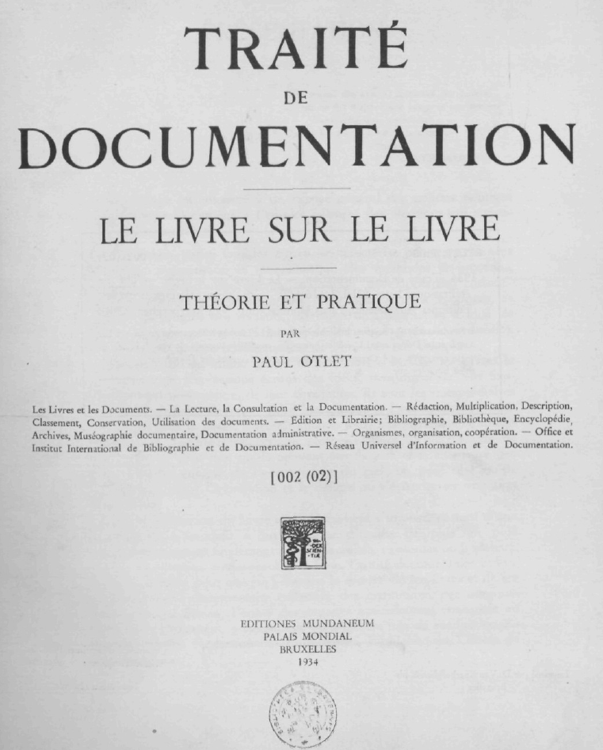

# INTRODUCTION

## Transcribing the Traité

Help to transcribe Paul Otlet’s _Traité de Documentation_ (1934) from PDF to a digital full-text edition. No easily readable edition of his works is currently accessible online. While more and more books and articles are published about the “visionary of the digital age”, the original sources remain accessible only to those who are willing to download or browse a 200 MB PDF-file and understand French.

The first goal is to produce a digital edition of the _Traité_ in readable plain text, using the lightweight markup Markdown syntax, following the conventions of [Pandoc](http://pandoc.org/), [CommonMark](http://commonmark.org/) and the syntax additions of [Textus](http://textus.io/). In fact, the electronic edition, file conversion processes and copy editing of the manuscript, as conducted in this repository, serve as a demo for the Textus publication platform.

The end goal is the generation, publication and distribution of an electronic edition in the HTML5 and PDF formats, again using the Textus platform.

The current version of the Markdown version can be found at <https://github.com/textvs/traite> . The rendered version will be available at <http://demos.textus.io/Otlet/Traite> .

To contribute to this effort just get a copy of the [PDF of University of Ghent](http://lib.ugent.be/fulltxt/RUG01/000/990/276/BIB-038A006_2006_0001_AC.pdf), open a text editor and start correcting the mistakes of the OCR run according to the rules layed out below.

### About Paul Otlet

> Paul Marie Ghislain Otlet (1868–1944) was a Belgian author, entrepreneur, visionary, lawyer and peace activist; he is one of several people who have been considered the father of information science, a field he called “documentation”. Otlet created the Universal Decimal Classification, one of the most prominent examples of faceted classification. … Outlet wrote numerous essays on how to collect and organize the world’s knowledge, culminating in two books, the _Traité de Documentation_ (1934) and _Monde: Essai d’universalisme_ (1935).
— From: [Wikipedia](http://en.wikipedia.org/wiki/Paul_Otlet)

### About the Traité

> The book is considered a landmark in the history of information science, with concepts predicting the rise of the World Wide Web and search engines.
— From: [Wikipedia](https://en.wikipedia.org/wiki/Trait%C3%A9_de_Documentation)

- Archive.org: <https://archive.org/details/OtletTraitDocumentationUgent>
- OpenLibrary.org: <https://openlibrary.org/works/OL1112871W/Traite%CC%81_de_documentation>
- Gent University:
  - <http://search.ugent.be/meercat/x/view/rug01/000990276>
  - <http://lib.ugent.be/fulltxt/handle/1854/5612/>
  - <http://lib.ugent.be/catalog/rug01:000990276>
  - <http://buck.ugent.be/fulltxt/RUG01/000/990/276/BIB-038A006_2006_0001_AC.pdf>
- <https://www.google.co.in/search?tbo=p&tbm=bks&q=inauthor:%22Paul+Otlet%22>

### Crowd sourcing for proofreading and translation

- <http://wikisource.org>
- <http://traduwiki.org/>
- <https://www.transifex.com/>
- <http://crowdin.net/pricing>
- <https://poeditor.com/>
- <http://www.hasecke.eu/Members/juh/sphinx-a-tool-for-self-publisher>
- <https://www.discovermeteor.com/blog/community-translations-with-github-middleman-codeship-heroku/>
- <http://annotatedbooksonline.com>

Translation:

- <https://translate.google.com/>
- <http://translation.babylon.com/french/to-english/>

## Guidelines for copy editing the manuscript

### Page layout

- Pages are separated by horizontal rules “====” surrounded by two empty lines above and one blank line below the rule.
- After a single blank line, page numbers, section/chapter titles and section numbers should be placed just as in the PDF, pages in *italics* (surrounded by `*` asterisks.)
- The two columns on each page are separated by “——” surrounded by two single blank lines.
- Header markup should be one symbol longer than the header text
- Unicode characters should be used wherever possible, but should be documented somewhere
- The original text, layout and typesetting should be represented as close as possible within the limits of the reStructuredText format.
- Hyphenation: What is a good solution to somehow mark a hyphenation from the book in the reST format without it showing up in the compiled html? Leaving hyphenation in the reST would destroy full-text search. But single dashes (`-`) at the end of the line are easy to remove with a script. Soft-hyphens can be used to replace the hyphenation so that it doesn’t show up in the browser. An open question is how this will affect the epub output of Sphinx.
- If the PDF resolution is not good enough to discriminate symbols accurately, just place three bold question marks **???** (surround them with two asterisks `**???**`) in this position.

### Special characters

see also: <http://character-code.com/french-html-codes.php>

« .. » left and right angle quotes

― Horizontal rule (use above footnotes)

– EN Dash

— EM Dash

see also: <http://en.wikipedia.org/wiki/Dash>

The source files are encoded in unicode format (UTF–8 without BOM). To check the encoding on Windows, use the excellent <http://notepad-plus-plus.org> editor.

To input specific letters or symbols:

Ubuntu12: Shift+AltGr + \^ + e = ê

<https://de.wikipedia.org/wiki/%C5%92> U+0152 OEvre Œ, Kleinbuchstabe œ U+0153

Multiplication sign: × (Unicode 215)

<https://help.ubuntu.com/community/ComposeKey> Unicode composition: Another means to enter characters is to enter them as Unicode character number.

Press Shift+Ctrl+U, release U, enter the hexadecimal (0123456789abcdef) Unicode character code point, then release Shift+Ctrl. An underlined u followed by the number will be displayed as you type.

Alternatively, press (and release) Shift+Ctrl+U, then, while underlined u is displayed, enter the hexadecimal Unicode character code point followed by <Return>.

<http://en.wikipedia.org/wiki/Unicode_input>

Windows: <http://superuser.com/questions/47420/insert-unicode-characters-via-the-keyboard>
