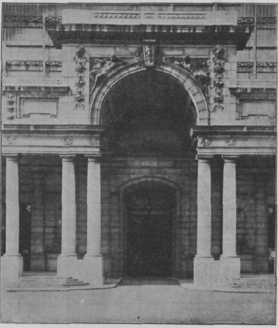
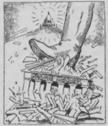

LE PALAIS MONDIAL - LE MUNDANEUM.

------------------------------------------------------------------------

Tableau Récapitulatif I Par Opérations de la Documentation

A Operations B Document C Personnes D Organisme E Locaux F Science-Technique Art. 1 Composition Notes Manuscrit Auteur Ecrivain Illustrateur Particulier Studio Art. littéraire (grammaire et rhétorique) 2 Reproduction Copie Exemplaire Copiste- Dactylographe Imprimeur Photographe Imprimerie Bureau Atelier Atelier Imprimerie Photographie 3 Distribution Editeur Libraire Maison d’éditions Librairie Officine 4 Catalographie Notice Catalogue Catalogueur 5 Critique Compte-rendu (critique) Critique 6 Collection Bibliothécaire Bibliothèque Bibliothèque 7 Codification Code Encyclopédie Compilateur -

N.B. - Ces deux tableaux montrent la corrélation générale de la Documentation. Ils complètent les tableaux présentés au cours de l’exposé de ¡’ouvrage. Iis montrent la nécessité d’une terminologie rationelle, complète, univoque, apte aux combi\* naisons des termes.

------------------------------------------------------------------------

Tableau Récapitulatif II Par échelons de l’Organisation de la Documentation

A. Echelons B. Eléments ou Organes Unités ou ensembles C. Développements

:   Ca. (En soi) Intégration des parties Cb. (En rapport les uns avec les autres) Réseau Ce. (En centrales mondiales) Institutions

1er Echelon Les livres et les documents. 1. Livres 2. Périodiques 3. Autres documents Liber Mundialis Periodicum Mundialc 2e Echelon Les ensembles ou collections. 1. Bibliographie 2. Bibliothèque 3. Encyclopédie 1. Dossiers 2. Atlas. Codiiication 4. Archives 3. Doc. administrative 51. Publique 52. Privée 6. Musée 7. Ciné-Radio-Phono Bibliographie universelle Bibliothèque universelle Musé universel Réseau des Bibliographies Réseau des Bibliothèques Réseau de Musées Bibliographia Mundialis Bibliotheca Mundialis Encyclopedia Mundialis Archivum Mundialc Documentation Administrativa Mundialis Muséum Mundialc Ciné-Radio-Phono Mundialis 3e Echelon Les organismes documentaires. 1. Studios 2. Services de documentation des organismes divers 3. Offices de documen- tation autonomes 4. Bibliothèques (comme institution complexe) Documentado Mundialis 4e Echelon Le Réseau Universel de Documentation. Réseau 5e Echelon Les corrélations externes. 1. L’Organisation du Travail intellectuel 2. L’Organisation de la Vie mondiale Réseau des Mundaneums Réseau des Cités Mundaneum Maximum Civitas Mundialis

------------------------------------------------------------------------

Table sommaire de la Classification Décimale

0 Ouvrage?? généraux.

01 Bibliographie.

02 Bibliothéconomie.

03 Encyclopédies générales,

04 Essais en Collections générait«.

05 Revues et Périodiques généraux.

06 Sociétés. Académies. Collectivités géné-

rales

07 Journaux. Journalisme.

08 CaUeetlotuu Polygraphie.

09 Manuscrits. Livres précieux.

10 Philosoiphie.

11 Métaphysique générale. Cosmologie.

12 Métaphysique spéciale.

13 Esprit et Corps.

14 Systèmes Philosophiques.

15 Psychologie.

16 Logique.

17 Morale.

t Théologie. Religion.

21 Théologie naturelle.

22 Bible. Evangile. Ecriture Sainte.

23 Idéologie dogmatique.

24 Pratique religieuse. Dévotion.

25 Œuvres Pastorales.

26 L’Eglise

27 Histoire dt V Eglise

28 Eglises et sectes chrétiennes.

29 Religions diverses.

30 Sciences sociales. Droit.

31 Statistique.

32 Politique.

33 Economie politique.

34 Droit. 35 Administration publique.

36 A sa latan oe. Assurance. Association.

37 Enseignement Education.

38 Commerce. Transport Communication.

39 Costumes. Folklore. 40 Philologie. Linguistique. 41 Philologie générale. 42 » Anglaise. 43 » Germanique. 44 » Française. 45 » Italienne. 46 » Espagnole Portugaise. 47 » Latine. 48 » Grecque. 49 » Langues diverses.

50 Hele (ici\* » pures.

51 Mathématiques.

52 Astronomie. Géodésie. Navigation,

53 Physique. Mécanique rationnelle.

54 Chimie. Cristallographie. Minéralogie.

55 Géologie Géophysique Météorologie.

56 Paléontologie

57 Biologie. Anthropologie.

58 Botanique

59 Zoologie.

6 Sciences appliquées.

61 Médecine. Physiologie Pharmacie.

62 Arts de l’Ingénieur.

63 Agriculture Agronomie.

64 Economie domestique.

65 Commerce Transport Organisation.

66 Industries chimique».

67 Technologie mécanique.

68 Professions et métiers.

69 Construction.

70 Beaux-Arts.

71 Urbanisme. Architecture de Jardins.

72 Architecture.

73 Sculpture. Numismatique.

74 Dessin. Décoration.

75 Peinture.

76 Gravure

77 Photographie.

78 Musique.

79 Jeux. Sports. DlverURsements. 80 Littérature. 81 En générai.

82 Littérature Anglaise. 83 » Germanique. 84 » Française. 85 » Italienne. 86 » Espagnole. Portugaise. 87 » Latine.211 88 » Grecque. 89 Littératures diverses. 9 MUloire et Géographie. 9 (3l Histoire ancienne.

9 (4) . Europe.

9 t&l »1 l’Asie.

9 \<«) o E l’Afrique.

9 \<7\> Amérique du Nord,

9 (81 £ g É Amérique du Sud 9 (9» \* Océanie. Régions polaires.

91 Géographie et Voyages.

92 Biographie. Sources : Bibliographie

1.  La Bibliologie en toutes ses parties est riche d’une abondante bibliographie. Des sources ont été signalées au cours de l’ouvrage sous chaque matière.
2.  Une Documentation a été largement rassemblée déjà au Palais Mondial (Mundaneum) sous les quatre formes de la Bibliographie, dans le Répertoire Bibliographique Universel; des ouvrages dans la Bibliothèque; des archives et notes manuscrites dans I Lncyclopédie documentaire; des tableaux, modèles, objets, spécimens et éléments de démonstration dans l’Atlas et dans le Musée. La Bibliologie y est classée aux Indices 002, 01, 02. 655.
3.  Des Bibliographies imprimées ont fait une large place au sujet, notamment celles de Petzholt, Vallée. Stein, Schneider, Van Hoesen et Walter, et en ont donné des listes étendues et classées dans leur ouvrage: «Bibliography».
4.  Les Tables et Index des Périodiques, des Recueils d’Associations, des Actes de Congrès consacrés au Livre, fournissent des dépouillements importants. De certains ensembles, il a été publié des Tables collectives, notamment George Watson Cole « An Index to Bibliographical Papers published by the Bibliographical Society and tbe Library Association r\>, London, 1877–1932.

La Bibliographie courante est donnée par « Internationales Jahresbericht der Bibliographie » du Dr. Joris Vorstius (1933, 4° année).

------------------------------------------------------------------------

POSTFACE

------------------------------------------------------------------------

Ce livre, commencé par un clair matin, s’achève précipitamment un soir aux ombres déjà lourdes, je le dédie à ma femme, compagne, collaboratrice et gardienne des bons et des mauvais jours. Je le souhaite aux mains de mon petit-fils, l’autre génération. Ne pouvant en remettre le sort à mes compatriotes, je le confie à mes amis de toutes les nations : Décimalistes, Documentalistes, Humanistes, Mundanéistes !

On rapporte qu’Héraclite ne parvenant pas à intéresser ses contemporains, jeta son manuscrit derrière l’autel du Temple id’Artémise, dans l’espoir qu’il y serait retrouvé plus tard par des hommes de meilleure compréhension. Ainsi nous en parvinrent des fragments, objet déjà d’une immense littérature. — Il n’y a plus de Temple d’Artémise, mais il y a l’Imprimerie, il y a les Typographes, obscurs et loyaux amis.

> Bruxelles, hors le Palais Mondial, août 1934, où le jour 15e, ici se réunit le Conseil de l’Institut International de Documentation.

Liber : lux, instrumentum, consolatio : fictio

MuNDUS : NATURE, HOMO, SOCIETAS, DEUS

NOVAM EVOLVERE HUMANIT ATEM — MEUOREM EXALTARE CIVILISATIONEM — ALTIORES CUM REBUS JÜNGERE IDEAS — OPUS MAXIMUM 1NSTRUERE MUNDANEUM.

------------------------------------------------------------------------

## Annexe : DOCUMENTS

De l’Affaire du PALAIS MONDIAL

### DOCUMENT I.

Bruxelles, le 3 mars 1934.

Au Comte de Broqueville,

Premier Ministre, Bruxelles.

Monsieur le Premier Ministre,

Nous venons de recevoir de Monsieur le Ministre des Travaux Publics une lettre datée du 28 février ainsi conçue :

« Monsieur le Secrétaire Général,

« J’ai l’honneur de vous faire savoir qu’en vue de donner aux Musées Royaux » l’extension qui leur est nécessaire, le Conseil des Ministres a décidé, en sa séance » du 10 de ce mois, qu’il y a lieu de remettre à la disposition de ses Musées les locaux „ du Cinquantenaire occupés à titre précaire, par l’Cnipn des Associations Interna-» tionales.

» Je vous prie, en conséquence, de bien vouloir prendre les mesures voulues » pour que ces locaux soient évacués pour le 31 mai prochain, au plus tard.

» Veuillez agréer, Monsieur le Secrétaire Général, l’assurance de ma consi-» dération distinguée.

» Le Ministre, SAP. » Il doit y avoir certainement erreur causée par une information insuffisante. En effet, M. le Ministre des Sciences et des Arts, sous la date du 26 mai 1926. nous a écrit :

« J’ai examiné avec la plus grande attention le dossier du Palais Mondial et » je reconnais volontiers que des erreurs ont été commises. Les Gouvernements s antérieurs ont reconnu votre institution et ils ont pris l’engagement de vous » soutenir financièrement, en outre ils ont pris l’engagement de mettre des locaux » à votre disposition. En attendant que des locaux convenables puissent être édifiés, » vos collections ne seront plus délogées, s

Sur la foi de cette lettre, notre Union a entrepris un travail considérable et exposé de grands frais. Elle a fait partager les avantages de ces assurances à un grand nombre de groupes et d’associations belges et internationaux, ainsi qu’à divers pays représentés par leurs légations et consulats.

Nous avons donc l’honneur d’en appeler au Conseil des Ministres lui-même après qu’une enquête lui aura permis de reconnaître exactement le statut de notre Union et de ses Instituts du Palais Mondial, ainsi que des accords formels intervenus en leur temps avec l’Etat belge, accords à placer dans le cadre des votes initiaux du Parlement, des arrêtés royaux et des décisions de la Société des Nations,

Veuillez agréer. Monsieur le Premier Ministre, l’assurance de notre haute considération.

L’Union des Associations Internationales,

Le Secrétaire Général, Paul OTLET.

------------------------------------------------------------------------

### DOCUMENT II.

Après la fermeture du PALAIS MONDIAL Le 1er juin à 6 heures du matin, par un acte d’arbitraire et de force, le Gouvernement belge a fait fermer le Palais Mondial.

Après un mois, le Palais Mondial n’a pas encore été réouvert, loutes les tentatives amiables avant la fermeture avaient été vaines. Devant le traitement infligé, pour la sauvegarde de sa dignité d’abord, de son trésor d’œuvres intellectuelles ensuite, l’Union des Associations Internationales a estimé qu’il ne lui restait que les voies judiciaires. Les « Amis du Palais Mondial en Belgique » ont vivement conseillé cette manière d’agir et cela pour l’honneur des Belges, ont-ils dit, attendu que la Justice est aussi un des pouvoirs qui exprime officiellement l’opinion publique du pays.

Mais où va conduire le développement de l’affaire ? Les procédures sont lentes et, même gagné, un procès laissera derrière lui des animosités rendant l’atmosphère peu favorable.

Il est rappelé que le Palais Mondial a été organisé après la guerre par l’Union des Associations Internationales. Celle-ci fondée dès 1910 et groupant autour d’elle divers Instituts, Associations et Organismes internationaux, avait proposé en 1919 au Gouvernement belge un plan complet en vue de créer à Bruxelles, milieu déjà ancien de vie internationale, une institution ayant pour objet la libre coopération dans le domaine intellectuel. Le Gouvernement d’abord, et ensuite le Parlement, le Roi et l’opinion avaient accepté le plan. Il répondait à l’esprit de la Société des Nations et donnait à la Belgique une certaine compensation de n’avoir chez elle le siège de la Société. Ainsi en témoignent les actes, la correspondance, les débats parlementaires, la presse au moment de la création.

L’œuvre réalisée a reçu des développements matériels mesurés par le chiffre de 17 millions de pièces; elle est, dans le chef de ses fondateurs, administrateurs et amis, complètement désintéressée; elle est dans son total l’œuvre d’une offrande universelle; des milliers de coopérateurs lui ont apporté idées, travail, objet, argent et sentiments de sympathie. Tous les services ont été constamment publics et gratuits et sans qu’aucun droit d’entrée, de location, de visite ou de consultation ait été perçu. D’autre part aucune allocation secrète n’est venue altérer le caractère objectif et impartial de l’institution.

Le Palais Mondial, le Mundaneum — Palais des Nations, de la Civilisation et de la Paix — se dresse au cœur de la capitale de la Belgique comme un grand et volontlaire symbole de l’Humanité après la guerre.

Avec la Société des Nations à Genève, la Cour Internationale de Justice à La Haye, le Palais Mondial à Bruxelles est l’affirmation visible et permanente

------------------------------------------------------------------------

d’une volonté de répondre à l’appel impératif de l’Intelligence, de la Concorde, de la Collaboration,

Il est advenu que pour l’aider à surmonter des difficultés, paraissant toutes temporaires et nées d’un changement subit dans la politique internationale du Gouvernement, siège de son établissement, le Palais Mondial, à peu d exceptions près, n’a pas trouvé les appuis officiels extérieurs sur lesquels il espérait pouvoir compter. Une action du dehors pour le protéger ne s’est produite ni efficacement, ni en temps utile. La protection demandée à la Société de« Nations n’a pu être donnée. Le recours à la Cour internationale de Justice a été reconnu impossible.

Si dans de telles conditions le Palais Mondial devait définitivement rester fermé, il semble bien qu’il n’y aurait plus place dans notre Civilisation pour une institution d’un caractère universel, inspirée de l’idéal indiqué en ces mots à son entrée : Par la Liberté, l’Egalité et la Fraternité mondiales — dans la Foi, l’Espérance et la Charité humaines — vers le Travail, le Progrès et la Paix de tous !

Mais rejetons les appréhensions pessimistes et continuons à avoir confiance en de puissantes interventions. Des interventions soit pour agir en médiateurs entre l’institution et le Gouvernement belge (modifié récemment dans sa composition), soit pour offrir, en Belgique même, un autre asile, soit pour aider au transfert en quelque lieu qui serait devenu plus sûr et plus accueillant.

Paul OTLET.

1934.07.03.

------------------------------------------------------------------------

[^1]: 1440.   Le siècle de l’invention de l’imprimerie.

[^2]: Grand ouvrage de Copernic, qui fut publié en 1543.
